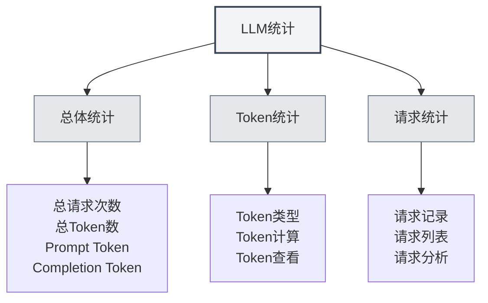

# Statistiques LLM

## Vue d'ensemble

La fonction Statistiques LLM permet de suivre et de visualiser l'utilisation des API LLM, y compris la consommation de tokens, le nombre de requêtes, les statistiques de coût, etc. Ces données statistiques vous aident à comprendre l'utilisation des LLM et à optimiser votre stratégie d'utilisation.

## Ouvrir les Statistiques LLM

### Méthodes d'accès

Vous pouvez accéder à la page des Statistiques LLM de plusieurs manières :

- **Page des paramètres** : Un accès aux Statistiques LLM peut être présent dans la page des paramètres.
- **Option de menu** : Certains menus peuvent contenir une option pour les Statistiques LLM.
- **Raccourci clavier** : Un raccourci clavier peut être disponible dans certains cas (prise en charge potentielle future).

<SettingLlmSection mode="demo" />

## Informations statistiques

<LlmStatisticsView mode="demo" />

<LlmStatisticsContent mode="demo" />

### Statistiques globales

La page des Statistiques LLM affiche les informations statistiques globales suivantes :

- **Nombre total de requêtes** : Le nombre total de toutes les requêtes LLM.
- **Nombre total de tokens** : Le nombre total de tokens utilisés pour toutes les requêtes.
- **Tokens d'invite (Prompt)** : Le nombre total de tokens d'invite pour toutes les requêtes.
- **Tokens de complétion** : Le nombre total de tokens de complétion pour toutes les requêtes.

### Filtrage par période

Vous pouvez filtrer les données statistiques par période :

- **Toute période** : Voir les statistiques pour toutes les périodes.
- **Aujourd'hui** : Voir les statistiques d'aujourd'hui.
- **Cette semaine** : Voir les statistiques de la semaine en cours.
- **Ce mois** : Voir les statistiques du mois en cours.
- **Plage personnalisée** : Sélectionner une date de début et de fin personnalisées.

### Graphiques statistiques

<ChartGenerationDisplay mode="demo" />

La page des statistiques peut inclure les graphiques suivants :

- **Tendance d'utilisation des tokens** : Montre l'évolution de la consommation de tokens dans le temps.
- **Tendance du nombre de requêtes** : Montre l'évolution du nombre de requêtes dans le temps.
- **Répartition de l'utilisation des modèles** : Montre l'utilisation des différents modèles.
- **Répartition des types de requêtes** : Montre la répartition des différents types de requêtes.

## Statistiques des Tokens

<DataAnalysisDisplay mode="demo" />

### Types de Tokens

Les statistiques de tokens incluent les types suivants :

- **Tokens d'invite (Prompt)** : Nombre de tokens pour l'invite d'entrée.
- **Tokens de complétion** : Nombre de tokens pour le contenu généré.
- **Total des tokens** : Nombre total de tokens (Prompt + Complétion).

### Calcul des Tokens

Méthode de calcul des tokens :

- **Enregistrement automatique** : La consommation de tokens est automatiquement enregistrée après chaque requête LLM.
- **Mise à jour en temps réel** : Les données statistiques sont mises à jour en temps réel.
- **Statistiques cumulatives** : Les données statistiques sont calculées de manière cumulative.

### Visualisation des Tokens

Vous pouvez consulter les informations de tokens suivantes :

- **Nombre total de tokens** : Le nombre total de tokens pour toutes les requêtes.
- **Nombre moyen de tokens** : Le nombre moyen de tokens par requête.
- **Nombre maximum de tokens** : Le nombre maximum de tokens pour une requête unique.
- **Nombre minimum de tokens** : Le nombre minimum de tokens pour une requête unique.

## Statistiques des Requêtes

<LlmStatisticsContent mode="demo" />

### Enregistrement des Requêtes

Chaque requête LLM enregistre les informations suivantes :

- **Horodatage** : L'heure de la requête.
- **Nom du modèle** : Le nom du modèle utilisé.
- **Type de requête** : Le type de requête (chat/complétion).
- **Consommation de tokens** : La consommation de tokens pour cette requête.

### Liste des Requêtes

Vous pouvez consulter la liste des requêtes :

- **Tri par date** : Triées par ordre chronologique inverse.
- **Détails** : Voir les informations détaillées de chaque requête.
- **Fonction de filtrage** : Filtrer les requêtes par modèle, type, etc.

### Analyse des Requêtes

Vous pouvez analyser les requêtes :

- **Fréquence des requêtes** : Analyser la fréquence des requêtes.
- **Utilisation des modèles** : Analyser l'utilisation des différents modèles.
- **Répartition des types** : Analyser la répartition des différents types de requêtes.

## Statistiques de Coût

<LlmStatisticsView mode="demo" />

### Calcul du Coût

Les statistiques de coût sont basées sur les informations suivantes :

- **Consommation de tokens** : Le coût est calculé en fonction de la consommation de tokens.
- **Tarification des modèles** : Différents modèles ont des tarifications différentes.
- **Estimation des coûts** : Fournit une estimation des coûts (si pris en charge).

### Visualisation des Coûts

Vous pouvez consulter les informations de coût suivantes :

- **Coût total** : Le coût total de toutes les requêtes.
- **Coût journalier moyen** : Le coût moyen par jour.
- **Coût par modèle** : La répartition des coûts par modèle.
- **Tendance des coûts** : L'évolution des coûts dans le temps.

**Remarque** : Les statistiques de coût sont fournies à titre indicatif uniquement. Les coûts réels sont ceux facturés par le fournisseur de l'API.

## Exportation des Données

<DataAnalysisDisplay mode="demo" />

### Fonction d'exportation

Vous pouvez exporter les données statistiques :

- **Format d'exportation** : Peut prendre en charge plusieurs formats (JSON, CSV, etc.).
- **Période d'exportation** : Vous pouvez choisir d'exporter toutes les données ou les données filtrées.
- **Contenu de l'exportation** : Vous pouvez choisir quelles informations statistiques exporter.

### Sauvegarde des Données

Les données statistiques sont sauvegardées automatiquement :

- **Stockage local** : Les données statistiques sont enregistrées localement.
- **Sauvegarde automatique** : Sauvegarde automatique après chaque requête.
- **Persistance des données** : Les données sont conservées après le redémarrage de l'application.

## Effacer les Statistiques

### Opération d'effacement

Vous pouvez effacer les données statistiques :

1. Ouvrez la page des Statistiques LLM.
2. Trouvez le bouton pour effacer les statistiques.
3. Confirmez l'opération d'effacement.
4. Les données statistiques seront effacées.

**Remarques** :

- L'opération d'effacement est irréversible.
- Il est recommandé d'exporter une sauvegarde des données avant d'effacer.
- Toutes les données statistiques seront perdues après l'effacement.

## Paramètres des Statistiques

### Activation/Désactivation

Vous pouvez contrôler la fonction de statistiques :

- **Activer les statistiques** : Active le suivi de l'utilisation des LLM.
- **Désactiver les statistiques** : Désactive la fonction de statistiques (aucune donnée n'est enregistrée).

### Précision des Statistiques

Vous pouvez définir la précision des statistiques :

- **Enregistrement détaillé** : Enregistre les informations détaillées de chaque requête.
- **Enregistrement simplifié** : Enregistre uniquement les informations statistiques globales.

## Bonnes Pratiques

1. **Consultation régulière** : Consultez régulièrement les statistiques d'utilisation LLM pour comprendre votre usage.
2. **Contrôle des coûts** : Contrôlez votre consommation en fonction des statistiques de coût.
3. **Optimisation de la stratégie** : Optimisez votre stratégie d'utilisation en fonction des données statistiques.
4. **Sauvegarde des données** : Exportez régulièrement des sauvegardes des données statistiques.
5. **Utilisation raisonnable** : Utilisez les fonctionnalités LLM de manière raisonnable en fonction des informations statistiques.

## Remarques Importantes

1. **Exactitude des statistiques** : Les données statistiques sont basées sur les informations de tokens renvoyées par l'API.
2. **Estimation des coûts** : Les statistiques de coût sont fournies à titre indicatif uniquement. Les coûts réels sont ceux facturés.
3. **Stockage des données** : Les données statistiques sont stockées localement et ne sont pas téléchargées.
4. **Protection de la vie privée** : Les données statistiques ne contiennent pas le contenu spécifique, seulement les informations de volume d'utilisation.
5. **Impact sur les performances** : La fonction de statistiques a un impact minime sur les performances et peut être utilisée en toute confiance.

## Documentation Associée

- [[settings.llm|Configuration LLM]]
- [[ai.chat|Fonction de dialogue IA]]
- [[ai.completion|Complétion automatique IA]]

<LlmStatisticsView mode="demo" />

<LlmStatisticsContent mode="demo" />
