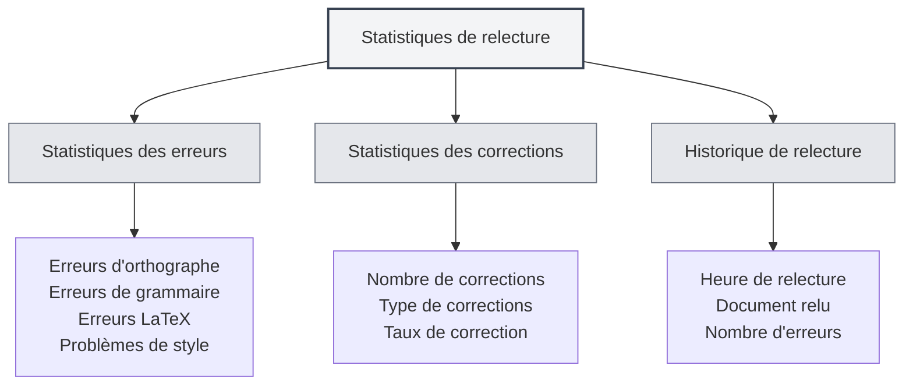

# Statistiques de l'outil de relecture

## Vue d'ensemble

La fonction de statistiques de l'outil de relecture permet de suivre et de consulter l'utilisation de la relecture de documents, y compris les informations statistiques telles que la vérification orthographique et grammaticale. Ces données statistiques peuvent vous aider à comprendre l'utilisation des fonctionnalités de relecture et à optimiser votre stratégie de correction.

<ProofreadView mode="demo" />

<ProofreadDisplay mode="demo" />

<DataAnalysisDisplay mode="demo" />

## Présentation des statistiques de relecture

### Qu'est-ce que les statistiques de relecture ?

Les statistiques de relecture enregistrent les informations pertinentes pendant le processus de correction des documents :

- **Statistiques des erreurs** : enregistrent le nombre et le type d'erreurs détectées.
- **Statistiques des corrections** : enregistrent le nombre d'erreurs corrigées.
- **Historique de relecture** : enregistre l'historique des opérations de relecture.

### Types de statistiques

Les statistiques de relecture incluent les types suivants :

- **Erreurs d'orthographe** : erreurs détectées par la vérification orthographique.
- **Erreurs de grammaire** : erreurs détectées par la vérification grammaticale.
- **Erreurs LaTeX** : erreurs détectées par la vérification de syntaxe LaTeX.
- **Problèmes de style** : problèmes détectés par la vérification de style.
- **Autres erreurs** : autres types d'erreurs.

## Statistiques des erreurs

<DataAnalysisDisplay mode="demo" />

<ChartGenerationDisplay mode="demo" />

### Classification des erreurs

L'outil de relecture classe et comptabilise les erreurs :

- **Erreurs d'orthographe** : nombre d'erreurs d'orthographe des mots.
- **Erreurs de grammaire** : nombre d'erreurs grammaticales.
- **Erreurs LaTeX** : nombre d'erreurs de syntaxe LaTeX.
- **Problèmes de style** : nombre de problèmes de style d'écriture.
- **Autres erreurs** : nombre d'autres types d'erreurs.

### Comptage des erreurs

Chaque relecture comptabilise les erreurs :

- **Nombre total d'erreurs** : total de toutes les erreurs.
- **Nombre par type d'erreur** : nombre d'erreurs pour chaque type.
- **Répartition des erreurs** : distribution des types d'erreurs.

## Statistiques des corrections

### Enregistrement des corrections

Enregistre la situation des corrections d'erreurs :

- **Nombre de corrections** : nombre d'erreurs déjà corrigées.
- **Type de corrections** : type des erreurs corrigées.
- **Taux de correction** : proportion d'erreurs corrigées.

### Historique des corrections

Permet de consulter l'historique des corrections :

- **Heure de correction** : moment où l'erreur a été corrigée.
- **Contenu corrigé** : contenu spécifique qui a été corrigé.
- **Méthode de correction** : méthode de correction (manuelle/automatique).

## Historique de relecture

### Enregistrement historique

Enregistre l'historique des opérations de relecture :

- **Heure de relecture** : moment de l'opération de relecture.
- **Document relu** : document qui a été relu.
- **Nombre d'erreurs** : nombre d'erreurs découvertes.
- **Nombre de corrections** : nombre d'erreurs corrigées.

### Consultation de l'historique

Permet de consulter l'historique de relecture :

- **Liste historique** : affiche tous les enregistrements de l'historique de relecture.
- **Détails** : consulte les informations détaillées de chaque relecture.
- **Analyse statistique** : analyse statistique des données historiques.

## Vues statistiques

<ProofreadView mode="demo" />

### Vue unifiée

La vue unifiée affiche toutes les erreurs :

- **Liste des erreurs** : affiche toutes les erreurs dans l'ordre.
- **Détails de l'erreur** : affiche les informations détaillées de chaque erreur.
- **Localisation de l'erreur** : permet de localiser la position de l'erreur.

<DataAnalysisDisplay mode="demo" />

### Vue par catégorie

La vue par catégorie affiche les erreurs par type :

- **Regroupement par type** : les erreurs sont affichées groupées par type.
- **Statistiques par type** : affiche le nombre d'erreurs pour chaque type.
- **Filtrage par type** : permet de filtrer les erreurs d'un type spécifique.

## Exportation des statistiques

### Fonction d'exportation

Permet d'exporter les statistiques de relecture :

- **Format d'exportation** : peut prendre en charge plusieurs formats (JSON, CSV, etc.).
- **Périmètre d'exportation** : permet de choisir d'exporter toutes les données ou les données filtrées.
- **Contenu exporté** : permet de choisir quelles informations statistiques exporter.

<ChartGenerationDisplay mode="demo" />

## Bonnes pratiques

1. **Relecture régulière** : utilisez régulièrement la fonction de relecture pour vérifier les documents.
2. **Surveillance des statistiques** : surveillez les statistiques d'erreurs pour comprendre la qualité des documents.
3. **Correction rapide** : corrigez les erreurs dès qu'elles sont découvertes.
4. **Analyse des tendances** : analysez les tendances des erreurs pour améliorer vos habitudes d'écriture.
5. **Utilisation de l'historique** : utilisez les enregistrements historiques pour suivre l'amélioration des documents.

## Points d'attention

1. **Exactitude des statistiques** : les données statistiques sont basées sur les résultats de détection de l'outil de relecture.
2. **Traitement des faux positifs** : certaines détections peuvent être des faux positifs, nécessitant un jugement humain.
3. **Stockage des données** : les données statistiques sont stockées localement et ne sont pas téléchargées.
4. **Protection de la vie privée** : les statistiques ne contiennent pas de contenu spécifique, seulement des informations statistiques.
5. **Impact sur les performances** : la fonction statistique a un impact minime sur les performances, vous pouvez l'utiliser en toute confiance.

## Documentation associée

- [[ai.proofread|Fonctionnalité de relecture IA]]
- [[statistics.llm|Statistiques LLM]]
