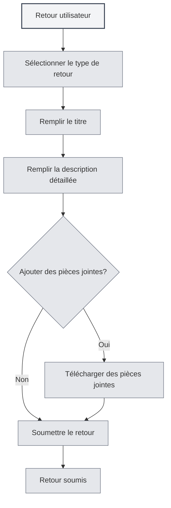

# Retour utilisateur

## Vue d'ensemble

La fonction de retour utilisateur vous permet de soumettre des rapports de problèmes, des suggestions de fonctionnalités ou d'autres commentaires à l'équipe MetaDoc. Vos retours sont essentiels pour nous aider à améliorer le produit.

## Ouvrir le retour utilisateur

### Méthodes d'accès

Vous pouvez ouvrir la page de retour utilisateur via les méthodes suivantes :

- **Page des paramètres** : Cliquez sur le bouton "Retour utilisateur" dans la page des paramètres "À propos"
- **Option de menu** : Certains menus peuvent contenir une option de retour utilisateur
- **Raccourci clavier** : Un raccourci clavier peut être disponible dans certains cas (prise en charge potentielle future)

<SettingAboutSection mode="demo" />

## Types de retour

### Sélection du type de retour

Lors de la soumission d'un retour, vous devez sélectionner un type :

- **Signalement de BUG** : Signaler un bug ou un problème logiciel
- **Suggestion de fonctionnalité** : Proposer une nouvelle fonctionnalité ou une amélioration
- **Retour de sécurité** : Signaler un problème de sécurité
- **Autre** : Autres types de commentaires

<DialogDemo mode="demo" dialogType="feedback" />

### Description des types

- **Signalement de BUG** : Utilisé pour signaler des bugs logiciels, des plantages, des comportements anormaux, etc.
- **Suggestion de fonctionnalité** : Utilisé pour proposer des demandes de nouvelles fonctionnalités ou des améliorations des fonctionnalités existantes
- **Retour de sécurité** : Utilisé pour signaler des vulnérabilités de sécurité ou des problèmes de sécurité
- **Autre** : Utilisé pour d'autres types de retours, comme des problèmes d'utilisation, des problèmes de documentation, etc.

## Contenu du retour

### Titre

Le titre du retour doit :

- **Être concis et clair** : Décrire brièvement le problème ou la suggestion
- **Être spécifique et précis** : Éviter les titres vagues
- **Être obligatoire** : Le titre est un champ requis

### Description détaillée

La description détaillée doit contenir :

- **Description du problème** : Décrire clairement le problème rencontré
- **Résultat attendu** : Indiquer le résultat attendu
- **Autres informations** : Fournir toute autre information utile au diagnostic
- **Coordonnées** : Coordonnées facultatives pour faciliter le suivi

### Modèle de retour

Le système fournit un modèle de retour comprenant les sections suivantes :

- **Informations système** : Remplies automatiquement
- **Description du problème** : Zone pour décrire le problème
- **Résultat attendu** : Zone pour le résultat attendu
- **Autres informations** : Zone pour d'autres informations
- **Coordonnées** : Coordonnées facultatives

<MenuItemsDemo mode="demo" :items='[{"id": "settings"}]' />

## Téléchargement de pièces jointes

### Prise en charge des pièces jointes

Vous pouvez télécharger des pièces jointes pour illustrer le problème :

- **Types de fichiers** : Tous les types de fichiers sont pris en charge
- **Taille de fichier** : 10 MB maximum par fichier
- **Taille totale** : 50 MB maximum pour l'ensemble des pièces jointes
- **Nombre de fichiers** : Maximum 5 pièces jointes

<SettingImageSection mode="demo" />

### Utilité des pièces jointes

Les pièces jointes peuvent servir à :

- **Captures d'écran** : Fournir des captures d'écran du problème
- **Fichiers journaux** : Fournir des journaux d'erreurs
- **Fichiers d'exemple** : Fournir des fichiers exemples illustrant le problème
- **Autres fichiers** : Fournir d'autres fichiers pertinents

### Règles pour les pièces jointes

- **Limite par fichier** : 10 MB maximum par fichier
- **Limite de taille totale** : 50 MB maximum pour l'ensemble
- **Limite de quantité** : Maximum 5 pièces jointes
- **Limite de type** : Aucune restriction de type de fichier, selon les capacités de Gist

## Soumettre un retour

### Étapes de soumission

1. **Sélectionner le type** : Choisir le type de retour
2. **Remplir le titre** : Saisir le titre du retour
3. **Remplir la description** : Saisir la description détaillée
4. **Ajouter des pièces jointes** : Optionnel, ajouter des pièces jointes
5. **Soumettre le retour** : Cliquer sur le bouton "Soumettre le retour"

Vous pouvez accéder au retour utilisateur via la page des paramètres :

<MenuItemsDemo mode="demo" :items='[{"id": "settings"}]' />

<QuickStartPanel mode="demo" />

### Validation de la soumission

Une validation est effectuée avant soumission :

- **Validation du titre** : Vérifie que le titre n'est pas vide
- **Validation de la description** : Vérifie que la description n'est pas vide
- **Validation des pièces jointes** : Vérifie que les pièces jointes respectent les règles

<DialogDemo mode="demo" dialogType="submit-confirm" />

### Résultat de la soumission

Un résultat s'affiche après soumission :

- **Succès** : Affiche un message de réussite
- **Échec** : Affiche un message d'erreur et la raison

## Autres moyens de contact

### Retour par e-mail

Vous pouvez également donner votre avis par e-mail :

- **Adresse e-mail** : Affichée en bas de la page de retour
- **Copier l'e-mail** : Vous pouvez copier l'adresse e-mail
- **Objet de l'e-mail** : Il est conseillé d'utiliser un objet clair

<ViewMenuItemsDemo mode="demo" :items='["settings"]' />

### Groupe QQ

Vous pouvez rejoindre le groupe QQ officiel :

- **Numéro du groupe QQ** : Affiché en bas de la page de retour
- **Copier le numéro** : Vous pouvez copier le numéro du groupe QQ
- **Rejoindre le groupe** : Après avoir rejoint le groupe, vous pouvez donner votre avis en temps réel

## Traitement des retours

### Processus de traitement

Processus de traitement après soumission d'un retour :

1. **Réception du retour** : Le système reçoit votre retour
2. **Classement** : Classement selon le type de retour
3. **Analyse du problème** : Analyse du problème ou de la suggestion
4. **Suivi du traitement** : Suivi du traitement selon la situation
5. **Réponse au retour** : Une réponse peut être donnée par e-mail ou via le groupe QQ

### Priorité des retours

La priorité est définie en fonction du type et de la gravité :

- **Retour de sécurité** : Priorité la plus élevée
- **BUG critique** : Haute priorité
- **Suggestion de fonctionnalité** : Priorité moyenne
- **Autres retours** : Priorité normale

<MainTabs mode="demo" />

## Bonnes pratiques

1. **Description détaillée** : Décrire le problème ou la suggestion de manière aussi détaillée que possible
2. **Fournir des captures d'écran** : Si possible, fournir des captures d'écran du problème
3. **Fournir des journaux** : En cas d'erreur, fournir les journaux d'erreurs
4. **Fournir un exemple** : Si possible, fournir un fichier exemple illustrant le problème
5. **Coordonnées** : Fournir des coordonnées pour faciliter le suivi

## Points à noter

1. **Format du retour** : Remplir le retour selon le format du modèle
2. **Taille des pièces jointes** : Respecter les limites de taille des pièces jointes
3. **Coordonnées** : Fournir des coordonnées pour faciliter le suivi
4. **Type de retour** : Choisir le type de retour correct
5. **Informations système** : Les informations système sont automatiquement remplies, ne pas les supprimer

## Documentation associée

- [[settings.about|Informations à propos]]
- [[user.profile|Profil utilisateur]]

<AIChat mode="demo" />