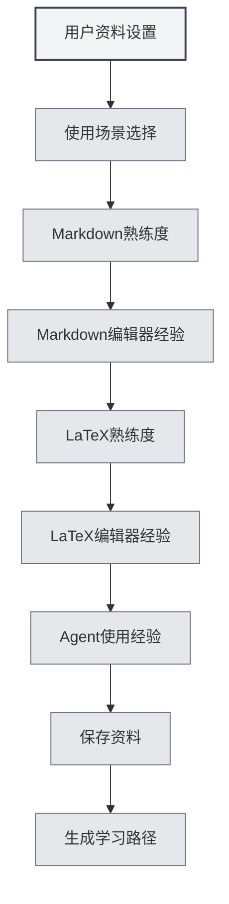

# Profil utilisateur

## Vue d'ensemble

La fonctionnalité de profil utilisateur vous permet de définir vos informations personnelles et vos préférences d'utilisation, aidant ainsi MetaDoc à mieux comprendre vos besoins pour offrir une expérience d'utilisation personnalisée et des parcours d'apprentissage adaptés.

## Configuration du profil utilisateur

### Ouvrir le profil utilisateur

Vous pouvez ouvrir la boîte de dialogue du profil utilisateur des manières suivantes :

- **Invite sur la page d'accueil** : Lors de la première utilisation, la page d'accueil peut inviter à configurer le profil utilisateur.
- **Manuel de l'utilisateur** : Vous pouvez accéder aux paramètres du profil utilisateur depuis le manuel de l'utilisateur.
- **Option de menu** : Certains menus peuvent contenir une option pour le profil utilisateur.

<QuickStartPanel mode="demo" />

### Interface du profil utilisateur

L'interface du profil utilisateur comprend les sections principales suivantes :

<UserProfileView mode="demo" />

### Assistant de configuration du profil

La configuration du profil utilisateur suit un assistant en plusieurs étapes :

1. **Scénario d'utilisation** : Sélectionnez votre principal scénario d'utilisation.
2. **Maîtrise de Markdown** : Évaluez votre familiarité avec la syntaxe Markdown.
3. **Expérience avec les éditeurs Markdown** : Choisissez les types d'éditeurs Markdown que vous avez utilisés.
4. **Maîtrise de LaTeX** : Évaluez votre familiarité avec la syntaxe LaTeX.
5. **Expérience avec les éditeurs LaTeX** : Choisissez les types d'éditeurs LaTeX que vous avez utilisés.
6. **Expérience avec les Agents** : Évaluez votre expérience d'utilisation des frameworks d'Agent.

## Sélection du scénario d'utilisation

### Types de scénarios

Vous pouvez choisir parmi les scénarios d'utilisation suivants :

- **Étudiant** : Adapté aux utilisateurs étudiants, met l'accent sur l'apprentissage des fonctions d'édition de base et de Markdown.
- **Chercheur** : Adapté aux chercheurs, met l'accent sur l'apprentissage des fonctions LaTeX et de rédaction académique.
- **Professionnel de l'informatique** : Adapté aux professionnels de l'informatique, met l'accent sur l'apprentissage des frameworks d'Agent et des fonctions avancées.
- **Utilisateur de bureau** : Adapté aux utilisateurs de bureau, met l'accent sur l'apprentissage des fonctions de base et de l'exportation.
- **Autre** : Autres scénarios d'utilisation.

### Impact du scénario

Le scénario choisi influence :

- **Le parcours d'apprentissage** : Le système recommandera un parcours d'apprentissage correspondant.
- **Les recommandations de fonctionnalités** : Les fonctionnalités pertinentes seront recommandées en priorité.
- **La compréhension de l'IA** : Aide l'IA à mieux comprendre vos besoins.

## Évaluation des compétences

### Maîtrise de Markdown

Évaluez votre niveau de familiarité avec la syntaxe Markdown :

- **Aucune expérience** : N'a jamais utilisé Markdown.
- **Débutant** : Connaît la syntaxe de base (titres, listes, liens, etc.).
- **Intermédiaire** : Maîtrise la syntaxe courante et les fonctions étendues.
- **Avancé** : Expert en Markdown, connaît diverses syntaxes étendues.

<QuickStartLatex mode="demo" />

### Maîtrise de LaTeX

Évaluez votre niveau de familiarité avec la syntaxe LaTeX :

- **Aucune expérience** : N'a jamais utilisé LaTeX.
- **Débutant** : Connaît la syntaxe de base et la structure des documents.
- **Intermédiaire** : Maîtrise les environnements et commandes courants.
- **Avancé** : Expert en LaTeX, capable de rédiger des documents complexes.

<MenuItemsDemo mode="demo" :items='[{"id": "file"}]' />

### Expérience avec les Agents

Évaluez votre expérience d'utilisation des frameworks d'Agent :

- **Aucune expérience** : N'a jamais utilisé les fonctions d'Agent.
- **Débutant** : Comprend les concepts de base, a utilisé des fonctions simples.
- **Intermédiaire** : Maîtrise les ensembles d'outils et les flux de travail.
- **Avancé** : Capable de créer des configurations et des flux de travail d'Agent complexes.

<AgentView mode="demo" />

## Expérience avec les éditeurs

### Expérience avec les éditeurs Markdown

Sélectionnez les types d'éditeurs Markdown que vous avez utilisés :

- **Éditeur WYSIWYG** : A utilisé un éditeur "What You See Is What You Get".
- **Autres éditeurs Markdown** : A utilisé d'autres éditeurs Markdown.

### Expérience avec les éditeurs LaTeX

Sélectionnez les types d'éditeurs LaTeX que vous avez utilisés :

- **Éditeur LaTeX en ligne** : A utilisé un éditeur LaTeX en ligne.
- **Éditeur LaTeX local** : A utilisé un éditeur LaTeX installé localement.

## Configuration des préférences d'utilisation

### Préférences d'édition

Vous pouvez configurer les préférences liées à l'édition :

- **Mode d'édition** : Mode d'édition préféré.
- **Mode d'aperçu** : Méthode d'aperçu préférée.
- **Sauvegarde automatique** : Préférence de sauvegarde automatique.

<MainTabs mode="demo" />

### Préférences de fonctionnalités

Vous pouvez configurer les préférences liées aux fonctionnalités :

- **Fonctionnalités fréquentes** : Marquer les fonctionnalités fréquemment utilisées.
- **Priorité des fonctionnalités** : Définir la priorité des fonctionnalités.
- **Disposition de l'interface** : Disposition de l'interface préférée.

<ViewMenuItemsDemo mode="demo" :items='["settings"]' />

## Configuration du profil utilisateur

### Génération du profil

Sur la base de vos paramètres, le système génère un profil utilisateur :

- **Niveau de compétence** : Évalue le niveau de chaque compétence.
- **Scénario d'utilisation** : Identifie le principal scénario d'utilisation.
- **Besoins d'apprentissage** : Analyse les besoins d'apprentissage.

### Application du profil

Le profil utilisateur est appliqué pour :

- **Le parcours d'apprentissage** : Recommande un parcours d'apprentissage personnalisé.
- **Les recommandations de fonctionnalités** : Recommande en priorité les fonctionnalités pertinentes.
- **L'assistance par l'IA** : Aide l'IA à mieux comprendre les besoins.

## Recommandation de parcours d'apprentissage

### Types de parcours

En fonction du profil utilisateur, le système recommande un parcours d'apprentissage correspondant :

- **Parcours Étudiant** : Parcours d'apprentissage adapté aux utilisateurs étudiants.
- **Parcours Chercheur** : Parcours d'apprentissage adapté aux chercheurs.
- **Parcours Professionnel de l'informatique** : Parcours d'apprentissage adapté aux professionnels de l'informatique.
- **Parcours Utilisateur de bureau** : Parcours d'apprentissage adapté aux utilisateurs de bureau.

<AIChat mode="demo" />

### Contenu du parcours

Le parcours d'apprentissage comprend :

- **Liste des documents** : Documents d'apprentissage classés par ordre.
- **Objectifs d'apprentissage** : Objectifs d'apprentissage pour chaque document.
- **Temps estimé** : Temps estimé pour terminer l'apprentissage.

## Mise à jour du profil

### Modifier le profil

Vous pouvez modifier votre profil utilisateur à tout moment :

1. Ouvrez la boîte de dialogue du profil utilisateur.
2. Modifiez les différents paramètres.
3. Enregistrez les modifications.

### Synchronisation du profil

Le profil utilisateur sera :

- **Enregistré localement** : Sauvegardé localement.
- **Synchronisé entre les fenêtres** : Synchronisé entre toutes les fenêtres.
- **Persistant** : Toujours disponible au prochain démarrage.

## Bonnes pratiques

1. **Remplir honnêtement** : Remplissez toutes les informations avec sincérité pour obtenir des recommandations plus précises.
2. **Mettre à jour régulièrement** : Mettez à jour votre profil régulièrement à mesure que vos compétences évoluent.
3. **Choisir le scénario** : Sélectionnez le scénario qui correspond le mieux à votre situation réelle d'utilisation.
4. **Évaluer ses compétences** : Évaluez objectivement votre niveau de compétence.
5. **Utiliser les recommandations** : Tirez pleinement parti des parcours d'apprentissage recommandés par le système.

## Points à noter

1. **Confidentialité du profil** : Le profil utilisateur est stocké uniquement en local et n'est pas téléchargé.
2. **Profil facultatif** : La configuration du profil utilisateur est facultative, vous pouvez choisir de ne pas la configurer.
3. **Recommandations indicatives** : Les recommandations de parcours d'apprentissage sont fournies à titre indicatif, vous pouvez les ajuster selon vos besoins.
4. **Évolution des compétences** : Le niveau de compétence évolue, il est conseillé de mettre à jour régulièrement.
5. **Scénarios multiples** : Si vous utilisez plusieurs scénarios, choisissez le scénario principal.

## Documents connexes

- [[home.features|Fonctionnalités de la page d'accueil]]
- [[user.feedback|Retour utilisateur]]
- [[quick-start.guide|Guide de démarrage rapide]]

<QuickStartPanel mode="demo" />

<MenuItemsDemo mode="demo" :items='[{"id": "settings"}]' />

<MainTabs mode="demo" />