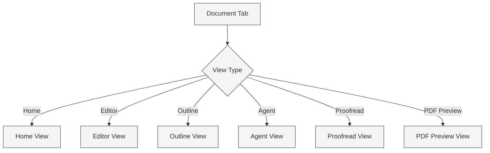

# Types de vues

## Vue d'ensemble

MetaDoc prend en charge plusieurs types de vues, chacune offrant des fonctionnalités et une interface différentes. Vous pouvez basculer entre différentes vues selon vos besoins pour accomplir diverses tâches.

## Présentation des types de vues

### Vue d'accueil

La vue d'accueil est l'interface d'entrée de MetaDoc, offrant des fonctionnalités de démarrage rapide et de documents récents.

**Fonctionnalités principales** :

- **Démarrage rapide** : Choisir un format de document pour créer rapidement un nouveau document
- **Documents récents** : Afficher la liste des documents ouverts récemment
- **Manuel utilisateur** : Accès rapide au manuel utilisateur
- **Profil utilisateur** : Accéder aux paramètres du profil utilisateur

**Cas d'utilisation** :

- Interface initiale après le lancement de l'application
- Besoin de créer rapidement un nouveau document
- Consulter les documents utilisés récemment

Vous pouvez basculer entre différentes vues via la barre latérale.

### Vue Éditeur

La vue Éditeur est l'interface principale pour l'édition de documents, prenant en charge l'édition en Markdown, LaTeX et texte brut.

<LaTeXEditor mode="demo" />

**Fonctionnalités principales** :

- **Édition Markdown** : Utiliser l'éditeur Vditor pour éditer des documents Markdown
- **Édition LaTeX** : Utiliser l'éditeur Monaco pour éditer des documents LaTeX
- **Édition texte brut** : Utiliser l'éditeur Monaco pour éditer du texte brut
- **Aperçu en temps réel** : L'éditeur Markdown prend en charge l'aperçu en temps réel

**Cas d'utilisation** :

- Éditer le contenu d'un document
- Rédiger une documentation technique
- Écrire un article académique

### Vue Plan

La vue Plan affiche le plan structuré du document, facilitant la visualisation et l'édition de la structure du document.

<Outline mode="demo" />

**Fonctionnalités principales** :

- **Affichage du plan** : Afficher les titres du document sous forme d'arborescence
- **Opérations sur les nœuds** : Ajouter, éditer, supprimer, déplacer des nœuds
- **Tri par glisser-déposer** : Ajuster l'ordre en faisant glisser les nœuds
- **Fonctionnalités IA** : Générer des sous-sections, générer du contenu, optimiser le plan

**Cas d'utilisation** :

- Visualiser la structure d'un document
- Naviguer rapidement vers un chapitre spécifique
- Éditer le plan d'un document
- Utiliser l'IA pour générer du contenu

### Vue Agent

La vue Agent fournit une interface d'interaction pour le framework Agent, permettant de créer et gérer des sessions Agent.

<AgentView mode="demo" />

**Fonctionnalités principales** :

- **Gestion des sessions** : Créer, éditer, supprimer des sessions Agent
- **Configuration des outils** : Configurer l'ensemble d'outils utilisé par l'Agent
- **Flux de travail** : Créer et exécuter des flux de travail
- **Interaction par messages** : Dialoguer avec l'Agent

**Cas d'utilisation** :

- Utiliser un Agent pour accomplir des tâches complexes
- Automatiser le traitement de documents
- Effectuer des opérations par lots sur des documents

### Vue Relecture

La vue Relecture offre une fonctionnalité de relecture par IA, vérifiant les erreurs dans le document et fournissant des suggestions de correction.

<ProofreadView mode="demo" />

**Fonctionnalités principales** :

- **Détection d'erreurs** : Détecter les erreurs d'orthographe, de grammaire, de syntaxe LaTeX
- **Liste d'erreurs** : Afficher toutes les erreurs détectées
- **Correction d'erreurs** : Correction individuelle ou correction en un clic de toutes les erreurs
- **Gestion du dictionnaire** : Ajouter des mots au dictionnaire

**Cas d'utilisation** :

- Vérifier les erreurs dans un document
- Améliorer la qualité d'un document
- Corriger les fautes d'orthographe et de grammaire

### Vue Aperçu PDF

La vue Aperçu PDF affiche un aperçu PDF après compilation des documents LaTeX (uniquement pour les documents LaTeX).

<PdfPreviewPanel mode="demo" pdfUrl="" />

**Fonctionnalités principales** :

- **Affichage PDF** : Afficher le contenu PDF après compilation
- **Contrôle du zoom** : Agrandir, réduire le PDF
- **Rafraîchir le PDF** : Recompiler et rafraîchir le PDF
- **Localiser dans le code** : Localiser le code LaTeX à partir d'une position dans le PDF

**Cas d'utilisation** :

- Prévisualiser le rendu d'un document LaTeX
- Vérifier le format PDF
- Localiser des problèmes dans le PDF

## Changement de vue

### Méthodes de changement

Vous pouvez changer de vue de la manière suivante :

<MainTabs mode="demo" />

<ViewMenuItemsDemo mode="demo" :items='["editor", "outline", "agent"]' />

1. **Menu des vues** : Cliquer sur le bouton du menu des vues à gauche
2. **Sélecteur de vue** : Choisir la vue vers laquelle basculer dans le menu des vues
3. **Raccourcis clavier** : Certaines vues peuvent avoir des raccourcis clavier (prise en charge possible à l'avenir)

### Menu des vues

Le menu des vues s'affiche dans la barre latérale gauche :

- **Accueil** : Basculer vers la vue d'accueil
- **Éditeur** : Basculer vers la vue Éditeur
- **Plan** : Basculer vers la vue Plan
- **Agent** : Basculer vers la vue Agent
- **Relecture** : Basculer vers la vue Relecture
- **Aperçu PDF** : Basculer vers la vue Aperçu PDF (uniquement pour les documents LaTeX)

### État des vues

Chaque onglet de document a un état de vue indépendant :

- **Mémorisation de la vue** : L'état de la vue est sauvegardé après un changement
- **Ouverture suivante** : Le document rouvrira dans la dernière vue utilisée
- **Multi-onglets** : Différents onglets peuvent utiliser différentes vues

## Caractéristiques des vues

### Indépendance des vues

Chaque vue est indépendante :

- **État indépendant** : Chaque vue a son propre état
- **Synchronisation des données** : Les données sont automatiquement synchronisées entre les vues
- **Changement rapide** : Le changement de vue est très rapide, aucun rechargement n'est nécessaire

### Combinaison de vues

Certaines vues peuvent être utilisées en combinaison :

- **Éditeur + Plan** : Visualiser simultanément l'éditeur et le plan
- **Éditeur + Aperçu PDF** : L'éditeur LaTeX peut afficher simultanément le code et le PDF
- **Éditeur + Relecture** : Effectuer une relecture pendant l'édition

## Recommandations d'utilisation des vues

### Édition de documents

- **Vue Éditeur** : Utiliser principalement la vue Éditeur pour l'édition
- **Vue Plan** : Basculer vers la vue Plan pour visualiser la structure
- **Aperçu PDF** : Utiliser l'aperçu PDF pour voir le rendu lors de l'édition de documents LaTeX

### Relecture de documents

- **Vue Relecture** : Spécialement dédiée à la relecture de documents
- **Vue Éditeur** : Retourner à la vue Éditeur pour continuer l'édition après relecture

### Tâches Agent

- **Vue Agent** : Créer et gérer des sessions Agent
- **Vue Éditeur** : Consulter les documents traités par l'Agent

## Points à noter

1. **Changement de vue** : Le changement de vue sauvegarde l'état actuel
2. **Aperçu PDF** : La vue Aperçu PDF est uniquement prise en charge pour les documents LaTeX
3. **État des vues** : L'état de vue de chaque onglet est sauvegardé indépendamment
4. **Synchronisation des données** : Les données sont automatiquement synchronisées entre les vues
5. **Considérations de performance** : Certaines vues peuvent consommer plus de ressources

## Documentation associée

- [[core.multi-tab|Gestion multi-onglets]]
- [[outline.basics|Fonctionnalités de la vue Plan]]
- [[agent.session|Gestion des sessions Agent]]
- [[ai.proofread|Fonctionnalité de relecture IA]]
- [[latex.pdf-preview|Fonctionnalité d'aperçu PDF]]
