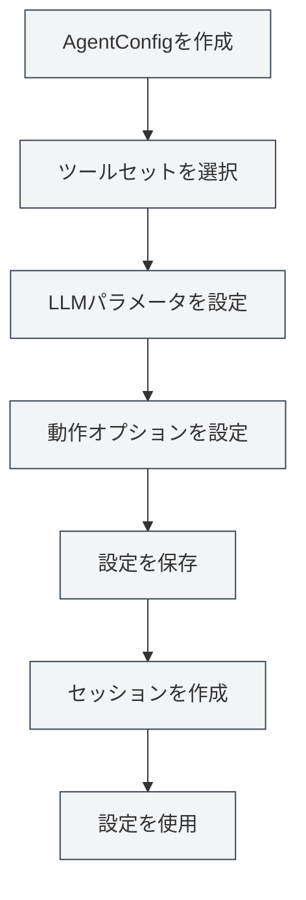

# Agent設定管理

## 概要

Agent設定（AgentConfig）は、Agentフレームワークのコアコンポーネントであり、Agentのアイデンティティと能力範囲を定義するために使用されます。各AgentConfigは一連のツールセットに関連付けられ、Agentがどのツールを使用できるかを決定し、LLMパラメータや動作オプションを設定することができます。

AgentConfigは、ツールセットの共通部分（積集合）メカニズムを通じて、Agentの能力範囲を柔軟に制御し、さまざまなシナリオに特化したAgent設定を作成することができます。

<AgentView mode="demo" />

## コアコンセプト

### AgentConfigの構造

AgentConfigは以下の主要部分を含みます：

- **基本情報**：ID、名前、説明、バージョン番号
- **ツールセット関連付け**：関連付けられたツールセットIDのリスト（共通部分を取る）
- **LLM設定**：モデル、温度、最大トークン数、システムプロンプトなど
- **動作設定**：ツール呼び出しの許可、最大呼び出し回数など
- **シナリオタイプ**：outline、editor、analysis、visualization、custom

### ツールセットの共通部分（積集合）

AgentConfigが複数のツールセットに関連付けられている場合、使用可能なツールはすべてのツールセットの共通部分（積集合）です：

- ツールセットAに含まれる：`[tool1, tool2, tool3]`
- ツールセットBに含まれる：`[tool2, tool3, tool4]`
- AgentConfigで使用可能なツール：`[tool2, tool3]`

このメカニズムにより、Agentの能力範囲を正確に制御できます。

<AgentConfigManager mode="demo" />

## AgentConfigの作成

### 新規設定の作成

AgentConfigを作成する手順：

1. **Agent管理を開く**：Agentビューで「管理」→「Agent設定」をクリック
2. **設定を作成**：「新規設定」ボタンをクリック
3. **基本情報を入力**：
   - 名前：設定の名前（多言語対応）
   - 説明：設定の説明（多言語対応）
4. **ツールセットを選択**：ドロップダウンリストから1つ以上のツールセットを選択
5. **LLMを設定**（オプション）：
   - システムプロンプト：カスタムシステムプロンプト
   - タイムスタンプの注入：システムプロンプトに現在時刻を注入するかどうか
6. **動作を設定**（オプション）：
   - 最大ツール呼び出し回数：Agentのツール呼び出し回数を制限（nullは無制限を意味）
7. **設定を保存**：「保存」ボタンをクリック

<AgentView mode="demo" />

サイドバーからAgentビューにアクセスできます：

### デフォルト設定

システムはデフォルトのAgentConfig（`default-agent-config`）を提供しており、すべての組み込みツールを含み、削除はできませんが複製は可能です。

## AgentConfigの編集

### 編集操作

既存のAgentConfigを編集する：

1. **管理インターフェースを開く**：Agent設定管理インターフェースで編集する設定を見つける
2. **編集をクリック**：設定カード上の「編集」ボタンをクリック
3. **設定を変更**：名前、説明、ツールセット、LLM設定、または動作設定を変更
4. **変更を保存**：「保存」ボタンをクリック

**注意**：デフォルト設定（`default-agent-config`）は編集できませんが、複製後に編集できます。

<AgentConfigManager mode="demo" />

## AgentConfigの削除

### 削除操作

不要なAgentConfigを削除する：

1. **管理インターフェースを開く**：Agent設定管理インターフェースで削除する設定を見つける
2. **削除をクリック**：設定カード上の「削除」ボタンをクリック
3. **削除を確認**：表示される確認ダイアログで削除を確認

<AgentConfigManager mode="demo" />

**注意**：

- デフォルト設定（`default-agent-config`）は削除できません
- 設定を削除しても、作成済みのセッションには影響しませんが、新規セッションではその設定を使用できなくなります
- 設定がセッションで使用されている場合、削除前に警告が表示されます

## AgentConfigの複製

### 複製操作

既存のAgentConfigを複製する：

1. **管理インターフェースを開く**：Agent設定管理インターフェースで複製する設定を見つける
2. **複製をクリック**：設定カード上の「複製」ボタンをクリック
3. **コピーを編集**：システムがコピーを作成し、名前には自動的に「（コピー）」サフィックスが追加されます
4. **変更を保存**：必要に応じてコピーを変更して保存

<AgentView mode="demo" />

設定を複製すると、ツールセット関連付け、LLM設定、動作設定を含むすべての設定がコピーされます。

## AgentConfigのインポート/エクスポート

### 設定のエクスポート

AgentConfigをJSONファイルとしてエクスポートする：

1. **管理インターフェースを開く**：Agent設定管理インターフェースでエクスポートする設定を見つける
2. **エクスポートをクリック**：設定カード上の「エクスポート」ボタンをクリック
3. **場所を選択**：保存場所とファイル名を選択
4. **ファイルを保存**：保存をクリックして設定をエクスポート

エクスポートされたJSONファイルには、設定のすべての情報が含まれており、バックアップや共有に使用できます。

<AgentConfigManager mode="demo" />

### 設定のインポート

JSONファイルからAgentConfigをインポートする：

1. **管理インターフェースを開く**：Agent設定管理インターフェースで
2. **インポートをクリック**：「設定をインポート」ボタンをクリック
3. **ファイルを選択**：インポートするJSONファイルを選択
4. **データを検証**：システムがファイル形式と内容を検証
5. **設定をインポート**：インポート成功後に新規設定を作成

インポートされた設定は新しいIDで作成され、既存の設定を上書きしません（上書きモードを使用する場合を除く）。

## LLM設定

### システムプロンプト

AgentConfigはカスタムシステムプロンプトを設定できます：

- **デフォルトプロンプト**：設定しない場合、Agentフレームワークのデフォルトシステムプロンプトを使用
- **カスタムプロンプト**：Agentの役割と動作を定義する専用のシステムプロンプトを設定可能
- **タイムスタンプ注入**：システムプロンプトに現在時刻を注入するかどうかを選択可能

### LLMパラメータ

AgentConfigはグローバルLLM設定を上書きできます：

- **モデル**：使用するLLMモデルを指定
- **温度**：出力のランダム性を制御（0-2）
- **最大トークン数**：単一呼び出しの最大トークン数を制限

**注意**：AgentConfigがLLMパラメータを設定していない場合、グローバルLLM設定が使用されます。

<AgentConfigManager mode="demo" />

## 動作設定

### ツール呼び出し制御

AgentConfigはツール呼び出し動作を制御できます：

- **ツール呼び出しを許可**：Agentがツールを呼び出すことを許可するか（デフォルトで許可）
- **最大ツール呼び出し回数**：単一タスクの最大ツール呼び出し回数を制限（nullは無制限を意味）
- **ワークフロー呼び出しを許可**：Agentがワークフローを呼び出すことを許可するか（デフォルトで許可）

### 使用シナリオ

異なる動作設定は異なるシナリオに適しています：

- **純粋な対話シナリオ**：ツール呼び出しを無効化し、対話のみを行う
- **限定ツールシナリオ**：ツール呼び出し回数を制限し、過剰な呼び出しを回避
- **フル機能シナリオ**：すべてのツール呼び出しを許可し、制限なし

<AgentConfigManager mode="demo" />

## シナリオタイプ

AgentConfigはシナリオタイプを設定でき、分類と管理に使用されます：

- **outline**：アウトラインシナリオ、ドキュメント構造関連タスク用
- **editor**：エディターシナリオ、ドキュメント編集タスク用
- **analysis**：分析シナリオ、ドキュメント分析タスク用
- **visualization**：可視化シナリオ、チャート生成タスク用
- **custom**：カスタムシナリオ

シナリオタイプは主に分類に使用され、Agentの実際の動作には影響しません。

## 使用上のヒント

### 設定の整理

1. **命名規則**：「データ分析Agent」、「ドキュメント編集Agent」など、明確な名前を使用
2. **シナリオ分類**：シナリオタイプを使用して分類管理
3. **ツールセット選択**：タスク要件に基づいて適切なツールセットの組み合わせを選択

<AgentConfigManager mode="demo" />

### ツールセットの共通部分（積集合）

1. **正確な制御**：複数のツールセットの共通部分を使用して、Agentの能力を正確に制御
2. **ツールセット設計**：専用のツールセットを設計し、共通部分を組み合わせて使用
3. **テスト検証**：設定作成後、ツールセットの共通部分が正しいかテスト

<AgentConfigManager mode="demo" />

### LLM設定

1. **システムプロンプト**：異なるシナリオに特化したシステムプロンプトを作成
2. **パラメータ調整**：タスクの特性に基づいて温度と最大トークン数を調整
3. **タイムスタンプ注入**：時間認識が必要なタスクでは、タイムスタンプ注入を有効化

## よくある質問

### Q: 専用のAgent設定を作成するには？

A: 新規設定を作成し、専用のツールセットを選択し、カスタムシステムプロンプトと動作設定を設定します。例：「データ分析Agent」を作成し、データ分析ツールセットを関連付け、専用のシステムプロンプトを設定します。

### Q: ツールセットの共通部分（積集合）とはどういう意味ですか？

A: AgentConfigが複数のツールセットに関連付けられている場合、使用可能なツールはすべてのツールセットの共通部分（積集合）です。例：ツールセットAに`[tool1, tool2, tool3]`が含まれ、ツールセットBに`[tool2, tool3, tool4]`が含まれる場合、AgentConfigで使用可能なツールは`[tool2, tool3]`です。

### Q: デフォルト設定を変更できますか？

A: デフォルト設定（`default-agent-config`）は編集できませんが、複製後に編集できます。デフォルト設定を複製し、コピーを変更します。

### Q: LLM設定とグローバル設定の関係は？

A: AgentConfigがLLMパラメータを設定している場合、AgentConfigの設定が使用されます。それ以外の場合はグローバルLLM設定が使用されます。AgentConfigの設定が優先されます。

### Q: Agentのツール呼び出し回数を制限するには？

A: AgentConfigの動作設定で「最大ツール呼び出し回数」を設定します。具体的な数字（例：10）を設定すると呼び出し回数を制限し、nullを設定すると無制限を意味します。

### Q: 設定を削除すると既存のセッションに影響しますか？

A: 設定を削除しても、作成済みのセッションには影響しませんが、新規セッションではその設定を使用できなくなります。設定がセッションで使用されている場合、削除前に警告が表示されます。

<AgentView mode="demo" />

## 関連ドキュメント

- [[agent.introduction|Agentフレームワーク概要]]
- [[agent.tools|ツールセット管理]]
- [[agent.session|Agentセッション管理]]
- [[agent.engine|Agentエンジン管理]]