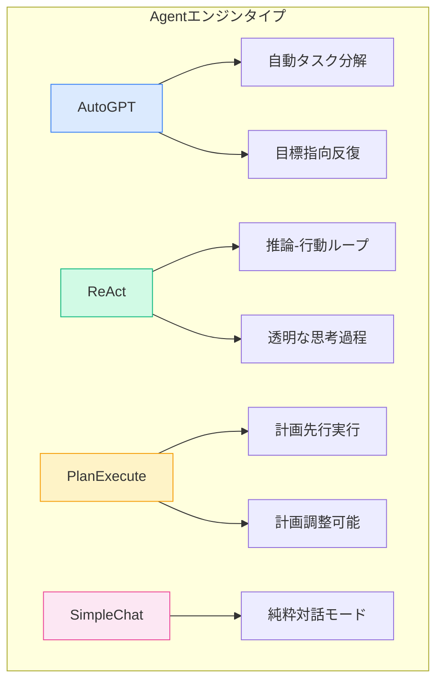
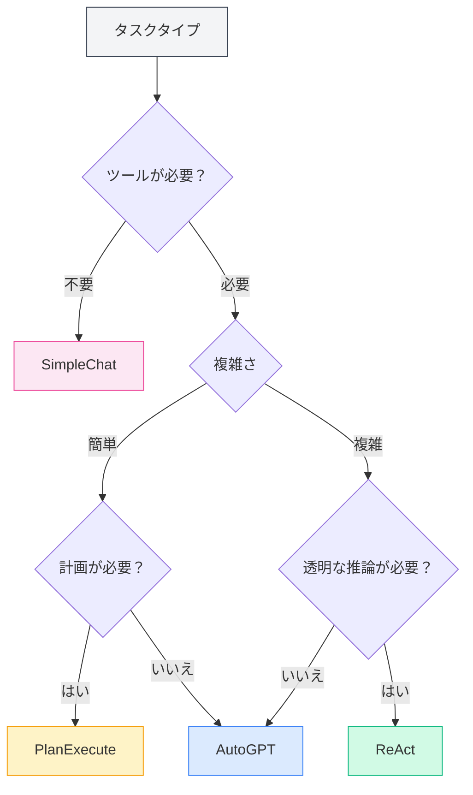
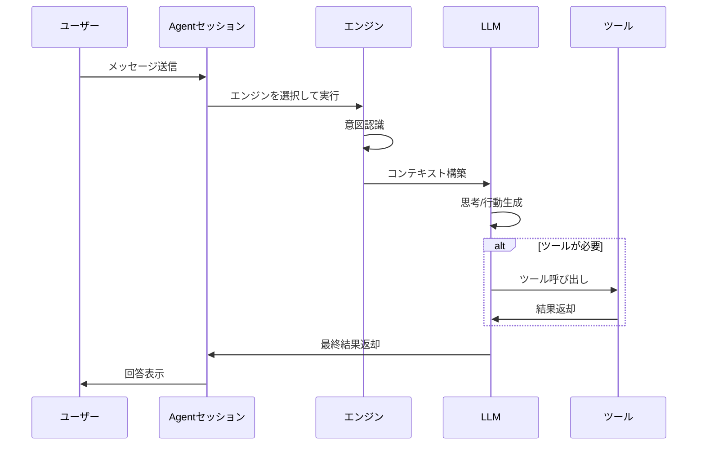

# Agentエンジン管理

## 概要

Agentエンジンは、Agentの実行戦略と動作方法を定義します。MetaDocは複数の組み込みエンジンを提供しており、各エンジンは異なるAI実行パラダイムを採用し、様々なタスクシナリオに適しています。適切なエンジンを選択することで、Agentが特定のタスクを最も適した方法で完了できるようにします。

<AgentView mode="demo" />

## エンジンタイプ

MetaDocは以下のAgentエンジンをサポートしています：

| エンジン名      | 特徴                          | 適用シナリオ         |
| --------------- | ----------------------------- | -------------------- |
| **AutoGPT**     | 自動タスク分解、目標指向の反復 | 複雑な多段階タスク   |
| **ReAct**       | 推論-行動ループ、思考過程の透明化 | 詳細な推論が必要なタスク |
| **PlanExecute** | 計画先行実行、計画の調整可能  | 構造化タスク         |
| **SimpleChat**  | 純粋な対話、ツールを呼び出さない | 簡単な質疑応答       |



## エンジン詳細

### AutoGPTエンジン

**特徴**：

- **自動タスク分解**：複雑なタスクを自動的にサブタスクに分解
- **目標指向**：最終目標を中心に反復実行
- **自律的決定**：Agentが次の行動を自律的に決定

<AgentView mode="demo" />
<AgentEngineManager mode="demo" />

**適用シナリオ**：

- 調査と情報収集
- 多段階ドキュメント処理
- オープンエンドな創作タスク

**例**：

```
ユーザー：人工知能に関するレビュー記事を書いてください
Agent：[自動的に分解：1.資料収集 2.アウトライン整理 3.内容作成 4.推敲修正]
```

### ReActエンジン

**特徴**：

- **推論-行動ループ**：思考過程（Reasoning）と行動（Action）を明示的に表示
- **トレーサビリティ**：各ステップに明確な推論根拠
- **透明性と制御性**：ユーザーはAgentの思考ロジックを確認可能

<AgentView mode="demo" />
<AgentEngineManager mode="demo" />

**適用シナリオ**：

- 推論過程の説明が必要なタスク
- 論理分析タスク
- 教育・デモンストレーションシナリオ

**例**：

```
思考：ユーザーはこのコードの機能説明を求めている
行動：コード分析ツールを呼び出す
観察：[ツールから結果が返される]
思考：分析結果に基づき、説明できる...
```

### PlanExecuteエンジン

**特徴**：

- **計画先行実行**：まず完全な計画を立て、計画に従って実行
- **計画調整可能**：実行中に計画を修正可能
- **構造化出力**：出力形式が標準化され、理解しやすい

<AgentView mode="demo" />
<AgentEngineManager mode="demo" />

**適用シナリオ**：

- プロジェクト管理タスク
- 構造化ドキュメント生成
- プロセス化された作業

**例**：

```
計画：
1. 要件分析
2. 設計案作成
3. 機能実装
4. テスト検証

実行：各段階をステップごとに完了
```

### SimpleChatエンジン

**特徴**：

- **純粋対話モード**：対話のみ行い、ツールを一切呼び出さない
- **高速応答**：ツール実行待ち時間なし
- **シンプル直接**：簡単な質疑応答に適している

**適用シナリオ**：

- 一般的な質疑応答
- 概念説明
- 簡単な対話

**注意**：このエンジンはツールを呼び出さないため、ファイル操作やデータ分析などの機能は実行できません。

<AgentEngineManager mode="demo" />

## エンジン選択

### 適切なエンジンの選び方

タスクの特徴に基づいてエンジンを選択：



<AgentView mode="demo" />

### 選択の推奨

| タスクシナリオ | 推奨エンジン           |
| -------------- | ---------------------- |
| 日常的な質疑応答 | SimpleChat             |
| ドキュメント編集 | AutoGPT または ReAct   |
| データ分析     | ReAct または PlanExecute |
| コード作成     | ReAct                  |
| 調査・リサーチ | AutoGPT                |
| プロジェクト管理 | PlanExecute            |

<AgentView mode="demo" />

## エンジン設定

### Agent設定でのエンジン選択

1. [[agent.introduction|Agent設定管理]] に移動
2. Agent設定を作成または編集
3. 「エンジン」オプションで希望のエンジンタイプを選択
4. 設定を保存

### エンジンパラメータ設定

異なるエンジンには特定のパラメータ設定があります：

**共通パラメータ**：

- **最大反復回数**：Agentの思考と行動の回数を制限
- **タイムアウト時間**：単一呼び出しの最大待機時間
- **温度**：出力の創造性を制御

**エンジン固有パラメータ**：

- **AutoGPT**：目標分解の深さ
- **ReAct**：思考過程表示オプション
- **PlanExecute**：計画調整権限

## エンジン実行フロー

### 共通実行フロー



### 異なるエンジンの実行特徴

**AutoGPT実行特徴**：

1. ユーザー目標を分析
2. 自動的にサブタスクに分解
3. サブタスクを逐次実行
4. 結果を集約して返却

**ReAct実行特徴**：

1. 思考過程を生成
2. 次の行動を決定
3. 行動を実行（ツール呼び出しまたは応答生成）
4. 結果を観察
5. タスク完了までループ

**PlanExecute実行特徴**：

1. 要件を分析
2. 完全な計画を策定
3. ステップごとに実行
4. 構造化された結果を返却

## カスタムエンジン

### エンジン設定のカスタマイズ

上級ユーザー向けに、エンジンの動作をカスタマイズできます：

1. **システムプロンプトの変更**：Agentの役割と動作を調整
2. **ツール設定の設定**：優先使用するツールを指定
3. **推論パラメータの調整**：温度、最大トークン数など

### カスタムエンジンの作成（上級）

開発者は新しいエンジンタイプを作成できます：

1. 基本エンジンインターフェースを継承
2. 特定の実行ロジックを実装
3. エンジンマネージャーに登録
4. 設定で使用を選択

## ベストプラクティス

### エンジン選択の原則

1. **シンプルから始める**：不明な場合はまずSimpleChatでテスト
2. **複雑さに基づいて選択**：複雑なタスクにはAutoGPTまたはReAct
3. **説明可能性を考慮**：説明が必要な場合はReActを使用

### エンジン効果の最適化

1. **要件を明確に記述**：エンジンの効果は入力の明確さに大きく依存
2. **ツールを適切に使用**：Agentに適切なツールセットを設定
3. **合理的な制限を設定**：最大反復回数などのパラメータでコストを制御
4. **タイムリーなフィードバック**：Agentの回答にフィードバックを与え、改善を支援

## よくある質問

### Q: Agentが期待通りに実行されないのはなぜですか？

A: 考えられる原因：

- エンジン選択が不適切
- ツールセット設定が不十分
- タスク記述が不明確
- 最大反復回数制限に達した

### Q: 対話中にエンジンを切り替えられますか？

A: 現在、単一の対話中でのエンジン切り替えはサポートされていません。エンジンを変更する場合は、以下をお勧めします：

1. 現在のセッションを終了
2. 新しいセッションを作成
3. 異なるエンジンを使用するAgent設定を選択

### Q: 初心者に最も適したエンジンはどれですか？

A: 推奨：

- まずSimpleChatで対話機能に慣れる
- 次にReActを試し、推論過程を観察
- 慣れたらAutoGPTで複雑なタスクを処理

### Q: エンジンは回答の品質に影響しますか？

A: はい。異なるエンジンは思考方法と実行戦略が異なります：

- 同じタスクでも、異なるエンジンは異なる回答を出す可能性があります
- 適切なエンジンを選択することで効果が大幅に向上します
- 異なるタイプのタスクには異なるAgentを設定することをお勧めします

## 関連ドキュメント

- [[agent.introduction|Agentフレームワーク概要]]
- [[agent.introduction|Agent設定管理]]
- [[agent.session|Agentセッション管理]]
- [[agent.tools|ツールセット管理]]
