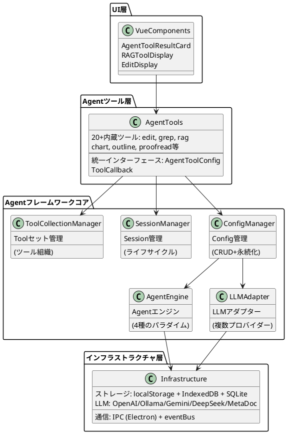
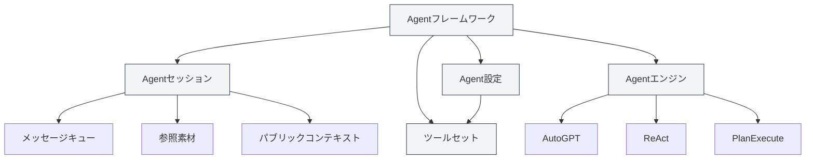
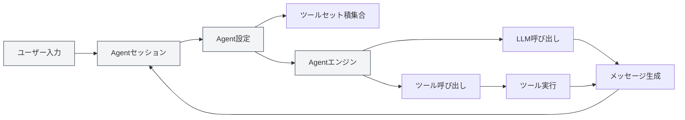
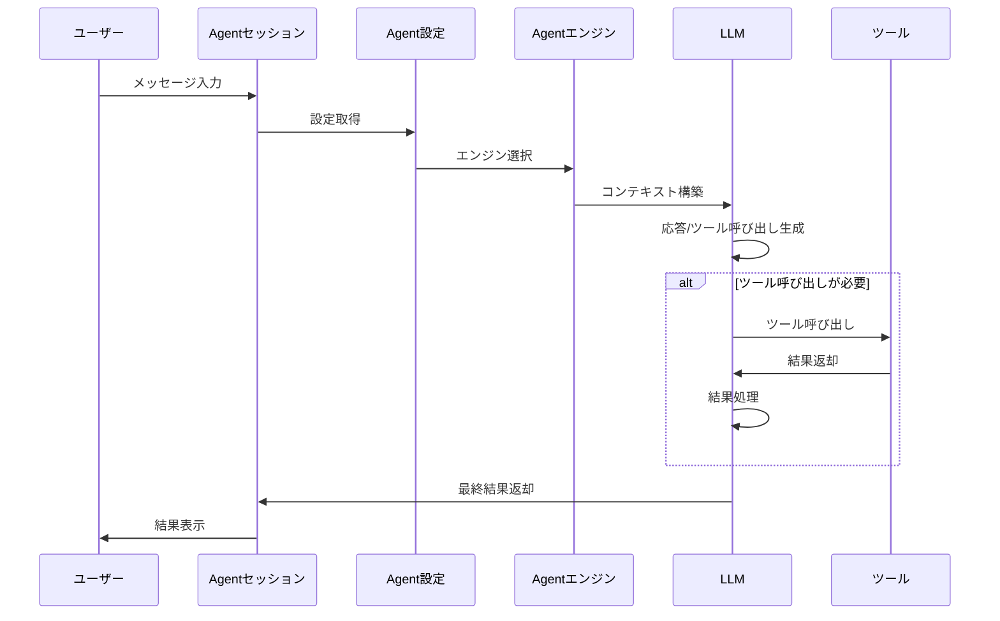

# Agentフレームワーク概要

## 概要

Agentフレームワークは、MetaDocにおいてインテリジェントAgentシステムを構築・管理するためのコアフレームワークであり、**階層型アーキテクチャ設計**を採用しています。セッション管理、設定管理、ツールセット管理、エンジン管理など、完全なAgentライフサイクル管理機能を提供します。

Agentフレームワークは既存のToolシステムを基盤として構築されており、Agent設定（AgentConfig）、ツールセット（ToolCollection）、Agentセッション（AgentSession）などのコアコンポーネントを通じて、柔軟で拡張性の高いAgentシステムを実現しています。

<AgentSessionManager mode="demo" />

## インターフェースプレビュー

Agentフレームワークは、Agentセッションとツールを管理するための直感的なインターフェースを提供します：

<AgentView mode="demo" />

## 技術アーキテクチャ

### アーキテクチャ階層



### コアファイルパス

| カテゴリ           | ファイルパス                                                            | 説明                          |
| ------------------ | ----------------------------------------------------------------------- | ----------------------------- |
| **型定義**         | `src/renderer/src/types/agent-framework.ts`                             | Agentフレームワークコア型定義 |
| **型定義**         | `src/renderer/src/types/agent-tool.ts`                                  | Agentツール型定義             |
| **設定管理**       | `src/renderer/src/utils/agent-framework/agent-config-manager.ts`        | AgentConfigのCRUDと永続化     |
| **セッション管理** | `src/renderer/src/utils/agent-framework/agent-session-manager.ts`       | AgentSessionライフサイクル管理 |
| **ツールセット管理** | `src/renderer/src/utils/agent-framework/tool-collection-manager.ts`   | ツールセットの組織と管理      |
| **エンジン管理**   | `src/renderer/src/utils/agent-framework/agent-engine-manager.ts`        | Agentエンジン設定管理         |
| **エンジン実行**   | `src/renderer/src/utils/agent-framework/agent-engine-executor.ts`       | 4種の実行パラダイム実装       |
| **ツール実行**     | `src/renderer/src/utils/agent-framework/tool-runner.ts`                 | 統一ツール呼び出しエントリ    |
| **LLMアダプト**    | `src/renderer/src/utils/agent-framework/llm-adapter.ts`                 | 複数LLMプロバイダー対応       |



## コアコンセプト

### Agentセッション（AgentSession）

<AgentView mode="demo" />

AgentセッションはAgentConfigのインスタンスであり、独立したコンテキストを持つAgent実行環境を表します。`agent-session-manager.ts` に基づいて実装され、各セッションは独自のメッセージ履歴、参照素材、パブリックコンテキスト空間を維持し、メッセージキュー、リトライ、Duplicateなどの高度な機能をサポートします。

**型定義**（`types/agent-framework.ts` 第387-424行）：

```typescript
export interface AgentSession {
  entityType: 'agent-session'
  id: string
  title: string
  agentConfigId: string // 関連するAgentConfig
  messages: AgentMessage[] // メッセージ履歴
  messageQueue: QueuedMessage[] // メッセージキュー
  referenceStore: Reference[] // 参照素材
  publicContext: PublicContext // パブリックコンテキスト
  executionNodes: ExecutionNode[] // 実行ノード（リトライ用）
  status: AgentSessionStatus // セッション状態
}
```

**セッション状態遷移**：

```
idle → thinking → generating → tool-calling → waiting-input → error
```

詳細は[[agent.session|Agentセッション管理]]を参照してください。

### Agent設定（AgentConfig）

<CompletionSettingsPanel mode="demo" />

AgentConfigは、Agentのアイデンティティと能力範囲を定義し、`agent-config-manager.ts` に基づいて実装されています。

**型定義**（`types/agent-framework.ts` 第242-289行）：

```typescript
export interface AgentConfig {
  entityType: 'agent-config'
  id: string
  name: LocalizedText // i18n対応の名称
  description: LocalizedText // i18n対応の説明
  toolCollectionIds: string[] // 関連するツールセットID（積集合）
  maxToolCalls?: number | null // 最大ツール呼び出し回数
  llmConfig?: {
    model?: string
    temperature?: number
    systemPrompt?: string // システムプロンプト
    injectTimestamp?: boolean
  }
  behavior?: {
    allowToolCalls?: boolean
  }
  scenario?: 'outline' | 'editor' | 'analysis' | 'visualization' | 'custom'
}
```

**コア機能**：

- **デフォルト設定**：`default-agent-config`（内蔵、削除不可）
- **ツールセット積集合**：複数のツールセットを関連付ける場合、使用可能なツールはすべてのツールセットの積集合となります
- **LLMパラメータ上書き**：グローバルLLM設定を上書き可能
- **永続化**：`localStorage` に `'agent-configs'` キーで保存

Agent 関連の管理は **Agent ビュー** のメニューに集約されています。まず [[agent.tools|ツールセット管理]] と [[agent.capabilities|ルール、スキル、MCP管理]] を参照してください。（旧「Agent 設定管理」の索引エントリは削除済みで、記事ファイルのみ残しています。）

### ツールセット（ToolCollection）

<DataAnalysisDisplay mode="demo" />

ツールセットは、Agentが使用可能なツールを組織化・管理するためのグループです。AgentConfigは複数のツールセットを関連付けることができ、使用可能なツールはすべてのツールセットの積集合となります。

詳細は[[agent.tools|ツールセット管理]]を参照してください。

### 参照素材（Reference）

<RAGToolDisplay mode="demo" />

参照素材は、Agentセッション内で参照されるドキュメントやファイルであり、Agentはこれらの内容を認識し、それらに基づいて推論や操作を行うことができます。ファイル、URL、ナレッジベースなど、さまざまなタイプの参照をサポートしています。

参照素材はセッション内で利用・管理します。[[agent.session|Agentセッション管理]] を参照してください。（「参照素材管理」の独立索引は削除済みです。）

### Agentエンジン（AgentEngine）

<DiffDisplay mode="demo" />

Agentエンジンは、Agentの実行戦略と動作方法を定義し、AutoGPT、ReAct、PlanExecuteなど複数のパラダイムを含みます。異なるエンジンは異なるタスクシナリオに適しています。

実行パラダイムはセッションと設定に基づき自動で選ばれます。日常利用は [[agent.session|Agentセッション管理]] を参照してください。（「Agentエンジン管理」の独立索引は削除済みです。）

## システムアーキテクチャ

Agentフレームワークのシステムアーキテクチャは以下の通りです：



## 実行フロー

Agentの基本的な実行フロー：

1. **ユーザー入力**：ユーザーがAgentセッションにメッセージを入力
2. **意図認識**：システムがユーザー意図を認識し、使用可能なツール説明を更新
3. **エンジン選択**：Agent設定に基づいて実行エンジンを選択
4. **コンテキスト構築**：履歴メッセージ、参照素材、ツール説明を含むコンテキストを構築
5. **LLM呼び出し**：LLMを呼び出して応答またはツール呼び出しを生成
6. **ツール実行**：LLMがツール呼び出しを決定した場合、対応するツールを実行
7. **結果処理**：ツール実行結果を観察（Observation）としてLLMに返す
8. **反復ループ**：エンジンのタイプに応じて、タスク完了まで複数回の反復が行われる可能性あり
9. **結果出力**：最終結果をユーザーに表示



## 機能特性

### コア機能

- **セッション管理**：セッションの作成、削除、複製、エクスポート/インポート
- **設定管理**：柔軟なAgent設定、複数ツールセット積集合のサポート
- **ツールセット管理**：Agentツールの組織と管理
- **参照素材管理**：セッション内の参照ドキュメントとファイルの管理
- **エンジン管理**：複数の実行パラダイムをサポート、カスタムエンジン可能

### 高度な機能

- **メッセージキュー**：Agent実行中にメッセージを挿入
- **リトライ機構**：失敗した実行ノードのリトライをサポート
- **Duplicate機能**：セッションまたは実行ノードの複製
- **パブリックコンテキスト**：セッションレベルの共有コンテキスト空間
- **実行ノード追跡**：各実行ノードの状態と結果を記録

## 使用シナリオ

Agentフレームワークは以下のシナリオに適しています：

- **ドキュメント編集**：Agentツールを使用したドキュメント編集と最適化
- **データ分析**：データ分析ツールを使用したデータ処理と可視化
- **コンテンツ生成**：Agentエンジンとツールセットを使用した構造化コンテンツ生成
- **ナレッジ検索**：ナレッジベースを組み合わせたインテリジェント検索と分析
- **自動化タスク**：Agentとツールセットによる多段階タスクの実現

## クイックスタート

Agentフレームワークの使用を開始するには、以下の順序で学習することをお勧めします：

1. [[agent.introduction|Agentフレームワーク概要]]（本文書）
2. [[agent.tools|ツールセット管理]]：ツールセットの管理方法を学習
3. [[agent.capabilities|ルール、スキル、MCP管理]]：ルール、ワークスペーススキル、MCP
4. [[agent.session|Agentセッション管理]]：セッションの作成と管理

## よくある質問

### Q: AgentフレームワークとAI対話の違いは何ですか？

A: AI対話はシンプルな対話機能ですが、Agentフレームワークはツール呼び出し、参照素材管理などの高度な機能を含む完全なAgentシステムを提供します。Agentフレームワークは、単なる対話だけでなく、複雑なタスクを実行することができます。

### Q: 適切なAgentエンジンはどのように選択すればよいですか？

A:

- **AutoGPTエンジン**：ほとんどのインテリジェントタスクに適し、自律的な意思決定能力が高い
- **ReActエンジン**：詳細な推論ステップが必要なタスクに適し、明示的な思考プロセスを持つ
- **PlanExecuteエンジン**：構造化された実行が必要なタスクに適し、計画してから実行する
- **SimpleChatエンジン**：純粋な対話タスクに適し、ツールを呼び出さない

### Q: ツールセット積集合とはどういう意味ですか？

A: AgentConfigが複数のツールセットを関連付ける場合、使用可能なツールはすべてのツールセットの積集合となります。例えば、ツールセットAが `[tool1, tool2, tool3]` を含み、ツールセットBが `[tool2, tool3, tool4]` を含む場合、AgentConfigの使用可能なツールは `[tool2, tool3]` となります。

## 関連ドキュメント

- [[agent.session|Agentセッション管理]]
- [[agent.tools|ツールセット管理]]
- [[agent.capabilities|ルール、スキル、MCP管理]]
- [[ai.llm-config|LLM設定]]

<QuickStartPanel mode="demo" />