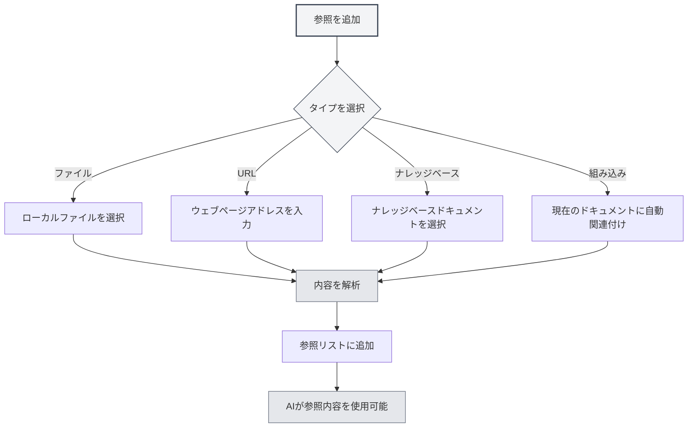

# 参照素材管理

## 概要

参照素材は、Agentセッションにおける重要な機能で、外部のドキュメント、ウェブページ、ファイルなどを会話に取り込むことができます。Agentはこれらの参照素材に基づいて推論と回答を行い、AIの回答をより正確で関連性の高いものにします。

参照素材を通じて、以下のことが可能です：

- AIに特定のドキュメント内容を参照させる
- ウェブページ情報に基づいて議論する
- ローカルファイルの内容を分析する
- ナレッジベースと組み合わせて深い質疑応答を行う

## 参照管理を開く

Agentセッションインターフェースで、「参照」タブをクリックすると、参照素材管理パネルが開きます。

参照パネルには、現在のセッションで追加されたすべての参照素材が表示されます。表示内容は以下の通りです：

- ファイル名またはURL
- 参照タイプ（ファイル/URL/ナレッジベース/組み込みドキュメント）
- 有効状態
- 内容プレビュー

サイドバーからAgentビューにアクセスできます：

<ReferenceManager mode="demo" />
<ReferenceDisplay mode="demo" />

## 参照を追加する

### ファイル参照を追加する

ローカルファイルを参照素材として追加します：

1.  参照パネルで「参照を追加」ボタンをクリック
2.  「ファイル」タイプを選択
3.  ファイルピッカーで参照するファイルを選択
4.  追加を確認

**対応ファイル形式**：

-   Markdownドキュメント（.md）
-   LaTeXドキュメント（.tex）
-   PDFファイル（.pdf）
-   Wordドキュメント（.docx）
-   プレーンテキストファイル（.txt）
-   画像ファイル（.png, .jpg）

<ReferenceManager mode="demo" />

### URL参照を追加する

ウェブページの内容を参照します：

1.  参照パネルで「参照を追加」ボタンをクリック
2.  「URL」タイプを選択
3.  参照するウェブページのアドレスを入力
4.  確認をクリック

MetaDocは自動的にウェブページの内容を取得し、参照に追加します。

<ReferenceManager mode="demo" />
<ReferenceDisplay mode="demo" />

### ナレッジベース参照を追加する

ナレッジベース内のドキュメントを参照します：

1.  参照パネルで「参照を追加」ボタンをクリック
2.  「ナレッジベース」タイプを選択
3.  ナレッジベースリストから参照するドキュメントを選択
4.  追加を確認

<ReferenceDisplay mode="demo" />

### 組み込みドキュメント参照

各Agentセッションでは、デフォルトで「組み込みドキュメント参照」（参照0番）が有効になっており、現在開いているドキュメントの内容を動的に取得して参照素材とします。



## 参照を管理する

### 参照の有効化/無効化

各参照素材の有効状態は個別に制御できます：

-   **有効**：参照内容がAIの推論プロセスに参加します
-   **無効**：参照内容は一時的に推論に参加しませんが、リストには残ります

参照素材の横にあるスイッチをクリックして、有効状態を切り替えます。

<ReferenceDisplay mode="demo" />

### 参照内容をプレビューする

参照素材をクリックすると、その内容をプレビューできます：

-   **ファイル参照**：ファイル内容のテキストプレビューを表示
-   **URL参照**：取得したウェブページ内容を表示
-   **ナレッジベース参照**：ナレッジベース内の関連スニペットを表示
-   **組み込み参照**：現在のドキュメントの内容を表示

### 参照を削除する

参照リストから不要な参照を削除します：

1.  参照パネルで削除する参照を見つける
2.  削除ボタン（×アイコン）をクリック
3.  削除を確認

**注意**：参照を削除しても、元のファイルには影響しません。

<ReferenceManager mode="demo" />

## 会話における参照の役割

### 参照認識

参照を有効にすると、Agentは返信時に以下のことを行います：

1.  **参照内容を分析**：参照されたドキュメント、ウェブページ、またはファイルの内容を理解します
2.  **コンテキストと結合**：参照内容と会話履歴を組み合わせます
3.  **回答を生成**：参照内容に基づいて、より正確な回答を生成します

### 使用例

**シナリオ1：ドキュメントに基づく質疑応答**

```
ユーザー：[技術文書を参照として追加]
ユーザーの質問：この文書で言及されているベストプラクティスは何ですか？
AI：参照された文書によると、ベストプラクティスには以下が含まれます...
```

**シナリオ2：複数ドキュメントの比較**

```
ユーザー：[2つの論文を参照として追加]
ユーザーの質問：この2つの論文の研究方法を比較してください
AI：最初の論文では...を使用していますが、2番目の論文では...を採用しています...
```

**シナリオ3：ウェブページ内容の分析**

```
ユーザー：[ニュースウェブページを参照として追加]
ユーザーの質問：この報道の主な内容を要約してください
AI：ウェブページの内容によると、主に...について報道されています...
```

## ベストプラクティス

### 参照の効率的な使用

1.  **関連素材を選択**：現在のトピックに関連する参照のみを追加し、情報過多を避けます
2.  **参照数を制御**：処理効率を保つため、同時に有効にする参照は5つ以下にすることをお勧めします
3.  **適時整理**：会話終了後、不要になった参照を削除し、リストを整理します

### 参照戦略

1.  **ドキュメント分析**：長いドキュメントを分析する際は、ドキュメント参照を追加して具体的な質問をします
2.  **ナレッジ検索**：ナレッジベース参照を使用して、ナレッジベースに基づく質疑応答を行います
3.  **リアルタイム情報**：URL参照を通じて最新のウェブページ情報を取得します
4.  **コンテキスト継続**：組み込み参照を利用して、AIに現在編集中のドキュメントを理解させます

## 使用上のヒント

### クイック追加

-   **ドラッグ＆ドロップ追加**：ファイルを直接参照パネルにドラッグ＆ドロップします
-   **右クリック追加**：ファイルまたはウェブページ上で右クリックし、「参照に追加」を選択します
-   **ショートカットキー**：ショートカットキーを使用して参照パネルを素早く開きます

<ReferenceManager mode="demo" />

### 参照の組み合わせ

複数の異なるタイプの参照を同時に追加できます：

-   PDFドキュメント1つ + ウェブページリンク1つ
-   複数のナレッジベースドキュメント
-   ローカルファイル + 組み込みドキュメント参照

AIは、有効になっているすべての参照内容を総合的に分析します。

<ReferenceDisplay mode="demo" />

### 一時的な無効化

参照が役立つかどうかわからない場合は、まず無効にすることができます：

1.  AIがその参照なしで回答する様子を観察します
2.  参照を有効にして、回答の違いを比較します
3.  効果に基づいて、保持するかどうかを決定します

## よくある質問

### Q: 参照内容にサイズ制限はありますか？

A: あります。大きすぎるファイルは切り捨て処理される場合があります。以下のことをお勧めします：

-   超大ドキュメントは章ごとに追加する
-   大量のドキュメントはナレッジベースで処理する
-   長いドキュメントはまず重要な部分を抽出する

### Q: 参照を追加したのに、AIが使用していないように見えるのはなぜですか？

A: 考えられる原因：

-   参照が有効になっていない（スイッチ状態を確認）
-   参照内容が質問と無関係
-   参照の解析に失敗した（ファイル形式を確認）

### Q: URL参照が失敗した場合はどうすればよいですか？

A: 考えられる原因：

-   ウェブページにログインが必要
-   ウェブページにクローラー対策がある
-   ネットワーク接続の問題
    推奨：ウェブページ内容をファイルとして保存し、ファイル参照として追加してください

### Q: 参照はストレージ容量を占有しますか？

A: 参照自体はリンクのみであり、追加の容量は占有しません。ただし、参照の解析結果はローカルにキャッシュされます。

## 関連ドキュメント

-   [[agent.session|Agentセッション管理]]
-   [[agent.introduction|Agent設定管理]]
-   [[knowledge-base.usage|ナレッジベースの使用]]
-   [[agent.introduction|Agentフレームワーク概要]]