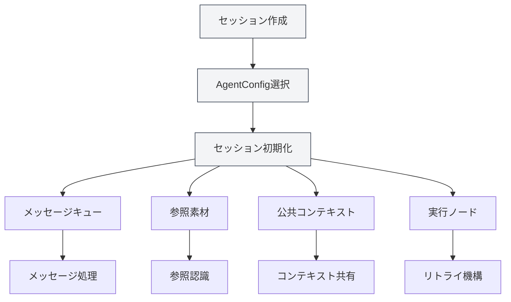
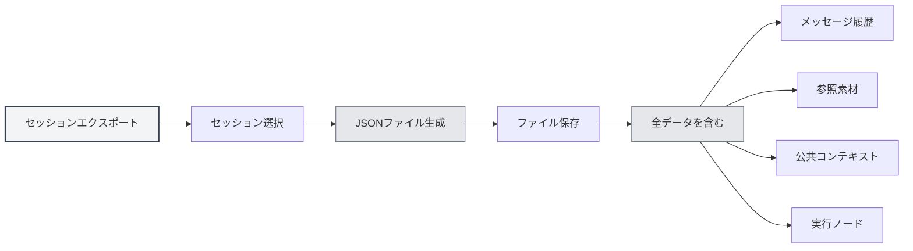
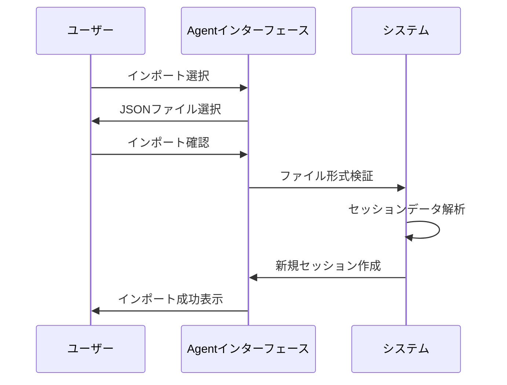
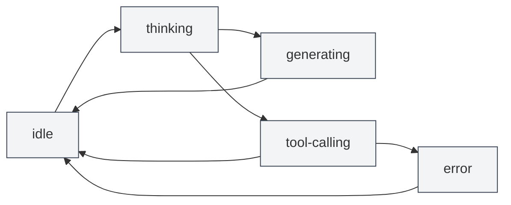

# Agentセッション管理

## 概要

AgentセッションはAgentフレームワークのコアコンポーネントであり、独立したコンテキストを持つAgent実行環境を表します。各セッションは独自のメッセージ履歴、参照素材、公共コンテキスト空間を維持し、メッセージキュー、リトライ、複製などの高度な機能をサポートします。

<AgentView mode="demo" />

AgentセッションはAgentConfigに基づいて作成され、AgentConfigのツールセットと能力範囲を継承しますが、各セッションは独立した実行状態と履歴を持ちます。

## セッション作成

### 新規セッション作成

Agentセッションを作成する手順：

<AgentView mode="demo" />

1.  **Agentビューを開く**：メニューバーの「AI」→「Agent」をクリックしてAgentビューを開く
2.  **AgentConfigを選択**：セッションリストの上部で使用するAgentConfigを選択
3.  **セッションを作成**：「新規セッション」ボタンをクリック
4.  **タイトルを入力**：オプションでセッションタイトルを入力（デフォルトでは最初のメッセージがタイトルとして使用されます）
5.  **会話を開始**：最初のメッセージを入力してAgentとの対話を開始

### セッション初期化

セッション作成時、システムは自動的に以下を行います：

<AgentSessionManager mode="demo" />

-   **セッションID作成**：一意のセッション識別子を生成
-   **AgentConfig関連付け**：指定されたAgentConfigにバインド
-   **メッセージキュー初期化**：空のメッセージキューを作成
-   **参照素材初期化**：空の参照素材ストレージを作成
-   **公共コンテキスト初期化**：現在時刻などの情報を含む公共コンテキスト空間を作成
-   **挨拶文作成**：Agentの挨拶メッセージを自動的に追加
-   **内蔵参照有効化**：デフォルトで内蔵0番reference（現在のドキュメント内容を動的に取得）を有効化

## セッション名変更

### 名前変更操作

既存のセッションの名前を変更：

<AgentView mode="demo" />

1.  **右クリックメニュー**：セッションを右クリックし、「名前変更」を選択
2.  **新しい名前を入力**：表示されるダイアログで新しいセッション名を入力
3.  **保存を確認**：確認をクリックして新しい名前を保存

セッション名は異なるセッションを識別・区別するために使用され、説明的な名前を使用することをお勧めします。

## セッション削除

### 削除操作

不要なセッションを削除：

<AgentSessionManager mode="demo" />

1.  **右クリックメニュー**：セッションを右クリックし、「削除」を選択
2.  **削除を確認**：表示される確認ダイアログで削除を確認

**注意**：セッションを削除すると、そのセッションのすべてのメッセージ履歴、参照素材、実行ノードも同時に削除され、この操作は元に戻せません。

### 一括削除

現在、一括削除はサポートされておらず、セッションを個別に削除する必要があります。

## セッション複製

### 複製操作

既存のセッションを複製：

<AgentView mode="demo" />

1.  **右クリックメニュー**：セッションを右クリックし、「複製」を選択
2.  **コピーを作成**：システムが新しいセッションのコピーを作成

セッションの複製では以下がコピーされます：

-   **メッセージ履歴**：すべてのメッセージ記録
-   **参照素材**：すべての参照素材
-   **公共コンテキスト**：公共コンテキスト空間の内容
-   **実行ノード**：すべての実行ノード記録

複製後のセッションは独立しており、変更は元のセッションに影響しません。

### 使用シナリオ

セッションの複製は以下に適しています：

-   **分岐ディスカッション**：既存の会話に基づいて異なるトピックの議論を続ける
-   **実験テスト**：異なるAgent構成やツールセットをテストする
-   **バックアップ保存**：重要なセッション状態を保存する

## セッションのエクスポート/インポート

### セッションのエクスポート

<AgentView mode="demo" />

セッションをJSONファイルとしてエクスポート：

<AgentView mode="demo" />

1.  **右クリックメニュー**：セッションを右クリックし、「エクスポート」を選択
2.  **保存場所を選択**：保存場所とファイル名を選択
3.  **ファイルを保存**：保存をクリックしてセッションをエクスポート

エクスポートされるJSONファイルには以下が含まれます：

-   セッション基本情報（ID、タイトル、説明など）
-   メッセージ履歴
-   参照素材
-   公共コンテキスト
-   実行ノード

### セッションのインポート

<AgentSessionManager mode="demo" />

JSONファイルからセッションをインポート：

1.  **インポートを開く**：Agentビューでインポート機能を見つける
2.  **ファイルを選択**：インポートするJSONファイルを選択
3.  **データを検証**：システムがファイル形式と内容を検証
4.  **セッションをインポート**：インポート成功後に新しいセッションを作成

インポートされたセッションは新しいセッションIDで作成され、既存のセッションを上書きしません。

## セッションのリトライ

### リトライ機能

セッションのリトライにより、失敗したAgentタスクを再実行できます：

1.  **実行ノードを表示**：セッション内で実行ノードリストを表示
2.  **ノードを選択**：リトライする実行ノードを選択
3.  **再実行**：「リトライ」ボタンをクリックして再実行

リトライは選択した実行ノードから再実行を開始し、以前のメッセージ履歴を保持します。

### 実行ノード

実行ノードはAgent実行プロセスの各ステップを記録します：

-   **メッセージノード**：ユーザーメッセージまたはAI応答
-   **ツール呼び出しノード**：ツール呼び出しと実行結果
-   **ワークフロー呼び出しノード**：ワークフロー実行プロセス
-   **LLM呼び出しノード**：LLM呼び出しと応答

各ノードには状態（pending、running、succeeded、failed、cancelled）と結果があります。

## セッションメッセージ管理

### メッセージ操作

セッションメッセージに対して以下の操作が可能です：

-   **メッセージ編集**：ユーザーメッセージを編集して再送信
-   **再生成**：AI応答を再生成
-   **メッセージコピー**：メッセージ内容をコピー
-   **メッセージ削除**：メッセージを削除（そのメッセージ以降のすべてのメッセージが削除されます）

### メッセージキュー

<AgentView mode="demo" />

メッセージキューにより、Agent実行中にメッセージを挿入できます：

1.  **挿入タイミング**：Agentが応答を生成中またはツールを呼び出している間、メッセージはキューに一時保存されます
2.  **処理タイミング**：現在のタスク実行完了後、次のステップを実行する前に、キュー内のメッセージが処理されます
3.  **注釈情報**：キュー内のメッセージには挿入時点と挿入時のメッセージIDが注釈として付けられ、Agentがコンテキストを理解するのに役立ちます

メッセージキュー機能により、Agent実行中に追加情報や指示を提供できます。

## 参照素材管理

### 参照の追加

<ReferenceManager mode="demo" />

セッションに参照素材を追加：

1.  **参照管理を開く**：セッション内の「参照」タブをクリック
2.  **参照を追加**：「参照を追加」ボタンをクリック
3.  **タイプを選択**：参照タイプを選択（ファイル、URL、テキストなど）
4.  **内容を選択**：参照する内容を選択

詳細は[[agent.references|参照素材管理]]を参照してください。

### 参照タイプ

以下の参照タイプをサポートしています：

-   **ファイル参照**：ローカルファイルを参照（Markdown、LaTeX、PDF、Word、画像など）
-   **URL参照**：ウェブページURLを参照
-   **テキスト参照**：カスタムテキスト内容を参照
-   **ナレッジベース参照**：ナレッジベース内の内容を参照
-   **内蔵参照**：現在のドキュメント内容を動的に取得（デフォルトで有効）

### 参照の有効化

<ReferenceManager mode="demo" />

参照素材は有効化または無効化できます：

-   **参照を有効化**：有効化された参照はAgent実行時に使用されます
-   **参照を無効化**：無効化された参照はAgent実行に影響しません

Agentは参照素材の内容を認識し、それらに基づいて推論や操作を行えます。

## 公共コンテキスト

### コンテキスト空間

公共コンテキストはセッションレベルの共有コンテキスト空間であり、以下を含みます：

<AgentView mode="demo" />

-   **現在時刻**：自動更新されるタイムスタンプ
-   **ドキュメント情報**：現在開いているドキュメント情報（有効な場合）
-   **カスタムデータ**：ユーザー定義のコンテキストデータ

### 使用シナリオ

公共コンテキストは以下に適しています：

-   **時間認識**：Agentに現在時刻を知らせる
-   **ドキュメント認識**：Agentに現在開いているドキュメントを知らせる
-   **状態共有**：ワークフロー内で状態情報を共有する

## セッション状態

<AgentSessionManager mode="demo" />

### 状態タイプ

セッションには以下の状態があります：

-   **idle**：アイドル状態、ユーザー入力を待機中
-   **thinking**：Agentが思考中
-   **generating**：Agentが応答生成中
-   **tool-calling**：Agentがツール呼び出し中
-   **waiting-input**：ユーザー入力を待機中
-   **error**：エラー発生

### 状態遷移

## 使用上のヒント

<AgentView mode="demo" />

### セッション整理

1.  **分類管理**：異なるトピックごとに異なるセッションを作成
2.  **命名規則**：明確なセッション名を使用
3.  **定期的な整理**：不要なセッションを定期的に削除

### メッセージ管理

1.  **メッセージ編集**：AI応答が理想的でない場合、ユーザーメッセージを編集して再送信
2.  **参照の使用**：参照素材を追加してより多くのコンテキストを提供
3.  **メッセージキュー**：Agent実行中にメッセージキューを使用して追加情報を挿入

### リトライ機構

1.  **ノードを表示**：実行ノードを表示してAgentの実行プロセスを理解
2.  **リトライを選択**：失敗したノードを選択してリトライ
3.  **構成を調整**：頻繁に失敗する場合、AgentConfigやツールセットの調整を検討

## よくある質問

<AgentView mode="demo" />

### Q: 新しいセッションはどのように作成しますか？

A: AgentビューでAgentConfigを選択し、「新規セッション」ボタンをクリックします。セッション作成後、最初のメッセージを入力して会話を開始します。

### Q: セッションメッセージ履歴は保存されますか？

A: はい、セッションメッセージ履歴は自動的にドキュメントのmetadataに保存されます。ドキュメントを再度開くとすべてのセッションが復元されます。

### Q: セッションはどのように削除しますか？

A: セッションを右クリックし、「削除」を選択し、確認ダイアログで削除を確認します。削除操作は元に戻せません。

### Q: セッションを複製すると何がコピーされますか？

A: セッションの複製では、メッセージ履歴、参照素材、公共コンテキスト、実行ノードがコピーされます。複製後のセッションは独立しています。

### Q: セッションはどのようにエクスポートしますか？

A: セッションを右クリックし、「エクスポート」を選択し、保存場所を選択します。エクスポートされるJSONファイルにはセッションのすべての情報が含まれます。

### Q: メッセージキューとは何ですか？

A: メッセージキューにより、Agent実行中にメッセージを挿入できます。現在のタスク実行完了後にキュー内のメッセージが処理されます。

### Q: 失敗した実行はどのようにリトライしますか？

A: セッション内で実行ノードリストを表示し、失敗したノードを選択し、「リトライ」ボタンをクリックします。

### Q: 参照素材はAgentにどのように影響しますか？

A: Agentは参照素材の内容を認識し、それらに基づいて推論や操作を行えます。有効化された参照はAgent実行時に使用されます。

## 関連ドキュメント

-   [[agent.introduction|Agentフレームワーク概要]]
-   [[agent.introduction|Agent構成管理]]
-   [[agent.references|参照素材管理]]
-   [[agent.engine|Agentエンジン管理]]