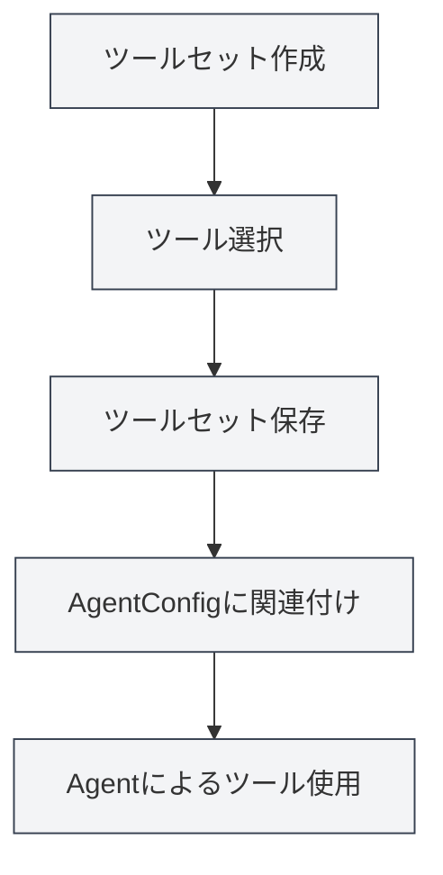

# ツールセット管理

## 概要

ツールセット（ToolCollection）は、AgentフレームワークにおいてAgentツールを整理・管理するための集合体です。ツールセットは関連するツールをグループ化し、管理と再利用を容易にします。AgentConfigはツールセットを関連付けることで、Agentが使用可能なツールを決定します。

ツールセットはツールの動的な追加・削除をサポートし、特定用途向けのツールセットを作成したり、複数のツールセットを組み合わせて使用することができます。

## コアコンセプト

### ツールセット構造

<AgentView mode="demo" />

ツールセットは以下の主要部分で構成されます：

- **基本情報**：ID、名称、説明、バージョン番号
- **ツールリスト**：含まれるツールIDのリスト（内部ツール、外部ツールを含む）
- **有効状態**：当該ツールセットが有効かどうか
- **タグ**：分類と検索のためのタグ
- **組み込み識別子**：組み込みツールセットかどうか（削除不可）

### ツールタイプ

<GrepDisplay mode="demo" />

ツールセットには以下のタイプのツールを含めることができます：

- **内部ツール**：MetaDocに組み込まれたAgentツール（edit-tool、proofread-toolなど）
- **外部ツール**：ユーザー定義の外部ツール

### デフォルトツールセット

システムはデフォルトツールセット（`default-tool-set`）を提供しており、すべての組み込みAgentツールを含みます。削除はできませんが、複製は可能です。

## ツールセットの作成

<AgentView mode="demo" />

### 新規ツールセットの作成

ツールセットを作成する手順：

1. **ツールセット管理を開く**：Agentビューで「管理」→「ツールセット」をクリック
2. **ツールセット作成**：「新規ツールセット」ボタンをクリック
3. **基本情報の入力**：
   - 名称：ツールセットの名称（多言語対応）
   - 説明：ツールセットの説明（多言語対応）
4. **ツールの選択**：ドロップダウンリストから1つ以上のツールを選択
   - ツール名で検索可能
   - 複数選択をサポート
   - ツールのタイプと説明を表示
5. **ツールセットの保存**：「保存」ボタンをクリック

サイドバーからAgentビューにアクセスできます：

### Agentツールセットインターフェース

以下の図は、ツールセット管理インターフェースの主な機能を示しています：

<AgentView mode="demo" />

### ツール選択

ツールを選択する際、システムは以下を表示します：

- **ツール名**：ツールの表示名
- **ツールID**：ツールの一意識別子
- **ツールタイプ**：内部ツール、外部ツール、またはワークフローツール
- **ツール説明**：ツールの簡単な説明

<DialogDemo mode="demo" dialogType="tool-select" />

## ツールセットの編集

<AgentView mode="demo" />

### 編集操作

既存のツールセットを編集する：

1. **管理インターフェースを開く**：ツールセット管理インターフェースで編集するツールセットを見つける
2. **編集をクリック**：ツールセットカード上の「編集」ボタンをクリック
3. **情報を修正**：名称、説明、またはツールリストを修正
4. **変更を保存**：「保存」ボタンをクリック

**注意**：デフォルトツールセット（`default-tool-set`）は編集を許可しませんが、複製後に編集は可能です。

### ツールの追加

ツールセットにツールを追加する：

1. **編集インターフェースを開く**：ツールセットを編集
2. **ツールを選択**：ツールドロップダウンリストから追加するツールを選択
3. **変更を保存**：「保存」ボタンをクリック

### ツールの削除

ツールセットからツールを削除する：

1. **編集インターフェースを開く**：ツールセットを編集
2. **選択を解除**：ツールリストで削除するツールの選択を解除
3. **変更を保存**：「保存」ボタンをクリック

## ツールセットの削除

<AgentView mode="demo" />

### 削除操作

不要なツールセットを削除する：

1. **管理インターフェースを開く**：ツールセット管理インターフェースで削除するツールセットを見つける
2. **削除をクリック**：ツールセットカード上の「削除」ボタンをクリック
3. **削除を確認**：表示される確認ダイアログで削除を確認

**注意**：

- デフォルトツールセット（`default-tool-set`）は削除不可
- ツールセットを削除しても、作成済みのAgentConfigには影響しませんが、当該ツールセットに関連付けられたAgentConfigはそのツールセットを使用できなくなります
- ツールセットがAgentConfigで使用中の場合は、削除前に警告が表示されます

## ツールセットの複製

### 複製操作

<OutlineTreeDisplay mode="demo" />

既存のツールセットを複製する：

1. **管理インターフェースを開く**：ツールセット管理インターフェースで複製するツールセットを見つける
2. **複製をクリック**：ツールセットカード上の「複製」ボタンをクリック
3. **コピーを編集**：システムがコピーを作成し、名称に自動的に「（コピー）」サフィックスが追加されます
4. **変更を保存**：必要に応じてコピーを修正して保存

ツールセットを複製すると、ツールリストや設定を含むすべてのツールがコピーされます。

## ツールセットのインポート/エクスポート

### ツールセットのエクスポート

ツールセットをJSONファイルとしてエクスポートする：

1. **管理インターフェースを開く**：ツールセット管理インターフェースでエクスポートするツールセットを見つける
2. **エクスポートをクリック**：ツールセットカード上の「エクスポート」ボタンをクリック
3. **保存場所を選択**：保存場所とファイル名を選択
4. **ファイルを保存**：保存をクリックしてツールセットをエクスポート

<DialogDemo mode="demo" dialogType="export-config" />

エクスポートされたJSONファイルにはツールセットのすべての情報が含まれており、バックアップや共有に使用できます。

### ツールセットのインポート

<DataAnalysisDisplay mode="demo" />

JSONファイルからツールセットをインポートする：

1. **管理インターフェースを開く**：ツールセット管理インターフェースで
2. **インポートをクリック**：「ツールセットをインポート」ボタンをクリック
3. **ファイルを選択**：インポートするJSONファイルを選択
4. **データを検証**：システムがファイル形式と内容を検証
5. **ツールセットをインポート**：インポート成功後、新しいツールセットが作成されます

<DialogDemo mode="demo" dialogType="import-config" />

インポートされたツールセットには新しいIDが割り当てられ、既存のツールセットは上書きされません（上書きモードを使用する場合を除く）。

## ツールセットとAgentConfig

### ツールセットの関連付け

AgentConfigはツールセットを関連付けることで使用可能なツールを決定します：

1. **AgentConfigを作成**：新しいAgentConfigを作成
2. **ツールセットを選択**：AgentConfigで1つ以上のツールセットを選択
3. **ツールの共通部分**：複数のツールセットを選択した場合、使用可能なツールはすべてのツールセットの共通部分（積集合）となります

### ツールセットの共通部分

<DiffDisplay mode="demo" />

AgentConfigが複数のツールセットに関連付けられている場合：

- ツールセットAが含むツール：`[tool1, tool2, tool3]`
- ツールセットBが含むツール：`[tool2, tool3, tool4]`
- AgentConfigで使用可能なツール：`[tool2, tool3]`（共通部分）

この仕組みにより、Agentの能力範囲を正確に制御できます。

## 使用上のヒント

### ツールセットの整理

1. **機能別分類**：「ドキュメント編集ツールセット」、「データ分析ツールセット」など、機能別にツールセットを作成
2. **シナリオ別分類**：「学術執筆ツールセット」、「コード分析ツールセット」など、シナリオ別にツールセットを作成
3. **命名規則**：識別と管理が容易な明確な名称を使用

### ツールセットの設計

1. **単一責任**：各ツールセットは特定の機能やシナリオに集中
2. **ツールの組み合わせ**：関連するツールを適切に組み合わせ、ツールセットが大きくなりすぎないようにする
3. **再利用性**：異なるAgentConfigで使用できる再利用可能なツールセットを設計

### ツールセットの管理

1. **定期的な整理**：使用しなくなったツールセットを削除
2. **バージョン管理**：エクスポート機能で重要なツールセットをバックアップ
3. **ドキュメント記録**：ツールセットの説明に用途や使用シナリオを記載

## よくある質問

### Q: 専用のツールセットはどのように作成しますか？

A: 新しいツールセットを作成し、関連するツールを選択し、明確な名称と説明を設定します。例えば、「データ分析ツールセット」を作成し、データ分析に関連するツールを選択します。

### Q: ツールセットとAgentConfigの関係は？

A: AgentConfigはツールセットを関連付けることで使用可能なツールを決定します。1つのAgentConfigは複数のツールセットに関連付けられ、使用可能なツールはすべてのツールセットの共通部分（積集合）となります。

### Q: デフォルトツールセットは修正できますか？

A: デフォルトツールセット（`default-tool-set`）は編集を許可しませんが、複製後に編集は可能です。デフォルトツールセットを複製し、コピーを修正してください。

### Q: カスタムツールをツールセットに追加するには？

A: まずカスタムツールを登録し、その後ツールセットの作成または編集時にそのツールを選択します。カスタムツールはAgentツール仕様に準拠する必要があります。

### Q: ツールセットを削除するとAgentConfigに影響しますか？

A: ツールセットを削除しても、作成済みのAgentConfigには影響しませんが、当該ツールセットに関連付けられたAgentConfigはそのツールセットを使用できなくなります。ツールセットが使用中の場合は、削除前に警告が表示されます。

## 関連ドキュメント

- [[agent.introduction|Agentフレームワーク概要]]
- [[agent.config|Agent設定管理]]
- [[agent.session|Agentセッション管理]]