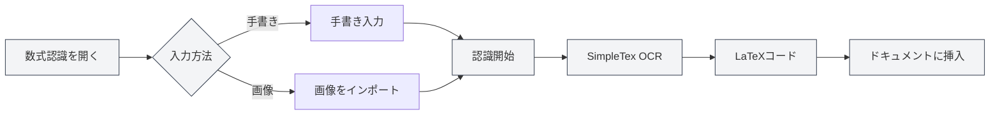

# AIアシスタント機能

## 概要

AIアシスタント機能は、ドキュメント作成、数式認識、チャート生成、データ分析などのタスクを支援する様々なスマートツールを提供します。AIアシスタントを通じて、様々なドキュメント処理作業を効率的に完了することができます。

AIアシスタント機能には、AIチャット、手書き数式認識、スマート作図アシスタント、データ分析ツール、OCR文字認識、添付ファイル解析ツール、AIGC検出などが含まれます。

<AgentView mode="demo" />

## AIチャット

### 機能紹介

AIチャット機能は、現在のドキュメント内容に基づいて対話できるインテリジェントな対話アシスタントを提供します：

- **コンテキスト理解**：現在のドキュメントの内容と文脈を理解します
- **インテリジェント回答**：ドキュメント内容に基づいて関連する質問に回答します
- **ドキュメント分析**：ドキュメントの構造、内容、スタイルなどを分析します

AIアシスタントメニューからAIチャット機能にアクセスできます：

<MenuItemsDemo mode="demo" :items='[{"id": "ai-assistant", "items": ["ai-chat"]}]' />

### インターフェースプレビュー

AIチャットインターフェースには、セッションリストと対話エリアが含まれており、複数セッションの管理と参照素材のサポートを提供します：

<AIChat mode="demo" />

詳細は[[ai.chat|AIチャット]]をご覧ください。

## 手書き数式認識

### 機能紹介

手書き数式認識機能は、手書きの数学数式をLaTeXコードに変換できます：

<FormulaRecognition mode="demo" />

- **手書き入力**：マウス/タッチスクリーンによる手書き入力をサポート
- **画像インポート**：数式画像をインポートして認識をサポート
- **リアルタイム認識**：SimpleTex OCR APIを使用して認識
- **LaTeX出力**：標準LaTeX形式に自動変換

### 使用方法

1. **数式認識を開く**：AIアシスタントメニューから数式認識ウィンドウを開きます
2. **手書き入力**：キャンバス上に数学数式を手書きします
3. **または画像をインポート**：インポートボタンをクリックし、数式画像を選択します
4. **認識開始**：認識ボタンをクリックします
5. **結果確認**：認識されたLaTeXコードを確認します
6. **ドキュメントに挿入**：LaTeXコードをドキュメントに挿入します

AIアシスタントメニューから手書き数式認識機能にアクセスできます：

<MenuItemsDemo mode="demo" :items='[{"id": "ai-assistant", "items": ["formula-recognition"]}]' />

### 認識精度

- **高精度認識**：SimpleTex OCR APIは高精度な数学数式認識を提供します
- **複雑な数式をサポート**：分数、根号、積分、総和などの複雑な数式をサポートします
- **自動修正**：認識結果は手動で編集・修正できます

## スマート作図アシスタント

### 機能紹介

スマート作図アシスタントは、AIを使用してチャートコードを生成し、様々なチャート形式をサポートします：

- **Mermaidチャート**：フローチャート、シーケンス図、クラス図、状態図など
- **PlantUMLチャート**：UML図、シーケンス図、アクティビティ図など
- **EChartsチャート**：折れ線グラフ、棒グラフ、円グラフ、散布図など
- **直接挿入**：生成されたチャートは直接ドキュメントに挿入できます

### インターフェースプレビュー

スマート作図アシスタントは、複数セッション管理、自動チャートエンジン選択、視覚化チャート生成をサポートします：

<GraphWindow mode="demo" />

<MenuItemsDemo mode="demo" :items='[{"id": "ai-assistant"}]' />

### 使用方法

1. **作図アシスタントを開く**：メニューまたはツールバーから作図アシスタントを開きます
2. **要件を記述**：生成したいチャートを自然言語で記述します
3. **タイプを選択**：チャートタイプ（Mermaid、PlantUML、EChartsなど）を選択します
4. **チャートを生成**：AIが記述に基づいてチャートコードを生成します
5. **チャートをプレビュー**：生成されたチャートをプレビューします
6. **ドキュメントに挿入**：チャートをドキュメントに挿入します

### サポートされるチャートタイプ

- **Mermaid**：フローチャート、シーケンス図、クラス図、状態図、ER図、ガントチャート、円グラフ、Git図、ジャーニーマップ、マインドマップ、タイムラインなど
- **PlantUML**：UML図、シーケンス図、アクティビティ図、コンポーネント図、配置図など
- **ECharts**：折れ線グラフ、棒グラフ、円グラフ、散布図、レーダーチャート、ヒートマップ、ツリーマップ、ツリーマップ矩形、サンバーストチャートなど

詳細は[[charts.introduction|チャート機能紹介]]をご覧ください。

## データ分析ツール

### 機能紹介

データ分析ツールは、ドキュメント内のデータテーブルを分析し、視覚化チャートを生成できます：

- **テーブル認識**：ドキュメント内のテーブルデータを自動認識
- **データ分析**：テーブルデータの統計情報を分析
- **チャート生成**：データに基づいて視覚化チャートを生成
- **チャート挿入**：生成されたチャートをドキュメントに挿入

<DataAnalysisWindow mode="demo" />

### 使用方法

1. **データ分析を開く**：メニューまたはツールバーからデータ分析ウィンドウを開きます
2. **テーブルを選択**：ドキュメント内で分析するテーブルを選択します
3. **データを分析**：分析ボタンをクリックし、AIがテーブルデータを分析します
4. **チャートを生成**：分析結果に基づいて視覚化チャートを生成します
5. **ドキュメントに挿入**：チャートをドキュメントに挿入します

## OCR文字認識

### 機能紹介

OCR文字認識機能は、画像内の文字を認識し、テキスト内容を抽出できます：

- **画像認識**：画像内の文字内容を認識
- **多言語サポート**：中国語、英語など様々な言語をサポート
- **文字抽出**：認識された文字内容を抽出
- **ドキュメントに挿入**：抽出した文字をドキュメントに挿入

### インターフェースプレビュー

OCR認識ウィンドウは、複数画像管理、画像前処理パラメータ調整、認識結果編集をサポートします：

<OcrWindow mode="demo" />

<MenuItemsDemo mode="demo" :items='[{"id": "ai-assistant", "items": ["proofread"]}]' />

### 使用方法

1. **OCR認識を開く**：メニューまたはツールバーからOCR認識ウィンドウを開きます
2. **画像をインポート**：認識する画像をインポートします
3. **認識開始**：認識ボタンをクリックします
4. **結果確認**：認識された文字内容を確認します
5. **ドキュメントに挿入**：文字をドキュメントに挿入します

## 添付ファイル解析ツール

### 機能紹介

添付ファイル解析ツールは、PDF、Wordなどの添付ファイルを解析し、ファイル内容を抽出できます：

- **ファイル解析**：PDF、Wordなどのファイル形式を解析
- **内容抽出**：ファイル内のテキストと画像を抽出
- **ナレッジベースに追加**：抽出した内容をナレッジベースに追加
- **ドキュメント参照**：ドキュメント内で添付ファイル内容を参照

<KnowledgeBase mode="demo" />

### 使用方法

1. **添付ファイル解析を開く**：メニューまたはツールバーから添付ファイル解析ウィンドウを開きます
2. **ファイルを選択**：解析するPDFまたはWordファイルを選択します
3. **解析開始**：解析ボタンをクリックします
4. **結果確認**：解析された内容を確認します
5. **ナレッジベースに追加**：内容をナレッジベースに追加します（オプション）

## AIGC検出

### 機能紹介

AIGC検出機能は、テキストがAI生成コンテンツかどうかを検出できます：

- **テキスト検出**：テキストがAI生成かどうかを検出
- **信頼度スコア**：AI生成確率のスコアを提供
- **検出レポート**：詳細な検出レポートを生成

<AigcDetectionWindow mode="demo" />

### 使用方法

1. **AIGC検出を開く**：メニューまたはツールバーからAIGC検出ウィンドウを開きます
2. **テキストを選択**：検出するテキストを選択します
3. **検出開始**：検出ボタンをクリックします
4. **結果確認**：検出結果と信頼度スコアを確認します

## 使用上のヒント

### AIアシスタントの効率的な使用

1. **要件を明確に**：要件を明確に記述し、より良い結果を得ます
2. **コンテキストを提供**：十分なコンテキスト情報を提供します
3. **反復最適化**：結果に基づいて要件を反復的に最適化します

### 数式認識のヒント

1. **明確に記述**：手書き時は明確に記述し、乱雑な書き方を避けます
2. **正しい形式**：正しい数学記号の形式を使用します
3. **結果を確認**：認識後に結果を確認し、必要に応じて手動で修正します

### チャート生成のヒント

1. **詳細に記述**：データタイプ、スタイルなど、チャート要件を詳細に記述します
2. **タイプを選択**：要件に基づいて適切なチャートタイプを選択します
3. **プレビュー調整**：チャートをプレビューした後、必要に応じて調整します

## よくある質問

### Q: 数式認識が正確でない？

A: 数式認識はSimpleTex OCR APIに基づいており、正確でない場合があります。手書き時は明確に記述するか、画像インポートを使用することをお勧めします。

### Q: チャート生成が期待通りでない？

A: 要件を詳細に記述するか、生成されたチャートコードを手動で編集して調整できます。

### Q: OCR認識はどの言語をサポートしていますか？

A: OCR認識は中国語、英語など様々な言語をサポートしており、使用するOCRサービスによって異なります。

### Q: 添付ファイル解析はどの形式をサポートしていますか？

A: 添付ファイル解析はPDF、Wordなどの一般的な形式をサポートしており、解析サービスの能力によって異なります。

<AgentView mode="demo" />

## 関連ドキュメント

- [[ai.chat|AIチャット]]
- [[charts.introduction|チャート機能紹介]]
- [[knowledge-base.usage|ナレッジベースの使用]]
