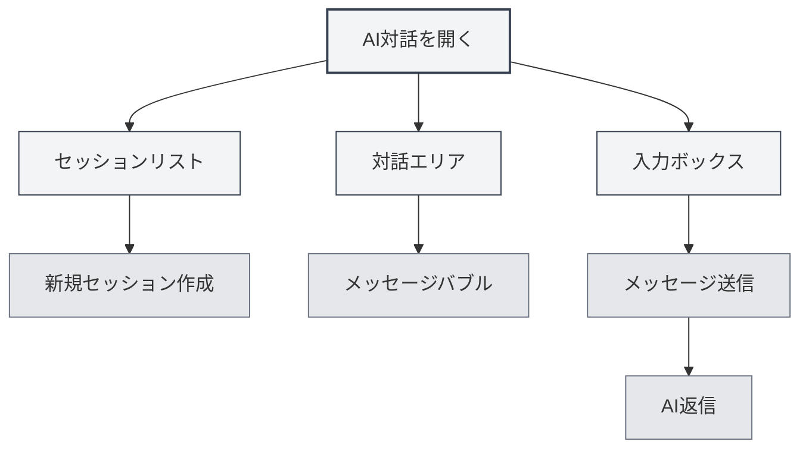
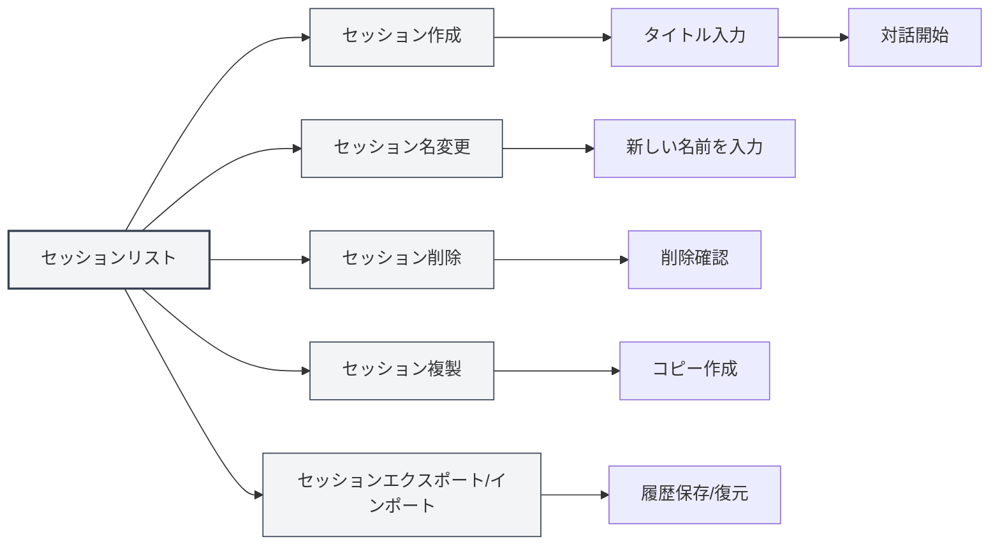
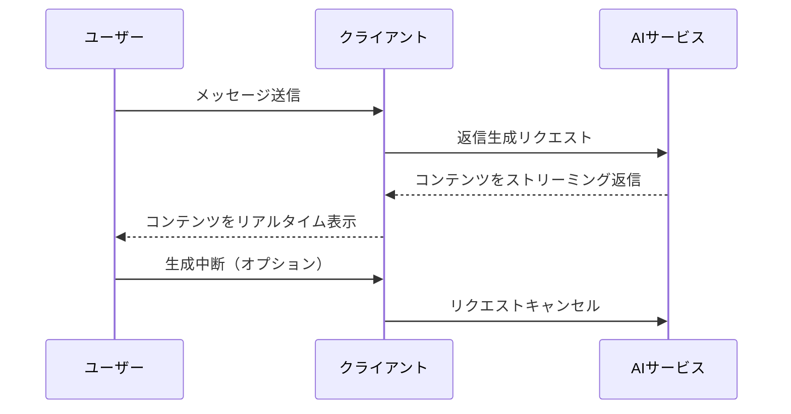
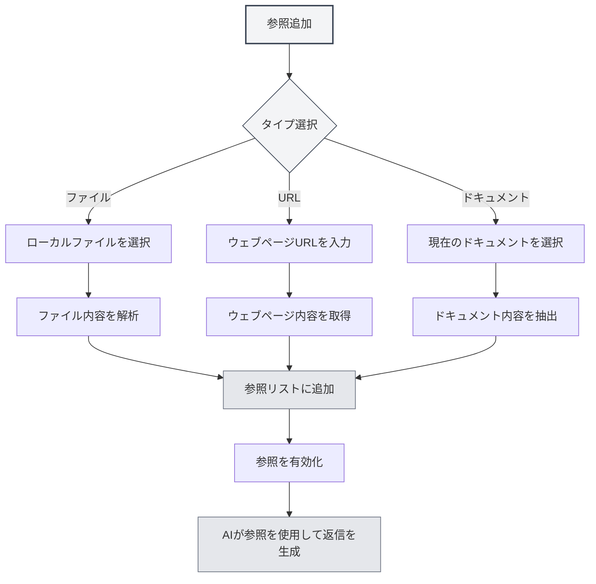

# AI対話

## 概要

AI対話機能は、インテリジェントな対話アシスタントを提供し、質問への回答、コンテンツ生成、ドキュメント分析などを支援します。AI対話を通じて、自然言語でAIと対話し、スマートなヘルプやアドバイスを得ることができます。

AI対話は、複数セッション管理、参照素材、ナレッジベース統合などの機能をサポートし、様々なタスクをAIの支援で効率的に完了できるようにします。

## AI対話を開く

### 開き方

AI対話を開く方法は複数あります：

- **メニューバー**：「AI」メニューをクリックし、「AI対話」を選択
- **ショートカットキー**：設定されている場合はショートカットキーで素早く開く
- **サイドバー**：サイドバーからAI対話パネルを開く

上部メニューバーのAIアシスタントメニューからAI対話機能にアクセスできます：

<MenuItemsDemo mode="demo" :items='[{"id": "ai-assistant", "items": ["ai-chat"]}]' />

### インターフェース説明

AI対話インターフェースは以下の部分で構成されています：

<AIChat mode="demo" />

- **セッションリスト**：左側にすべてのセッションリストを表示
- **対話エリア**：中央に対話メッセージを表示
- **入力ボックス**：下部でメッセージを入力
- **参照管理**：参照素材を管理

## セッション管理

AI対話は複数セッション管理をサポートしており、セッションの作成、名前変更、削除、複製が可能です。

<AIChat mode="demo" />

### セッション作成

新しいAI対話セッションを作成します：

1. **新規作成をクリック**：セッションリスト上部の「新規セッション」ボタンをクリック
2. **タイトル入力**：オプションでセッションタイトルを入力（デフォルトは最初のメッセージを使用）
3. **対話開始**：最初のメッセージを入力して対話を開始

### セッション操作

### セッション名変更

既存のセッション名を変更します：

1. **右クリックメニュー**：セッションを右クリックし、「名前変更」を選択
2. **新しい名前を入力**：新しいセッション名を入力
3. **保存確認**：確認後、新しい名前を保存

### セッション削除

不要なセッションを削除します：

1. **右クリックメニュー**：セッションを右クリックし、「削除」を選択
2. **削除確認**：確認後、セッションを削除

セッションを削除すると、そのセッションのすべてのメッセージ履歴も同時に削除されます。

### セッション複製

既存のセッションを複製します：

1. **右クリックメニュー**：セッションを右クリックし、「複製」を選択
2. **コピー作成**：システムが新しいセッションコピーを作成

セッションを複製すると、すべてのメッセージ履歴がコピーされ、既存の対話を基に議論を続けることが容易になります。

### セッションのエクスポート/インポート

セッションのエクスポートとインポート：

- **セッションのエクスポート**：セッションを右クリックし、「エクスポート」を選択、JSONファイルとして保存
- **セッションのインポート**：ファイルからセッションをインポートし、メッセージ履歴を復元

エクスポート/インポート機能により、対話内容のバックアップや共有が容易になります。

<MenuItemsDemo mode="demo" :items='[{"id": "file", "items": ["save", "open"]}]' />

## メッセージ送信

AI対話は豊富なメッセージ送信機能を提供します。

<AIChat mode="demo" />

### メッセージ入力

入力ボックスでメッセージを入力します：

1. **テキスト入力**：入力ボックスに質問やリクエストを入力
2. **フォーマット**：Markdown形式をサポートし、テキストをフォーマット可能
3. **メッセージ送信**：送信ボタンをクリックするか、`Enter`キーを押して送信

### メッセージタイプ

以下のメッセージタイプをサポートしています：

- **テキストメッセージ**：通常のテキストメッセージ
- **Markdownメッセージ**：Markdown形式をサポートしたメッセージ
- **コードメッセージ**：コードを含むメッセージ

### ショートカットキー

メッセージ送信のショートカットキー：

- **Enter**：メッセージ送信
- **Shift+Enter**：改行（送信しない）
- **Ctrl+Enter**：メッセージ送信（一部の設定で）

## AI返信

AI返信機能は、ストリーミング出力とメッセージ操作機能を提供します。

<AIChat mode="demo" />

<AIChat mode="demo" />

### ストリーミング出力

AI返信はストリーミング出力を採用しています：

- **リアルタイム表示**：AIが生成する内容がリアルタイムで表示されます
- **段階的生成**：内容が段階的に生成され、完了を待つ必要がありません
- **中断可能**：AIの生成をいつでも中断できます

### メッセージ操作

AI返信に対して以下の操作が可能です：

- **コピー**：AI返信内容をコピー
- **再生成**：AI返信を再生成
- **編集**：AI返信を編集（サポートされている場合）
- **削除**：AI返信を削除

### メッセージ編集

ユーザーメッセージを編集します：

1. **編集をクリック**：メッセージ横の編集ボタンをクリック
2. **内容を修正**：メッセージ内容を修正
3. **再送信**：修正したメッセージを再送信

メッセージを編集すると、そのメッセージ以降のすべてのメッセージが削除され、対話が最初から再開されます。

## 参照素材

AI対話に参照素材を追加し、AIがコンテキストをよりよく理解できるように支援できます。

<AIChat mode="demo" />

### 参照追加

セッションに参照素材を追加します：

1. **参照管理を開く**：対話エリア上部の参照タブをクリック
2. **参照追加**：「参照追加」ボタンをクリック
3. **タイプ選択**：参照タイプを選択（ファイル、URLなど）
4. **内容選択**：参照する内容を選択

### 参照タイプ

以下の参照タイプをサポートしています：

- **ファイル参照**：ローカルファイルを参照
- **URL参照**：ウェブページURLを参照
- **ドキュメント参照**：現在開いているドキュメントを参照

### 参照の有効化

参照の有効化と無効化：

- **参照を有効化**：参照タブをクリックして参照を有効化
- **参照を無効化**：再度クリックして参照を無効化
- **有効化状態**：有効化された参照はAI返信時に使用されます

参照を有効化すると、AIは参照内容を参考にして返信を生成します。

### 参照プレビュー

参照内容をプレビューします：

- **プレビューをクリック**：参照タブをクリックして参照内容を表示
- **詳細を表示**：参照の詳細内容を表示
- **参照を編集**：参照を編集または削除

## ナレッジベース統合

AI対話はナレッジベースと統合でき、関連知識を自動的に検索します。

<KnowledgeBase mode="demo" />

<AIChat mode="demo" />

### ナレッジベースの有効化

ナレッジベース検索を有効化します：

1. **設定を開く**：入力ボックス下部のナレッジベーススイッチを見つける
2. **検索を有効化**：スイッチを切り替えてナレッジベース検索を有効化
3. **自動検索**：AI返信時にナレッジベースを自動的に検索

### ナレッジベース検索

ナレッジベース検索機能：

- **自動検索**：メッセージ送信時に関連知識を自動検索
- **コンテキスト理解**：対話コンテキストに基づいて関連内容を検索
- **結果統合**：検索結果をAI返信に統合

### 検索設定

ナレッジベース検索設定：

- **信頼度閾値**：検索の信頼度閾値を設定
- **検索数**：検索結果の数を設定
- **検索範囲**：検索範囲を設定

詳細は[[knowledge-base.config|ナレッジベース設定]]を参照してください。

## メッセージ管理

AI対話内のメッセージを管理します。

<AIChat mode="demo" />

### メッセージ操作

メッセージに対して以下の操作が可能です：

- **メッセージコピー**：メッセージ内容をコピー
- **メッセージ編集**：ユーザーメッセージを編集
- **メッセージ削除**：メッセージを削除
- **再生成**：AI返信を再生成

### メッセージ履歴

メッセージ履歴管理：

- **自動保存**：メッセージ履歴は自動保存されます
- **セッション分離**：各セッションのメッセージ履歴は独立しています
- **履歴復元**：セッションを再度開くと履歴が復元されます

### メッセージフォーマット

メッセージは以下のフォーマットをサポートしています：

<AIChat mode="demo" />

- **Markdown**：Markdown形式をサポート
- **コードブロック**：コードブロックのハイライトをサポート
- **数式**：LaTeX数式をサポート
- **テーブル**：テーブル表示をサポート

## 使用のコツ

以下のコツを通じて、AI対話機能をより効率的に使用できます。

<AIChat mode="demo" />

### 効率的な対話

1. **明確な質問**：明確な質問をすることで、より良い返信を得られます
2. **コンテキスト提供**：十分なコンテキスト情報を提供します
3. **参照の使用**：参照素材を使用してより多くの情報を提供します

### セッション整理

1. **分類管理**：異なるトピックごとに異なるセッションを作成します
2. **命名規則**：明確なセッション名を使用します
3. **定期的な整理**：不要なセッションを定期的に削除します

### ナレッジベースの使用

1. **関連ドキュメント追加**：関連ドキュメントをナレッジベースに追加します
2. **検索有効化**：ナレッジベース検索を有効化してより良い返信を得ます
3. **設定調整**：必要に応じて検索設定を調整します

## よくある質問

<AIChat mode="demo" />

<MenuItemsDemo mode="demo" :items='[{"id": "ai-assistant"}]' />

### Q: AIの返信が正確でない？

A: AIの返信は学習データに基づいており、正確でない場合があります。より多くのコンテキスト情報を提供するか、参照素材を使用して正確性を高めることができます。

### Q: AIの生成を中断するには？

A: 「キャンセル」ボタンをクリックすると、AIの生成を中断できます。既に生成された内容は失われません。

### Q: メッセージ履歴が失われた？

A: メッセージ履歴は自動保存されます。失われた場合は、セッションを削除したかデータをクリアしたかを確認してください。

### Q: 返信品質を向上させるには？

A: 明確なコンテキストの提供、参照素材の使用、ナレッジベース検索の有効化などが返信品質の向上に役立ちます。

### Q: どのLLMをサポートしていますか？

A: OpenAI、Ollama、DeepSeekなど、複数のLLMをサポートしています。詳細は[[ai.llm-config|LLM設定]]を参照してください。

## 関連ドキュメント

- [[ai.proofread|AI校正]]
- [[ai.completion|AI自動補完]]
- [[knowledge-base.config|ナレッジベース設定]]
- [[ai.llm-config|LLM設定]]