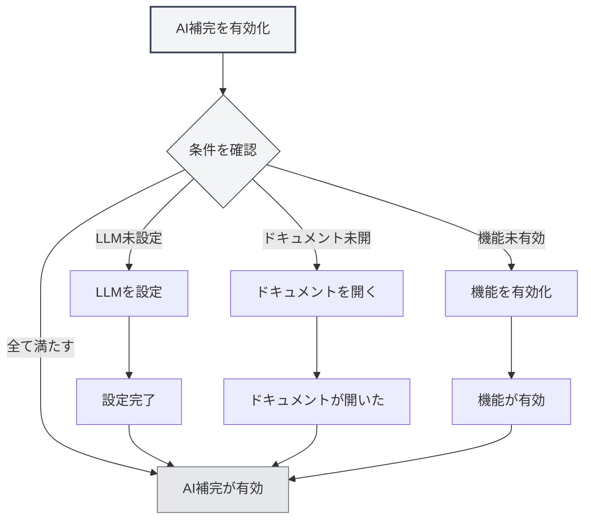
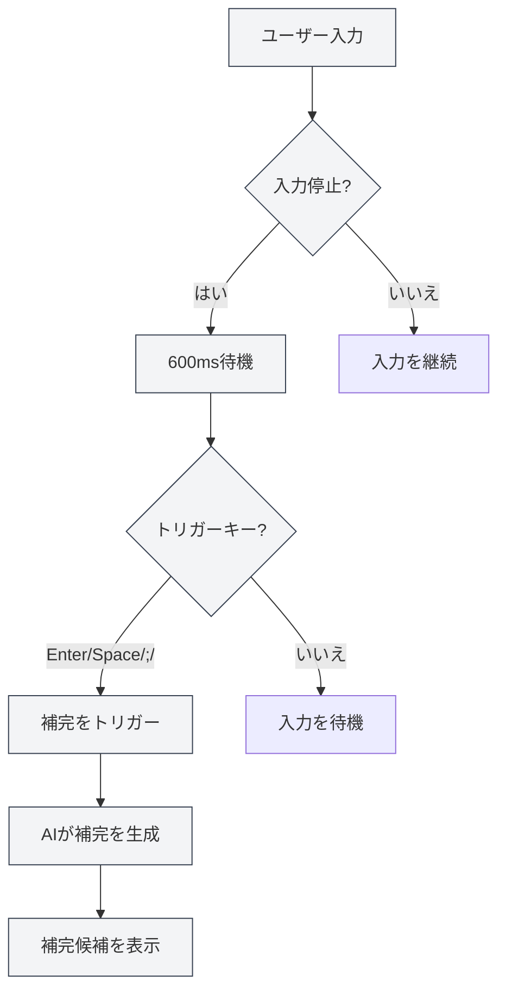
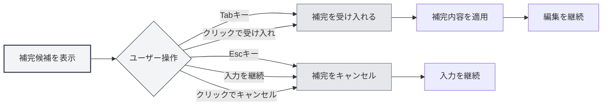

# AI自動補完

## 概要

AI自動補完機能は、AI技術を使用して入力中の内容を自動的に補完します。入力が停止すると、AIは文脈に基づいて自動的に補完候補を生成し、ドキュメント作成を迅速に支援します。

AI自動補完は、複数のドキュメント形式（Markdown、LaTeX、プレーンテキスト）をサポートし、文脈をインテリジェントに理解して、ドキュメントのスタイルと内容に合った補完候補を生成できます。

## AI補完の有効化

### 有効化方法

AI自動補完を有効にする方法は複数あります：

- **右クリックメニュー**：エディター内で右クリックし、「AI自動補完を有効にする」を選択
- **設定ページ**：設定でAI自動補完機能を有効にする
- **ショートカットキー**：ショートカットキーで迅速に切り替え（設定されている場合）

設定には上部メニューバーからアクセスできます：

<MenuItemsDemo mode="demo" :items='[{"id": "settings"}]' />

<CompletionSettingsPanel mode="demo" />

### 有効化条件

AI自動補完を有効にするには、以下の条件を満たす必要があります：

- **LLMが設定済み**：LLMサービスの設定が必要
- **ドキュメントが開かれている**：エディターでドキュメントを開いている必要がある
- **機能が有効化されている**：設定でAI補完機能を有効にする必要がある

詳細は[[ai.llm-config|LLM設定]]を参照してください。

<CompletionSettingsPanel mode="demo" />

## 自動トリガー

<AISuggestionGhost mode="demo" />

### トリガー条件

AI自動補完は以下の状況で自動的にトリガーされます：

- **入力停止**：入力停止から600ms後に自動トリガー
- **トリガーキー**：特定のキー入力後にトリガー（Enter、Space、`;`、`,`など）

### トリガー遅延

トリガー遅延の設定：

- **デフォルト遅延**：600ms（0.6秒）
- **設定可能**：設定で遅延時間を調整可能
- **バランス考慮**：遅延が短すぎると頻繁にトリガーされ、長すぎると体験に影響

<CompletionSettingsPanel mode="demo" />

### トリガーキー

サポートされるトリガーキー：

- **Enter**：エンターキーでトリガー
- **Space**：スペースキーでトリガー
- **;**：セミコロンでトリガー
- **,**：カンマでトリガー

設定でトリガーキーを設定でき、複数のキーを同時に有効にすることができます。

## 手動トリガー

<AISuggestionGhost mode="demo" />

### トリガー方法

手動で補完をトリガーする方法：

- **ショートカットキー**：`Shift+Tab`を押して手動トリガー
- **右クリックメニュー**：右クリックで「手動で補完をトリガー」を選択

手動トリガーでは、自動トリガーの遅延をスキップして即座に補完が開始されます。

<CompletionSettingsPanel mode="demo" />

### 使用シナリオ

手動トリガーが適したシナリオ：

- **即座の補完が必要**：即座に補完候補が必要な場合
- **自動トリガー失敗**：自動トリガーが動作しなかった場合
- **特定の位置**：特定の位置で補完が必要な場合

## 補完内容

<AISuggestionGhost mode="demo" />

### 文脈理解

AI補完は以下の文脈を理解します：

- **現在の段落**：現在の段落の内容を理解
- **ドキュメント構造**：ドキュメント全体の構造を理解
- **ドキュメントスタイル**：ドキュメントの執筆スタイルを理解
- **ドキュメントテーマ**：ドキュメントのテーマと内容を理解

### 補完モード

AI補完は2つのモードをサポートします：

- **完全生成**：完全な補完内容を生成
- **部分生成**：一部の内容のみ生成（設定に基づく）

補完モードは設定で構成できます。

<CompletionSettingsPanel mode="demo" />

### 補完長さ

補完内容の長さ制御：

- **最大トークン数**：補完の最大トークン数を設定可能
- **デフォルト値**：50トークン
- **範囲**：20トークンから無制限（0は無制限を意味）

トークン数が大きいほど補完内容は多くなりますが、生成時間も長くなります。

<CompletionSettingsPanel mode="demo" />

## 補完の受け入れ

<AISuggestionGhost mode="demo" />

### 受け入れ方法

補完候補を受け入れる方法：

- **Tabキー**：`Tab`キーを押して補完候補を受け入れる
- **クリックで受け入れ**：補完候補上の「受け入れる」ボタンをクリック

### 補完のキャンセル

補完候補をキャンセルする方法：

- **Escキー**：`Esc`キーを押して補完候補をキャンセル
- **入力を継続**：入力を継続すると自動的に補完がキャンセルされる
- **クリックでキャンセル**：補完候補上の「キャンセル」ボタンをクリック

### 補完の編集

補完を受け入れた後も編集を継続できます：

- **直接編集**：受け入れ後、補完内容を直接編集可能
- **部分受け入れ**：補完内容の一部のみを受け入れることが可能
- **補完の修正**：補完内容を修正してから使用可能

## ナレッジベース統合

### ナレッジベースの有効化

ナレッジベース統合を有効化：

1. **設定を開く**：設定でナレッジベース統合を有効にする
2. **ナレッジベースを設定**：ナレッジベース関連の設定を構成
3. **自動検索**：補完時に自動的にナレッジベースを検索

詳細は[[knowledge-base.config|ナレッジベース設定]]を参照してください。

### 文脈検索

ナレッジベース検索機能：

- **自動検索**：補完時に自動的に関連知識を検索
- **意味的マッチング**：意味的類似度に基づいて関連コンテンツをマッチング
- **結果統合**：検索結果を補完候補に統合

### 検索設定

ナレッジベース検索設定：

- **信頼度閾値**：検索の信頼度閾値を設定
- **検索数**：検索結果の数を設定
- **検索範囲**：検索の範囲を設定

## 補完設定

### 基本設定

AI補完の基本設定：

- **有効化/無効化**：AI補完機能の有効化または無効化
- **トリガー遅延**：自動トリガーの遅延時間を設定
- **トリガーキー**：トリガーキーを構成
- **最大トークン数**：補完の最大トークン数を設定

<CompletionSettingsPanel mode="demo" />

### 詳細設定

AI補完の詳細設定：

- **補完モード**：補完モードを選択（完全生成/部分生成）
- **文脈長さ**：補完で使用する文脈の長さを設定
- **温度設定**：AI生成の温度パラメータを設定
- **ナレッジベース統合**：ナレッジベース統合オプションを構成

<CompletionSettingsPanel mode="demo" />

### フォーマット設定

異なるフォーマットの補完設定：

- **Markdown**：Markdownフォーマットの補完設定
- **LaTeX**：LaTeXフォーマットの補完設定
- **プレーンテキスト**：プレーンテキストフォーマットの補完設定

フォーマットによって、異なる補完戦略と設定が存在する場合があります。

## 使用のコツ

### 補完品質の向上

1. **文脈を提供**：ドキュメント内に十分な文脈情報を提供する
2. **ナレッジベースを有効化**：ナレッジベース統合を有効にすると補完品質が向上
3. **設定を調整**：必要に応じて補完設定を調整する

### 効率的な使用

1. **適切に使用**：AI補完に過度に依存しない
2. **内容を確認**：補完を受け入れた後、内容が正しいか確認する
3. **手動調整**：必要に応じて補完内容を手動で調整する

### 問題の回避

1. **頻繁なトリガーを回避**：頻繁に補完がトリガーされると入力体験に影響
2. **正確性を確認**：補完内容の正確性を確認する
3. **適時キャンセル**：不要な補完は適時にキャンセルする

## よくある質問

### Q: 補完が不正確ですか？

A: AI補完は文脈と学習データに基づいているため、不正確な場合があります。より多くの文脈情報を提供するか、ナレッジベース統合を有効にして正確性を向上させることができます。

### Q: 補完が遅いですか？

A: 補完速度はAIサービスの応答速度に依存します。補完設定を調整するか、より高速なLLMサービスを使用することができます。

### Q: 自動補完を無効にするには？

A: 設定でAI自動補完機能を無効にするか、右クリックメニューで無効にします。

### Q: トリガーキーをカスタマイズできますか？

A: 可能です。設定でトリガーキーを構成でき、複数のキーを同時に有効にすることができます。

### Q: 補完内容が長すぎますか？

A: 設定で補完の最大トークン数を調整し、補完内容の長さを制限できます。

## 関連ドキュメント

- [[ai.chat|AIチャット]]
- [[ai.proofread|AI校正]]
- [[knowledge-base.config|ナレッジベース設定]]
- [[ai.llm-config|LLM設定]]