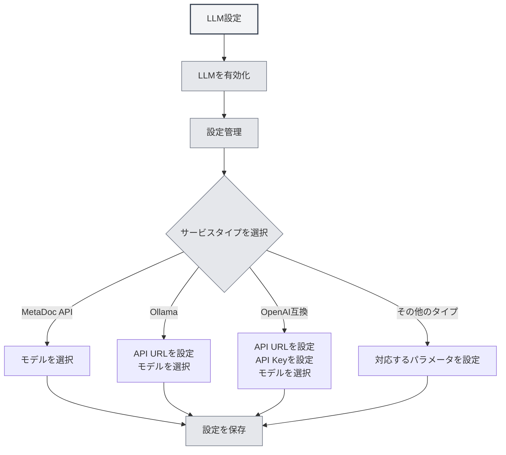

# LLM設定ガイド

## 概要

LLM（大規模言語モデル）は、MetaDocにおけるAI対話、校正、補完、アシスタント、Agentなどの機能の共通基盤です。この文書では、なぜLLMの設定が必要なのか、設定がどの機能に影響するのか、そして具体的な設定画面への入り方について説明します。

**配信チャネル**：**Steam** で MetaDoc を利用する場合は、まず **[[settings.llm|LLM設定]]** の **Steam／MetaDoc Cloud**（チャージ、残高、モデル切替）を読んでください。サードパーティの **自前 API** が必要な場合のみ、**実験的オプション** で **実験的な接続を有効にする** をオンにし、以降の説明および [[settings.llm-types|LLMタイプ設定]] を参照してください。

<Demo component="SettingLlmSection" mode="demo" />

## なぜLLMを設定する必要があるのか

- **API呼び出し**: 対話、補完、校正などは、選択したLLMインターフェースにリクエストを送信するため、正しいアドレスとキーの設定が必要です。
- **モデルの違い**: モデルによって品質、速度、コストが大きく異なります。シーンに適したモデルを選択することで、体験を向上させ、コストを管理できます。
- **統一されたエントリーポイント**: [[settings.llm|LLM設定]]で、有効状態、温度、推論タグなどを一括管理でき、一度の設定ですべてのAI機能に影響を与えます。

## 設定が影響する機能

LLMを設定して有効にすると、以下の機能に影響します：

| 機能          | 説明                                                                 |
| ------------- | -------------------------------------------------------------------- | -------------------------------------------------------------------------------------- |
| **AI対話**    | [[ai.chat            | AI対話機能]]：AIとのマルチターン対話、コンテキストに基づく回答                         |
| **AI校正**    | [[ai.proofread       | AI校正機能]]：文法とスペルチェック、修正提案                                           |
| **AI補完**    | [[ai.completion      | AI自動補完]]：執筆時のインテリジェントな続き書きと補完                                 |
| **AIアシスタント** | [[ai.assistants      | AIアシスタント機能]]：数式認識、描画アシスタント、データ分析など                       |
| **Agent**     | [[agent.introduction | Agentフレームワーク]]：セッション、ツール呼び出し、ワークフロー実行                    |

LLMをオフにするか、利用可能なサービスが設定されていない場合、上記の機能は利用不可となるか、設定を完了するよう促されます。

## LLMの設定方法

### 設定ページへ移動

1.  **設定** → **LLM設定**（またはアプリ内の同等のエントリーポイント）を開きます。
2.  「[[settings.llm|LLM設定]]」ページでは以下が可能です：
    -   LLMの有効化/無効化
    -   温度、推論タグの自動削除の有無などのグローバルオプションの設定
    -   複数のLLM設定の管理（作成、編集、削除、並べ替え）

上部メニューバーからLLM設定にアクセスできます：

<MenuItemsDemo mode="demo" :items='[{"id": "settings"}]' />

<MenuItemsDemo mode="demo" :items='[{"id": "ai"}]' />

### 具体的なサービスの設定

**LLM設定管理**で設定を選択または新規作成し、サービスタイプに応じて入力します：

-   **MetaDoc API / Ollama / OpenAI互換 / OpenAI公式 / DeepSeek / Gemini** など  
    詳細なフィールドと手順については、[[settings.llm-types|LLMタイプ設定]]（APIアドレス、APIキー、モデル名、最大トークン数など）を参照してください。

### 使用上の推奨事項

-   **初回使用時**: まず利用可能なLLM設定を1つ完了して保存し、その後「LLMを有効化」をオンにしてください。
-   **複数設定**: 異なるシーン（例：「日常会話」「校正専用」）に応じて複数の設定を作成し、対応する機能やAgent設定で使用するものを選択できます。
-   **コストとプライバシー**: クラウドAPIを使用すると費用が発生し、コンテンツがアップロードされる可能性があります。ローカル環境とプライバシーが必要な場合は、Ollamaなどのローカルデプロイメントを優先的に検討してください（[[settings.llm-types|LLMタイプ設定]]を参照）。

## 関連ドキュメント

- [[settings.llm|LLM設定]]
- [[settings.llm-types|LLMタイプ設定]]
- [[settings.llm-management|LLM設定管理]]
- [[ai.chat|AI対話機能]]
- [[agent.introduction|Agentフレームワーク概要]]

<AIChat mode="demo" />
