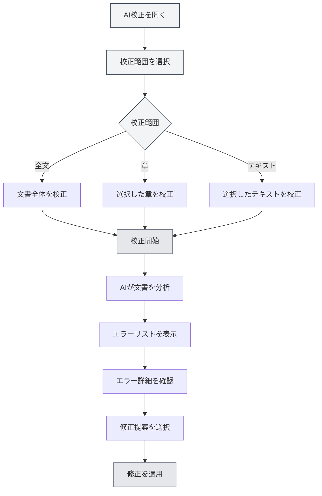
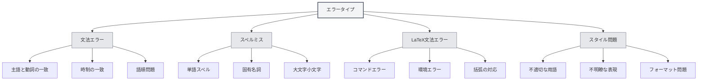
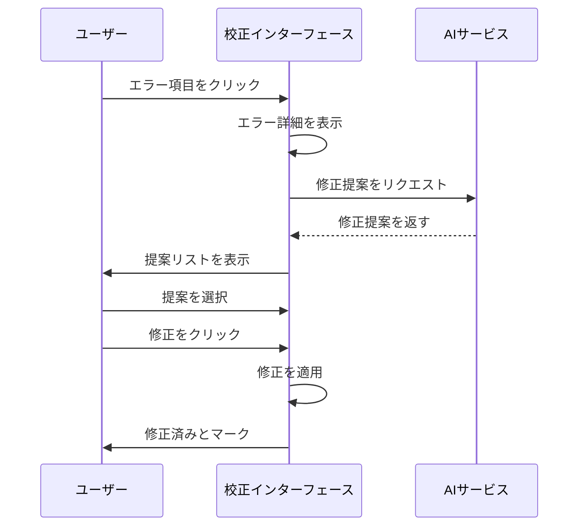

# AI校正

## 概要

AI校正機能は、AI技術を使用して文書内の文法誤り、スペルミス、LaTeX文法エラーなどの問題を自動的にチェックし、修正提案を提供します。AI校正を通じて、文書内の誤りを迅速に発見・修正し、文書品質を向上させることができます。

AI校正は複数の文書形式（Markdown、LaTeX、プレーンテキスト）をサポートし、全文または特定の章を校正し、詳細なエラー情報と修正提案を提供します。

## AI校正を開く

### 開き方

AI校正を開く方法は複数あります：

- **メニューバー**：「AI」メニューをクリックし、「AI校正」を選択
- **ショートカットキー**：設定されている場合はショートカットキーで素早く開く
- **サイドバー**：サイドバーからAI校正パネルを開く

上部メニューバーのAIアシスタントメニューからAI校正機能にアクセスできます：

<MenuItemsDemo mode="demo" :items='[{"id": "ai-assistant", "items": ["proofread"]}]' />

### インターフェース説明

AI校正インターフェースは以下の部分で構成されます：

- **エラーリスト**：左側にすべてのエラーを表示
- **文書プレビュー**：右側に文書内容を表示
- **エラー統計**：上部にエラー統計情報を表示
- **操作ボタン**：上部に操作ボタンを提供

<ProofreadView mode="demo" />

<ProofreadDisplay mode="demo" />

## 校正範囲

### 全文校正

文書全体を校正します：

1. **校正を開く**：AI校正パネルを開く
2. **開始をクリック**：「校正開始」ボタンをクリック
3. **完了を待機**：AIが校正を完了するのを待つ

全文校正は文書内のすべての内容を自動的にチェックします。

<ProofreadView mode="demo" />

<ProofreadDisplay mode="demo" />

### 特定の章を校正

文書の特定の章を校正します：

1. **章を選択**：アウトラインビューで校正する章を選択
2. **校正を開く**：AI校正パネルを開く
3. **章を指定**：校正設定で章のパスを指定
4. **校正開始**：「校正開始」ボタンをクリック

特定の章の校正は、選択した章とそのサブセクションの内容のみをチェックします。

<ProofreadView mode="demo" />

<ProofreadDisplay mode="demo" />

### 指定テキストを校正

指定したテキスト内容を校正します：

1. **テキストを選択**：エディタで校正するテキストを選択
2. **校正を開く**：AI校正パネルを開く
3. **テキストを貼り付け**：テキストを校正入力ボックスに貼り付け
4. **校正開始**：「校正開始」ボタンをクリック

<ProofreadDisplay mode="demo" />

## エラータイプ

AI校正は以下のタイプのエラーを検出できます：

### 文法エラー

文書内の文法エラーをチェックします：

<ProofreadDisplay mode="demo" />

- **主語と動詞の一致**：主語と動詞の一致問題をチェック
- **時制の一致**：時制の一致問題をチェック
- **語順問題**：語順問題をチェック
- **その他の文法**：その他の文法問題をチェック

### スペルミス

文書内のスペルミスをチェックします：

- **単語スペル**：単語のスペルミスをチェック
- **固有名詞**：固有名詞のスペルをチェック
- **大文字小文字**：大文字小文字の問題をチェック

### LaTeX文法エラー

LaTeX文書内の文法エラーをチェックします：

- **コマンドエラー**：LaTeXコマンドエラーをチェック
- **環境エラー**：LaTeX環境エラーをチェック
- **括弧の対応**：括弧の対応問題をチェック
- **その他の文法**：その他のLaTeX文法問題をチェック

### スタイル問題

文書のスタイル問題をチェックします：

- **不適切な用語**：用語が適切かどうかをチェック
- **不明瞭な表現**：表現が明確かどうかをチェック
- **フォーマット問題**：フォーマット問題をチェック

## エラー情報

### エラー表示

エラー情報には以下の内容が含まれます：

<ProofreadDisplay mode="demo" />

- **エラータイプ**：エラータイプ（文法、スペル、LaTeXなど）を表示
- **エラー位置**：エラーがある行番号と列番号を表示
- **エラーテキスト**：エラーのテキスト内容を表示
- **修正提案**：修正提案を表示
- **重大度**：エラーの重大度を表示

### 重大度

エラーは重大度によって分類されます：

- **エラー（Error）**：修正必須のエラー
- **警告（Warning）**：修正を推奨する問題
- **情報（Info）**：参考情報

### エラー位置特定

エラー位置を素早く特定します：

1. **エラーをクリック**：エラーリストのエラー項目をクリック
2. **自動位置特定**：エディタが自動的にエラー位置までスクロール
3. **ハイライト表示**：エラー位置がハイライト表示されます

## 修正提案

### 提案を確認

AIが提供する修正提案を確認します：

<ProofreadDisplay mode="demo" />

- **単一提案**：提案が1つのみの場合、直接表示
- **複数提案**：提案が複数ある場合、タグ形式で表示
- **提案を選択**：提案タグをクリックして提案を選択

### 修正を適用

修正提案を適用します：

<ProofreadDisplay mode="demo" />

1. **提案を選択**：提案タグをクリックして提案を選択
2. **修正をクリック**：「修正」ボタンをクリック
3. **修正を確認**：確認後に修正を適用

修正後、エラーは「修正済み」とマークされます。

### 一括修正

すべてのエラーを一括修正します：

1. **すべて修正をクリック**：「すべて一括修正」ボタンをクリック
2. **修正を確認**：確認後にすべてのエラーを修正

一括修正は最初の提案を使用してすべてのエラーを修正します。

## エラー管理

### エラーを無視

修正不要なエラーを無視します：

1. **エラーを選択**：無視するエラーを選択
2. **無視をクリック**：「無視」ボタンをクリック
3. **無視を確認**：確認後にエラーを無視

無視されたエラーはエラーリストから削除されます。

### 辞書に追加

単語を辞書に追加します：

1. **エラーを選択**：スペルミスを選択
2. **辞書に追加**：「辞書に追加」ボタンをクリック
3. **追加を確認**：確認後に辞書に追加

辞書に追加後、その単語はスペルミスとしてマークされなくなります。

### 修正済みをクリア

修正済みのエラーをクリアします：

1. **クリアをクリック**：「修正済みをクリア」ボタンをクリック
2. **クリアを確認**：確認後に修正済みのエラーをクリア

修正済みのエラーをクリアすると、エラーリストがより明確になります。

## 使用のコツ

<ProofreadView mode="demo" />

### 効率的な校正

1. **まず全文校正**：まず全文を校正して全体状況を把握
2. **次に章ごと校正**：問題のある章を詳細に校正
3. **一括修正**：一括修正を使用して一般的なエラーを迅速に修正

### エラー処理

1. **重大エラーを優先**：重大なエラーを優先的に処理
2. **提案をチェック**：修正提案を注意深くチェック
3. **手動調整**：必要に応じて修正内容を手動調整

### 辞書管理

1. **専門用語を追加**：専門用語を辞書に追加
2. **定期的に更新**：辞書内容を定期的に更新
3. **辞書をエクスポート**：辞書をエクスポートしてバックアップ

## よくある質問

### Q: 校正結果が正確でない？

A: AI校正はAIモデルに基づいており、不正確な場合があります。特に専門用語や特殊な表現については、校正結果を人手でチェックすることをお勧めします。

### Q: 特定の章を校正するには？

A: 校正設定で章のパス（例：「1.1」）を指定するか、アウトラインビューを使用して章を選択します。

### Q: 特定のエラーを無視できますか？

A: できます。「無視」ボタンをクリックすると、修正不要なエラーを無視できます。

### Q: 辞書に追加するには？

A: スペルミスを選択し、「辞書に追加」ボタンをクリックすると、単語を辞書に追加できます。

### Q: 校正が遅い？

A: 校正速度は文書サイズとAIサービスの応答速度に依存します。大きな文書の場合は、セクションごとに校正することをお勧めします。

## 関連文書

- [[ai.chat|AIチャット]]
- [[ai.completion|AI自動補完]]
- [[outline.basics|アウトラインビュー機能]]
