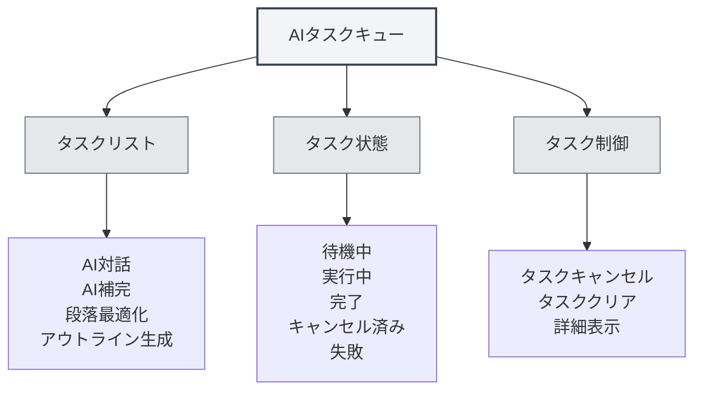

# AIタスクキュー

## 概要

AIタスクキューは、実行中のすべてのAIタスクを管理・監視するために使用されます。タスクキューを通じて、タスクの状態確認、タスクのキャンセル、タスクの進捗状況の確認が可能となり、AI機能の効率的な実行を確保します。

## タスクキューの紹介

<AITaskQueue mode="demo" />

### タスクキューとは

AIタスクキューは、実行中または実行待ちのすべてのAIタスクを表示する管理インターフェースです：

- **タスクリスト**：すべてのタスクとその状態を表示
- **タスク状態**：タスクの実行状態を表示
- **タスク進捗**：タスクの実行進捗状況を表示
- **タスク制御**：タスクのキャンセルや管理が可能

### タスクの種類

タスクキューには以下の種類のタスクが含まれる場合があります：

- **AI対話**：AI対話タスク
- **AI補完**：AI自動補完タスク
- **段落最適化**：段落最適化タスク
- **アウトライン生成**：アウトライン生成タスク
- **その他のAIタスク**：その他のAI関連タスク

## タスクキューの開き方

### アクセス方法

以下の方法でタスクキューを開くことができます：

- **サイドバー**：サイドバーにタスクキューのエントリがある場合があります
- **メニューオプション**：一部のメニューにタスクキューオプションがある場合があります
- **ショートカットキー**：場合によってはショートカットキーが利用可能な場合があります（将来サポートされる可能性あり）

### タスクキューパネル

<AITaskQueue mode="demo" />

タスクキューは通常、サイドパネルとして表示されます：

- **タスクリスト**：すべてのタスクを表示
- **タスク詳細**：選択したタスクの詳細情報を表示
- **制御ボタン**：タスク制御機能を提供

## タスクの表示

<AITaskQueue mode="demo" />

### タスクリスト

タスクリストはすべてのタスクを表示します：

- **タスク名**：タスクの名前を表示
- **タスク状態**：タスクの現在の状態を表示
- **タスク進捗**：タスクの実行進捗状況を表示
- **タスク時間**：タスクの作成時間を表示

### タスクの状態

タスクは以下の状態にある可能性があります：

- **待機中**：タスクが作成され、実行を待機中
- **実行中**：タスクが実行中
- **完了**：タスクの実行が完了
- **キャンセル済み**：タスクがキャンセルされた
- **失敗**：タスクの実行が失敗

### タスク詳細

タスクの詳細情報を確認できます：

- **タスク名**：タスクの名前
- **タスクタイプ**：タスクの種類
- **タスクパラメータ**：タスクのパラメータ
- **タスク結果**：タスクの結果（完了している場合）
- **エラーメッセージ**：タスクのエラー情報（失敗している場合）

## タスクの制御

<AITaskQueue mode="demo" />

### タスクのキャンセル

実行中のタスクをキャンセルできます：

1. **タスクの選択**：タスクリストでキャンセルするタスクを選択
2. **キャンセルをクリック**：「キャンセル」ボタンをクリック
3. **キャンセルの確認**：キャンセル操作を確認
4. **タスクキャンセル**：タスクがキャンセルされ、削除されます

<AITaskQueue mode="demo" />

### タスクのクリア

すべてのタスクをクリアできます：

1. **タスクキューを開く**：タスクキューパネルを開く
2. **クリアをクリック**：「クリア」ボタンをクリック
3. **クリアの確認**：クリア操作を確認
4. **タスククリア**：すべてのタスクがキャンセルされ、削除されます

### タスクの優先度

一部のタスクには優先度がある場合があります：

- **高優先度**：重要なタスクを優先的に実行
- **通常優先度**：通常のタスクを順番に実行
- **低優先度**：低優先度のタスクを最後に実行

## タスク進捗の表示

<AITaskQueue mode="demo" />

### プログレスバー

タスクの進捗状況はプログレスバーで表示されます：

- **進捗率**：タスク完了の割合を表示
- **プログレスバー**：タスクの進捗状況を視覚的に表示
- **進捗更新**：進捗状況がリアルタイムで更新

### 進捗情報

タスクの進捗情報を確認できます：

- **現在のステップ**：現在実行中のステップを表示
- **完了済みステップ**：完了したステップを表示
- **総ステップ数**：総ステップ数を表示
- **予想時間**：完了までの予想時間を表示

<AITaskQueue mode="demo" />

## タスクの遅延

<AITaskQueue mode="demo" />

### 遅延補完

AI補完タスクを遅延させることができます：

1. **タスクキューを開く**：タスクキューパネルを開く
2. **遅延時間を選択**：遅延時間（分）を選択
3. **遅延を適用**：遅延設定を適用
4. **タスク遅延**：補完タスクが遅延実行されます

### 遅延表示

遅延時間はタスクキューに表示されます：

- **残り時間**：残りの遅延時間を表示
- **カウントダウン**：リアルタイムのカウントダウン表示
- **自動実行**：遅延時間終了後に自動的に実行

## タスク履歴

<AITaskQueue mode="demo" />

### 履歴記録

タスクキューはタスク履歴を保存する場合があります：

- **完了タスク**：完了したタスクを表示
- **失敗タスク**：失敗したタスクを表示
- **キャンセルタスク**：キャンセルされたタスクを表示

### 履歴の表示

タスク履歴を確認できます：

- **履歴リスト**：履歴タスクのリストを表示
- **タスク詳細**：履歴タスクの詳細情報を確認
- **結果の表示**：タスクの結果を確認

## ベストプラクティス

<AITaskQueue mode="demo" />

1. **定期的な確認**：定期的にタスクキューを確認し、タスクの実行状況を把握する
2. **タイムリーなキャンセル**：不要なタスクはタイムリーにキャンセルし、リソースを解放する
3. **進捗の監視**：タスクの進捗状況に注意し、タスクが正常に実行されていることを確認する
4. **エラー処理**：失敗したタスクはタイムリーに処理し、後続のタスクに影響を与えないようにする
5. **リソース管理**：タスクを適切に管理し、リソースの浪費を避ける

## 注意事項

1. **タスク数**：タスクが多すぎるとパフォーマンスに影響する可能性があります
2. **タスクキャンセル**：タスクのキャンセルは実行中の操作に影響を与える可能性があります
3. **タスク状態**：タスクの状態はリアルタイムで変化する可能性があります
4. **リソース使用量**：タスクはシステムリソースを占有します
5. **ネットワーク依存**：一部のタスクはネットワーク接続が必要です

## 関連ドキュメント

- [[ai.chat|AI対話機能]]
- [[ai.completion|AI自動補完]]
- [[features.paragraph-optimization|段落最適化機能]]
