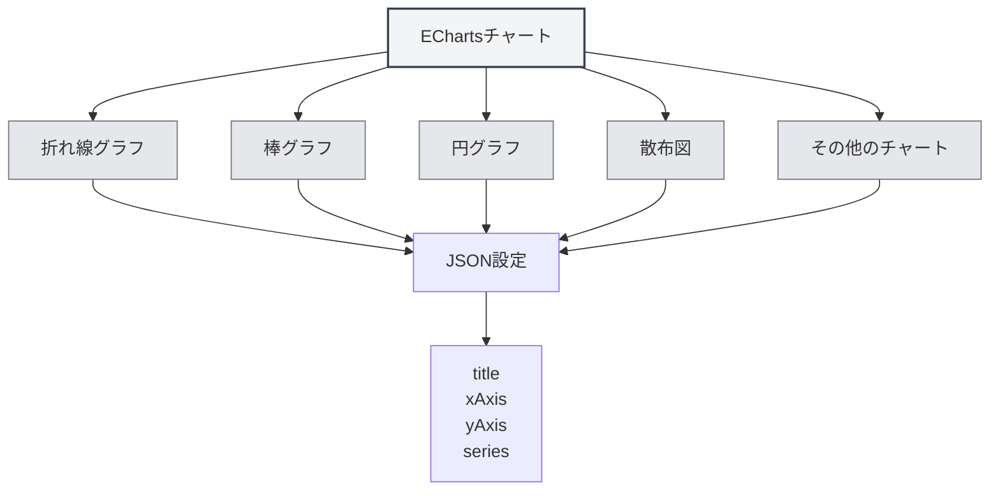

# EChartsチャート

## 概要

EChartsは強力なデータ可視化チャートライブラリで、多様なチャートタイプをサポートしています。MetaDocはEChartsチャートをサポートしており、Markdownドキュメント内でECharts設定を使用して様々なデータ可視化チャートを作成できます。

<DataAnalysisWindow mode="demo" />

## ECharts構文

<ChartGenerationDisplay mode="demo" />

### 基本構文

EChartsはJSON設定フォーマットを使用します：

````markdown
```echarts
{
  "title": {
    "text": "サンプルチャート"
  },
  "xAxis": {
    "type": "category",
    "data": ["A", "B", "C"]
  },
  "yAxis": {
    "type": "value"
  },
  "series": [{
    "data": [10, 20, 30],
    "type": "bar"
  }]
}
```
````

### 設定フォーマット

ECharts設定は有効なJSONである必要があります：

- **JSONフォーマット**：標準JSONフォーマットを使用
- **英語の句読点**：英語のカンマ、コロン、引用符を使用
- **設定の完全性**：必要な設定項目を含める



## サポートされているチャートタイプ

<DataAnalysisDisplay mode="demo" />

### 折れ線グラフ

折れ線グラフを作成：

````markdown
```echarts
{
  "xAxis": {
    "type": "category",
    "data": ["月", "火", "水"]
  },
  "yAxis": {
    "type": "value"
  },
  "series": [{
    "data": [120, 200, 150],
    "type": "line"
  }]
}
```
````

### 棒グラフ

<ChartGenerationDisplay mode="demo" />

棒グラフを作成：

````markdown
```echarts
{
  "xAxis": {
    "type": "category",
    "data": ["A", "B", "C"]
  },
  "yAxis": {
    "type": "value"
  },
  "series": [{
    "data": [10, 20, 30],
    "type": "bar"
  }]
}
```
````

### 円グラフ

<DataAnalysisDisplay mode="demo" />

円グラフを作成：

````markdown
```echarts
{
  "series": [{
    "type": "pie",
    "data": [
      {"value": 335, "name": "カテゴリA"},
      {"value": 310, "name": "カテゴリB"},
      {"value": 234, "name": "カテゴリC"}
    ]
  }]
}
```
````

### 散布図

<ChartGenerationDisplay mode="demo" />

散布図を作成：

````markdown
```echarts
{
  "xAxis": {
    "type": "value"
  },
  "yAxis": {
    "type": "value"
  },
  "series": [{
    "type": "scatter",
    "data": [[10, 20], [15, 25], [20, 30]]
  }]
}
```
````

### レーダーチャート

<OutlineTreeDisplay mode="demo" />

レーダーチャートを作成：

````markdown
```echarts
{
  "radar": {
    "indicator": [
      {"name": "指標1", "max": 100},
      {"name": "指標2", "max": 100}
    ]
  },
  "series": [{
    "type": "radar",
    "data": [{
      "value": [80, 90]
    }]
  }]
}
```
````

### ヒートマップ

<DataAnalysisDisplay mode="demo" />

ヒートマップを作成：

````markdown
```echarts
{
  "xAxis": {
    "type": "category",
    "data": ["A", "B", "C"]
  },
  "yAxis": {
    "type": "category",
    "data": ["X", "Y", "Z"]
  },
  "series": [{
    "type": "heatmap",
    "data": [[0, 0, 10], [0, 1, 20], [1, 0, 30]]
  }]
}
```
````

## チャート設定

<OutlineTreeDisplay mode="demo" />

### タイトル設定

チャートタイトルを設定：

```json
{
  "title": {
    "text": "チャートタイトル",
    "subtext": "サブタイトル"
  }
}
```

### 座標軸設定

座標軸を設定：

```json
{
  "xAxis": {
    "type": "category",
    "data": ["A", "B", "C"]
  },
  "yAxis": {
    "type": "value"
  }
}
```

### シリーズ設定

データシリーズを設定：

```json
{
  "series": [
    {
      "name": "シリーズ名",
      "type": "bar",
      "data": [10, 20, 30]
    }
  ]
}
```

### 凡例設定

凡例を設定：

```json
{
  "legend": {
    "data": ["シリーズ1", "シリーズ2"]
  }
}
```

### ツールチップ設定

ツールチップを設定：

```json
{
  "tooltip": {
    "trigger": "axis"
  }
}
```

## 高度な機能

<ChartGenerationDisplay mode="demo" />

### マルチシリーズチャート

マルチシリーズチャートを作成：

````markdown
```echarts
{
  "xAxis": {
    "type": "category",
    "data": ["月", "火", "水"]
  },
  "yAxis": {
    "type": "value"
  },
  "series": [
    {
      "name": "シリーズ1",
      "type": "bar",
      "data": [10, 20, 30]
    },
    {
      "name": "シリーズ2",
      "type": "line",
      "data": [15, 25, 35]
    }
  ]
}
```
````

### データズーム

データズームを追加：

```json
{
  "dataZoom": [
    {
      "type": "slider",
      "start": 0,
      "end": 100
    }
  ]
}
```

### ビジュアルマップ

ビジュアルマップを追加：

```json
{
  "visualMap": {
    "min": 0,
    "max": 100,
    "inRange": {
      "color": ["#50a3ba", "#eac736", "#d94e5d"]
    }
  }
}
```

## レンダリング方式

### メインプロセスレンダリング

EChartsはメインプロセスでレンダリングします：

- **サーバーサイドレンダリング**：メインプロセスでチャートをレンダリング
- **SVGフォーマット**：デフォルトでSVGフォーマットとしてレンダリング
- **PNGフォーマット**：PNGフォーマットに変換可能

### レンダリングパフォーマンス

EChartsのレンダリング特性：

- **レンダリング速度**：メインプロセスレンダリングは比較的高速
- **リソース使用**：レンダリング時にメインプロセスリソースを占有
- **エラー処理**：レンダリングエラーはコンソールに表示

## 注意事項

### 構文に関する注意

1. **JSONフォーマット**：有効なJSONフォーマットを使用する必要があります
2. **英語の句読点**：英語のカンマ、コロン、引用符を使用してください
3. **設定の完全性**：必要な設定項目を含めてください
4. **構文の正確性**：JSON構文が正しいことを確認してください。そうでないとレンダリングできません

### レンダリングに関する注意

1. **設定検証**：レンダリング前に設定フォーマットを検証します
2. **構文エラー**：JSON構文エラーがある場合、チャートはレンダリングされません
3. **複雑なチャート**：過度に複雑なチャートはレンダリングパフォーマンスに影響する可能性があります
4. **エクスポート互換性**：エクスポート時にチャートがターゲットフォーマットで正常に表示されることを確認してください

## ベストプラクティス

1. **設定規範**：ECharts公式設定規範に従ってください
2. **JSONフォーマット**：JSONフォーマットが正しいことを確認してください
3. **コードの明確さ**：設定コードを明確で読みやすく保ってください
4. **レンダリングテスト**：編集後にチャートのレンダリング効果をテストしてください
5. **ドキュメント参照**：ECharts公式ドキュメントとサンプルを参照してください

## 関連ドキュメント

- [[charts.introduction|チャート機能紹介]]
- [[charts.mermaid|Mermaidチャート]]
- [[charts.plantuml|PlantUMLチャート]]