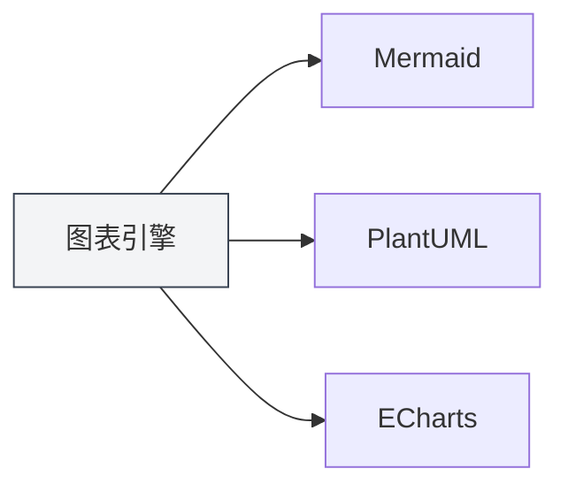
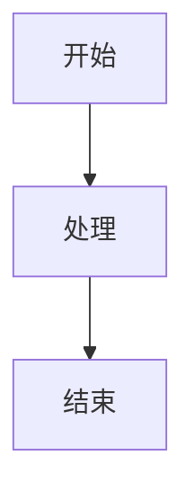

# グラフ機能の紹介

## 概要

MetaDocは複数のグラフ描画エンジンをサポートしており、Markdownドキュメント内に様々なタイプのグラフを挿入してレンダリングすることができます。グラフ機能により、フローチャート、UML図、データ可視化グラフなどを作成し、ドキュメントの内容を充実させることができます。

<GraphWindow mode="demo" />

## サポートされているグラフエンジン

<ChartGenerationDisplay mode="demo" />

### グラフの種類

MetaDocは以下のグラフエンジンをサポートしています：

- **Mermaid**：フローチャート、UML図、ガントチャートなど
- **PlantUML**：専門的なUMLモデリング図
- **ECharts**：データ可視化グラフ
- **Flowchart**：基本的なフローチャート
- **Graphviz**：グラフ可視化
- **Mindmap**：マインドマップ
- **Markmap**：Markdownマインドマップ
- **SMILES**：化学構造式
- **ABC**：楽譜

### エンジン比較

<DataAnalysisDisplay mode="demo" />

| エンジン    | 適用シーン                         | レンダリング方式 |
| ----------- | ---------------------------------- | ---------------- |
| Mermaid     | フローチャート、シーケンス図、クラス図、ガントチャート | ブラウザレンダリング |
| PlantUML    | 専門的なUMLモデリング              | メインプロセスレンダリング |
| ECharts     | データ可視化（折れ線グラフ、棒グラフなど） | メインプロセスレンダリング |
| Flowchart   | 基本的なフローチャート             | Vditorレンダリング |
| Graphviz    | グラフ可視化                       | Vditorレンダリング |
| Mindmap     | マインドマップ                     | Vditorレンダリング |

### エンジン比較グラフ

<OutlineTreeDisplay mode="demo" />



## グラフの挿入

<DataAnalysisWindow mode="demo" />

### コードブロック構文

Markdownドキュメント内でコードブロックを使用してグラフを挿入します：

````markdown

````

### グラフタイプ識別子

異なるグラフタイプは異なるコードブロック識別子を使用します：

- **Mermaid**：` ```mermaid `
- **PlantUML**：` ```plantuml `
- **ECharts**：` ```echarts `
- **Flowchart**：` ```flowchart `
- **Graphviz**：` ```graphviz `
- **Mindmap**：` ```mindmap `

## グラフのレンダリング

<ChartGenerationDisplay mode="demo" />

### リアルタイムレンダリング

グラフはエディタ内でリアルタイムにレンダリングされます：

- **自動レンダリング**：グラフコード入力後に自動的にレンダリング
- **リアルタイムプレビュー**：プレビューウィンドウでグラフをリアルタイム表示
- **エラー表示**：構文エラー時にエラーメッセージを表示

### レンダリング方式

異なるグラフは異なるレンダリング方式を使用します：

- **ブラウザレンダリング**：MermaidなどはブラウザAPIを使用してレンダリング
- **メインプロセスレンダリング**：PlantUML、EChartsはメインプロセスでレンダリング
- **Vditorレンダリング**：FlowchartなどはVditorを使用してレンダリング

### レンダリング形式

グラフは異なる形式でレンダリングできます：

- **SVG**：ベクター画像形式（デフォルト）
- **PNG**：ビットマップ画像形式（変換可能）

## グラフのエクスポート

<OutlineTreeDisplay mode="demo" />

### エクスポートサポート

グラフは複数の形式へのエクスポートをサポートしています：

- **PDFエクスポート**：グラフはPDFに含まれます
- **HTMLエクスポート**：グラフはHTMLに含まれます
- **画像エクスポート**：グラフを単独で画像としてエクスポート可能

### エクスポート品質

エクスポート時もグラフの品質を維持します：

- **ベクター画像**：SVG形式は鮮明さを保持
- **ビットマップ画像**：PNG形式は印刷に適しています
- **解像度**：エクスポート形式に応じて解像度を調整

## グラフの編集

<DataAnalysisDisplay mode="demo" />

### コード編集

グラフコードを直接編集できます：

- **シンタックスハイライト**：コードブロックはシンタックスハイライトをサポート
- **オートコンプリート**：一部のエディタはオートコンプリートをサポート
- **エラーチェック**：構文エラーをリアルタイムでチェック

### プレビュー更新

コード編集後、プレビューは自動的に更新されます：

- **リアルタイム更新**：コード修正後、プレビューは即座に更新
- **エラー表示**：構文エラー時にエラー情報を表示
- **レンダリング状態**：グラフのレンダリング状態を表示

## 多言語サポート

<DataAnalysisWindow mode="demo" />

### グラフコードの多言語対応

グラフコードは多言語をサポートしています：

- **日本語対応**：日本語のラベルやテキストを使用可能
- **英語対応**：英語のラベルやテキストを使用可能
- **混合使用**：日本語と英語を混合して使用可能

### 国際化

グラフ機能は国際化をサポートしています：

- **インターフェース言語**：グラフ関連のインターフェースはシステム言語に追随
- **エラーメッセージ**：エラーメッセージは現在の言語を使用
- **ヘルプドキュメント**：ヘルプドキュメントは多言語をサポート

## ベストプラクティス

1. **適切なエンジンの選択**：要件に応じて適切なグラフエンジンを選択
2. **構文規約**：各エンジンの構文規約に従う
3. **コードの明確さ**：グラフコードを明確で読みやすく保つ
4. **レンダリングテスト**：編集後にグラフのレンダリング効果をテスト
5. **エクスポートテスト**：エクスポート前に、ターゲット形式でのグラフ表示効果をテスト

## 注意事項

1. **構文の正確さ**：グラフコードの構文が正しいことを確認、そうでないとレンダリング不可
2. **レンダリングパフォーマンス**：複雑なグラフはレンダリングパフォーマンスに影響する可能性あり
3. **エクスポート互換性**：一部のグラフ形式は、一部のエクスポート形式と互換性がない場合あり
4. **コードセキュリティ**：グラフコードのセキュリティに注意し、悪意のあるコードを避ける
5. **バージョン互換性**：異なるバージョンのグラフエンジンでは構文の差異がある可能性あり

## 関連ドキュメント

- [[charts.mermaid|Mermaidグラフ]]
- [[charts.plantuml|PlantUMLグラフ]]
- [[charts.echarts|EChartsグラフ]]
- [[markdown.features|Markdownエディタ機能]]