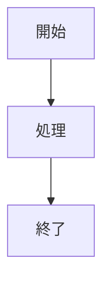
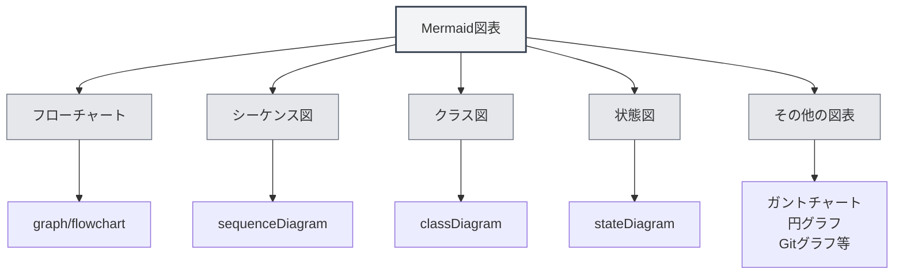
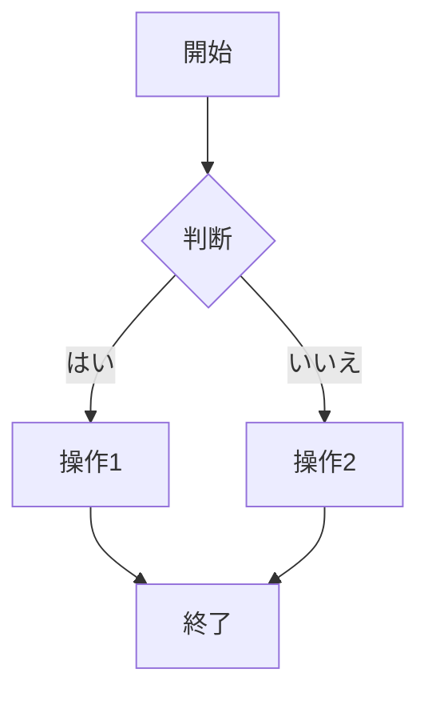
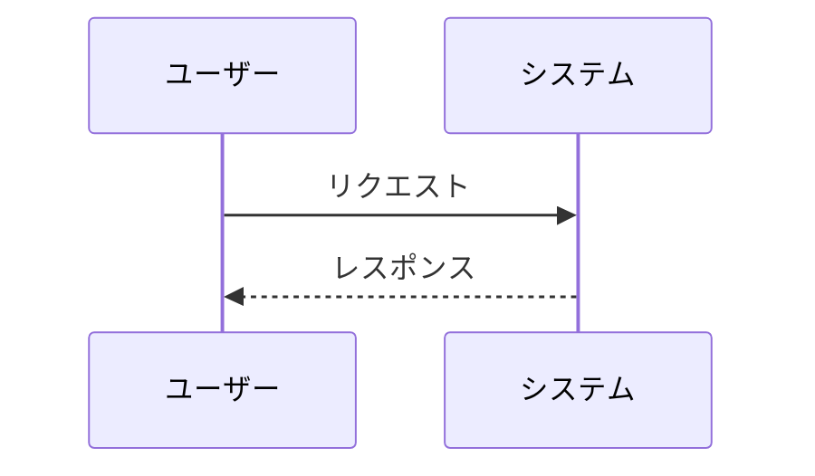
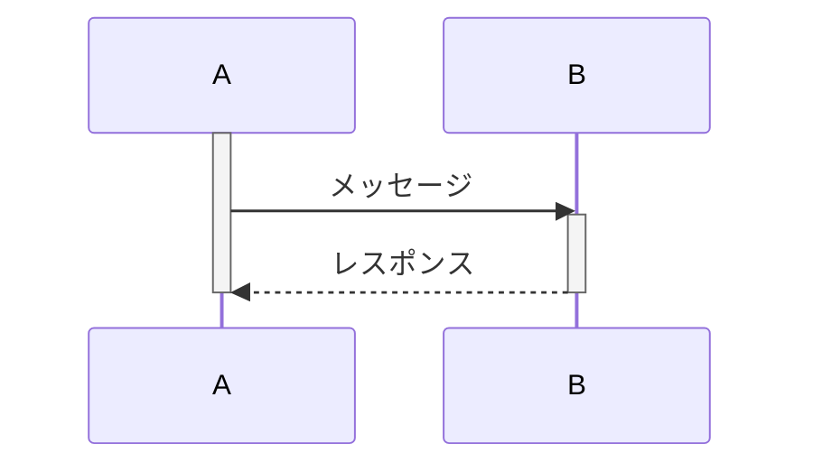
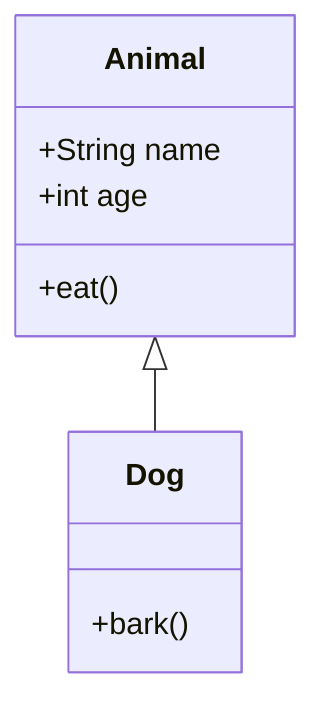
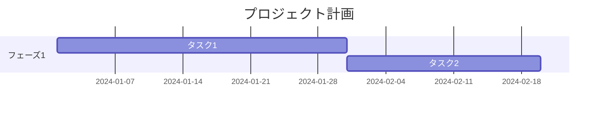
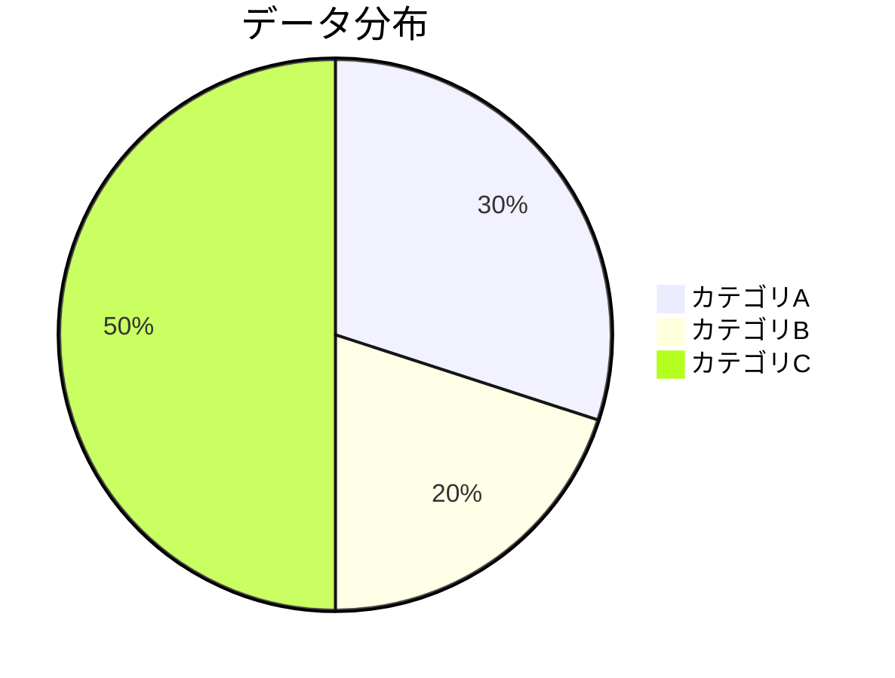
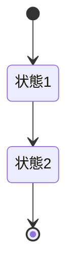
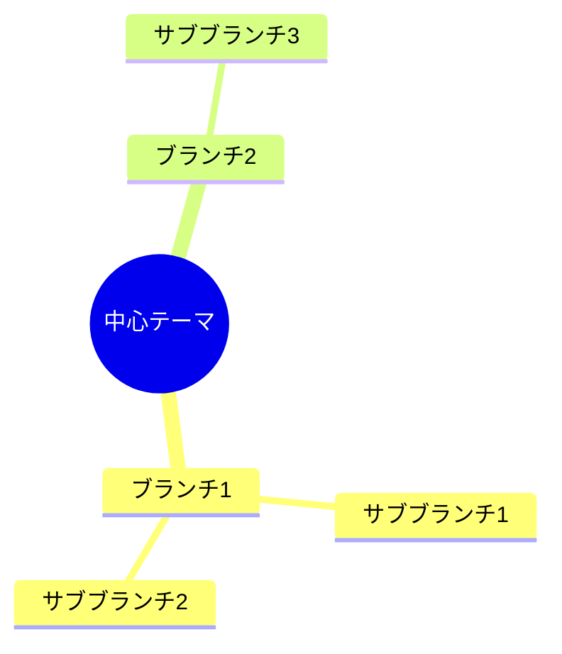

# Mermaid図表

## 概要

Mermaidは、フローチャート、シーケンス図、クラス図、ガントチャートなどを素早く描画するための人気のある図表作成ツールです。MetaDocはMermaid図表をサポートしており、Markdown文書内で直接Mermaid構文を使用して様々な図表を作成できます。

<GraphWindow mode="demo" initialTool="mermaid" />

## Mermaid構文

<OutlineTreeDisplay mode="demo" />

### 基本構文

Mermaidは、シンプルなテキスト構文を使用して図表を記述します：

````markdown

````

### 図表の種類

<ChartGenerationDisplay mode="demo" />

Mermaidは様々な種類の図表をサポートしています：

- **フローチャート**（graph/flowchart）
- **シーケンス図**（sequenceDiagram）
- **クラス図**（classDiagram）
- **状態図**（stateDiagram）
- **実体関連図**（erDiagram）
- **ガントチャート**（gantt）
- **円グラフ**（pie）
- **Gitグラフ**（gitgraph）
- **ユーザージャーニー図**（journey）
- **マインドマップ**（mindmap）
- **タイムライン**（timeline）



## フローチャート

<OutlineTreeDisplay mode="demo" />

### 基本フローチャート

基本的なフローチャートを作成します：

````markdown

````

### フローチャートの方向

フローチャートの方向を設定できます：

- **TD**：上から下へ（Top Down）
- **BT**：下から上へ（Bottom Top）
- **LR**：左から右へ（Left Right）
- **RL**：右から左へ（Right Left）

### ノードの形状

異なるノード形状を使用できます：

- **矩形**：`[テキスト]`
- **角丸矩形**：`(テキスト)`
- **菱形**：`{テキスト}`
- **円形**：`((テキスト))`
- **六角形**：`{{テキスト}}`
- **台形**：`[/テキスト\]`
- **逆台形**：`[\テキスト/]`

## シーケンス図

<DataAnalysisDisplay mode="demo" />

### 基本シーケンス図

シーケンス図を作成します：

````markdown

````

### メッセージの種類

異なる種類のメッセージを使用できます：

- **実線矢印**：`->>` 同期メッセージ
- **破線矢印**：`-->>` 非同期メッセージ
- **実線**：`->` 同期メッセージ（戻り値なし）
- **破線**：`-->` 非同期メッセージ（戻り値なし）

### アクティベーションボックス

オブジェクトの活動を表すアクティベーションボックスを追加できます：

````markdown

````

## クラス図

<ChartGenerationDisplay mode="demo" />

### 基本クラス図

クラス図を作成します：

````markdown

````

### クラス間の関係

異なるクラス間の関係を表現できます：

- **継承**：`<|--` または `--|>`
- **実装**：`<|..` または `..|>`
- **コンポジション**：`*--` または `--*`
- **アグリゲーション**：`o--` または `--o`
- **関連**：`-->` または `<--`
- **依存**：`..>` または `<..`

### クラスメンバー

クラスのメンバーを定義できます：

- **属性**：`+name: String`（公開）、`-name: String`（非公開）
- **メソッド**：`+method()`（公開）、`-method()`（非公開）

## ガントチャート

<OutlineTreeDisplay mode="demo" />

### 基本ガントチャート

ガントチャートを作成します：

````markdown

````

### 日付フォーマット

日付フォーマットを設定できます：

- **YYYY-MM-DD**：年-月-日
- **MM/DD/YYYY**：月/日/年
- **その他のフォーマット**：様々な日付フォーマットをサポート

### タスクの関係

タスク間の関係を設定できます：

- **after**：特定のタスクの後
- **マイルストーン**：`milestone`でマイルストーンをマーク

## 円グラフ

<DataAnalysisDisplay mode="demo" />

### 基本円グラフ

円グラフを作成します：

````markdown

````

## 状態図

<ChartGenerationDisplay mode="demo" />

### 基本状態図

状態図を作成します：

````markdown

````

## マインドマップ

<OutlineTreeDisplay mode="demo" />

### 基本マインドマップ

マインドマップを作成します：

````markdown

````

## 注意事項

<DataAnalysisDisplay mode="demo" />

### 構文に関する注意事項

1.  **文字列の囲み**：エスケープエラーを避けるため、`["..."]`で文字列を囲むことを推奨します
2.  **識別子**：クラス図では、スペースや特殊文字を含む識別子の使用を避けてください
3.  **日本語サポート**：日本語を使用できますが、識別子には英語を使用することを推奨します
4.  **構文バージョン**：Mermaidの構文バージョンに注意してください。異なるバージョンでは差異がある場合があります

### レンダリングに関する注意事項

1.  **構文エラー**：構文エラーがある場合、図表はレンダリングされません
2.  **複雑な図表**：過度に複雑な図表はレンダリング性能に影響を与える可能性があります
3.  **ブラウザ互換性**：一部のブラウザでは、特定のMermaid機能がサポートされていない場合があります
4.  **エクスポート互換性**：エクスポート時に、図表が対象フォーマットで正常に表示されることを確認してください

## ベストプラクティス

1.  **構文の規範**：Mermaid公式の構文規範に従ってください
2.  **コードの明確さ**：図表のコードを明確で読みやすく保ってください
3.  **レンダリングテスト**：編集後に図表のレンダリング効果をテストしてください
4.  **サンプルの活用**：Mermaid公式ドキュメントのサンプルを参考にしてください
5.  **バージョン互換性**：Mermaidのバージョン互換性に注意してください

## 関連ドキュメント

- [[charts.introduction|図表機能の紹介]]
- [[charts.plantuml|PlantUML図表]]
- [[charts.echarts|ECharts図表]]
