# PlantUML図表

## 概要

PlantUMLは、多様なUML図表タイプをサポートする専門的なUMLモデリングツールです。MetaDocはPlantUML図表をサポートしており、Markdown文書内でPlantUML構文を使用して専門的なUML図表を作成できます。

<GraphWindow mode="demo" initialTool="plantuml" />

## PlantUML構文

<OutlineTreeDisplay mode="demo" />

### 基本構文

PlantUMLは特定のマークアップと構文を使用します：

````markdown
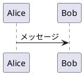
````

### 必須マークアップ

<ChartGenerationDisplay mode="demo" />

PlantUML図表には以下を含める必要があります：

- **@startuml**：図表開始マークアップ
- **@enduml**：図表終了マークアップ

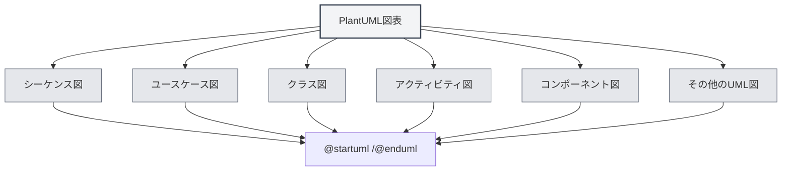

## サポートされる図表タイプ

<DataAnalysisDisplay mode="demo" />

### シーケンス図

シーケンス図を作成：

````markdown
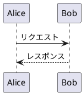
````

### ユースケース図

<OutlineTreeDisplay mode="demo" />

ユースケース図を作成：

````markdown
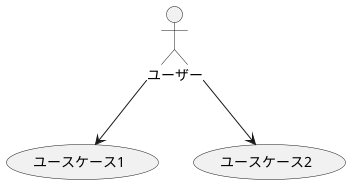
````

### クラス図

<ChartGenerationDisplay mode="demo" />

クラス図を作成：

````markdown
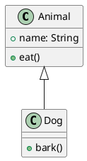
````

### アクティビティ図

<DataAnalysisDisplay mode="demo" />

アクティビティ図を作成：

````markdown
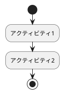
````

### コンポーネント図

<OutlineTreeDisplay mode="demo" />

コンポーネント図を作成：

````markdown
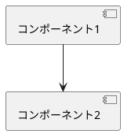
````

### 配置図

<ChartGenerationDisplay mode="demo" />

配置図を作成：

````markdown
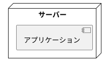
````

### 状態図

<DataAnalysisDisplay mode="demo" />

状態図を作成：

````markdown
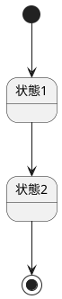
````

## シーケンス図の詳細

<OutlineTreeDisplay mode="demo" />

### 参加者

参加者を定義：

````markdown
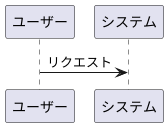
````

### メッセージタイプ

異なるタイプのメッセージを使用できます：

- **同期メッセージ**：`->`
- **非同期メッセージ**：`-->`
- **返信メッセージ**：`<-` または `<--`
- **自己呼び出し**：`->` を自分自身に向ける

### アクティベーションボックス

アクティベーションボックスを追加：

````markdown
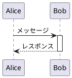
````

## クラス図の詳細

<ChartGenerationDisplay mode="demo" />

### クラス定義

クラスを定義：

````markdown
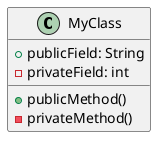
````

### クラス関係

クラス関係を表現：

- **継承**：`<|--` または `--|>`
- **実装**：`<|..` または `..|>`
- **コンポジション**：`*--` または `--*`
- **アグリゲーション**：`o--` または `--o`
- **関連**：`-->` または `<--`
- **依存**：`..>` または `<..`

### インターフェースと抽象クラス

インターフェースと抽象クラスを定義：

````markdown
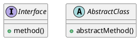
````

## アクティビティ図の詳細

### 基本アクティビティ

アクティビティを定義：

````markdown

````

### 判断ノード

判断を追加：

````markdown
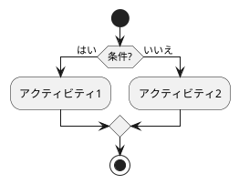
````

### ループ

ループを追加：

````markdown
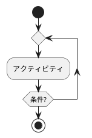
````

## スタイルとテーマ

### テーマ設定

テーマを設定できます：

````markdown
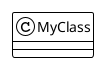
````

### 色設定

色を設定できます：

````markdown
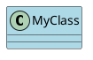
````

## レンダリング方法

### メインプロセスレンダリング

PlantUMLはメインプロセスでレンダリングします：

- **サーバーサイドレンダリング**：メインプロセスで図表をレンダリング
- **SVG形式**：デフォルトでSVG形式にレンダリング
- **PNG形式**：PNG形式に変換可能

### レンダリング性能

PlantUMLレンダリングの特徴：

- **レンダリング速度**：メインプロセスレンダリングは比較的高速
- **リソース使用**：レンダリング時はメインプロセスリソースを占有
- **エラー処理**：レンダリングエラーはコンソールに表示

## 注意事項

### 構文に関する注意事項

1. **必須マークアップ**：`@startuml` と `@enduml` を含める必要があります
2. **構文規約**：PlantUML公式構文規約に従ってください
3. **日本語サポート**：日本語を使用できますが、英語識別子の使用を推奨します
4. **バージョン互換性**：PlantUMLのバージョン互換性に注意してください

### レンダリングに関する注意事項

1. **コード抽出**：XMLタグを含まないよう、コード抽出が正しいことを確認してください
2. **構文エラー**：構文エラーがある場合、図表はレンダリングされません
3. **複雑な図表**：過度に複雑な図表はレンダリング性能に影響する可能性があります
4. **エクスポート互換性**：エクスポート時に図表が対象形式で正常に表示されることを確認してください

## ベストプラクティス

1. **構文規約**：PlantUML公式構文規約に従ってください
2. **コードの明確さ**：図表コードを明確で読みやすく保ってください
3. **マークアップの使用**：常に `@startuml` と `@enduml` マークアップを使用してください
4. **レンダリングテスト**：編集後に図表のレンダリング効果をテストしてください
5. **ドキュメント参照**：PlantUML公式ドキュメントを参照してください

## 関連ドキュメント

- [[charts.introduction|図表機能紹介]]
- [[charts.mermaid|Mermaid図表]]
- [[charts.echarts|ECharts図表]]