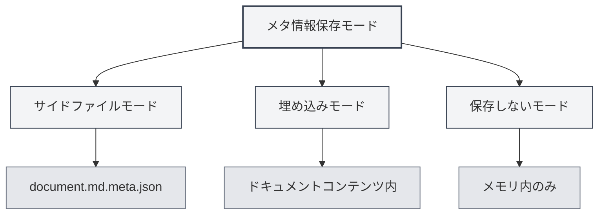

# ドキュメントメタ情報

## 概要

ドキュメントメタ情報は、タイトル、著者、説明、キーワードなど、ドキュメントの基本属性を記述するデータです。メタ情報を適切に設定することは、ドキュメントの管理と検索に役立ち、またドキュメントをエクスポートする際にはこれらの情報が自動的に含まれます。

MetaDocは各ドキュメントに対してメタ情報を設定することをサポートしており、この情報はサイドファイルに保存したり、ドキュメントコンテンツに埋め込んだり、あるいは保存しないこともできます。また、AIを使用してメタ情報を自動生成することも可能です。

<MetaInfoPanel mode="demo" :meta='{"title": "", "author": "", "description": "", "keywords": []}' :outlineJson='""' />

## メタ情報の紹介

### タイトル（Title）

ドキュメントのタイトルで、通常はドキュメントの上部やタブに表示されます。

- **用途**：ドキュメントの主な内容を識別する
- **表示位置**：タブタイトル、エクスポートしたドキュメントのタイトルページ
- **例**：`"MetaDocユーザーマニュアル"`

<MetaInfoPanel mode="demo" :meta='{"title": "MetaDocユーザーマニュアル", "author": "", "description": "", "keywords": []}' :outlineJson='""' />

### 著者（Author）

ドキュメントの著者または作成者です。

- **用途**：ドキュメントの作成者を識別する
- **表示位置**：エクスポートしたドキュメントの著者情報
- **例**：`"山田太郎"`

<MetaInfoPanel mode="demo" :meta='{"title": "サンプルドキュメント", "author": "山田太郎", "description": "", "keywords": []}' :outlineJson='""' />

### 説明（Description）

ドキュメントの簡単な説明または要約です。

- **用途**：ドキュメントの主な内容を要約する
- **表示位置**：エクスポートしたドキュメントの要約部分
- **例**：`"このドキュメントはMetaDocの基本的な使用方法を紹介します"`

<MetaInfoPanel mode="demo" :meta='{"title": "サンプルドキュメント", "author": "著者名", "description": "このドキュメントはMetaDocの基本的な使用方法を紹介します", "keywords": []}' :outlineJson='""' />

### キーワード（Keywords）

ドキュメントのキーワードリストで、ドキュメントの検索と分類に使用されます。

- **用途**：ドキュメントの検索と分類を支援する
- **形式**：文字列の配列
- **例**：`["MetaDoc", "ユーザーマニュアル", "ドキュメント編集"]`

<MetaInfoPanel mode="demo" :meta='{"title": "サンプルドキュメント", "author": "著者名", "description": "ドキュメントの説明", "keywords": ["MetaDoc", "ユーザーマニュアル", "ドキュメント編集"]}' :outlineJson='""' />

## メタ情報の設定

### 手動設定

1. **メタ情報パネルを開く**：

   - エディタのツールバーにある「メタ情報」ボタンをクリック
   - または、設定されている場合はショートカットキーを使用

2. **メタ情報を入力する**：

   - **タイトル**：ドキュメントのタイトルを入力
   - **著者**：著者名を入力
   - **説明**：ドキュメントの説明を入力（複数行対応）
   - **キーワード**：キーワードを入力。複数のキーワードはカンマで区切る

3. **保存**：「保存」ボタンをクリックしてメタ情報を保存

メタ情報パネルのインターフェースは以下の通りです：

<MetaInfoPanel mode="demo" :meta='{"title": "サンプルドキュメント", "author": "著者名", "description": "ドキュメントの説明", "keywords": ["キーワード1", "キーワード2"]}' :outlineJson='""' />

### 一括設定

すべてのメタ情報フィールドを一度に設定できます：

1. メタ情報パネルを開く
2. すべてのフィールドに入力する
3. 「保存」ボタンをクリック

<MetaInfoPanel mode="demo" :meta='{"title": "一括設定サンプル", "author": "管理者", "description": "すべてのメタ情報フィールドを一括設定する例", "keywords": ["一括", "設定", "メタ情報"]}' :outlineJson='""' />

### メタ情報の編集

設定済みのメタ情報はいつでも変更できます：

1. メタ情報パネルを開く
2. 変更が必要なフィールドを修正する
3. 「保存」ボタンをクリック

変更されたメタ情報は即座に有効になり、次回ドキュメントを保存する際に保存されます。

## メタ情報保存モード

MetaDocは3つのメタ情報保存モードをサポートしており、[[settings.basic|基本設定]]で設定できます：



### サイドファイルモード

メタ情報は、ドキュメントと同じ名前のサイドファイル（`.meta.json`）に保存されます。

<MetaInfoPanel mode="demo" :meta='{"title": "サイドファイルモード例", "author": "システム", "description": "メタ情報は.meta.jsonファイルに保存されます", "keywords": ["サイドファイル", "メタデータ"]}' :outlineJson='""' />

**利点**：

- 元のドキュメント内容を変更しない
- サイドファイルを削除すればいつでも元のドキュメントに戻せる
- バージョン管理に適している

**欠点**：

- 追加のファイルが生成される
- ドキュメントを移動する際はサイドファイルも同時に移動する必要がある

**例**：

- ドキュメント：`document.md`
- メタ情報ファイル：`document.md.meta.json`

### 埋め込みモード

メタ情報はドキュメントコンテンツ内（Markdownのfront matterやLaTeXのコメント）に埋め込まれます。

<MetaInfoPanel mode="demo" :meta='{"title": "埋め込みモード例", "author": "埋め込み著者", "description": "メタ情報はドキュメント内に埋め込まれます", "keywords": ["埋め込み", "front matter"]}' :outlineJson='""' />

**利点**：

- ドキュメントとメタ情報が一体となっており、管理が容易
- 追加のファイルが不要

**欠点**：

- 元のドキュメント内容を変更する
- 一部の形式では埋め込みをサポートしていない場合がある

**例**（Markdown）：

```markdown
---
title: ドキュメントタイトル
author: 著者名
description: ドキュメントの説明
keywords: [キーワード1, キーワード2]
---

ドキュメント内容...
```

### 保存しないモード

メタ情報は編集時にのみ使用され、ファイルには保存されません。

<MetaInfoPanel mode="demo" :meta='{"title": "保存しないモード", "author": "一時", "description": "メタ情報はメモリ内にのみ保存されます", "keywords": ["一時", "保存しない"]}' :outlineJson='""' />

**利点**：

- 元のドキュメントに影響を与えない
- 追加のファイルを生成しない

**欠点**：

- ドキュメントを閉じるとメタ情報は失われる
- エクスポート時にメタ情報を使用できない

## AIによるメタ情報生成

MetaDocは、AIを使用してドキュメントメタ情報を自動生成することをサポートしており、ドキュメントの内容とアウトライン構造に基づいてインテリジェントに生成します。

### 個別フィールドの生成

特定のフィールドのメタ情報を生成します：

1. メタ情報パネルを開く
2. フィールド横の「AI生成」ボタンをクリック
3. AIの生成結果を待つ
4. 生成された内容を確認し、受け入れるか再生成する

### 全フィールドの生成

すべてのメタ情報フィールドを一度に生成します：

1. メタ情報パネルを開く
2. 「AIで全て生成」ボタンをクリック
3. AIの生成結果を待つ
4. 生成された内容を確認し、受け入れる、修正する、または再生成する

<MetaInfoPanel mode="demo" :meta='{"title": "AI生成例", "author": "AIアシスタント", "description": "AIで自動生成されたメタ情報", "keywords": ["AI", "自動生成", "インテリジェント"]}' :outlineJson='""' />

### 生成の原理

AIによるメタ情報生成は以下に基づいています：

- **ドキュメントアウトライン**：ドキュメントの見出し構造を分析
- **ドキュメント内容**：ドキュメントの主な内容を分析
- **文脈理解**：ドキュメントのテーマと目的を理解

生成される結果はドキュメント内容に応じて自動的に調整され、メタ情報が正確にドキュメント内容を反映することを保証します。

## エクスポートにおけるメタ情報の適用

エクスポートされたドキュメントには自動的にメタ情報が含まれます：

### PDFエクスポート

- **タイトル**：PDFドキュメントのプロパティに表示
- **著者**：PDFドキュメントのプロパティに表示
- **説明**：PDFの主題（Subject）として使用
- **キーワード**：PDFドキュメントのプロパティに表示

### DOCXエクスポート

- **タイトル**：Wordドキュメントのプロパティに表示
- **著者**：Wordドキュメントのプロパティに表示
- **説明**：Wordの要約として使用
- **キーワード**：Wordドキュメントのプロパティに表示

### HTMLエクスポート

- **タイトル**：HTMLの`<title>`タグに表示
- **著者**：HTMLの`<meta>`タグに表示
- **説明**：HTMLの`<meta>`タグに表示
- **キーワード**：HTMLの`<meta>`タグに表示

## 使用上のヒント

### タイトルの適切な設定

- **簡潔で明確**：タイトルはドキュメント内容を簡潔に要約すべき
- **長すぎない**：タイトルが長すぎると表示効果に影響する
- **キーワードを使用**：タイトルに重要なキーワードを含める

### キーワードの設定

- **適切な数**：3〜10個のキーワードを設定することを推奨
- **関連性が高い**：キーワードはドキュメント内容と高い関連性を持つべき
- **重複を避ける**：重複または類似したキーワードの設定を避ける

### AI生成の最適化

- **生成後の確認**：AIが生成した内容は人手での確認が必要
- **適切な修正**：実際の必要に応じて生成内容を修正する
- **複数回生成**：満足できない場合は、複数回生成して最良の結果を選択する

<MetaInfoPanel mode="demo" :meta='{"title": "メタ情報完全例", "author": "デモユーザー", "description": "完全なメタ情報設定例を表示", "keywords": ["メタ情報", "設定", "例"]}' :outlineJson='""' />

## よくある質問

### Q: メタ情報はどこに保存されますか？

A: 保存モードによって異なります。メタ情報はサイドファイル、ドキュメントコンテンツ内に埋め込まれる、または保存されない場合があります。設定で保存モードを構成できます。

### Q: メタ情報を削除するにはどうすればよいですか？

A: メタ情報パネルですべてのフィールドを空にして保存すると、メタ情報が削除されます。

### Q: AIが生成した内容が正確でない場合はどうすればよいですか？

A: AIが生成した内容は参考情報です。手動で修正するか、再生成してください。生成後に確認し調整することをお勧めします。

### Q: メタ情報はドキュメント内容に影響しますか？

A: 埋め込みモードを使用する場合、メタ情報はドキュメント内容に埋め込まれます。サイドファイルモードまたは保存しないモードを使用する場合、元のドキュメント内容には影響しません。

### Q: エクスポート時にメタ情報は失われますか？

A: 失われません。エクスポート時には自動的にメタ情報が含まれ、エクスポートしたドキュメントのプロパティに表示されます。

## 関連ドキュメント

- [[core.file-operations|ファイル操作]]
- [[core.export|エクスポート機能]]
- [[settings.basic|基本設定]]
- [[ai.assistants|AIアシスタント機能]]