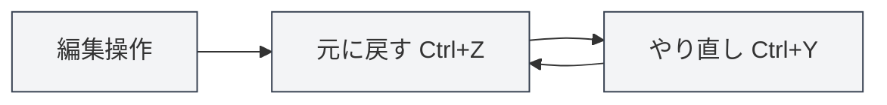
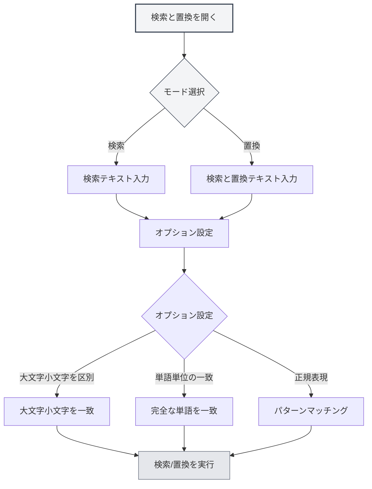

# エディタ基本操作

## 概要

エディタ基本操作は、MetaDocでドキュメントを編集するための基本的なスキルです。これらの操作を習得することで、編集効率を大幅に向上させることができます。

MetaDocのエディタは、元に戻す、やり直し、コピー、貼り付け、切り取り、すべて選択、検索と置換などの標準的なテキスト編集操作をサポートしています。

<SearchReplaceMenu mode="demo" :position='{"top": 100, "left": 200}' :adapter='null' />

<MenuItemsDemo mode="demo" :items='[{"id": "edit"}]' />

## 元に戻すとやり直し

### 元に戻す操作

直前の編集操作を取り消します：

- **ショートカットキー**：`Ctrl+Z`（Windows/Linux）または `Cmd+Z`（macOS）
- **メニュー**：「編集」→「元に戻す」をクリック

連続して複数回の操作を取り消すことができ、ドキュメントの初期状態に戻るまで繰り返せます。

### やり直し操作

<MenuItemsDemo mode="demo" :items='[{"id": "edit"}]' />

取り消した操作を復元します：

- **ショートカットキー**：`Ctrl+Y` または `Ctrl+Shift+Z`（Windows/Linux）または `Cmd+Shift+Z`（macOS）
- **メニュー**：「編集」→「やり直し」をクリック

やり直し操作は、元に戻した操作と逆の順序で復元されます。

## コピー、貼り付け、切り取り

<MenuItemsDemo mode="demo" :items='[{"id": "edit"}]' />

### コピー

選択したテキストをクリップボードにコピーします：

- **ショートカットキー**：`Ctrl+C`（Windows/Linux）または `Cmd+C`（macOS）
- **メニュー**：「編集」→「コピー」をクリック
- **右クリックメニュー**：テキストを選択後、右クリックで「コピー」を選択

### 貼り付け

<MenuItemsDemo mode="demo" :items='[{"id": "edit"}]' />

クリップボードの内容を現在位置に貼り付けます：

- **ショートカットキー**：`Ctrl+V`（Windows/Linux）または `Cmd+V`（macOS）
- **メニュー**：「編集」→「貼り付け」をクリック
- **右クリックメニュー**：右クリックで「貼り付け」を選択

貼り付け操作は、内容をカーソル位置に挿入します。すでにテキストが選択されている場合は、選択された内容を置き換えます。

### 切り取り

<MenuItemsDemo mode="demo" :items='[{"id": "edit"}]' />

選択したテキストをクリップボードに切り取ります（元の位置の内容を削除）：

- **ショートカットキー**：`Ctrl+X`（Windows/Linux）または `Cmd+X`（macOS）
- **メニュー**：「編集」→「切り取り」をクリック
- **右クリックメニュー**：テキストを選択後、右クリックで「切り取り」を選択

切り取り操作は、元の位置のテキストを削除し、クリップボードに保存します。その後、他の位置に貼り付けることができます。

## すべて選択

<MenuItemsDemo mode="demo" :items='[{"id": "edit"}]' />

ドキュメント内のすべての内容を選択します：

- **ショートカットキー**：`Ctrl+A`（Windows/Linux）または `Cmd+A`（macOS）
- **メニュー**：「編集」→「すべて選択」をクリック

すべて選択後、以下の操作が可能です：

- ドキュメント全体の内容をコピー
- ドキュメント全体の内容を削除
- すべてのテキストを統一してフォーマット

## 検索と置換

### 検索

<SearchReplaceMenu mode="demo" :position='{"top": 100, "left": 200}' :adapter='null' />

ドキュメント内で指定されたテキストを検索します：

- **ショートカットキー**：`Ctrl+F`（Windows/Linux）または `Cmd+F`（macOS）
- **メニュー**：「編集」→「検索」をクリック

検索機能は以下をサポートします：

- **大文字小文字の区別**：大文字と小文字を区別して検索
- **単語単位の一致**：完全な単語のみ一致
- **正規表現**：正規表現を使用した高度な検索
- **ハイライト表示**：検索結果がドキュメント内でハイライト表示されます

### 置換

<SearchReplaceMenu mode="demo" :position='{"top": 100, "left": 200}' :adapter='null' />

テキストを検索して置換します：

- **ショートカットキー**：`Ctrl+H`（Windows/Linux）または `Cmd+H`（macOS）
- **メニュー**：「編集」→「検索と置換」をクリック

置換機能は以下をサポートします：

- **個別置換**：一致したテキストを一つずつ置換
- **すべて置換**：一致したすべてのテキストを一度に置換
- **置換プレビュー**：置換前に結果をプレビュー

### 検索と置換オプション

検索と置換ダイアログでは、以下のオプションが提供されます：

- **大文字小文字を区別**：大文字小文字が完全に一致するテキストのみ一致
- **単語単位の一致**：完全な単語のみ一致（単語の一部は一致しない）
- **正規表現**：正規表現を使用したパターンマッチング
- **循環検索**：ドキュメント末尾に到達したら自動的に先頭から検索を再開

検索と置換メニューのインターフェースは以下の通りです：

<SearchReplaceMenu mode="demo" :position='{"top": 100, "left": 200}' :adapter='null' />

## テキスト選択

### 基本選択

- **クリック**：クリック位置にカーソルを移動
- **ドラッグ**：開始位置から終了位置までのテキストを選択
- **ダブルクリック**：単語全体を選択
- **トリプルクリック**：行全体を選択

### 拡張選択

- **Shift+クリック**：クリック位置まで選択範囲を拡張
- **Ctrl+クリック**：複数の連続しない選択領域を追加（エディタがサポートする場合）
- **Alt+ドラッグ**：列選択モード（エディタがサポートする場合）

## カーソル移動

### 基本移動

- **方向キー**：上下左右にカーソルを移動
- **Home/End**：行頭/行末に移動
- **Ctrl+Home/End**：ドキュメントの先頭/末尾に移動
- **Page Up/Page Down**：ページを上/下にスクロール

### 単語移動

- **Ctrl+左/右矢印**：単語単位でカーソルを移動
- **Ctrl+上/下矢印**：段落単位で上/下に移動

## 削除操作

### 基本削除

- **Backspace**：カーソルの前の文字を削除
- **Delete**：カーソルの後の文字を削除
- **Ctrl+Backspace**：カーソルの前の単語全体を削除
- **Ctrl+Delete**：カーソルの後の単語全体を削除

## エディタの違い

MetaDocは主に2種類のエディタを提供します：

### Markdownエディタ（Vditor）

- リアルタイムプレビューをサポート
- フォーマットツールバーを提供
- 複数の編集モード（IR/WYSIWYG/SV）をサポート
- 詳細は[[markdown.editor|Markdownエディタ使用ガイド]]を参照

### LaTeXエディタ（Monaco）

- プロフェッショナルなコード編集体験
- シンタックスハイライトとオートコンプリート
- コード折りたたみをサポート
- 詳細は[[latex.editor|LaTeXエディタ使用ガイド]]を参照

両エディタの基本操作はほぼ同じですが、高度な機能には違いがあります。

## ショートカットキーリファレンス

### 共通ショートカットキー

| 操作     | Windows/Linux              | macOS         |
| -------- | -------------------------- | ------------- |
| 元に戻す | `Ctrl+Z`                   | `Cmd+Z`       |
| やり直し | `Ctrl+Y` または `Ctrl+Shift+Z` | `Cmd+Shift+Z` |
| コピー   | `Ctrl+C`                   | `Cmd+C`       |
| 貼り付け | `Ctrl+V`                   | `Cmd+V`       |
| 切り取り | `Ctrl+X`                   | `Cmd+X`       |
| すべて選択 | `Ctrl+A`                  | `Cmd+A`       |
| 検索     | `Ctrl+F`                   | `Cmd+F`       |
| 検索と置換 | `Ctrl+H`                 | `Cmd+H`       |

## 注意事項

1. **元に戻す履歴**：ドキュメントを閉じると元に戻す履歴はクリアされます。ドキュメントはこまめに保存することをお勧めします。
2. **クリップボード**：コピーや切り取りした内容はシステムのクリップボードに保存され、アプリケーションを閉じると失われる可能性があります。
3. **検索と置換**：正規表現を使用する際は、特殊文字のエスケープに注意してください。
4. **大規模ドキュメント**：大規模なドキュメントを処理する場合、検索と置換操作には時間がかかる場合があります。

## 関連ドキュメント

- [[core.file-operations|ファイル操作]]
- [[core.editor-settings|エディタ設定]]
- [[markdown.editor|Markdownエディタ使用ガイド]]
- [[latex.editor|LaTeXエディタ使用ガイド]]
