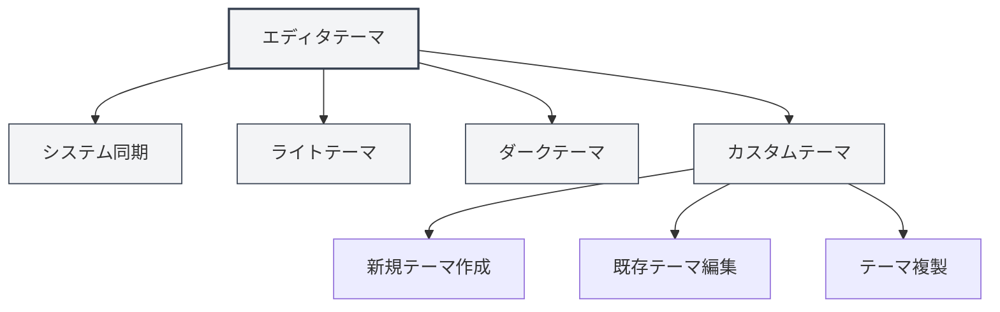
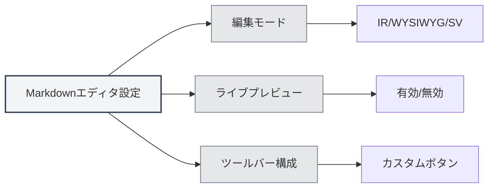

# エディタ設定

## 概要

エディタ設定では、テーマ、フォント、行番号表示など、エディタの外観と動作をカスタマイズできます。適切な設定は、編集体験と作業効率を向上させます。

エディタ設定は、グローバル設定とエディタ固有の設定に分かれています。グローバル設定はすべてのエディタに影響しますが、一部の設定は特定の種類のエディタ（MarkdownエディタやLaTeXエディタなど）にのみ適用される場合があります。

<MenuItemsDemo mode="demo" :items='[{"id": "settings"}]' />

## エディタテーマ

<MenuItemsDemo mode="demo" :items='[{"id": "settings"}]' />

### テーマタイプ

MetaDocは複数のテーマモードをサポートしています：

- **システム同期**：システムテーマ（ライト/ダーク）に自動的に追従
- **ライトテーマ**：常にライトテーマを使用
- **ダークテーマ**：常にダークテーマを使用
- **カスタムテーマ**：カスタムカラー設定を使用

### テーマ設定

<SettingThemeSection mode="demo" />

1.  設定ページを開く（メニューの「設定」をクリック、またはショートカットキーを使用）
2.  「テーマ設定」セクションに移動
3.  お好みのテーマを選択

上部メニューバーから設定にアクセスできます：

上部メニューバーの「設定」メニューをクリックすると、設定パネルが開き、エディタテーマ、コンテンツテーマ、コードテーマなどのオプションを設定できます。

<MenuItemsDemo mode="demo" :items='[{"id": "settings"}]' />

テーマ設定は即座に反映され、アプリケーションの再起動は不要です。

### カスタムテーマ

<SettingThemeSection mode="demo" />

カスタムテーマの作成と編集が可能です：

1.  テーマ設定ページで「新規テーマ」をクリック
2.  テーマ名とテーマカラーを設定
3.  保存後、使用可能になります

カスタムテーマは以下をサポートします：

-   **編集**：テーマ名とカラーの変更
-   **複製**：既存テーマを新しいテーマの起点として複製
-   **削除**：不要なカスタムテーマを削除

## コンテンツテーマ

<SettingThemeSection mode="demo" />

コンテンツテーマは、ドキュメントプレビュー領域の表示スタイルを制御します：

-   **自動**：グローバルテーマに基づいて自動選択
-   **ライト**：常にライトプレビュースタイルを使用
-   **ダーク**：常にダークプレビュースタイルを使用

コンテンツテーマは主に、MarkdownプレビューとPDFプレビューの表示効果に影響します。

## コードテーマ

<SettingThemeSection mode="demo" />

コードテーマは、コードブロックのシンタックスハイライトスタイルを制御します：

-   **自動**：グローバルテーマに基づいて自動選択
-   **プリセットテーマ**：プリセットされたコードテーマを選択（例：GitHub、Monokai、Solarizedなど）

コードテーマは以下に影響します：

-   Markdownコードブロックのシンタックスハイライト
-   LaTeXエディタのコードハイライト
-   コンソール出力の表示スタイル

## フォント設定

<SettingBasicSection mode="demo" />

### エディタフォント

エディタで使用するフォントは、システム設定で構成できます。デフォルトでは以下のような等幅フォントを使用します：

-   JetBrains Mono
-   Consolas
-   Courier New
-   Microsoft YaHei Mono

### フォントサイズ

-   **拡大**： `Ctrl+=` または `Ctrl+マウスホイール上`
-   **縮小**： `Ctrl+-` または `Ctrl+マウスホイール下`
-   **リセット**： `Ctrl+0` でデフォルトサイズにリセット

フォントサイズの調整は即座に反映されますが、設定には保存されません。

## 行番号表示

<SettingBasicSection mode="demo" />

### 行番号の表示/非表示

行番号表示設定は、エディタに行番号を表示するかどうかを制御します：

-   **有効**：行番号を表示し、コード位置の特定を容易にします
-   **無効**：行番号を非表示にし、より広い編集領域を得ます

### 行番号表示の設定

1.  設定ページを開く
2.  「エディタ設定」セクションで「行番号表示」を見つける
3.  トグルスイッチで行番号を有効または無効にする

行番号設定は以下に影響します：

-   LaTeXエディタ
-   プレーンテキストエディタ
-   コードプレビュー領域

注意：Markdownエディタ（Vditor）の行番号表示は、その自身の設定で制御されます。

## ミニマップ表示

ミニマップはエディタ右側のコード縮図で、ドキュメント内容の迅速な閲覧と位置特定を支援します。

### ミニマップの表示/非表示

ミニマップ表示設定：

-   **有効**：ミニマップを表示し、長文書の閲覧を容易にします
-   **無効**：ミニマップを非表示にし、より広い編集領域を得ます

### ミニマップ設定

ミニマップ設定は通常、エディタの右クリックメニューまたはツールバーにあります：

1.  エディタ内で右クリック
2.  「ミニマップ」または「Minimap」オプションを探す
3.  表示状態を切り替える

ミニマップ機能は主に以下に適用されます：

-   LaTeXエディタ（Monaco）
-   プレーンテキストエディタ（Monaco）

## エディタ固有の設定

### Markdownエディタ設定

Markdownエディタ（Vditor）の固有設定：

-   **編集モード**：IRモード、WYSIWYGモード、SVモード
-   **ライブプレビュー**：ライブプレビュー機能の有効/無効
-   **ツールバー構成**：ツールバーボタンのカスタマイズ

詳細は[[markdown.editor|Markdownエディタ使用ガイド]]を参照してください。

### LaTeXエディタ設定

LaTeXエディタ（Monaco）の固有設定：

-   **コード折りたたみ**：コード折りたたみ機能の有効/無効
-   **自動折り返し**：長い行の表示方法を制御
-   **文法チェック**：LaTeX文法チェックの有効/無効

詳細は[[latex.editor|LaTeXエディタ使用ガイド]]を参照してください。

## 設定同期

エディタ設定はローカル構成に保存され、以下が含まれます：

-   テーマ選択
-   行番号表示の好み
-   フォントサイズ（現在のセッション）
-   ミニマップ表示状態

設定はアプリケーション再起動後に自動的に復元されます。

## ショートカットキーリファレンス

### フォント調整

| 操作             | Windows/Linux | macOS        |
| ---------------- | ------------- | ------------ |
| フォント拡大     | `Ctrl+=`      | `Cmd+=`      |
| フォント縮小     | `Ctrl+-`      | `Cmd+-`      |
| フォントリセット | `Ctrl+0`      | `Cmd+0`      |
| マウスホイール   | `Ctrl+ホイール` | `Cmd+ホイール` |

## ベストプラクティス

1.  **テーマ選択**：

    -   長時間の編集にはダークテーマの使用を推奨し、目の疲れを軽減します
    -   印刷プレビュー時はライトテーマを使用し、より良い印刷効果を得ます

2.  **行番号表示**：

    -   コード記述時は行番号を有効にし、エラーの位置特定を容易にします
    -   プレーンテキスト編集時は行番号をオフにし、より広い編集領域を得ます

3.  **ミニマップ**：

    -   長文書編集時はミニマップを有効にし、ドキュメント構造を迅速に閲覧します
    -   短文書編集時はミニマップをオフにできます

4.  **フォントサイズ**：
    -   画面サイズと個人の習慣に応じてフォントサイズを調整します
    -   可読性と画面スペースのバランスを考慮し、14-16pxのフォントサイズの使用を推奨します

## 注意事項

1.  **テーマ同期**：「システム同期」を選択すると、テーマはシステム設定に従って自動的に切り替わります
2.  **設定範囲**：一部の設定は特定のエディタにのみ影響し、他のエディタには影響しません
3.  **パフォーマンス影響**：一部の機能（ライブプレビューなど）を有効にすると、編集パフォーマンスに影響する可能性があります
4.  **カスタムテーマ**：カスタムテーマの色は、アプリケーション全体の配色に影響します

## 関連ドキュメント

-   [[core.editor-basics|エディタ基本操作]]
-   [[settings.basic|基本設定]]
-   [[settings.theme|テーマ設定]]
-   [[markdown.editor|Markdownエディタ使用ガイド]]
-   [[latex.editor|LaTeXエディタ使用ガイド]]
