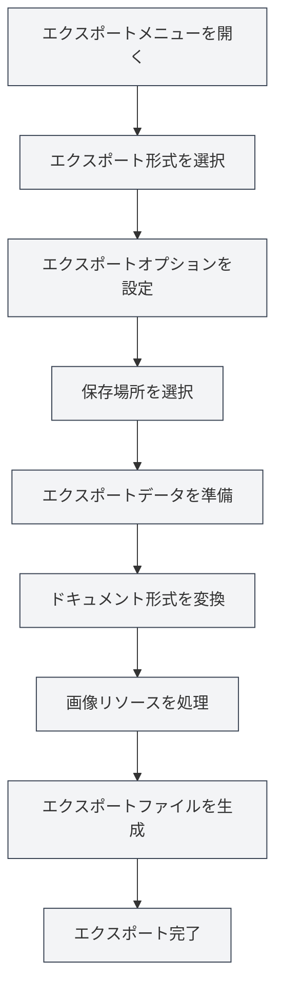

# エクスポート機能

## 概要

MetaDocは、PDF、HTML、DOCX、LaTeX、Markdown、JSONなど、ドキュメントを複数の形式にエクスポートすることをサポートしています。エクスポート機能は、ドキュメントの形式に応じて異なるエクスポートオプションを提供し、エクスポートされたドキュメントが元の書式とスタイルを保持することを保証します。

エクスポート機能は、ドキュメントのメタ情報（タイトル、著者、説明、キーワード）を自動的に含め、エクスポートプロセス中に画像、表、数式などの要素を処理します。

<MenuItemsDemo mode="demo" :items='[{"id": "file", "items": ["export"]}]' />

<MetaInfoPanel mode="demo" :meta='{"title": "エクスポート例", "author": "著者", "description": "ドキュメントの説明", "keywords": ["エクスポート", "PDF"]}' :outlineJson='""' />

<MenuItemsDemo mode="demo" :items='[{"id": "file", "items": ["export"]}]' />

<MetaInfoPanel mode="demo" :meta='{"title": "エクスポート形式", "author": "MetaDoc", "description": "サポートされているエクスポート形式の紹介", "keywords": ["エクスポート", "形式"]}' :outlineJson='""' />

## エクスポート形式のサポート

<MenuItemsDemo mode="demo" :items='[{"id": "file", "items": ["export"]}]' />

### Markdownドキュメントのエクスポート

Markdownドキュメント（`.md`）は以下の形式にエクスポートできます：

- **PDF**：印刷や共有に適しています
- **HTML**：ウェブページでの表示に適しています
- **DOCX**：Wordでの編集に適しています
- **LaTeX**：学術論文に適しています
- **JSON**：プログラム処理に適しています

<MetaInfoPanel mode="demo" :meta='{"title": "LaTeXエクスポート", "author": "システム", "description": "LaTeXドキュメントのエクスポートオプション", "keywords": ["LaTeX", "エクスポート"]}' :outlineJson='""' />

### LaTeXドキュメントのエクスポート

LaTeXドキュメント（`.tex`）は以下の形式にエクスポートできます：

- **PDF**：LaTeXコンパイルにより生成されます
- **Markdown**：Markdown形式に変換されます
- **HTML**：HTML形式に変換されます
- **DOCX**：Word形式に変換されます

<MenuItemsDemo mode="demo" :items='[{"id": "file", "items": ["export"]}]' />

### JSONドキュメントのエクスポート

JSONドキュメント（`.json`）は以下の形式にエクスポートできます：

- **JSON**：JSON形式を保持します

## エクスポート操作

### 基本エクスポート

1. **エクスポートメニューを開く**：
   - メニューバーの「ファイル」→「エクスポート」をクリックします
   - または、ショートカットキーを使用します（設定されている場合）

ファイルメニュー内のエクスポートオプションは以下の通りです：

<MenuItemsDemo mode="demo" :items='[{"id": "file", "items": ["export"]}]' />

2. **エクスポート形式を選択**：

   - エクスポートメニューでターゲット形式を選択します
   - システムは現在のドキュメント形式に基づいて利用可能なエクスポートオプションを表示します

3. **保存場所を選択**：

   - ファイル保存ダイアログで保存場所を選択します
   - ファイル名を入力します（システムは自動的に正しい拡張子を追加します）

4. **エクスポート完了を待つ**：
   - エクスポート中はプログレスバーが表示されます
   - エクスポート完了後、成功メッセージが表示されます

### クイックエクスポート

よく使う形式については、ショートカットキーを使用して素早くエクスポートできます：

- **PDFとしてエクスポート**：`Ctrl+Shift+E`（設定されている場合）
- **HTMLとしてエクスポート**：メニューから選択します

## Markdownエクスポートの詳細

<MenuItemsDemo mode="demo" :items='[{"id": "file", "items": ["export"]}]' />

### PDFとしてエクスポート

PDFエクスポートは、MarkdownをPDF形式に変換します：

- **含まれる内容**：ドキュメント本文、画像、表、数式
- **含まれるメタ情報**：タイトル、著者、説明、キーワード
- **スタイル**：PDF専用のスタイルを使用し、印刷に適しています
- **画像処理**：画像はページに合わせて自動的にサイズ調整されます

**使用シナリオ**：

- ドキュメントの印刷
- 他者へのドキュメント共有
- アーカイブ保存

### HTMLとしてエクスポート

<MetaInfoPanel mode="demo" :meta='{"title": "HTMLエクスポート", "author": "システム", "description": "HTMLエクスポートの設定とオプション", "keywords": ["HTML", "エクスポート"]}' :outlineJson='""' />

HTMLエクスポートは、Markdownをウェブページ形式に変換します：

- **含まれる内容**：ドキュメント本文、画像、表、数式
- **含まれるメタ情報**：タイトル、著者、説明、キーワード（HTMLのmetaタグ内）
- **スタイル**：HTMLスタイルを使用し、ウェブページ表示に適しています
- **画像処理**：元のURLを保持、base64に変換、またはフォルダに保存するかを選択できます

**使用シナリオ**：

- ウェブサイトへの公開
- ブラウザでの閲覧
- 他者への共有

### DOCXとしてエクスポート

<MenuItemsDemo mode="demo" :items='[{"id": "file", "items": ["export"]}]' />

DOCXエクスポートは、MarkdownをWord形式に変換します：

- **含まれる内容**：ドキュメント本文、画像、表、数式
- **含まれるメタ情報**：タイトル、著者、説明、キーワード（Wordドキュメントのプロパティ内）
- **スタイル**：Wordスタイルを使用し、Word内でさらに編集できます
- **画像処理**：画像はWordドキュメントに埋め込まれます

**使用シナリオ**：

- Wordでのさらなる編集
- 他者との共同編集
- ドキュメントの提出

### LaTeXとしてエクスポート

<MetaInfoPanel mode="demo" :meta='{"title": "LaTeXエクスポート", "author": "学術", "description": "MarkdownからLaTeXへのエクスポート", "keywords": ["LaTeX", "学術"]}' :outlineJson='""' />

LaTeXエクスポートは、MarkdownをLaTeX形式に変換します：

- **含まれる内容**：ドキュメント本文、画像、表、数式
- **含まれるメタ情報**：タイトル、著者、説明、キーワード（LaTeXドキュメント内）
- **形式変換**：Markdown構文が対応するLaTeXコマンドに変換されます
- **数式**：LaTeX数式形式を保持します

**使用シナリオ**：

- 学術論文の執筆
- LaTeX形式が必要なシナリオ
- LaTeXドキュメントのさらなる編集

### JSONとしてエクスポート

<MenuItemsDemo mode="demo" :items='[{"id": "file", "items": ["export"]}]' />

JSONエクスポートは、ドキュメントをJSON形式で保存します：

- **含まれる内容**：ドキュメントの全データ（内容、メタ情報、アウトラインなど）
- **形式**：構造化されたJSONデータ
- **用途**：プログラム処理、データバックアップ

## LaTeXエクスポートの詳細

<MetaInfoPanel mode="demo" :meta='{"title": "LaTeXエクスポート詳細", "author": "システム", "description": "LaTeXドキュメントエクスポートの詳細説明", "keywords": ["LaTeX", "PDF", "エクスポート"]}' :outlineJson='""' />

### PDFとしてエクスポート

LaTeXドキュメントをPDFにエクスポートするには、LaTeXのコンパイルが必要です：

1. **LaTeXをコンパイル**：システムが自動的にLaTeXドキュメントをコンパイルします
2. **PDFを生成**：コンパイル成功後にPDFファイルが生成されます
3. **メタ情報を含む**：PDFドキュメントのプロパティにメタ情報が含まれます

**注意事項**：

- LaTeXディストリビューション（TeX Liveなど）のインストールが必要です
- コンパイルには時間がかかる場合があります
- コンパイルに失敗した場合、エラーメッセージが表示されます

### Markdownとしてエクスポート

LaTeXドキュメントはMarkdown形式に変換できます：

- **形式変換**：LaTeXコマンドがMarkdown構文に変換されます
- **数式**：LaTeX数式がMarkdown数式形式に変換されます
- **表**：LaTeX表がMarkdown表に変換されます

### HTMLとしてエクスポート

LaTeXドキュメントはHTML形式に変換できます：

- **形式変換**：LaTeXコマンドがHTMLタグに変換されます
- **数式**：MathJaxまたはKaTeXを使用してレンダリングされます
- **スタイル**：HTMLスタイルを使用して表示されます

### DOCXとしてエクスポート

LaTeXドキュメントはWord形式に変換できます：

- **形式変換**：LaTeXコマンドがWord形式に変換されます
- **数式**：Word数式形式に変換されます
- **表**：Word表形式に変換されます

## エクスポートオプション設定

### 画像処理オプション

エクスポート時に画像の処理方法を設定できます：

- **元のURLを保持**：画像の元のURLを保持します（HTMLエクスポートに適しています）
- **Base64に変換**：画像をドキュメントに埋め込みます（HTML、DOCXエクスポートに適しています）
- **フォルダに保存**：画像を指定したフォルダに保存します（HTMLエクスポートに適しています）

### PDFエクスポートオプション

PDFエクスポートは以下のオプションをサポートします：

- **ページサイズ**：A4、Letterなど
- **余白**：カスタム余白
- **フォント**：フォントとフォントサイズの選択
- **画質**：画質の調整

### HTMLエクスポートオプション

HTMLエクスポートは以下のオプションをサポートします：

- **スタイル**：HTMLスタイルテーマの選択
- **数式レンダリング**：MathJaxまたはKaTeXの選択
- **コードハイライト**：コードハイライトの有効化または無効化

## エクスポート進捗

エクスポート中はプログレスバーが表示されます：

- **準備段階**：エクスポートデータの準備
- **変換段階**：ドキュメント形式の変換
- **画像処理**：ドキュメント内の画像の処理
- **ファイル生成**：最終ファイルの生成

エクスポートに時間がかかる場合、以下のことができます：

- **進捗確認**：プログレスバーで現在の進捗を確認します
- **エクスポートキャンセル**：「キャンセル」ボタンをクリックしてエクスポート操作をキャンセルします

## エクスポートファイルの命名

エクスポートされるファイルは自動的に命名されます：

- **デフォルト名**：ドキュメントのタイトルまたはファイル名を使用します
- **自動拡張子**：エクスポート形式に基づいて自動的に拡張子が追加されます
- **カスタム名**：保存ダイアログでカスタム名を選択できます

## 使用上のヒント

### 適切な形式の選択

- **PDF**：印刷や正式な共有に適しています
- **HTML**：ウェブページ表示やオンライン閲覧に適しています
- **DOCX**：さらなる編集が必要なシナリオに適しています
- **LaTeX**：学術執筆やLaTeX形式が必要なシナリオに適しています

### 画像処理のアドバイス

- **HTMLエクスポート**：ウェブページ上で表示する場合は、Base64またはフォルダへの保存をお勧めします
- **DOCXエクスポート**：画像は自動的に埋め込まれるため、追加処理は不要です
- **PDFエクスポート**：画像は自動的にサイズ調整され、ページに適合するようになります

### バッチエクスポート

複数のドキュメントをエクスポートする必要がある場合：

1. ドキュメントを一つずつ開きます
2. 必要な形式にそれぞれエクスポートします
3. または、スクリプトを使用してバッチ処理します（上級ユーザー向け）

## よくある質問

### Q: エクスポートに失敗した場合はどうすればよいですか？

A: ドキュメントにエラーがないか確認し、すべての画像とリソースにアクセスできることを確認してください。PDFエクスポートに失敗した場合は、LaTeXコンパイルにエラーがないか確認してください。

### Q: エクスポートされたPDFの形式が正しくありません？

A: PDFエクスポートオプションの設定を確認し、ページサイズと余白を調整してください。ドキュメントの内容形式が正しいことを確認してください。

### Q: エクスポート後に画像が表示されません？

A: 画像パスが正しいか確認し、画像ファイルが存在することを確認してください。HTMLエクスポートの場合は、適切な画像処理方法を選択してください。

### Q: エクスポートスタイルをカスタマイズできますか？

A: 一部の形式ではカスタムスタイルをサポートしており、エクスポートオプションで設定できます。PDFおよびHTMLエクスポートはスタイルのカスタマイズをサポートしています。

### Q: エクスポートにはメタ情報が含まれますか？

A: はい、エクスポート時にはドキュメントのメタ情報（タイトル、著者、説明、キーワード）が自動的に含まれ、エクスポートされたドキュメントのプロパティに表示されます。

## 関連ドキュメント

- [[core.file-operations|ファイル操作]]
- [[core.document-metadata|ドキュメントメタ情報]]
- [[markdown.basics|Markdown構文]]
- [[latex.basics|LaTeX構文]]
- [[latex.compilation|LaTeXコンパイルとプレビュー]]