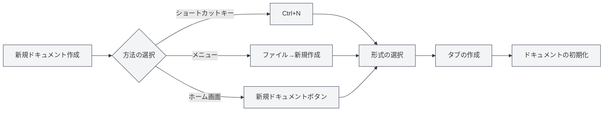
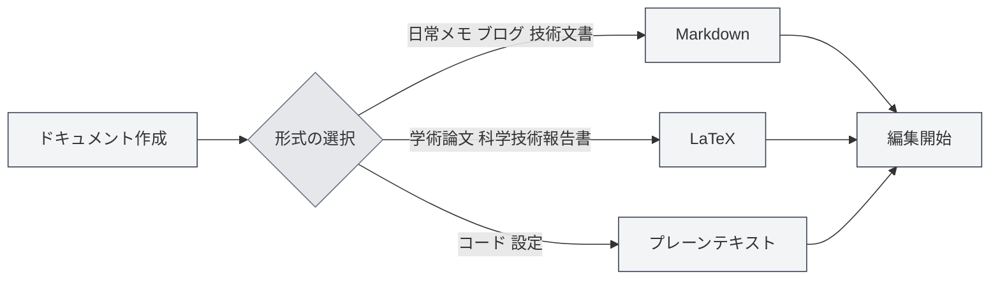
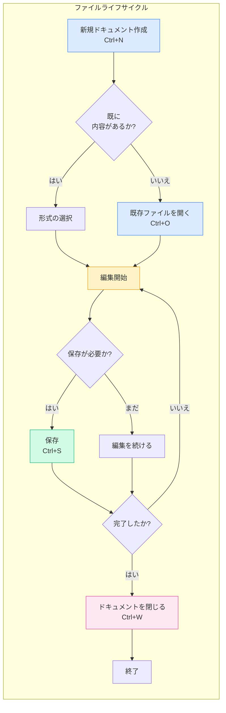

# ファイル操作

## 概要

ファイル操作はMetaDocの基本機能です。技術文書、学術論文、日常のメモ書きなど、どのような作成作業においても、ファイル操作を習熟することで創作プロセスがよりスムーズになります。この文書では、ドキュメントの作成、開く、保存、管理の方法について詳しく説明します。

## 新規ドキュメント作成

<MainTabs mode="demo" />

<MenuItemsDemo mode="demo" :items='[{"id": "file", "items": ["new"]}]' />

### 空白ドキュメントの作成

MetaDocでは、新しいドキュメントを作成するための複数の便利な方法を提供しています。現在の操作習慣に合わせて最適な方法を選択できます：

**方法1：ショートカットキー（最速）**

- `Ctrl+N` を押すと、すぐに新しいドキュメントが作成されます
- 編集中に素早く新規ドキュメントを作成するのに適しています

**方法2：ファイルメニュー**

- 左側のメニューバーの「ファイル」アイコンをクリックします
- 展開されたメニューから「新規作成」を選択します

**方法3：ホーム画面からのアクセス**

- ホーム画面で「新規ドキュメント」ボタンをクリックします
- アプリケーションを開いた直後に作成を開始するのに適しています

以下に、新規作成、開く、保存などの一般的な操作を含むファイルメニューのインターフェースを示します：

<MenuItemsDemo mode="demo" :items='[{"id": "file", "items": ["new", "open", "save", "save-as", "save-all", "close"]}]' />

<MainTabs mode="demo" />

**ドキュメント作成後の状態**：

新しいドキュメントを作成すると、以下のようになります：

- 上部に新しいタブが表示され、タイトルは「無題」と表示されます
- システムからドキュメント形式（Markdown、LaTeX、またはプレーンテキスト）の選択を求められます
- この時点ではドキュメントはメモリ上にのみ存在し、保存して初めてディスクに保持されます

### ドキュメント形式の選択

ドキュメントを作成する際には、ドキュメント形式を選択する必要があります。異なる形式は異なるシナリオに適しています：

**Markdown (.md)** —— 最も一般的に使用される軽量形式

- 適しているもの：日常のメモ、ブログ記事、技術文書、プロジェクト文書
- 利点：シンタックスがシンプル、読みやすい、エクスポート形式が豊富
- 使用例：会議の要点記録、技術ブログ執筆、学習ノートの整理

**LaTeX (.tex)** —— 専門的な学術組版形式

- 適しているもの：学術論文、学位論文、科学技術報告書、数学文書
- 利点：美しい組版、数式サポートが充実、目次と参考文献の自動生成
- 使用例：研究論文の執筆、数学教科書の作成、学術発表の準備

**プレーンテキスト (.txt)** —— 最もシンプルなテキスト形式

- 適しているもの：コードスニペット、設定ファイル、一時的なメモ
- 利点：汎用性が高い、あらゆるエディタで開ける
- 使用例：コードスニペットの保存、一時的な情報の記録

## ドキュメントを開く

<MenuItemsDemo mode="demo" :items='[{"id": "file", "items": ["open"]}]' />

### 既存ファイルを開く

1.  **ショートカットキー方式**：`Ctrl+O` を押してファイル選択ダイアログを開きます
2.  **メニュー方式**：「ファイル」→「開く」をクリックします
3.  **ホーム画面方式**：ホーム画面で「ファイルを開く」ボタンをクリックします

### サポートされているファイル形式

MetaDocは以下の形式のファイルを開くことができます：

- `.md` - Markdownドキュメント
- `.tex` - LaTeXドキュメント
- `.txt` - プレーンテキストファイル
- `.json` - JSON形式ファイル

### 最近開いたファイルリスト

ホーム画面には最近開いたドキュメントのリストが表示され、素早くアクセスできます：

- 最近のドキュメントカードをクリックするだけで素早く開けます
- 右クリックで最近のドキュメント履歴を削除できます
- 最大12個の最近のドキュメントを表示します

### ファイル関連付け

MetaDocはファイル関連付け機能をサポートしています：

- システム上の `.md` または `.tex` ファイルをダブルクリックすると、自動的にMetaDocで開きます
- ファイルが他のウィンドウですでに開かれている場合は、他のウィンドウで開かれていることを通知します

## ドキュメントの保存

<MenuItemsDemo mode="demo" :items='[{"id": "file", "items": ["save", "save-as", "save-all"]}]' />

### 現在のドキュメントを保存する

こまめに保存する習慣を身につけることで、予期せぬ状況による作業の損失を防ぐことができます。

**保存方法**：

- **ショートカットキー**（推奨）：`Ctrl+S` —— 最も一般的な保存方法で、キーボードから手を離さずに操作できます
- **メニュー操作**：「ファイル」メニュー →「保存」をクリックします

**初回保存**：
ドキュメントが新規作成の場合、最初の保存時には「名前を付けて保存」ダイアログが表示され、以下の操作が必要です：

1.  保存場所を選択します（例：「ドキュメント」フォルダ）
2.  ファイル名を入力します（例：「プロジェクト計画.md」）
3.  「保存」ボタンをクリックします

**既に保存済みのドキュメントの更新保存**：
ドキュメントが以前に保存されている場合、`Ctrl+S` を押すとダイアログを表示せずに直接元のファイルを上書きします。

### 名前を付けて保存 —— ドキュメントのコピーを作成する

元のドキュメントを保持しながら新しいバージョンを作成する必要がある場合、「名前を付けて保存」機能を使用します。

**使用シナリオ**：

- ドキュメントを変更する前にバックアップコピーを作成する
- ドキュメントを別の場所に保存する
- 異なるファイル名でドキュメントの異なるバージョンを保存する

**操作方法**：

- **ショートカットキー**：`Ctrl+Shift+S`
- **メニュー**：「ファイル」→「名前を付けて保存」をクリックします

**例**：
「レポートv1.md」を編集中で、大幅な変更を行う前にバックアップを保存したい場合：

1.  `Ctrl+Shift+S` を押します
2.  新しいファイル名「レポートv1_バックアップ.md」を入力します
3.  保存をクリックします
4.  元のドキュメントの編集を続け、安心して変更を加えます

### すべて保存 —— すべてのドキュメントを一括保存する

複数のドキュメントを同時に開いている場合、「すべて保存」機能を使用してすべてのドキュメントを一度に保存できます。

**操作方法**：

- **ショートカットキー**：`Ctrl+K S`（最初に `Ctrl+K` を押し、次に `S` を押します）
- **メニュー**：「ファイル」→「すべて保存」をクリックします

**使用シナリオ**：

- 作業終了時に開いているすべてのドキュメントを素早く保存する
- すべての変更が保存されていることを確認する

### 自動保存 —— システムによる保存

MetaDocは自動保存機能をサポートしており、作成に集中している間に自動的にドキュメントを保存します。

**設定方法**：
[[settings.basic|基本設定]] に移動し、「自動保存」オプションを見つけて、適切な時間間隔を選択します：

- **オフ**：保存タイミングを手動で制御します
- **1分**：最も安全ですが、ディスク書き込みが増加します
- **5分**：バランスの取れた選択肢（推奨）
- **10分/30分/1時間**：長いドキュメントに適しており、保存頻度を減らします

**動作原理**：

- 自動保存はバックグラウンドで静かに実行され、編集を中断しません
- 自動保存時には、タブ上の「未保存」マーカーが消えます
- 自動保存の影響を受けずに、いつでも手動で保存（`Ctrl+S`）できます

**推奨事項**：

- 重要なドキュメントについては、5分間隔の自動保存を有効にすることをお勧めします
- 自動保存を有効にしていても、重要なポイント（例：章の完了）では手動での保存をお勧めします

## ファイルを閉じる

<MainTabs mode="demo" />

### 現在のタブを閉じる

- **ショートカットキー**：`Ctrl+W`
- **タブの閉じるボタンをクリック**：タブの右側にある × ボタンをクリックします

### 閉じる前の確認

ドキュメントに未保存の変更がある場合、閉じる前に確認が表示されます：

- **保存**：変更を保存して閉じます
- **保存しない**：変更を破棄して閉じます
- **キャンセル**：閉じる操作をキャンセルします

### 閉じたタブを再度開く

- **ショートカットキー**：`Ctrl+Shift+T`

最近閉じたタブを復元できます（最大20個まで復元可能）。

## 複数タブ管理

<MainTabs mode="demo" />

MetaDocは複数のドキュメントを同時に開くことをサポートしており、各ドキュメントは独立したタブに表示されます：

タブバーには開いているすべてのドキュメントが表示され、切り替え、閉じる、ドラッグなどの操作をサポートします：

<MainTabs mode="demo" />

- **タブの切り替え**：`Ctrl+Tab` で次のタブに切り替え、`Ctrl+Shift+Tab` で前のタブに切り替えます
- **ドラッグによる並べ替え**：タブをドラッグして順序を変更できます
- **タブの固定**：タブを右クリックして「固定」を選択すると、固定されたタブは常に左側に表示され、閉じることができなくなります

タブ操作の詳細については、[[core.multi-tab|複数タブ管理]] を参照してください。

## ファイル状態表示

タブにはドキュメントの状態が表示されます：

- **未保存**：タブタイトルの横にドット（●）が表示され、未保存の変更があることを示します
- **保存済み**：特別なマーカーはありません
- **読み取り専用**：ロックアイコンが表示され、ファイルが読み取り専用モードであることを示します

## 注意事項

1.  **ファイルパス**：ファイルを保存する際、十分なディスク空き容量と書き込み権限があることを確認してください
2.  **ファイル形式**：保存時には適切なファイル形式を選択し、形式の互換性の問題を避けてください
3.  **バックアップ**：重要なドキュメントは定期的にバックアップすることをお勧めします。「名前を付けて保存」機能を使用してコピーを作成できます
4.  **ファイル競合**：ファイルが外部で変更された場合、MetaDocはそれを検出し、競合の処理を促します

## 関連ドキュメント

- [[core.editor-basics|エディタ基本操作]]
- [[core.multi-tab|複数タブ管理]]
- [[core.document-metadata|ドキュメントメタ情報]]
- [[core.export|エクスポート機能]]
- [[settings.basic|基本設定]]