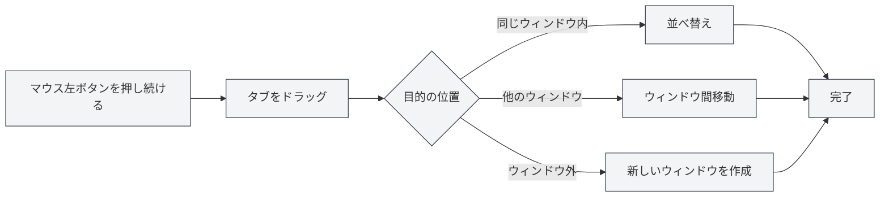

# マルチタブ管理

## 概要

MetaDocはマルチタブ管理をサポートしており、複数のドキュメントを同時に開くことができます。各ドキュメントは独立したタブに表示されます。タブ操作を習得することで、作業効率を大幅に向上させることができます。

タブ管理には、新規作成、切り替え、閉じる、ドラッグによる並べ替え、固定などの機能があり、複数のドキュメントを柔軟に整理・管理することができます。

<MainTabs mode="demo" />

<AIChat mode="demo" />

<KnowledgeBase mode="demo" />

<ProofreadView mode="demo" />

<GraphWindow mode="demo" />

<OcrWindow mode="demo" />

<DataAnalysisWindow mode="demo" />

<AgentView mode="demo" />

<MenuItemsDemo mode="demo" :items='[{"id": "file", "items": ["new", "open", "save"]}]' />

<ViewMenuItemsDemo mode="demo" :items='["editor", "outline"]' />

<Outline mode="demo" />

<ResizableDivider mode="demo" />

<TitleMenu mode="demo" title="タブ例" :position='{"top": 100, "left": 200}' path="1" :tree='{}' />

## 新しいタブを作成

### 新規タブの作成

新しいタブを作成する方法はいくつかあります：

1.  **ショートカットキー**： `Ctrl+T` を押すと、新しいタブを素早く作成できます。
2.  **ボタンをクリック**： タブバーの右側にある"+"ボタンをクリックします。
3.  **メニュー**： 「ファイル」→「新規作成」をクリックします。

タブバーには開いているすべてのドキュメントが表示され、新規作成、切り替え、閉じるなどの操作がサポートされています：

<MainTabs mode="demo" />

新しく作成されたタブは空白のドキュメントを開き、ドキュメント形式（Markdown/LaTeX/プレーンテキスト）を選択できます。

### ファイルからタブを作成

ファイルを開くと、自動的に新しいタブが作成されます：

1.  **ショートカットキー**： `Ctrl+O` を押してファイル選択ダイアログを開きます。
2.  **メニュー**： 「ファイル」→「開く」をクリックします。
3.  **ホーム画面**： ホーム画面で「ファイルを開く」ボタンをクリックします。

開いたファイルは新しいタブに表示されます。

## タブの切り替え

### ショートカットキーでの切り替え

-   **次のタブ**： `Ctrl+Tab` で次のタブに切り替えます。
-   **前のタブ**： `Ctrl+Shift+Tab` で前のタブに切り替えます。

切り替えは循環して行われ、最後のタブに到達すると自動的に最初のタブに戻ります。

### マウスでの切り替え

-   **タブをクリック**： タブのタイトルを直接クリックすると、そのタブに切り替わります。
-   **マウスホイール**： タブバー上でマウスホイールをスクロールするとタブを切り替えることができます。
    -   **下にスクロール**： 次のタブに切り替えます。
    -   **上にスクロール**： 前のタブに切り替えます。

### タブ切り替えインジケーター

ショートカットキーを使用してタブを切り替えると、切り替えインジケーターが表示され、現在選択されているタブが表示されるため、素早く目的のタブを見つけることができます。

## タブを閉じる

### 現在のタブを閉じる

-   **ショートカットキー**： `Ctrl+W` で現在アクティブなタブを閉じます。
-   **閉じるボタンをクリック**： タブの右側にある × ボタンをクリックします。
-   **中クリック**： マウスの中ボタンでタブをクリックすると閉じます。

### 閉じる前の確認

タブ内のドキュメントに保存されていない変更がある場合、閉じる前に確認が表示されます：

-   **保存**： 変更を保存してタブを閉じます。
-   **保存しない**： 変更を破棄してタブを閉じます。
-   **キャンセル**： 閉じる操作をキャンセルし、編集を続けます。

### 閉じたタブを再度開く

-   **ショートカットキー**： `Ctrl+Shift+T` で最近閉じたタブを再度開きます。

システムは最近閉じた20個のタブを保存しており、閉じた順序の逆順で順次復元することができます。

## タブのドラッグ

### 並べ替え

タブをドラッグして順序を変更することができます：

1.  **マウスの左ボタンを押し続ける**： タブのタイトル上でマウスの左ボタンを押し続けます。
2.  **ドラッグ**： タブを目的の位置までドラッグします。
3.  **離す**： マウスの左ボタンを離して並べ替えを完了します。

ドラッグ中は視覚的なフィードバックがあり、タブの目的の位置が表示されます。

### ウィンドウ間でのドラッグ

タブは他のウィンドウにドラッグすることができます：

1.  **タブをドラッグ**： マウスの左ボタンを押し続けてタブをドラッグします。
2.  **他のウィンドウに移動**： タブを別のMetaDocウィンドウにドラッグします。
3.  **離す**： ターゲットウィンドウ内でマウスを離すと、タブがそのウィンドウに移動します。

ウィンドウ間でのドラッグにより、複数のウィンドウ間でドキュメントを柔軟に整理することができます。

### 新しいウィンドウの作成

タブをウィンドウの外側にドラッグすると、新しいウィンドウを作成できます：

1.  **タブをドラッグ**： マウスの左ボタンを押し続けてタブをドラッグします。
2.  **ウィンドウ外に移動**： タブを現在のウィンドウの外側にドラッグします。
3.  **離す**： マウスを離すと、システムが新しいウィンドウを作成し、そのタブを開きます。

## タブの固定

### タブを固定する

固定されたタブは常にタブバーの左端に表示され、閉じることができません：

-   **タブをダブルクリック**： タブのタイトルをダブルクリックすると、そのタブを固定できます。
-   **右クリックメニュー**： タブを右クリックし、「固定」を選択します。

固定されたタブは以下のようになります：

-   タブバーの左端に表示されます。
-   ロックアイコンが表示されます。
-   通常の方法では閉じることができません。
-   ドラッグして位置を移動することができません。

### 固定を解除する

-   **右クリックメニュー**： 固定されたタブを右クリックし、「固定を解除」を選択します。

固定を解除すると、タブは通常の閉じられる・ドラッグ可能な状態に戻ります。

## タブの状態

### 未保存状態

タブはドキュメントの保存状態を表示します：

-   **未保存**： タブのタイトルの横にドット（●）が表示され、保存されていない変更があることを示します。
-   **保存済み**： 特別なマークはありません。

### 読み取り専用状態

ドキュメントが読み取り専用の場合、タブにはロックアイコンが表示されます：

-   **読み取り専用ドキュメント**： ロックアイコンが表示され、ドキュメントが編集不可であることを示します。
-   **編集可能なドキュメント**： 特別なマークはありません。

### プレビュー状態

プレビュー状態のタブ：

-   **プレビューモード**： シングルクリックで開いたファイルはプレビューモードで表示されます。
-   **ダブルクリックでアクティブ化**： プレビュー状態のタブをダブルクリックすると、正式なタブとしてアクティブ化されます。
-   **自動アクティブ化**： 編集やビューの切り替え後に自動的にアクティブ化されます。

## タブの右クリックメニュー

タブを右クリックすると、以下の操作を提供するコンテキストメニューが表示されます：

-   **閉じる**： 現在のタブを閉じます。
-   **他を閉じる**： 現在のタブ以外のすべてのタブを閉じます。
-   **右側を閉じる**： 現在のタブの右側にあるすべてのタブを閉じます。
-   **固定/固定を解除**： タブを固定または固定解除します。
-   **新しいウィンドウに移動**： タブを新しいウィンドウに移動します。
-   **パスをコピー**： ドキュメントのパスをクリップボードにコピーします。

## タブ数の制限

MetaDocでは、同時に開くことができるタブの数に厳密な制限はありませんが、以下の点が推奨されます：

-   **適切な数**： 同時に10〜20個のタブを開くのが適切です。
-   **パフォーマンスへの影響**： タブを開きすぎるとアプリケーションのパフォーマンスに影響する可能性があります。
-   **メモリ使用量**： 各タブは一定量のメモリを消費します。

タブが多すぎる場合は、不要なタブを閉じることをお勧めします。

## ショートカットキーリファレンス

### タブ操作のショートカットキー

| 操作                 | Windows/Linux    | macOS           |
| -------------------- | ---------------- | --------------- |
| 新しいタブを作成     | `Ctrl+T`         | `Cmd+T`         |
| タブを閉じる         | `Ctrl+W`         | `Cmd+W`         |
| 次のタブに切り替え   | `Ctrl+Tab`       | `Cmd+Tab`       |
| 前のタブに切り替え   | `Ctrl+Shift+Tab` | `Cmd+Shift+Tab` |
| 閉じたタブを再度開く | `Ctrl+Shift+T`   | `Cmd+Shift+T`   |

### マウス操作

| 操作           | 方法                             |
| -------------- | -------------------------------- |
| タブを切り替え | タブのタイトルをクリック         |
| タブを閉じる   | × ボタンをクリック、または中クリック |
| タブを固定     | タブのタイトルをダブルクリック   |
| ドラッグで並べ替え | 左ボタンを押し続けてドラッグ     |
| ホイールで切り替え | タブバー上でマウスホイールをスクロール |

## 使用上のヒント

### タブの整理

1.  **よく使うドキュメントを固定**： 頻繁に使用するドキュメントを固定して、素早くアクセスできるようにします。
2.  **プロジェクトごとにグループ化**： 関連するドキュメントをまとめて配置し、ドラッグによる並べ替えで整理します。
3.  **複数ウィンドウを使用**： 異なるプロジェクトのドキュメントを別々のウィンドウに配置します。

### 素早い切り替え

1.  **ショートカットキーを使用**： `Ctrl+Tab` を駆使して素早くタブを切り替えます。
2.  **ホイールを使用**： タブバー上でマウスホイールをスクロールして素早く閲覧します。
3.  **切り替えインジケーターを使用**： ショートカットキーを使用すると切り替えインジケーターが表示され、目的のタブを見つけやすくなります。

### 一括操作

1.  **複数のタブを閉じる**： 右クリックメニューの「他を閉じる」または「右側を閉じる」機能を使用します。
2.  **すべてのタブを保存**： `Ctrl+K S` を使用して、開いているすべてのドキュメントを保存します。
3.  **再度開く**： `Ctrl+Shift+T` を使用して、閉じたタブを素早く復元します。

## よくある質問

### Q: 特定のタブを素早く見つけるにはどうすればよいですか？

A: `Ctrl+Tab` ショートカットキーを使用すると、切り替えインジケーターが表示され、すべてのタブが表示されます。Tabキーを押し続けて選択するか、直接クリックすることができます。

### Q: タブが多すぎる場合はどうすればよいですか？

A: よく使うタブを固定したり、不要なタブを閉じたり、複数ウィンドウを使用してドキュメントをグループ化することができます。

### Q: 誤って閉じてしまったタブを復元するにはどうすればよいですか？

A: `Ctrl+Shift+T` ショートカットキーを使用すると、最近閉じたタブを再度開くことができます。

### Q: 固定されたタブは閉じることができますか？

A: 固定されたタブは通常の方法では閉じることができません。まず固定を解除する必要があります。固定されたタブを右クリックし、「固定を解除」を選択します。

### Q: タブをウィンドウ間でドラッグすることはできますか？

A: はい、可能です。タブを他のMetaDocウィンドウにドラッグすると、そのタブをそのウィンドウに移動することができます。

## 関連ドキュメント

-   [[core.file-operations|ファイル操作]]
-   [[core.multi-window|マルチウィンドウ管理]]
-   [[core.editor-basics|エディタ基本操作]]
