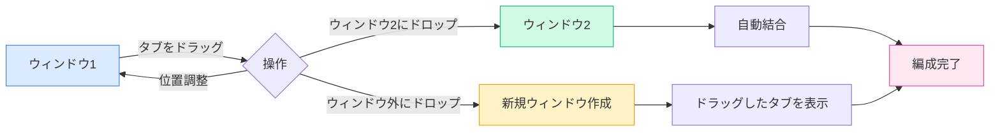

# マルチウィンドウ管理

## 概要

MetaDocはマルチウィンドウ管理をサポートしており、異なるウィンドウで異なるドキュメントを開くことができます。マルチウィンドウ管理により、複数のドキュメントを同時に表示・編集でき、作業効率を向上させます。

## マルチウィンドウサポート

### ウィンドウタイプ

MetaDocは2種類のウィンドウをサポートしています：

- **メインウィンドウ**：ドキュメント編集、ホームページなどの主要機能を担い、マルチタブ管理をサポート
- **補助ウィンドウ**：設定、AIチャット、OCRなどのツールウィンドウ、シングルインスタンスウィンドウ

### ウィンドウの特徴

メインウィンドウの特徴：

- **マルチタブ**：各ウィンドウは独立したタブリストを持つ
- **独立状態**：各ウィンドウは独立したドキュメント状態を持つ
- **ドラッグ＆ドロップサポート**：タブのドラッグによる分割と結合をサポート
- **ウィンドウプール**：アイドル状態のウィンドウを事前作成し、高速表示を実現

## 新規ウィンドウの作成

### ドラッグによる作成

タブをドラッグすることで新規ウィンドウを作成できます：

1. **タブをドラッグ**：タブをウィンドウの境界外にドラッグ
2. **ウィンドウ作成**：システムが自動的に新規ウィンドウを作成
3. **コンテンツ表示**：新規ウィンドウにドラッグしたタブの内容が表示される

タブバーはドラッグ操作をサポートしており、タブをドラッグしてウィンドウ外に移動することで新規ウィンドウを作成できます：

<MainTabs mode="demo" />

**注意事項**：

- 単一タブのウィンドウはドラッグによる新規ウィンドウ作成ができない
- ドラッグ時にはウィンドウプールから事前ロードされたウィンドウを自動取得し、高速表示を実現

### 右クリックメニューによる作成

右クリックメニューから新規ウィンドウを作成できます：

1. **タブを右クリック**：移動させたいタブを右クリック
2. **オプション選択**：「新しいウィンドウで開く」を選択
3. **ウィンドウ作成**：システムが新規ウィンドウを作成し、タブを移動

### ウィンドウプール機構

MetaDocはウィンドウ作成を最適化するためにウィンドウプール機構を使用：

- **事前ロードウィンドウ**：システムが2つのアイドルウィンドウを事前作成
- **高速表示**：事前ロードウィンドウを使用すると瞬時に表示（<100ms）
- **自動補充**：使用後に新しいウィンドウを自動的にプールに補充

## ウィンドウ間タブドラッグ

### ドラッグによる結合

タブをあるウィンドウから別のウィンドウにドラッグすることで、柔軟なウィンドウ編成が可能：

**操作手順**：

1. **タブをドラッグ**：ソースウィンドウでタブをドラッグ
2. **ターゲットウィンドウにドロップ**：タブをターゲットウィンドウのタブバーにドロップ
3. **自動結合**：タブが自動的にターゲットウィンドウに追加される

### ドラッグ位置

ドラッグ時に挿入位置を指定できます：

- **自動位置決定**：マウス位置に基づいて自動的に挿入位置を決定
- **指定位置**：特定の位置にドラッグして挿入可能
- **末尾挿入**：末尾にドラッグすると末尾に挿入

### 単一タブウィンドウの結合

ソースウィンドウにタブが1つしかない場合：

- **自動結合**：他のウィンドウにドラッグすると自動的に結合
- **ウィンドウ閉鎖**：結合後、ソースウィンドウは自動的に閉じる
- **空ウィンドウ防止**：空のウィンドウが発生するのを防止

## ウィンドウ管理

### ウィンドウ切り替え

システムショートカットキーを使用してウィンドウを切り替え可能：

- **Alt+Tab**（Windows/Linux）：ウィンドウ切り替え
- **Cmd+Tab**（macOS）：ウィンドウ切り替え

### ウィンドウ状態

各ウィンドウは独立した状態を持ちます：

- **タブリスト**：各ウィンドウは独立したタブリストを持つ
- **ドキュメント状態**：各ウィンドウは独立したドキュメント状態を持つ
- **ビュー状態**：各ウィンドウは独立したビュー状態を持つ

### ウィンドウ閉鎖

ウィンドウを閉じる方法：

- **閉じるボタン**：ウィンドウの閉じるボタンをクリック
- **ショートカットキー**：システムショートカットキーを使用してウィンドウを閉じる
- **メニューオプション**：メニューからウィンドウを閉じる

**注意事項**：

- ウィンドウを閉じる前に未保存のドキュメントの保存を促す
- 補助ウィンドウを閉じる場合は、実際に閉じるのではなく非表示にする

## ウィンドウ同期

### 状態同期

一部の状態はウィンドウ間で同期されます：

- **言語設定**：言語切り替えはすべてのウィンドウに同期
- **テーマ設定**：テーマ切り替えはすべてのウィンドウに同期
- **システム設定**：システム設定はすべてのウィンドウに同期

### ファイル関連付け

ファイル関連付け機能：

- **重複防止**：同じファイルが複数のウィンドウで同時に開かれない
- **ウィンドウ位置特定**：ファイルが他のウィンドウですでに開かれている場合、通知しそのウィンドウに移動
- **ファイルロック**：ファイル転送時には一時的にロックされ、競合を防止

## ベストプラクティス

1. **適切な画面分割**：マルチウィンドウを使用して画面分割編集を実現し、効率向上
2. **ウィンドウ編成**：関連するドキュメントは同じウィンドウに、無関係なドキュメントは分けて配置
3. **タブ管理**：タブドラッグを適切に使用し、ウィンドウレイアウトを編成
4. **ウィンドウ切り替え**：Alt+Tabを熟練して使用し、迅速なウィンドウ切り替え
5. **状態保存**：ウィンドウを閉じる前に重要なドキュメントが保存されていることを確認

## 注意事項

1. **ウィンドウ数**：ウィンドウが多すぎるとパフォーマンスに影響する可能性があるため、適切に制御を推奨
2. **ファイルロック**：ファイル転送時には一時的にロックされ、競合を回避
3. **状態独立**：各ウィンドウの状態は独立しており、相互に影響しない
4. **ウィンドウプール**：ウィンドウプール機構は自動的に管理され、手動介入は不要
5. **補助ウィンドウ**：補助ウィンドウはシングルインスタンスであり、閉じると非表示になる

## 関連ドキュメント

- [[core.multi-tab|マルチタブ管理]]
- [[core.file-operations|ファイル操作]]

<ViewMenuItemsDemo mode="demo" :items='["home", "outline"]' />

<ViewMenuItemsDemo mode="demo" :items='["chat", "agent"]' />

<MenuItemsDemo mode="demo" :items='[{"id": "file"}]' />

<MenuItemsDemo mode="demo" :items='[{"id": "edit"}]' />

<MenuItemsDemo mode="demo" :items='[{"id": "view"}]' />

<LeftMenu mode="demo" />
