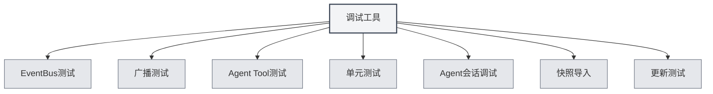

# デバッグツール

## 概要

デバッグツールは、MetaDocが提供する開発環境機能であり、アプリケーション機能のテストとデバッグに使用されます。これらのツールは開発環境でのみ利用可能で、開発者がコードを迅速にテスト・デバッグするのに役立ちます。

<SettingDebugSection mode="demo" />

## デバッグツールの紹介

<SettingDebugSection mode="demo" />

<ConsoleTerminal mode="demo" consoleKey="debug" :history='[]' />

### デバッグツールへのアクセス

デバッグツールは開発環境でのみ利用可能です：

1.  **開発環境**：開発環境で実行されていることを確認します
2.  **設定ページ**：設定ページを開きます
3.  **デバッグツール**：設定ページ内で「デバッグツール」オプションを見つけます
4.  **ツールを開く**：デバッグツールインターフェースを開くためにクリックします

上部メニューバーからデバッグツールにアクセスできます（開発環境のみ）：

<MenuItemsDemo mode="demo" :items='[{"id": "settings"}]' />

### ツールの種類

デバッグツールには以下の機能モジュールが含まれます：

-   **EventBusテスト**：EventBusイベントをテストします
-   **ブロードキャストテスト**：ブロードキャストイベントをテストします
-   **Agent Toolテスト**：Agentツールをテストします
-   **ユニットテスト**：ユニットテストを実行します
-   **Agentセッションデバッグ**：Agentセッションをデバッグします
-   **スナップショットインポート**：ドキュメントスナップショットをインポートします
-   **更新テスト**：更新機能をテストします

<SettingDebugSection mode="demo" />

## EventBusテスト

### イベントの送信

EventBusイベントを送信してテストできます：

1.  **イベント名**：送信するイベント名を入力します
2.  **イベントデータ**：オプションで、JSON形式のイベントデータを入力します
3.  **イベント送信**：「イベント送信」ボタンをクリックします
4.  **結果の確認**：イベント送信結果を確認します

<ConsoleTerminal mode="demo" consoleKey="debug" :history='[]' />

### イベントの監視

EventBusイベントを監視できます：

-   **イベントリスト**：送信されたすべてのイベントを表示します
-   **イベント詳細**：イベントの詳細情報を確認します
-   **イベントデータ**：イベントのデータ内容を確認します

## ブロードキャストテスト

### ブロードキャストの送信

ブロードキャストイベントを送信してテストできます：

1.  **ターゲットウィンドウ**：ブロードキャストのターゲットを選択します（all/home/ai-chatなど）
2.  **イベント名**：ブロードキャストするイベント名を入力します
3.  **イベントデータ**：オプションで、JSON形式のイベントデータを入力します
4.  **ブロードキャスト送信**：「ブロードキャスト送信」ボタンをクリックします
5.  **結果の確認**：ブロードキャスト送信結果を確認します

<ConsoleTerminal mode="demo" consoleKey="debug" :history='[]' />

### ブロードキャストの監視

ブロードキャストイベントを監視できます：

-   **ブロードキャストリスト**：送信されたすべてのブロードキャストを表示します
-   **ブロードキャスト詳細**：ブロードキャストの詳細情報を確認します
-   **ターゲットウィンドウ**：ブロードキャストのターゲットウィンドウを確認します

## Agent Toolテスト

### ツールのテスト

Agentツールをテストできます：

1.  **ツールの選択**：テストするAgentツールを選択します
2.  **パラメータの入力**：ツールのテストパラメータを入力します（JSON形式）
3.  **コンテキストの選択**：テストするコンテキストのTab IDを選択します
4.  **テストの実行**：「テスト実行」ボタンをクリックします
5.  **結果の確認**：テスト結果を確認します

### テスト履歴

テスト履歴を確認できます：

-   **履歴リスト**：すべてのテスト履歴を表示します
-   **テスト結果**：各テストの結果を確認します
-   **エラー情報**：テストのエラー情報を確認します

## ユニットテスト

### 単体テスト

単一のユニットテストを実行できます：

1.  **モジュールの選択**：テストするモジュールを選択します
2.  **テストの選択**：実行するテスト関数を選択します
3.  **パラメータの編集**：テスト関数のパラメータを編集します
4.  **テストの実行**：「テスト実行」ボタンをクリックします
5.  **結果の確認**：テスト結果を確認します

<ConsoleTerminal mode="demo" consoleKey="debug" :history='[]' />

### バッチテスト

ユニットテストを一括実行できます：

1.  **モジュールの選択**：1つまたは複数のモジュールを選択します
2.  **コンテキストの選択**：テストするコンテキストのTab IDを選択します
3.  **テスト開始**：「バッチテスト開始」ボタンをクリックします
4.  **進捗の確認**：テストの進捗状況を確認します
5.  **結果の確認**：すべてのテスト結果を確認します

### テスト結果

テスト結果には以下が含まれます：

-   **テストステータス**：テストが合格したかどうかを表示します
-   **テスト出力**：テストの出力情報を表示します
-   **エラー情報**：テストのエラー情報を表示します（存在する場合）
-   **実行時間**：テストの実行時間を表示します

## Agentセッションデバッグ

### セッションデバッグ

Agentセッションをデバッグできます：

1.  **セッションの選択**：デバッグするAgentセッションを選択します
2.  **メッセージの確認**：セッションのメッセージ履歴を確認します
3.  **メッセージの送信**：テストメッセージを送信します
4.  **応答の確認**：Agentの応答を確認します

<ConsoleTerminal mode="demo" consoleKey="debug" :history='[]' />

### デバッグ情報

デバッグ情報を確認できます：

-   **セッションステータス**：セッションの現在の状態を表示します
-   **ツール呼び出し**：ツール呼び出し履歴を確認します
-   **エラー情報**：エラー情報を確認します

## スナップショットインポート

### スナップショットのインポート

ドキュメントスナップショットをインポートできます：

1.  **スナップショットの選択**：インポートするスナップショットファイルを選択します
2.  **スナップショットインポート**：「スナップショットインポート」ボタンをクリックします
3.  **結果の確認**：インポート結果を確認します

<ConsoleTerminal mode="demo" consoleKey="debug" :history='[]' />

### スナップショット形式

スナップショットファイルの形式：

-   **JSON形式**：スナップショットファイルはJSON形式です
-   **ドキュメント内容**：ドキュメントの完全な内容を含みます
-   **ドキュメントステータス**：ドキュメントの状態情報を含みます

## 更新テスト

### 更新のテスト

更新機能をテストできます：

1.  **更新チャネルの選択**：更新チャネルを選択します（release/dev）
2.  **更新の確認**：「更新確認」ボタンをクリックします
3.  **結果の確認**：更新確認結果を確認します

<SettingDebugSection mode="demo" />

## ベストプラクティス

1.  **開発環境**：デバッグツールは開発環境でのみ使用します
2.  **テストの分離**：テスト時は独立したテストデータを使用します
3.  **エラー処理**：テスト中のエラーに注意して処理します
4.  **結果の記録**：重要なテスト結果を記録します
5.  **ツールの使用**：デバッグツールを適切に使用し、開発効率を向上させます

## 注意事項

1.  **開発環境**：デバッグツールは開発環境でのみ利用可能です
2.  **データセキュリティ**：テスト時はデータセキュリティに注意し、本番データに影響を与えないようにします
3.  **パフォーマンスへの影響**：一部のテストはアプリケーションのパフォーマンスに影響を与える可能性があります
4.  **エラー処理**：テスト中のエラーは適切に処理する必要があります
5.  **ツールの制限**：一部のツールには使用制限がある場合があります

## 関連ドキュメント

-   [[agent.session|Agentセッション管理]]
-   [[agent.tools|ツールセット管理]]
-   [[settings.basic|基本設定]]