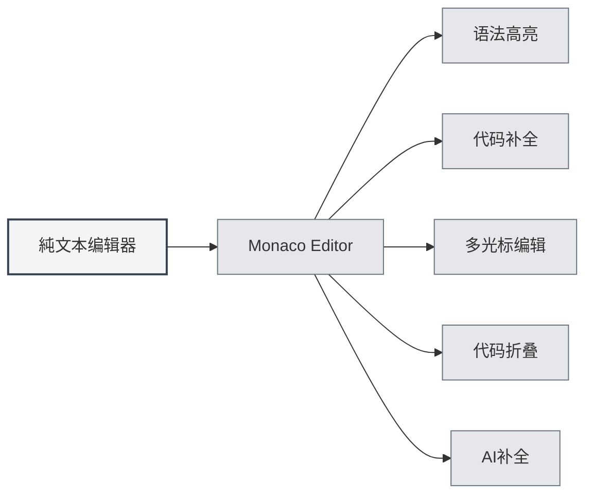
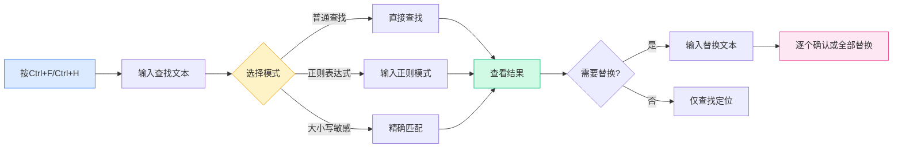

# プレーンテキストエディタ

## 概要

プレーンテキストエディタは、プレーンテキストファイルとコードファイルを編集するために使用されます。MetaDocのプレーンテキストエディタはMonaco Editorをベースとしており、シンタックスハイライト、コード補完、AI補完などの機能を備えた、プロフェッショナルなコード編集体験を提供します。

プレーンテキストエディタは、コードファイル（`.js`、`.py`、`.java`など）や設定ファイル（`.json`、`.yaml`、`.ini`など）など、様々なファイル形式をサポートしており、ファイル拡張子に基づいて言語を自動認識し、対応するシンタックスハイライトを適用します。

## Monacoエディタの機能

<LaTeXEditorDemo mode="demo" />

<SearchReplaceMenu mode="demo" :position='{"top": 100, "left": 200}' :adapter='null' />

<MenuItemsDemo mode="demo" :items='[{"id": "file"}]' />

<ViewMenuItemsDemo mode="demo" :items='["editor", "outline"]' />

### エディタの紹介

プレーンテキストエディタはMonaco Editorを使用しており、以下の特徴があります：

- **プロフェッショナルなコード編集**：Visual Studio Codeに似た編集体験を提供
- **シンタックスハイライト**：ファイルタイプに応じて自動的にシンタックスハイライトを適用
- **コード補完**：インテリジェントなコード補完をサポート
- **マルチカーソル編集**：複数のカーソルでの同時編集をサポート
- **コード折りたたみ**：コードブロックの折りたたみをサポート

### サポートされるファイル形式

プレーンテキストエディタは以下のファイル形式をサポートします：

**コードファイル**：

- JavaScript/TypeScript: `.js`, `.jsx`, `.ts`, `.tsx`
- Python: `.py`
- Java: `.java`
- C/C++: `.c`, `.cpp`, `.h`, `.hpp`
- C#: `.cs`
- Go: `.go`
- Rust: `.rs`
- Swift: `.swift`
- Kotlin: `.kt`
- その他: `.php`, `.rb`, `.scala`, `.dart`, `.lua`など

**設定ファイル**：

- JSON: `.json`
- YAML: `.yaml`, `.yml`
- XML: `.xml`
- TOML: `.toml`
- INI: `.ini`, `.conf`
- SQL: `.sql`

**スクリプトファイル**：

- Shell: `.sh`, `.bash`, `.zsh`
- PowerShell: `.ps1`
- その他: `.vim`, `.diff`, `.patch`, `.log`

### 自動言語認識

エディタはファイル拡張子に基づいて言語を自動認識します：

- **ファイル拡張子**：ファイル拡張子に応じて対応する言語モードを選択
- **シンタックスハイライト**：対応するシンタックスハイライトルールを自動適用
- **コード補完**：対応する言語のコード補完機能を有効化

ファイルに拡張子がない場合、または拡張子が認識されない場合、エディタはプレーンテキストモードを使用します。

## コードハイライト

### シンタックスハイライト

エディタはファイルタイプに応じて自動的にシンタックスハイライトを適用します：

- **キーワードハイライト**：言語のキーワードを異なる色で表示
- **文字列ハイライト**：文字列を特定の色で表示
- **コメントハイライト**：コメントを灰色で表示
- **関数ハイライト**：関数名を特定の色で表示

シンタックスハイライトにより、コード構造がより明確になり、読み書きが容易になります。

### テーマ同期

コードハイライトのテーマはエディタのテーマに追従します：

- **ライトテーマ**：ライトテーマでは明るいシンタックスハイライトを使用
- **ダークテーマ**：ダークテーマでは暗いシンタックスハイライトを使用
- **自動同期**：エディタのテーマ設定と自動的に同期

## 行番号表示

### 行番号の表示

行番号はエディタの左側に表示され、以下の点で役立ちます：

- **コードの位置特定**：特定の行に素早く移動
- **コードの参照**：ドキュメント内で特定のコード行を参照するのに便利
- **コードのデバッグ**：エラーの位置を素早く特定

### 行番号の設定

行番号の表示は設定で構成できます：

1. 設定ページを開く
2. 「エディタ設定」セクションで「行番号表示」を探す
3. トグルスイッチで行番号を有効化または無効化

行番号設定はすべてのMonacoエディタ（プレーンテキストエディタ、LaTeXエディタなど）に影響します。

<MenuItemsDemo mode="demo" :items='[{"id": "file", "items": ["new", "open", "save"]}]' />

<ViewMenuItemsDemo mode="demo" :items='["editor", "outline"]' />

<MainTabs mode="demo" />

<AISuggestionGhost mode="demo" />

<LaTeXEditorDemo mode="demo" />

## ファイルプレビューと統計情報

### ファイル統計

エディタはファイルの統計情報を表示します：

- **文字数**：ファイルの総文字数を表示
- **行数**：ファイルの総行数を表示
- **単語数**：ファイルの総単語数を表示（該当する場合）

統計情報はステータスバーまたはエディタの下部に表示されます。

### ファイルプレビュー

ファイルを開くと、エディタは以下の処理を行います：

- **内容の読み込み**：ファイル内容を素早く読み込み
- **ハイライトの適用**：ファイルタイプに応じてシンタックスハイライトを適用
- **統計の表示**：ファイルの統計情報を表示

### ファイル形式検出

エディタはファイル形式を自動検出します：

- **拡張子検出**：ファイル拡張子に基づいて形式を認識
- **内容検出**：拡張子が不明確な場合、内容に基づいて認識を試みる
- **手動選択**：ファイル形式を手動で選択可能

## AI補完機能

### AI自動補完

プレーンテキストエディタはAI自動補完機能をサポートします：

- **自動トリガー**：入力を停止すると自動的に補完をトリガー
- **手動トリガー**：`Shift+Tab`で手動で補完をトリガー
- **インテリジェント補完**：コンテキストに基づいて補完候補を生成

AI補完機能は以下の点で役立ちます：

- **コード生成**：コメントやコンテキストに基づいてコードを生成
- **関数補完**：関数定義や呼び出しを補完
- **コメント生成**：コードコメントを生成

### 補完設定

AI補完の設定はMarkdownエディタと同じです：

- **有効化/無効化**：設定で有効化または無効化可能
- **トリガーキー**：トリガーキー（Enter、Space、`;`、`,`）を設定可能
- **補完モード**：完全生成または部分生成を選択可能
- **最大トークン数**：補完の最大トークン数を設定可能

詳細は[[ai.completion|AI自動補完]]を参照してください。

## エディタ機能

### コード折りたたみ

エディタはコードブロックの折りたたみをサポートします：

- **コードブロックの折りたたみ**：行番号の左側にある折りたたみアイコンをクリック
- **コードブロックの展開**：折りたたみマーカーをクリックして展開
- **ショートカットキー**：`Ctrl+Shift+[`で折りたたみ、`Ctrl+Shift+]`で展開

コード折りたたみにより、現在編集中の部分に集中できます。

### 検索と置換

エディタは強力な検索・置換機能をサポートし、コード内で素早く内容を特定・修正するのに役立ちます：

**基本操作**：

- **検索**：`Ctrl+F`で検索ダイアログを開き、検索するテキストを入力
- **置換**：`Ctrl+H`で検索・置換ダイアログを開き、検索内容と置換内容を入力
- **個別置換**：個別に確認しながら置換
- **すべて置換**：一致するすべての項目を一度に置換

**詳細オプション**：

- **正規表現**：正規表現を使用した複雑なパターンマッチング
- **大文字小文字の区別**：大文字小文字を区別して検索
- **単語単位の一致**：完全な単語のみ一致

**使用シナリオ**：

- 変数名の一括修正
- 特定の関数呼び出しの検索
- コード内の文字列の置換
- 正規表現を使用した複雑な置換

検索・置換パネルのインターフェースは以下の通りです：

<SearchReplaceMenu mode="demo" :position='{"top": 100, "left": 200}' :adapter='null' />

### マルチカーソル編集

エディタは複数のカーソルでの同時編集をサポートします：

- **カーソルの追加**：`Alt+クリック`でクリック位置に新しいカーソルを追加
- **上へのカーソル追加**：`Ctrl+Alt+↑`で上にカーソルを追加
- **下へのカーソル追加**：`Ctrl+Alt+↓`で下にカーソルを追加
- **同じ単語の選択**：`Ctrl+D`で次の同じ単語を選択

マルチカーソル編集により、複数の位置を同時に修正でき、編集効率が向上します。

## 使用上のヒント

<LaTeXEditorDemo mode="demo" />

<ConsoleTerminal mode="demo" consoleKey="plaintext" :history='[]' />

### 効率的な編集

1. **ショートカットキーの使用**：よく使うショートカットキーを習熟し、編集効率を向上
2. **コード折りたたみの使用**：確認不要なコードブロックを折りたたむ
3. **マルチカーソルの使用**：マルチカーソルを使用して複数の位置を同時編集

### コード補完

1. **AI補完の有効化**：AI補完機能を有効化してインテリジェントな補完候補を取得
2. **手動トリガーの使用**：必要な時に`Shift+Tab`で手動で補完をトリガー
3. **設定の調整**：ニーズに応じて補完設定を調整

### ファイル管理

1. **形式の認識**：ファイル拡張子が正しいことを確認し、自動認識を確実に
2. **統計の確認**：ファイル統計情報を確認してファイルサイズを把握
3. **ファイルの保存**：変更を失わないよう、適宜ファイルを保存

## よくある質問

### Q: シンタックスハイライトが正しくない？

A: ファイル拡張子が正しいか確認してください。拡張子が正しくない場合、エディタはファイルタイプを認識できない可能性があります。ファイル形式を手動で選択できます。

### Q: コード補完が表示されない？

A: AI補完機能が有効になっていることを確認してください。一部のファイルタイプではコード補完がサポートされていない場合があります。

### Q: ファイル形式を切り替えるには？

A: ファイル形式はファイル拡張子に基づいて自動認識されます。変更が必要な場合は、ファイル名を変更するか、形式を手動で選択してください。

### Q: 行番号が表示されない？

A: 設定の「行番号表示」オプションが有効になっているか確認してください。行番号設定はすべてのMonacoエディタに影響します。

### Q: ファイルが大きすぎて編集できない？

A: 非常に大きなファイルの場合、エディタは一部の機能を制限する可能性があります。超大ファイルの処理には専用のテキストエディタの使用を推奨します。

## 関連ドキュメント

- [[core.editor-basics|エディタ基本操作]]
- [[core.editor-settings|エディタ設定]]
- [[latex.editor|LaTeXエディタ使用ガイド]]
- [[ai.completion|AI自動補完]]
