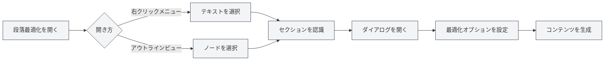

# 段落最適化機能

## 概要

段落最適化機能は、AIを使用して文書内の特定の段落や章を最適化することができます。右クリックメニューまたはアウトラインビューから段落最適化機能を開き、段落の内容を生成または最適化できます。

## 段落最適化を開く

### 右クリックメニューから開く

エディター内で右クリックして段落最適化を開くことができます：

1.  **テキストを選択**：エディター内で最適化したいテキストを選択します
2.  **右クリックメニュー**：選択したテキストを右クリックします
3.  **最適化を選択**：右クリックメニューから「段落最適化」または類似のオプションを選択します
4.  **ダイアログを開く**：段落最適化ダイアログが開きます

### アウトラインから開く

アウトラインビューから段落最適化を開くことができます：

1.  **ノードを選択**：アウトラインツリーで最適化したいノードを選択します
2.  **右クリックメニュー**：ノードを右クリックします
3.  **最適化を選択**：右クリックメニューから「段落最適化」または類似のオプションを選択します
4.  **ダイアログを開く**：段落最適化ダイアログが開きます

サイドバーからアウトラインビューにアクセスできます：

<ViewMenuItemsDemo mode="demo" :items='["outline"]' />

<ViewMenuItemsDemo mode="demo" :items='["chat"]' />

<AIChat mode="demo" />

段落オプティマイザーのインターフェースは以下の通りです：

<SectionOptimizer mode="demo" title="サンプルセクション" path="1" :tree='{"text": "サンプルセクション", "children": []}' language="markdown" :adapter='null' />

### セクションの自動認識

段落最適化は現在のセクションを自動的に認識します：

-   **カーソル位置**：カーソル位置に基づいて現在のセクションを認識します
-   **選択テキスト**：テキストが選択されている場合は、選択されたテキストを使用します
-   **アウラインノード**：アウトラインから開いた場合は、対応するアウトラインノードを使用します

## 最適化オプション

### 最適化モード

以下の異なる最適化モードを選択できます：

-   **コンテンツ生成**：新しい段落の内容を生成します
-   **コンテンツ最適化**：既存の段落の内容を最適化します
-   **コンテンツ追加**：既存の内容の後に新しい内容を追加します
-   **コンテンツ置換**：既存の段落の内容を置き換えます

### コンテキストモード

以下のコンテキストモードを選択できます：

-   **全文コンテキスト**：文書全体をコンテキストとして使用します
-   **セクションコンテキスト**：現在のセクションのみをコンテキストとして使用します
-   **コンテキストなし**：コンテキスト情報を使用しません

### カスタムプロンプト

カスタムプロンプトを入力できます：

-   **最適化目標**：最適化の目標を記述します
-   **コンテンツ要件**：コンテンツの要件を説明します
-   **スタイル要件**：執筆スタイルを指定します

### プリセットプロンプト

プリセットプロンプトを使用できます：

-   **コンテンツ拡張**：段落の内容を拡張します
-   **コンテンツ簡素化**：段落の内容を簡素化します
-   **コンテンツ書き換え**：段落の内容を書き換えます
-   **コンテンツ補足**：段落の内容を補足します

## コンテンツ生成

### 生成プロセス

コンテンツ生成のプロセス：

1.  **セクション分析**：現在のセクションの構造と内容を分析します
2.  **プロンプト構築**：オプションに基づいて最適化プロンプトを構築します
3.  **AI呼び出し**：AIを呼び出して最適化されたコンテンツを生成します
4.  **結果表示**：ダイアログに生成されたコンテンツを表示します

### 生成結果

生成されたコンテンツはダイアログに表示されます：

-   **コンテンツプレビュー**：生成されたコンテンツをプレビューできます
-   **コンテンツ編集**：生成されたコンテンツを編集できます
-   **コンテンツ適用**：コンテンツを文書に適用できます

### 生成オプション

生成時に以下のオプションを設定できます：

-   **ストリーミング出力**：生成プロセスをリアルタイムで表示します
-   **一括生成**：生成完了を待ってから表示します
-   **生成キャンセル**：いつでも生成プロセスをキャンセルできます

## コンテンツ適用

### 適用方法

生成されたコンテンツを文書に適用できます：

-   **置換**：元の段落の内容を置き換えます
-   **挿入**：指定した位置にコンテンツを挿入します
-   **追加**：段落の末尾にコンテンツを追加します

### 適用位置

適用位置を指定できます：

-   **現在位置**：現在のカーソル位置に適用します
-   **セクション位置**：セクションの開始位置に適用します
-   **セクション末尾**：セクションの末尾に適用します

## 対話機能

### 対話の継続

コンテンツ生成後に対話を継続できます：

1.  **対話を開く**：「対話を続ける」ボタンをクリックします
2.  **対話画面に入る**：AI対話インターフェースに入ります
3.  **最適化を継続**：コンテンツの最適化や修正を継続できます

### 対話コンテキスト

対話には以下のコンテキストが含まれます：

-   **元のコンテンツ**：元の段落の内容
-   **生成コンテンツ**：生成されたコンテンツ
-   **最適化履歴**：最適化の履歴

## ベストプラクティス

1.  **目標を明確化**：最適化の目標を明確にし、明確なプロンプトを使用します
2.  **コンテキストを選択**：状況に応じて適切なコンテキストモードを選択します
3.  **コンテンツをプレビュー**：生成後にコンテンツをプレビューし、要件に合致していることを確認します
4.  **編集調整**：生成後、さらに編集や調整を行えます
5.  **複数回の最適化**：複数回最適化を行い、段階的にコンテンツを改善できます

## 注意事項

1.  **セクション認識**：セクションが正しく認識されていることを確認し、誤ったコンテンツを最適化しないようにします
2.  **コンテキストの使用**：コンテキストを適切に使用し、コンテンツが長くなりすぎないようにします
3.  **コンテンツ品質**：生成されたコンテンツは人手による確認と調整が必要です
4.  **トークン消費**：最適化機能はトークンを消費するため、使用量に注意します
5.  **文書の保存**：コンテンツを適用した後は、文書を保存することを忘れないでください

## 関連ドキュメント

-   [[outline.basics|アウトラインビュー機能]]
-   [[ai.chat|AI対話機能]]
-   [[ai.completion|AI自動補完]]

<Outline mode="demo" />

<CompletionSettingsPanel mode="demo" />

<MenuItemsDemo mode="demo" :items='[{"id": "ai"}]' />

<ViewMenuItemsDemo mode="demo" :items='["chat"]' />
