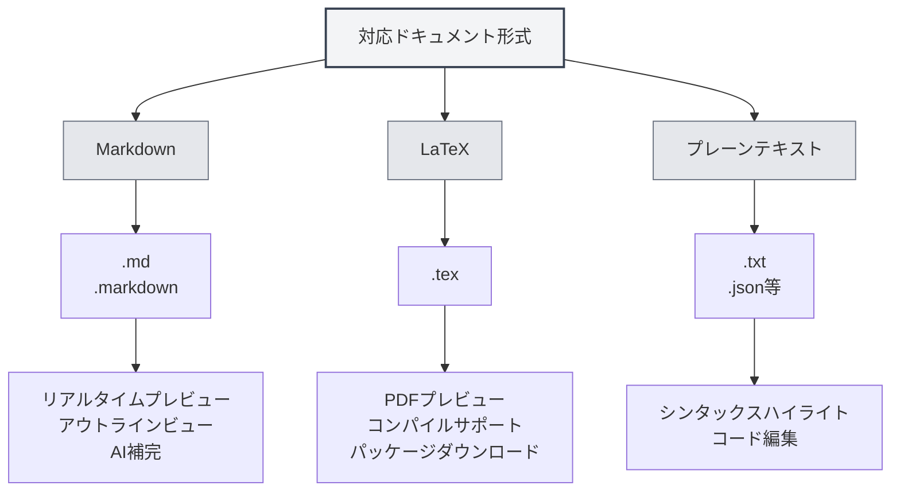

# 対応ドキュメント形式

## 概要

MetaDocは、Markdown、LaTeX、プレーンテキスト形式など、複数のドキュメント形式をサポートしています。システムはファイル形式を自動検出しますが、手動での形式選択も可能です。

<MenuItemsDemo mode="demo" :items='[{"id": "file"}]' />

<MenuItemsDemo mode="demo" :items='[{"id": "edit"}]' />

<MenuItemsDemo mode="demo" :items='[{"id": "view"}]' />

<ViewMenuItemsDemo mode="demo" :items='["home", "outline", "chat"]' />

<MainTabs mode="demo" />

<QuickStartPanel mode="demo" />

<QuickStartMarkdown mode="demo" />

<QuickStartLatex mode="demo" />

## 対応形式

### Markdown形式

**ファイル拡張子**：`.md`、`.markdown`

**特徴**：

- 標準Markdown構文をサポート
- 拡張構文（表、コードブロック、数式など）をサポート
- リアルタイムプレビューをサポート
- アウトラインビューをサポート
- AI補完をサポート

**使用シナリオ**：

- 技術文書作成
- ブログ記事作成
- ノート記録
- ドキュメント作成

### LaTeX形式

**ファイル拡張子**：`.tex`

**特徴**：

- 学術論文作成に適した専門的な形式
- 数式、表、図表をサポート
- リアルタイムPDFプレビュー
- パッケージ自動ダウンロードをサポート
- コンパイルエラー表示をサポート

**使用シナリオ**：

- 学術論文作成
- 技術レポート作成
- 書籍組版
- 複雑なドキュメントの組版

### プレーンテキスト形式

**ファイル拡張子**：`.txt`、`.json`など

**特徴**：

- シンプルなテキスト編集
- シンタックスハイライト対応
- コード編集機能
- プレビューとアウトラインは非対応

**使用シナリオ**：

- コードファイル編集
- 設定ファイル編集
- シンプルなテキスト編集
- データファイル編集

## ファイル形式検出

### 自動検出

MetaDocはファイル形式を自動的に検出します：

1. **拡張子検出**：ファイル拡張子に基づいて優先的に形式を検出

   - `.md`、`.markdown` → Markdown形式
   - `.tex` → LaTeX形式
   - `.txt`、`.json`など → プレーンテキスト形式

2. **内容検出**：拡張子で形式が確定できない場合、ファイル内容を検出

   - LaTeX内容は優先的にLaTeX形式として認識
   - その他の内容はデフォルトでMarkdown形式として認識

3. **デフォルト形式**：検出できない場合、デフォルトでMarkdown形式を使用

### 検出優先順位

形式検出は以下の優先順位に従います：

1. **ファイル拡張子**：拡張子による検出を優先
2. **ファイル内容**：拡張子で確定できない場合、内容を検出
3. **デフォルト形式**：検出できない場合、デフォルト形式を使用

### 検出ルール

- **Markdown検出**：拡張子が`.md`または`.markdown`の場合、Markdownとして認識
- **LaTeX検出**：拡張子が`.tex`または内容にLaTeXコマンドが含まれる場合、LaTeXとして認識
- **プレーンテキスト検出**：その他の拡張子または確定できない場合、プレーンテキストとして認識

## 手動形式選択

### ファイルを開く際の選択

ファイルを開く際に手動で形式を選択できます：

1. **ファイルを開くダイアログ**：ファイルを開くダイアログ内で
2. **形式選択**：ファイル形式を選択（自動検出が正しくない場合）
3. **開く確認**：確認後、選択した形式で開く

### 新規ファイル作成時の選択

新規ファイル作成時に形式を選択できます：

1. **新規ドキュメント**：「新規ドキュメント」ボタンをクリック
2. **形式選択**：形式選択ダイアログで形式を選択
3. **ドキュメント作成**：指定形式のドキュメントを作成

### 形式切替

開いているドキュメントの形式を切り替えることができます：

1. **ドキュメントを開く**：形式を切り替えるドキュメントを開く
2. **形式メニュー**：メニュー内で形式切替オプションを探す
3. **形式選択**：新しい形式を選択
4. **切替確認**：形式切替を確認

**注意事項**：

- 形式切替はドキュメント内容に影響する可能性があります
- 一部の形式固有の機能は変換できない場合があります
- 切替前にドキュメントのバックアップを推奨します

## 形式特性比較

### 機能サポート

| 機能         | Markdown | LaTeX      | プレーンテキスト |
| ------------ | -------- | ---------- | ---------------- |
| リアルタイムプレビュー | ✅       | ✅ (PDF)   | ❌               |
| アウトラインビュー   | ✅       | ✅         | ❌               |
| AI補完       | ✅       | ✅         | ✅               |
| 数式         | ✅       | ✅         | ❌               |
| 表サポート     | ✅       | ✅         | ❌               |
| コードハイライト | ✅       | ✅         | ✅               |
| メタ情報サポート | ✅       | ✅         | ❌               |

### エディタ特性

| 特性           | Markdown | LaTeX | プレーンテキスト |
| -------------- | -------- | ----- | ---------------- |
| シンタックスハイライト | ✅       | ✅    | ✅               |
| 自動補完       | ✅       | ✅    | ✅               |
| エラー表示     | ✅       | ✅    | ❌               |
| 折りたたみ機能 | ✅       | ✅    | ✅               |
| マルチカーソル編集 | ✅       | ✅    | ✅               |

## 形式変換

### エクスポート形式

ドキュメントを他の形式にエクスポートできます：

- **Markdown → PDF**：PDFドキュメントとしてエクスポート
- **Markdown → HTML**：HTMLドキュメントとしてエクスポート
- **Markdown → DOCX**：Wordドキュメントとしてエクスポート
- **LaTeX → PDF**：PDFドキュメントとしてコンパイル
- **LaTeX → Markdown**：Markdown形式に変換

### 変換時の注意点

形式変換時には以下の点に注意してください：

- **内容互換性**：一部の形式固有の機能は変換できない場合があります
- **スタイル消失**：変換後に一部のスタイルが失われる可能性があります
- **内容調整**：変換後に内容を手動で調整する必要がある場合があります

## ベストプラクティス

1. **適切な形式の選択**：ドキュメントの種類に応じて適切な形式を選択
2. **標準拡張子の使用**：自動検出を容易にするため、標準的なファイル拡張子を使用
3. **形式の一貫性**：同一プロジェクト内では統一された形式を使用
4. **ドキュメントのバックアップ**：形式変換前に元のドキュメントをバックアップ
5. **変換テスト**：変換後に内容が正しいか確認

## 注意事項

1. **形式検出**：自動検出は不正確な場合があり、手動選択が可能です
2. **形式切替**：形式切替はドキュメント内容に影響する可能性があります
3. **互換性**：異なる形式ではサポートされる機能が異なります
4. **ファイル拡張子**：標準的な拡張子の使用を推奨します
5. **形式変換**：変換時に一部の内容やスタイルが失われる可能性があります

## 関連ドキュメント

- [[markdown.basics|Markdown構文]]
- [[latex.basics|LaTeX構文]]
- [[editor.plain-text|プレーンテキストエディタ]]
- [[core.file-operations|ファイル操作]]