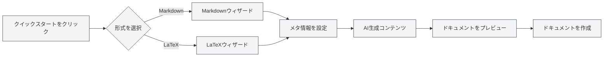

# ホーム機能

## 概要

ホームはMetaDocのエントリーインターフェースであり、クイックスタート、新規ドキュメント作成、ファイルを開くなどの機能を提供します。ホームはシンプルで美しいデザインで、MetaDocの使用を素早く開始できるよう支援します。

## クイックスタート

### クイックスタートウィザード

「クイックスタート」ボタンをクリックすると、クイックスタートウィザードが起動します：

1.  **形式を選択**：ドキュメント形式（MarkdownまたはLaTeX）を選択します
2.  **メタ情報を設定**：ドキュメントのタイトル、著者などの情報を入力します
3.  **AIによるコンテンツ生成**：AIを活用してドキュメントコンテンツを生成します
4.  **ドキュメントをプレビュー**：生成されたドキュメント内容をプレビューします
5.  **ドキュメントを作成**：確認後にドキュメントを作成します

クイックスタートウィザードの形式選択画面は以下の通りです：

<QuickStartPanel mode="demo" />

### Markdownクイックスタート

Markdown形式を選択した場合：

-   **テンプレート選択**：Markdownテンプレートを選択できます
-   **コンテンツ生成**：AIがMarkdownコンテンツを生成できます
-   **クイック編集**：作成後すぐに編集を開始できます

Markdownを選択した後に進むウィザード画面：

<QuickStartMarkdown mode="demo" />

### LaTeXクイックスタート

LaTeX形式を選択した場合：

-   **ドキュメントタイプ**：ドキュメントタイプ（article、bookなど）を選択できます
-   **コンテンツ生成**：AIがLaTeXコンテンツを生成できます
-   **コンパイルプレビュー**：作成後にPDFをコンパイルしてプレビューできます

LaTeXを選択した後に進むウィザード画面：

<QuickStartLatex mode="demo" />

## 新規ドキュメント

### 空白ドキュメントを作成

「新規ドキュメント」ボタンをクリックすると、空白ドキュメントを素早く作成できます：

1.  「新規ドキュメント」ボタンをクリックします
2.  ドキュメント形式（Markdown/LaTeX/プレーンテキスト）を選択します
3.  ドキュメントが新しいタブで開きます

**ショートカットキー**：`Ctrl+N`（Windows/Linux）または `Cmd+N`（macOS）を使用して素早く作成することもできます。

## ファイルを開く

### 既存ファイルを開く

「ファイルを開く」ボタンをクリックすると、既存ファイルを開くことができます：

1.  「ファイルを開く」ボタンをクリックします
2.  ファイル選択ダイアログでファイルを選択します
3.  ファイルが新しいタブで開きます

**ショートカットキー**：`Ctrl+O`（Windows/Linux）または `Cmd+O`（macOS）を使用して素早く開くこともできます。

### サポートされているファイル形式

-   **Markdown** (.md)
-   **LaTeX** (.tex)
-   **プレーンテキスト** (.txt)
-   **JSON** (.json)

## ユーザーマニュアル

### ユーザーマニュアルを開く

「ユーザーマニュアル」ボタンをクリックすると、ユーザーマニュアルを開くことができます：

1.  「ユーザーマニュアル」ボタンをクリックします
2.  ユーザーマニュアルが新しいタブで開きます
3.  様々な機能を閲覧・学習できます

**ショートカットキー**：`F1` キーを押してユーザーマニュアルを素早く開くこともできます。

## 最近使用したドキュメントリスト

### 最近使用したドキュメントを表示

ホームには最近開いたドキュメントのリストが表示されます：

-   **表示数**：最大12個の最近使用したドキュメントを表示します
-   **ドキュメントカード**：各ドキュメントはカードとして表示されます
-   **クイックオープン**：カードをクリックするだけでドキュメントを素早く開けます

### 最近使用したドキュメントの操作

-   **ドキュメントを開く**：ドキュメントカードをクリックしてドキュメントを開きます
-   **レコードを削除**：カード上の削除ボタンをクリックしてレコードを削除します
-   **右クリックメニュー**：カードを右クリックすると、さらにオプションが表示される場合があります

### 最近使用したドキュメントの管理

-   **自動更新**：ドキュメントを開くとリストが自動的に更新されます
-   **レコード保存**：最近使用したドキュメントのレコードは保存されます
-   **リストソート**：開いた時間の降順で並べ替えられます

## ユーザープロファイルダイアログ

### ユーザープロファイルを開く

ホームにはユーザープロファイルダイアログが表示される場合があります：

-   **初回使用時**：初回使用時にユーザープロファイルの設定を促される場合があります
-   **プロファイル設定**：ユーザープロファイルや使用設定を設定できます
-   **AI最適化**：ユーザープロファイルは、AIがユーザーのニーズをより良く理解するのに役立ちます

### ユーザープロファイルの内容

ユーザープロファイルには以下が含まれる場合があります：

-   **基本情報**：氏名、職業など
-   **使用設定**：編集習慣、よく使う機能など
-   **ユーザープロファイル**：AIがユーザーの使用シーンを理解するのに役立ちます

## ホームインターフェース

### インターフェースレイアウト

ホームは中央揃えのレイアウトを採用しています：

-   **上部**：MetaDocのタイトルとサブタイトル
-   **中央**：操作ボタンエリア
-   **下部**：最近使用したドキュメントリスト

### ビジュアルデザイン

ホームはシンプルでモダンなデザインを採用しています：

-   **動的背景**：動的な背景アニメーション効果
-   **グリッド装飾**：ミニマルなグリッド装飾
-   **カードデザイン**：操作ボタンはカードデザインを採用

## ベストプラクティス

1.  **クイックスタート**：初回使用時はクイックスタートウィザードの使用をお勧めします
2.  **ショートカットキー**：ショートカットキーを習熟して効率を向上させましょう
3.  **最近使用したドキュメント**：最近使用したドキュメントリストを活用して、よく使うドキュメントに素早くアクセスしましょう
4.  **ユーザープロファイル**：より良いAI体験を得るためにユーザープロファイルを設定しましょう
5.  **ユーザーマニュアル**：問題が発生した場合はユーザーマニュアルを参照しましょう

## 注意事項

1.  **ホーム表示**：ホームはドキュメントが開かれていない場合にのみ表示されます
2.  **クイックスタート**：クイックスタートウィザードはいつでも閉じることができます
3.  **最近使用したドキュメント**：最近使用したドキュメントリストは最大12個まで表示されます
4.  **ユーザープロファイル**：ユーザープロファイルの設定は任意です
5.  **インターフェース言語**：ホームインターフェースの言語はシステムの言語設定に従います

## 関連ドキュメント

-   [[quick-start.guide|クイックスタートガイド]]
-   [[core.file-operations|ファイル操作]]
-   [[user.profile|ユーザープロファイル]]
-   [[views.types|ビュータイプ]]

<MenuItemsDemo mode="demo" :items='[{"id": "file"}]' />

<MenuItemsDemo mode="demo" :items='[{"id": "edit"}]' />

<MenuItemsDemo mode="demo" :items='[{"id": "view"}]' />

<ViewMenuItemsDemo mode="demo" :items='["home", "outline", "chat", "agent"]' />

<MainTabs mode="demo" />

<UserProfileView mode="demo" />