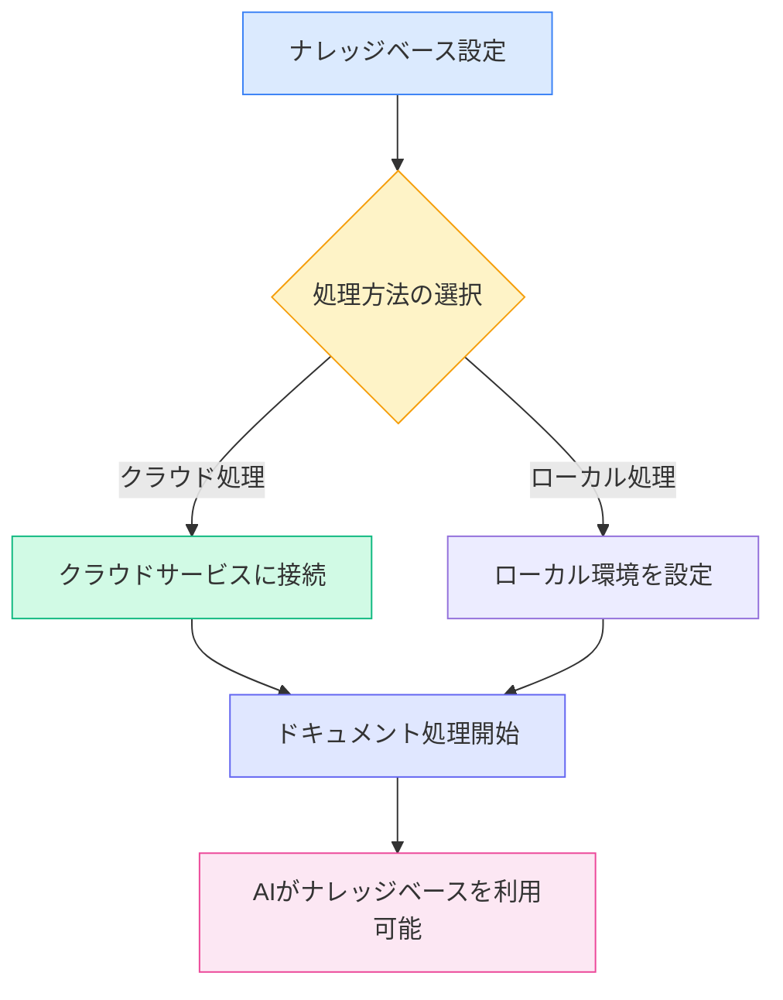
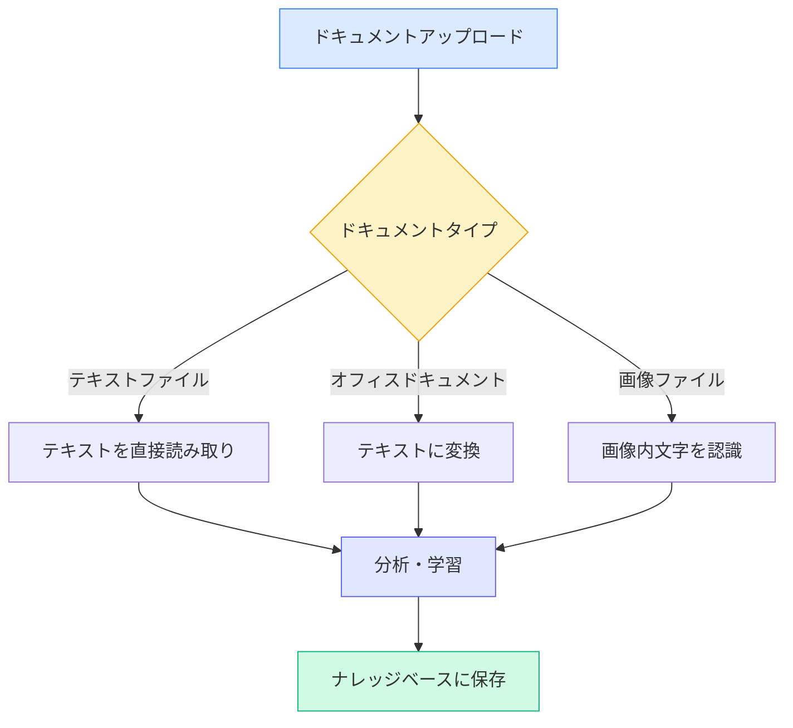
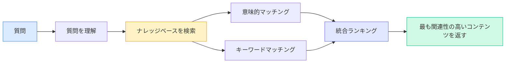

# ナレッジベース設定

## 概要

ナレッジベースは、MetaDocのインテリジェントなドキュメント管理システムです。あなたのドキュメントをナレッジベースに「学習」させることで、AIはその内容を理解し、参照できるようになり、より正確な回答や提案を提供します。

このガイドは、ナレッジベースを設定し、あなたのニーズに合わせて活用するための手助けをします。

## ナレッジベース機能の有効化

ナレッジベース設定ページでは、まずナレッジベース機能を有効にする必要があります：

1.  「ナレッジベースを有効化」スイッチを見つける
2.  スイッチを「有効」状態に切り替える
3.  ナレッジベース関連のパラメータを設定する

上部メニューバーからナレッジベース管理にアクセスできます：

<KnowledgeBase mode="demo" />

上の図は、ナレッジベース管理インターフェースの主な機能エリアを示しています：

-   **左側パネル**：ナレッジベース一覧と検索機能
-   **中央エリア**：追加済みのドキュメント一覧
-   **右側詳細**：選択したドキュメントの詳細情報と処理状態
-   **下部ツールバー**：ドキュメント追加、処理開始、削除などの操作ボタン

## 処理方法の選択

### 2つの方法の紹介

MetaDocは、ドキュメントを処理する2つの方法を提供します：

**クラウド処理（推奨）**

-   ドキュメントをクラウドサービスに送信して分析
-   処理速度が速く、ローカルリソースを占有しない
-   ネットワーク接続が必要

**ローカル処理（開発中）**

-   あなたのコンピュータ上で直接ドキュメントを処理
-   データは完全にローカルで、プライバシーを保護
-   高性能なコンピュータ構成が必要

現在のバージョンでは、クラウド処理方式のみをサポートしています。設定で選択できます：

<MenuItemsDemo mode="demo" :items='[{"id": "settings"}]' />

### クラウド処理の利点

ほとんどのユーザーには、クラウド処理の使用をお勧めします：

-   **すぐに始められる**：複雑なローカル環境の設定が不要
-   **時間の節約**：大量のドキュメントを処理する際に速度が速い
-   **リソースの節約**：コンピュータのメモリやプロセッサを占有しない
-   **メンテナンスが簡単**：自動更新で、手動管理が不要

### ローカル処理が必要な場合

以下の要件がある場合は、ローカル処理機能の提供を待つことができます：

-   機密性の高い極秘文書を処理する
-   ネットワークがない環境で頻繁に作業する
-   高性能なコンピュータ構成（専用グラフィックスカード搭載）を持っている
-   膨大なドキュメント（10GB以上）を処理する必要がある

<SettingKnowledgeBaseSection mode="demo" />

## ナレッジベースの仕組みを理解する

### ドキュメントがどのように「学習」されるか

<RAGToolDisplay mode="demo" />

ドキュメントをナレッジベースに追加すると、MetaDocは以下の手順を実行します：

1.  **ドキュメント内容の読み取り**

    -   PDF、Word、画像などの形式からテキストを抽出
    -   ドキュメントの構造とフォーマット情報を保持

2.  **ドキュメントの意味を理解**

    -   テキストをAIが理解できる「意味表現」に変換
    -   これは、ドキュメントにインテリジェントなタグを付けるようなもの

3.  **インデックスの作成**

    -   高速検索のためのインデックスを作成
    -   AIが瞬時に関連コンテンツを見つけられるようにする

4.  **知識の保存**
    -   処理結果をローカルデータベースに保存
    -   いつでも呼び出し可能

<KnowledgeBase mode="demo" />

## サポートされているドキュメントタイプ

### 直接処理可能なフォーマット

MetaDocナレッジベースは、さまざまな一般的なドキュメントフォーマットをサポートしています：

**テキスト系**

-   Markdownドキュメント（.md）—— 技術文書の推奨フォーマット
-   LaTeXドキュメント（.tex）—— 学術論文で一般的なフォーマット
-   プレーンテキストファイル（.txt）—— シンプルなテキスト記録

**オフィスドキュメント**

-   PDFファイル（.pdf）—— 最も汎用的なドキュメントフォーマット
-   Wordドキュメント（.docx）—— Microsoft Officeフォーマット

**画像系**

-   PNG画像（.png）—— スクリーンショット、図表
-   JPEG画像（.jpg, .jpeg）—— 写真、スキャン画像

### 異なるドキュメントの処理方法

ドキュメントのタイプによって、MetaDocは異なる方法で処理します：

**テキストドキュメント**（Markdown、LaTeX、TXT）

-   テキスト内容を直接読み取る
-   見出し構造とフォーマットを保持
-   処理速度が最も速い

**オフィスドキュメント**（PDF、Word）

-   まずプレーンテキストに変換
-   見出し、段落などの構造を抽出
-   ドキュメントの論理的な階層を保持

**画像ドキュメント**（PNG、JPG）

-   OCR技術を使用して画像内の文字を認識
-   スキャンした紙文書の処理に適している
-   処理時間は比較的長い

<RAGToolDisplay mode="demo" />

## インテリジェント検索メカニズム

### ナレッジベースが関連コンテンツを見つける方法

AIがナレッジベースを使用する必要がある場合、MetaDocはインテリジェントな検索戦略を採用します：

**意味的マッチング**

-   キーワードだけでなく、質問の意味も理解する
-   例：「インストール方法」を検索すると、「インストール手順」、「デプロイガイド」などの関連コンテンツも見つかる

**ハイブリッド検索**

-   意味理解とキーワードマッチングを組み合わせる
-   正確性を保証しつつ、再現率を向上させる
-   自動的にランク付けされ、最も関連性の高いコンテンツが優先表示される

**高速応答**

-   効率的なインデックスアルゴリズムを使用
-   ミリ秒単位の応答で、会話の流暢さに影響しない

<KnowledgeBase mode="demo" />

## チャンク処理の説明

### チャンクが必要な理由

より効率的に検索するために、MetaDocは長いドキュメントを小さなチャンク（塊）に分割します：

**チャンク化の利点**

-   **正確な位置特定**：ドキュメント内の特定の段落を見つけられる
-   **速度向上**：小さなチャンクは処理が速く、検索も迅速
-   **コンテキストの保持**：隣接するチャンク間に重複があり、意味が途切れない

**デフォルト設定**

-   各チャンクは約500文字（約250漢字）
-   隣接チャンク間で50文字の重複
-   この設定は、正確性と効率性のバランスを取っています

### チャンク化の例

長文があると仮定します：

原文：[冒頭段落...中間段落...末尾段落...]

チャンク化後：

-   チャンク1：冒頭段落 + 中間内容の一部
-   チャンク2：中間内容の一部（重複領域）+ さらに中間内容
-   チャンク3：さらに中間内容 + 末尾段落

これにより、「中間内容」のみに関わる質問でも、関連部分を正確に見つけることができます。

<SettingKnowledgeBaseSection mode="demo" />

## 設定の推奨事項

### 初回使用時の推奨設定

ナレッジベースを初めて使用する場合は、以下の設定をお勧めします：

-   **処理方法**：クラウド処理（デフォルト）
-   **検索感度**：中（デフォルト値）
    -   感度が高すぎる：関連性の低いコンテンツが多く返される可能性
    -   感度が低すぎる：関連するコンテンツを見逃す可能性
    -   中設定：両者のバランス

### 異なるタイプのドキュメントに対する設定

**技術文書/マニュアル**

-   専用のナレッジベースを構築するのに適している
-   AIが技術的な質問に正確に回答できる
-   コードスニペットの検索をサポート

**学術論文**

-   完全な引用情報を保持
-   ドキュメント間の知識関連付けをサポート
-   文献レビューや研究に適している

**日常のメモ**

-   個人ナレッジベースを構築
-   過去の記録を迅速に検索
-   クリエイティブな執筆時の参照をサポート

### 使用上のアドバイス

**1. 定期的なメンテナンス**

-   古くなった、または不要になったドキュメントを削除
-   既存ドキュメントの新しいバージョンを更新
-   ナレッジベースを整理し、正確に保つ

**2. 適切な分類**

-   関連するトピックのドキュメントをまとめる
-   ナレッジベースに明確な名前を設定
-   管理と使用を容易にする

**3. プライバシーへの配慮**

-   機密文書は慎重にアップロード
-   データの処理方法を理解する
-   適切な処理方法を選択する

<RAGToolDisplay mode="demo" />

## 注意事項

### 使用前にご確認ください

1.  **処理時間**

    -   小規模ドキュメント（1-10ページ）：数秒
    -   中規模ドキュメント（10-50ページ）：数十秒
    -   大規模ドキュメント（50ページ以上）：数分かかる場合があります
    -   処理が完了するまでお待ちください

2.  **ストレージ容量**

    -   ナレッジベースは一定のハードディスク容量を占有します
    -   おおよそ元のドキュメントサイズの2-3倍
    -   使用しないドキュメントを定期的にクリーンアップすることで容量を解放できます

3.  **ネットワーク要件**

    -   ドキュメント追加時にはネットワーク接続が必要
    -   検索時にはネットワーク不要（ローカルに保存済み）
    -   不安定なネットワークは処理速度に影響する可能性があります

4.  **ファイルフォーマット**
    -   アップロードするファイルフォーマットが正しいことを確認
    -   破損したファイルは処理できない場合があります
    -   暗号化されたPDFは先に復号する必要があります

### よくある質問

**Q: ナレッジベース内のドキュメントは安全ですか？**
A: ドキュメント処理後のベクトルデータはローカルに保存されます。クラウド処理を使用する場合、元のドキュメントはクラウドサービスに送信されて処理され、処理完了後に削除されます。高度に機密性の高い内容はアップロードしないことをお勧めします。

**Q: どのくらいの大きさのドキュメントを処理できますか？**
A: 単一ドキュメントは100MB以下を推奨します。超大規模ドキュメントは複数の小さいドキュメントに分割して処理できます。

**Q: 処理後のドキュメントは編集できますか？**
A: ナレッジベース内のコンテンツは、元のドキュメントの「スナップショット」です。ドキュメントが更新された場合は、ナレッジベースに再度追加する必要があります。

**Q: なぜ一部のコンテンツが検索できないのですか？**
A: 考えられる原因：1) ドキュメントの処理がまだ完了していない；2) コンテンツが画像内にあり、OCR認識に失敗した；3) 検索語とドキュメント内容の表現方法が大きく異なる。

## 関連ドキュメント

-   [[knowledge-base.management|ナレッジベース管理]] - ナレッジベースへのドキュメントの追加、削除、管理方法を学ぶ
-   [[knowledge-base.usage|ナレッジベースの使用]] - AI会話でナレッジベースを使用する方法を理解する
-   [[ai.chat|AI会話機能]] - AI会話の高度な機能を探求する