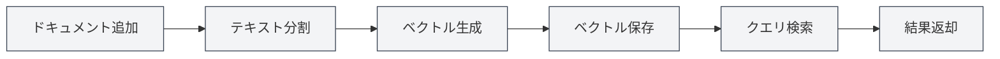
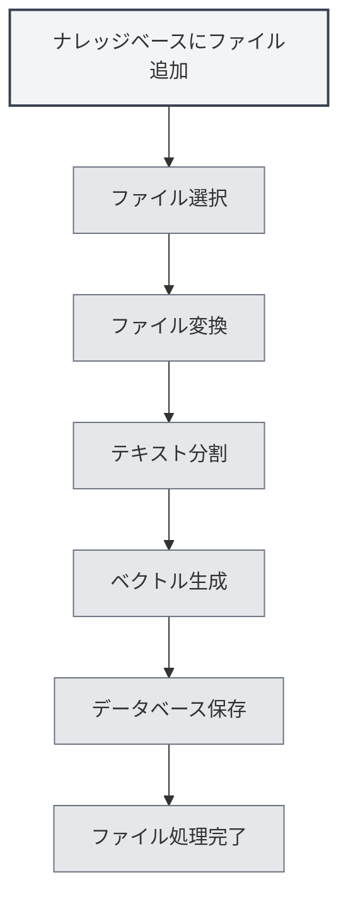

# ナレッジベースの使用

## 概要

ナレッジベースは、MetaDocのRAG（検索拡張生成）システムであり、ベクトル検索を通じてAI機能にコンテキスト情報を提供します。ナレッジベースを適切に使用することで、AI回答の正確性と関連性を大幅に向上させることができます。

<KnowledgeBase mode="demo" />

## ナレッジベースの紹介

### ナレッジベースとは

ナレッジベースは、ドキュメントの保存と検索システムであり、以下のことが可能です：

- **ドキュメントの保存**：ドキュメントをベクトルに変換して保存
- **セマンティック検索**：意味的な類似性に基づいて関連コンテンツを検索
- **AIの強化**：AI対話にコンテキスト情報を提供

### 動作原理

<RAGToolDisplay mode="demo" />

ナレッジベースはベクトル埋め込み技術を使用します：

1. **ドキュメント処理**：ドキュメントをテキストチャンクに分割
2. **ベクトル化**：各テキストチャンクに対してベクトル埋め込みを生成
3. **保存**：ベクトルをデータベースに保存
4. **検索**：クエリに基づいてベクトルを生成し、類似コンテンツを検索

<KnowledgeBase mode="demo" />

## ナレッジベースへのファイル追加

### ファイルの追加

1. ナレッジベース管理ページを開く
2. 「ファイル追加」ボタンをクリック
3. 追加するファイルを選択
4. ファイル処理の完了を待つ

### サポートされているファイル形式

ナレッジベースは以下のファイル形式をサポートしています：

- **Markdown** (.md)：Markdownドキュメント
- **LaTeX** (.tex)：LaTeXドキュメント
- **PDF** (.pdf)：PDFドキュメント
- **Word** (.docx)：Wordドキュメント
- **画像** (.png, .jpgなど)：OCRによる文字認識
- **プレーンテキスト** (.txt)：プレーンテキストファイル

### ファイル処理

<RAGToolDisplay mode="demo" />

ファイル追加後、システムは自動的に以下を実行します：

1. **テキスト変換**：ファイルをテキストコンテンツに変換
2. **テキスト分割**：テキストを固定サイズのチャンクに分割
3. **ベクトル生成**：各チャンクに対してベクトル埋め込みを生成
4. **データ保存**：ベクトルとテキストをデータベースに保存

処理時間はファイルサイズに依存し、大きなファイルは時間がかかる場合があります。

<KnowledgeBase mode="demo" />

## ナレッジベースのファイル管理

### ファイル一覧

ナレッジベース管理ページには、追加されたすべてのファイルが表示されます：

- **ファイル名**：ファイルの名称
- **サイズ/チャンク数**：ファイルサイズとデータチャンクの数
- **ステータス**：ファイルが有効かどうか

### ファイル操作

<RAGToolDisplay mode="demo" />

#### ファイルの有効化/無効化

- **有効化**：ファイルが検索対象となり、AI機能で使用される
- **無効化**：ファイルは検索されないが、データは保持される

#### ファイルのプレビュー

ファイルをクリックすると、ファイル内容をプレビューできます：

- **内容の表示**：プレビューパネルでファイルテキストを表示
- **エディターで開く**：エディターでファイルを開く

#### ファイル名の変更

1. 名前を変更するファイルを選択
2. ファイル名横の編集ボタンをクリック
3. 新しいファイル名を入力
4. 名前変更を確認

#### ファイルの削除

1. 削除するファイルを選択
2. 「削除」ボタンをクリック
3. 削除操作を確認

ファイルを削除すると、関連するすべてのベクトルとデータチャンクが削除されます。

#### ファイルのダウンロード

ナレッジベース内のファイルをダウンロードできます：

1. ダウンロードするファイルを選択
2. 「ダウンロード」ボタンをクリック
3. 保存場所を選択

<KnowledgeBase mode="demo" />

## ベクトル検索

### 検索原理

ベクトル検索はANN（近似最近傍探索）アルゴリズムを使用します：

- **ベクトル類似度**：クエリベクトルとドキュメントベクトルの類似度を計算
- **コサイン類似度**：コサイン類似度を使用して類似度を測定
- **結果のソート**：類似度に基づいて結果をソートして返却

### 検索方法

<RAGToolDisplay mode="demo" />

ナレッジベースは2つの検索方法をサポートしています：

- **ベクトル検索**：意味的類似性に基づく
- **ハイブリッド検索**：ベクトル検索とキーワードマッチングの組み合わせ

### 検索テスト

ナレッジベース管理ページで検索機能をテストできます：

1. 検索ボックスにクエリテキストを入力
2. 信頼度しきい値を調整
3. 「検索」ボタンをクリック
4. 検索結果を確認

### 信頼度しきい値

信頼度しきい値は検索結果のフィルタリングを制御します：

- **低いしきい値（0.1-0.3）**：より多くの結果を返すが、無関係なコンテンツを含む可能性あり
- **中程度のしきい値（0.4-0.6）**：関連性と数のバランスを取る（推奨）
- **高いしきい値（0.7-0.9）**：高度に関連する結果のみを返す

<KnowledgeBase mode="demo" />

## ハイブリッド検索

### 検索メカニズム

ハイブリッド検索は2つの方法を組み合わせます：

- **ベクトル検索**：意味的類似性に基づく
- **キーワードマッチング**：テキストマッチングに基づく

### スコアリングメカニズム

ハイブリッド検索は総合スコアを使用します：

- **ベクトル類似度**：意味的類似性スコア
- **キーワードマッチング**：テキストマッチングスコア
- **総合スコア**：2つのスコアを組み合わせた最終スコア

### 利点

ハイブリッド検索の利点：

- **正確性**：ベクトル検索が意味理解を提供
- **精密性**：キーワードマッチングが正確な一致を提供
- **バランス**：2つの方法の利点を組み合わせる

<RAGToolDisplay mode="demo" />

## 検索テスト

### 検索のテスト

ナレッジベース管理ページで検索をテストできます：

1. **クエリ入力**：検索ボックスに検索したい内容を入力
2. **しきい値調整**：スライダーを使用して信頼度しきい値を調整
3. **検索実行**：「検索」ボタンをクリックまたはEnterキーを押す
4. **結果確認**：結果エリアで検索結果を確認

### 検索結果

検索結果には以下が表示されます：

- **一致テキスト**：クエリに関連するテキストスニペット
- **類似度**：テキストとクエリの類似度スコア
- **ソースファイル**：テキストの出典ファイル

### 結果のソート

検索結果は類似度でソートされます：

- **最も関連性が高い**：類似度が最も高い結果が先頭に表示
- **関連性の減少**：類似度の降順でソート

## ベクトルの再構築

### ベクトルの再構築

ファイルのベクトルデータに問題がある場合、ベクトルを再構築できます：

1. 再構築するファイルを選択
2. 「ベクトル再構築」ボタンをクリック
3. 再構築の完了を待つ

### すべてのベクトルの再構築

すべてのファイルのベクトルを再構築できます：

1. 「すべてのベクトルを再構築」ボタンをクリック
2. 操作を確認
3. すべてのファイルの再構築完了を待つ

### 再構築のシナリオ

ベクトルの再構築が必要なシナリオ：

- **Embeddingモデルの変更**：モデル変更後に再構築が必要
- **ベクトルデータの破損**：ベクトルデータに問題が発生した場合
- **ベクトル表現の更新**：ベクトル表現を更新する必要がある場合

## ナレッジベースのクリア

### クリア操作

ナレッジベース全体をクリアする必要がある場合：

1. 「ナレッジベースをクリア」ボタンをクリック
2. 操作を確認
3. クリア完了を待つ

### クリアの影響

ナレッジベースをクリアすると：

- すべてのファイル記録が削除される
- すべてのデータチャンクが削除される
- すべてのベクトルが削除される
- 操作は元に戻せない

**注意事項**：

- クリア操作は元に戻せません。慎重に操作してください
- クリア前に重要なファイルをバックアップすることを推奨します
- クリア後はファイルを再追加する必要があります

<KnowledgeBase mode="demo" />

## AI機能での使用

### AI対話

ナレッジベースは自動的にAI対話にコンテキストを提供します：

- **自動検索**：対話内容に基づいて関連知識を自動検索
- **コンテキスト注入**：検索結果を対話コンテキストに注入
- **回答の強化**：ナレッジベースの内容に基づいてより正確な回答を生成

### AI補完

ナレッジベースはAI補完機能を強化できます：

- **コンテキスト理解**：ナレッジベースの内容に基づいてコンテキストを理解
- **コンテンツ生成**：ナレッジベースの内容に関連するコンテンツを生成
- **正確性の向上**：補完コンテンツの正確性を向上

### Agentツール

ナレッジベースはAgentツールとして使用できます：

- **RAGツール**：AgentワークフローでRAG検索を使用
- **コンテキスト提供**：Agentに関連するコンテキスト情報を提供
- **タスク実行**：知識を必要とするタスクの完了をAgentに支援

## ベストプラクティス

1. **ファイルの整理**：テーマやプロジェクトごとにファイルを整理
2. **定期的な更新**：ファイル内容更新後は速やかにベクトルを再構築
3. **しきい値の調整**：使用効果に基づいて信頼度しきい値を調整
4. **ファイルの整理**：不要になったファイルを定期的に削除
5. **検索テスト**：定期的に検索機能をテストし、効果を確認

## 注意事項

1. **ナレッジベースの有効化**：ナレッジベース機能を使用する前に有効化が必要
2. **ファイル処理**：大きなファイルの処理には時間がかかります。お待ちください
3. **ストレージ容量**：ナレッジベースは一定のストレージ容量を占有します
4. **ネットワーク接続**：APIモードを使用するにはネットワーク接続が必要
5. **データセキュリティ**：ナレッジベース内の機密情報の保護に注意

## 関連ドキュメント

- [[knowledge-base.management|ナレッジベース管理]]
- [[knowledge-base.config|ナレッジベース設定]]
- [[settings.llm|LLM設定]]
- [[ai.chat|AI対話機能]]

<KnowledgeBase mode="demo" />

<RAGToolDisplay mode="demo" />
