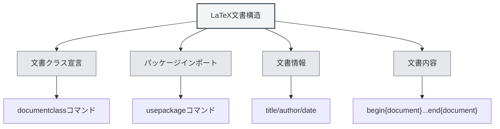

# LaTeX構文

## 概要

LaTeXはTeXを基盤とした組版システムで、学術論文や技術文書の作成に広く使用されています。MetaDocは完全なLaTeXの編集、コンパイル、プレビュー機能を提供します。

<LaTeXEditorDemo mode="demo" />

<PdfPreviewPanel mode="demo" />

<LaTeXCompilerPanel mode="demo" />

<LaTeXConsole mode="demo" />

## 基本構文

### 文書構造

LaTeX文書の基本構造：

```latex
\documentclass{article}
\usepackage[utf8]{inputenc}

\title{文書タイトル}
\author{著者}
\date{\today}

\begin{document}
\maketitle

\section{セクションタイトル}
内容...

\end{document}
```



### 数式

**インライン数式**：

```latex
これはインライン数式です：$E = mc^2$
```

**ブロック数式**：

```latex
\begin{equation}
\int_{-\infty}^{\infty} e^{-x^2} dx = \sqrt{\pi}
\end{equation}
```

**複数行数式**：

```latex
\begin{align}
x &= a + b \\
y &= c + d
\end{align}
```

### 表

`tabular` 環境を使用：

```latex
\begin{tabular}{|c|c|c|}
\hline
列1 & 列2 & 列3 \\
\hline
データ1 & データ2 & データ3 \\
\hline
\end{tabular}
```

### 画像挿入

`figure` 環境を使用：

```latex
\begin{figure}[h]
\centering
\includegraphics[width=0.8\textwidth]{image.png}
\caption{画像キャプション}
\label{fig:example}
\end{figure}
```

### 参考文献

`BibTeX` または `natbib` を使用：

```latex
\bibliographystyle{plain}
\bibliography{references}
```

## コンパイルとプレビュー

LaTeX文書はPDFを生成するためにコンパイルが必要です。詳細は[[latex.compilation|LaTeXコンパイルとプレビュー]]を参照してください。

コンパイルが完了すると、[[latex.pdf-preview|PDFプレビュー機能]]で結果を確認できます。

## 関連ドキュメント

- [[latex.editor|LaTeXエディター使用ガイド]]
- [[latex.compilation|LaTeXコンパイルとプレビュー]]
- [[latex.pdf-preview|PDFプレビュー機能]]
- [[latex.console|コンソール出力]]
