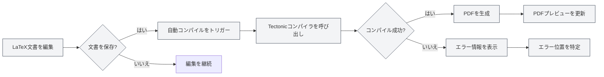
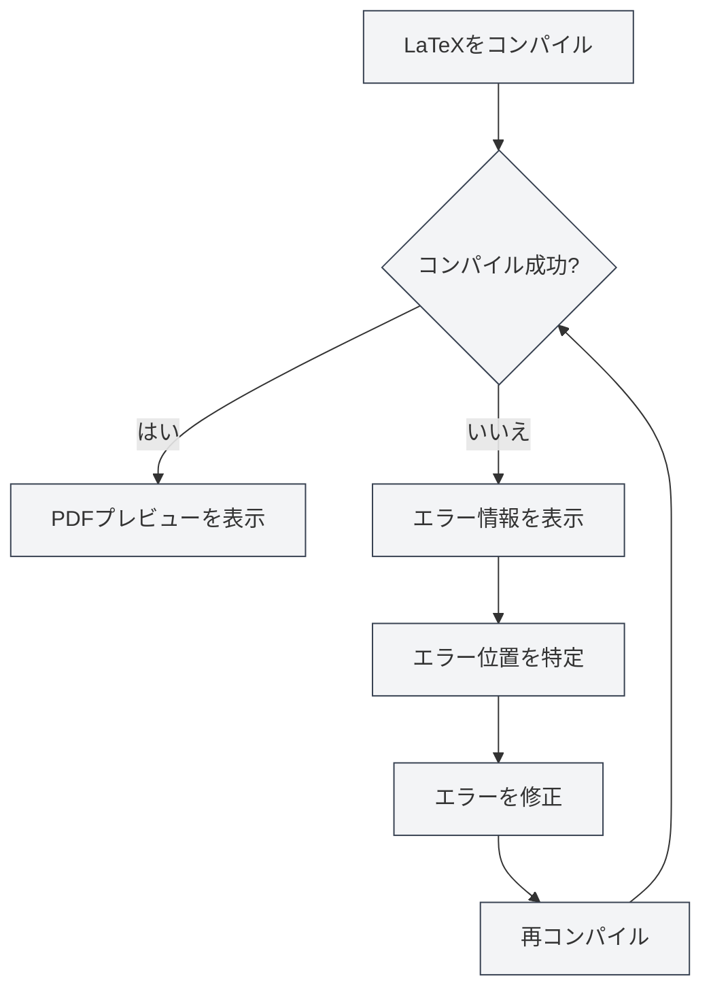

# LaTeXコンパイルとプレビュー

## 概要

LaTeX文書はコンパイルしてPDFを生成する必要があります。MetaDocはTectonicコンパイラを使用し、自動コンパイル、リアルタイムプレビュー、エラー位置特定などの機能をサポートし、LaTeX文書を効率的に記述・デバッグできます。

コンパイルプロセスでは必要なマクロパッケージが自動的にダウンロードされ、手動設定は不要で、LaTeXの使用フローを大幅に簡素化します。

## LaTeX文書のコンパイル

<LaTeXCompilerPanel mode="demo" />

### 自動コンパイル

MetaDocは自動コンパイル機能をサポートします：

- **保存時コンパイル**：LaTeX文書を保存すると自動的にコンパイルがトリガーされます
- **手動コンパイル**：ツールバーの「コンパイル」ボタンをクリックして手動でコンパイルをトリガーします
- **コンパイル状態**：コンパイル中に進捗と状態が表示されます

### コンパイルプロセス

<LaTeXConsole mode="demo" />

コンパイルプロセスには以下のステップが含まれます：

1. **コンパイル環境の準備**：Tectonicコンパイラが利用可能か確認します
2. **マクロパッケージのダウンロード**：文書で使用されているLaTeXマクロパッケージを自動的にダウンロードします
3. **コンパイルの実行**：Tectonicコンパイラを実行してPDFを生成します
4. **出力の処理**：コンパイルログとエラー情報を処理します
5. **プレビューの更新**：コンパイルが成功した場合、PDFプレビューを更新します

### コンパイルオプション

<LaTeXEditorDemo mode="demo" />

コンパイルでは以下のオプションをサポートします：

- **コンパイラ**：Tectonicコンパイラを使用（デフォルト）
- **コンパイルモード**：非対話モード、エラー発生時に停止
- **出力ディレクトリ**：PDFファイルは文書と同じディレクトリに保存されます

### コンパイル時間

<ConsoleTerminal mode="demo" consoleKey="demo" :history='[{"content": "Tectonicコンパイラ起動...", "type": "out"}, {"content": "文書構造を解析", "type": "out"}]' />

コンパイル時間は以下に依存します：

- **文書サイズ**：文書が大きいほどコンパイル時間が長くなります
- **マクロパッケージ数**：使用するマクロパッケージが多いほど、初回コンパイル時間が長くなります（ダウンロードが必要）
- **画像数**：含まれる画像が多いほどコンパイル時間が長くなります

初回コンパイルはマクロパッケージのダウンロードが必要なため、時間がかかる場合があります。以降のコンパイルはより速くなります。

## PDFプレビュー

<PdfPreviewPanel mode="demo" pdfUrl="" />

### 自動更新

PDFプレビューはコンパイル成功後に自動的に更新されます：

- **リアルタイムプレビュー**：コンパイル成功後すぐにPDFプレビューを表示します
- **自動更新**：PDF内容が変更されると自動的にプレビューを更新します
- **同期スクロール**：PDFとコードの同期位置特定をサポートします

### プレビュー機能

<LaTeXCompilerPanel mode="demo" />

PDFプレビューパネルでは以下の機能を提供します：

- **ページナビゲーション**：前ページ、次ページ、指定ページへのジャンプ
- **ズーム制御**：拡大、縮小、ズームリセット
- **プレビュー更新**：手動でPDFプレビューを更新
- **コードへの位置特定**：PDF位置からLaTeXコードへの位置特定

詳細は[[latex.pdf-preview|PDFプレビュー機能]]を参照してください。

PDFプレビューパネルのインターフェースは以下の通りです：

<PdfPreviewPanel mode="demo" pdfUrl="" />

## コンソール出力

<LaTeXConsole mode="demo" />

### コンパイルログ

コンパイルプロセス中のログはコンソール出力パネルに表示されます：

- **標準出力**：コンパイルプロセスの通常出力
- **エラー情報**：コンパイルエラーと警告情報
- **リアルタイム更新**：コンパイル中にログをリアルタイムで更新します

コンソール出力パネルのインターフェースは以下の通りです：

<ConsoleTerminal mode="demo" consoleKey="demo" :history='[{"content": "コンパイル開始...", "type": "out"}, {"content": "マクロパッケージをダウンロード中: amsmath", "type": "out"}, {"content": "警告: 未定義の参照", "type": "warn"}, {"content": "コンパイル完了", "type": "out"}]' />

### エラー情報

<ConsoleTerminal mode="demo" consoleKey="demo" :history='[{"content": "エラー: 未定義のコマンド", "type": "error"}, {"content": "警告: ハイパーリンク参照が見つかりません", "type": "warn"}]' />

コンパイルエラーは異なる色で表示されます：

- **エラー**：赤色で表示、コンパイル失敗を示します
- **警告**：黄色で表示、潜在的な問題を示します
- **情報**：灰色で表示、一般的な情報を示します

### エラー位置特定

コンパイルエラーは以下を表示します：

- **エラー位置**：エラーが発生した行番号と列番号を表示します
- **エラータイプ**：エラータイプと説明を表示します
- **クイックジャンプ**：エラー情報をクリックして対応するコード位置にジャンプできます

詳細は[[latex.console|コンソール出力]]を参照してください。

## PDFへの位置特定

<LaTeXEditorDemo mode="demo" />

### コードからPDFへの位置特定

LaTeXエディターでは以下のことができます：

1. **コードを選択**：LaTeXコードを選択します
2. **右クリックメニュー**：右クリックして「PDFに位置特定」を選択します
3. **プレビューにジャンプ**：PDFプレビューが自動的に対応位置にジャンプします

### PDFからコードへの位置特定

PDFプレビューでは以下のことができます：

1. **PDF位置をクリック**：PDF内の特定の位置をクリックします
2. **自動ジャンプ**：エディターが自動的に対応するLaTeXコード位置にジャンプします

この機能により、PDFとコード間を素早く切り替え、デバッグと編集が容易になります。

## コンパイルエラー処理

<LaTeXConsole mode="demo" />

### 一般的なエラータイプ

LaTeXコンパイルでは以下のエラーが発生する可能性があります：

- **構文エラー**：LaTeX構文が正しくありません
- **マクロパッケージ欠落**：インストールされていないマクロパッケージを使用しています（Tectonicが自動的にダウンロードします）
- **ファイル欠落**：参照されているファイルが存在しません
- **エンコーディングエラー**：ファイルエンコーディングが正しくありません

### エラー処理フロー

### デバッグのコツ

1. **コンソールを確認**：コンソール出力のエラー情報を注意深く確認します
2. **エラー位置を特定**：エラー位置特定機能を使用して問題のコードを素早く見つけます
3. **段階的に修正**：最初のエラーから順番に修正します
4. **構文を確認**：LaTeX構文が正しいことを確認します
5. **ファイルを確認**：参照されているファイルが存在し、パスが正しいことを確認します

## Tectonicコンパイラ

<LaTeXCompilerPanel mode="demo" />

### コンパイラの紹介

MetaDocはTectonicコンパイラを使用し、以下の特徴があります：

- **TeXディストリビューションのインストール不要**：Tectonicは独立したバイナリファイルです
- **マクロパッケージの自動ダウンロード**：コンパイル時にCTANから必要なマクロパッケージを自動的にダウンロードします
- **高速コンパイル**：従来のTeXディストリビューションに比べてコンパイル速度が速いです
- **クロスプラットフォームサポート**：Windows、macOS、Linuxの全プラットフォームをサポートします

### マクロパッケージ管理

TectonicはLaTeXマクロパッケージを自動的に管理します：

- **自動ダウンロード**：初回使用時に自動的にダウンロードします
- **キャッシュ管理**：ダウンロードしたマクロパッケージはキャッシュされ、以降のコンパイルが速くなります
- **バージョン管理**：マクロパッケージのバージョンを自動的に管理します

マクロパッケージを手動でダウンロードまたは設定する必要はなく、文書内で`\usepackage{}`コマンドを使用するだけです。

## 使用のコツ

<LaTeXEditorDemo mode="demo" />

### コンパイル速度の向上

1. **画像を減らす**：文書内の画像数を減らします
2. **コードを最適化**：LaTeXコード構造を最適化します
3. **キャッシュを活用**：Tectonicのマクロパッケージキャッシュを利用します

### コンパイルエラーのデバッグ

1. **完全なログを確認**：コンソールの完全なコンパイルログを確認します
2. **構文を確認**：LaTeX構文を注意深く確認します
3. **段階的にコンパイル**：一部のコードをコメントアウトし、段階的に問題を特定します
4. **ドキュメントを参照**：LaTeXマクロパッケージのドキュメントを参照します

### コンパイルフローの最適化

1. **保存時コンパイル**：保存時の自動コンパイルを有効にします
2. **プレビューを使用**：PDFプレビューを使用して効果を素早く確認します
3. **位置特定機能**：位置特定機能を使用してコードとPDFを素早く切り替えます

## よくある質問

### Q: コンパイルが失敗したらどうすればよいですか？

A: コンソール出力のエラー情報を確認し、エラーメッセージに基づいてコードを修正してください。一般的な問題には構文エラー、ファイル欠落などがあります。

### Q: コンパイル時間が長いのはなぜですか？

A: 初回コンパイルではマクロパッケージのダウンロードが必要なため、時間がかかるのは正常です。以降のコンパイルはより速くなります。引き続き遅い場合は、文書サイズと画像数を確認してください。

### Q: マクロパッケージのダウンロードに失敗しましたか？

A: ネットワーク接続を確認し、CTANにアクセスできることを確認してください。Tectonicは自動的にダウンロードを再試行します。

### Q: PDFプレビューが更新されませんか？

A: 「更新」ボタンをクリックして手動でプレビューを更新するか、コンパイルが成功したか確認してください。

### Q: コンパイルログはどのように確認できますか？

A: コンパイルログはコンソール出力パネルに表示され、標準出力、エラー情報、警告情報を確認できます。

## 関連ドキュメント

- [[latex.editor|LaTeXエディター使用ガイド]]
- [[latex.basics|LaTeX構文]]
- [[latex.pdf-preview|PDFプレビュー機能]]
- [[latex.console|コンソール出力]]

<LaTeXCompilerPanel mode="demo" />

<LaTeXEditorDemo mode="demo" />