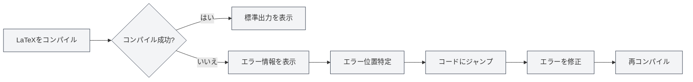

# コンソール出力

## 概要

コンソール出力パネルは、LaTeXコンパイルプロセス中のログ情報を表示します。標準出力、エラーメッセージ、警告メッセージなどが含まれます。コンソール出力を確認することで、コンパイルプロセスを理解し、エラーを特定し、問題をデバッグすることができます。

コンソール出力はMonacoエディタを使用して表示され、シンタックスハイライト、エラー位置特定、ログフィルタリングなどの機能をサポートし、コンパイルログを効率的に閲覧・分析できるようにします。

## LaTeXコンパイル出力

<LaTeXConsole mode="demo" />

### 標準出力

コンパイルプロセス中の標準出力はコンソールに表示されます：

- **コンパイル進捗**：コンパイルの各段階を表示
- **パッケージダウンロード**：ダウンロードされたパッケージ情報を表示
- **コンパイル情報**：コンパイルプロセスの詳細情報を表示

標準出力は通常のテキストとして表示され、コンパイルプロセスを理解するのに役立ちます。

コンソール出力パネルのインターフェースは以下の通りです：

<ConsoleTerminal mode="demo" consoleKey="demo" :history='[{"content": "コンパイル開始...", "type": "out"}, {"content": "警告：未定義の参照", "type": "warn"}, {"content": "コンパイル完了", "type": "out"}]' />

### 出力形式

<ConsoleTerminal mode="demo" consoleKey="demo" :history='[{"content": "標準出力情報", "type": "out"}, {"content": "警告情報", "type": "warn"}, {"content": "エラー情報", "type": "error"}]' />

コンソール出力は、異なる色を使用して異なる種類の情報を区別します：

- **標準出力**：灰色のテキスト、通常のコンパイル情報を表示
- **エラー情報**：赤色のテキスト、コンパイルエラーを表示
- **警告情報**：黄色のテキスト、コンパイル警告を表示
- **デバッグ情報**：濃い灰色のテキスト、デバッグ情報を表示

## エラー情報表示

<LaTeXConsole mode="demo" />

### エラー形式

コンパイルエラーは特定の形式で表示されます：

- **エラー位置**：エラーが発生したファイル名、行番号、列番号を表示
- **エラータイプ**：エラーの種類（例：構文エラー、ファイル欠落など）を表示
- **エラー説明**：エラーの詳細な説明を表示

### エラー位置特定

コンソール出力はエラー位置特定機能をサポートします：

- **エラークリック**：エラー情報をクリックすると、対応するコード位置にジャンプ
- **ハイライト表示**：エラーに対応するコード行がハイライト表示されます
- **クイックフィックス**：エラー位置に素早く移動し、修正を容易にします

### 一般的なエラータイプ

LaTeXコンパイルでは以下のエラーが発生する可能性があります：

- **構文エラー**：LaTeX構文が正しくない
- **未定義コマンド**：未定義のLaTeXコマンドを使用している
- **環境未閉じ**：環境が正しく閉じられていない
- **ファイル欠落**：参照されたファイルが存在しない
- **パッケージエラー**：パッケージの読み込み失敗または競合

## 警告情報表示

<ConsoleTerminal mode="demo" consoleKey="demo" :history='[{"content": "警告: 未定義の参照", "type": "warn"}]' />

### 警告形式

コンパイル警告は特定の形式で表示されます：

- **警告位置**：警告が発生した位置を表示
- **警告タイプ**：警告の種類を表示
- **警告説明**：警告の詳細な説明を表示

### 警告処理

警告情報は通常コンパイルを妨げませんが、最終的な結果に影響を与える可能性があります：

- **警告を確認**：警告情報を注意深く確認し、考えられる問題を理解する
- **警告を修正**：警告情報に基づいてコードを修正する
- **警告を無視**：警告が結果に影響を与えない場合は、一時的に無視することができる

## ログフィルタリング

<LaTeXConsole mode="demo" />

### フィルタ機能

コンソール出力はログフィルタリング機能をサポートします：

- **タイプ別フィルタ**：エラー、警告、または標準出力のみを表示
- **キーワードフィルタ**：特定のキーワードを含むログをフィルタリング
- **時間フィルタ**：特定の時間帯のログをフィルタリング

### フィルタ設定

ログフィルタリングはコンソールパネルで設定できます：

1.  コンソール出力パネルを開く
2.  フィルタオプションを使用して表示する内容を選択
3.  キーワードを入力して検索フィルタリング

### ログクリア

コンソール出力をクリア：

- **クリアボタン**：コンソールの「クリア」ボタンをクリック
- **ショートカットキー**：`Ctrl+L`（設定されている場合）

ログをクリアすると、表示されているすべてのログ情報が削除されます。

## ログ操作

<ConsoleTerminal mode="demo" consoleKey="demo" :history='[{"content": "コンパイルログ内容...", "type": "out"}]' />

### ログコピー

コンソール出力をクリップボードにコピー：

- **コピーボタン**：コンソールの「コピー」ボタンをクリック
- **ショートカットキー**：`Ctrl+C`（テキスト選択後）

ログをコピーすると、他の場所に保存したり、他の人と共有したりできます。

### ログ保存

コンソール出力をファイルに保存：

- **保存ボタン**：コンソールの「ログを保存」ボタンをクリック
- **ファイル選択**：保存場所とファイル名を選択

保存されたログファイルは、後続の分析や問題報告に使用できます。

### AI分析

コンソール出力はAI分析機能をサポートします：

- **AI分析を有効化**：コンソールパネルでAI分析スイッチを有効にする
- **自動分析**：AIが自動的にエラー情報を分析し、修正提案を提供
- **提案を確認**：AIが提供するエラー修正提案を確認

AI分析機能は、コンパイルエラーを迅速に理解し修正するのに役立ちます。

## コンソール設定

<LaTeXConsole mode="demo" />

### 表示オプション

コンソール出力は以下の表示オプションをサポートします：

- **行番号表示**：ログ行の行番号を表示
- **自動折り返し**：長い行を自動的に折り返して表示
- **フォントサイズ**：ログ表示のフォントサイズを調整

### テーマ設定

コンソール出力はエディタのテーマに追従します：

- **ライトテーマ**：ライトテーマでは明るい背景を使用
- **ダークテーマ**：ダークテーマでは暗い背景を使用
- **自動同期**：エディタのテーマ設定を自動的に同期

## 使用上のヒント

<ConsoleTerminal mode="demo" consoleKey="demo" :history='[{"content": "エラー位置に移動...", "type": "out"}]' />

### エラーの迅速な特定

1.  **エラー情報を確認**：エラー情報の形式と内容を注意深く確認する
2.  **位置特定機能を使用**：エラー情報をクリックしてコード位置に素早くジャンプ
3.  **コンテキストを確認**：エラー位置の周辺コードを確認する

### コンパイルログの理解

1.  **標準出力を読む**：コンパイルプロセスの各段階を理解する
2.  **エラー情報に注目**：エラー情報に重点を置き、優先的に修正する
3.  **警告情報を確認**：警告情報を確認し、考えられる問題を理解する

### デバッグのヒント

1.  **段階的なコンパイル**：コードの一部をコメントアウトし、問題を段階的に特定する
2.  **完全なログを確認**：完全なコンパイルログを確認し、コンパイルプロセスを理解する
3.  **AI分析を使用**：AI分析機能を有効にして、修正提案を取得する

## よくある質問

<LaTeXConsole mode="demo" />

### Q: コンソール出力が表示されない？

A: コンソール出力パネルが開いていることを確認してください。LaTeX文書をコンパイルすると、コンソールパネルが自動的に開きます。

### Q: エラーを素早く見つけるには？

A: エラー情報は赤色で表示されます。エラー情報をクリックすると、コード位置に素早くジャンプできます。

### Q: ログが多すぎる場合は？

A: フィルタ機能を使用して不要なログをフィルタリングするか、クリア機能を使用して古いログをクリアしてください。

### Q: コンパイルログを保存するには？

A: コンソールの「ログを保存」ボタンをクリックし、保存場所を選択するとログファイルを保存できます。

### Q: AI分析が不正確？

A: AI分析は参考情報です。エラー情報とコードのコンテキストを組み合わせて判断することをお勧めします。手動で修正するか、再分析することができます。

## 関連ドキュメント

- [[latex.compilation|LaTeXコンパイルとプレビュー]]
- [[latex.editor|LaTeXエディタ使用ガイド]]
- [[latex.pdf-preview|PDFプレビュー機能]]

<PdfPreviewPanel mode="demo" pdfUrl="" />

<LaTeXCompilerPanel mode="demo" />

<LaTeXEditorDemo mode="demo" />
