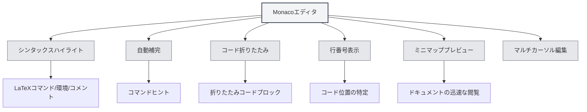

# LaTeXエディタ使用ガイド

## 概要

MetaDocのLaTeXエディタはMonaco Editorをベースとしており、プロフェッショナルなLaTeXコード編集体験を提供します。エディタはシンタックスハイライト、自動補完、コード折りたたみなどの機能をサポートし、LaTeXドキュメントの効率的な作成を支援します。

Monaco EditorはVisual Studio Codeで使用されているエディタコアであり、強力なコード編集能力と豊富な機能特性を備えています。

<PdfPreviewPanel mode="demo" pdfUrl="" />

<ConsoleTerminal mode="demo" consoleKey="demo" :history='[{"content": "コンパイル完了", "type": "out"}]' />

<QuickStartLatex mode="demo" />

<LaTeXEditor mode="demo" />

## Monacoエディタの紹介

Monaco EditorはLaTeX編集に以下の特性を提供します：

- **シンタックスハイライト**：LaTeXコマンド、環境、コメントなどの異なる構文要素を異なる色で表示
- **自動補完**：LaTeXコマンド入力時に自動的に補完候補を表示
- **コード折りたたみ**：コードブロックの折りたたみをサポートし、長いドキュメントの閲覧を容易にします
- **行番号表示**：行番号を表示し、コード位置の特定を容易にします
- **ミニマッププレビュー**：右側にコードの縮小図を表示し、ドキュメント構造を素早く閲覧できます
- **マルチカーソル編集**：複数のカーソルでの同時編集をサポート

<LaTeXEditorDemo mode="demo" />

## コードハイライトとシンタックスヒント

### シンタックスハイライト

LaTeXエディタは自動的に認識し、以下をハイライト表示します：

- **コマンド**：`\documentclass`、`\usepackage` などのLaTeXコマンド
- **環境**：`\begin{document}`、`\end{document}` などの環境マーカー
- **コメント**：`%` で始まるコメント行
- **数式**：`$`、`$$` で囲まれた数式領域
- **特殊文字**：`&`、`#`、`$` などの特殊文字

シンタックスハイライトにより、コード構造がより明確になり、読み取りと編集が容易になります。

### シンタックスヒント

エディタは以下の状況でシンタックスヒントを表示します：

- **コマンド入力**：`\` を入力後に利用可能なLaTeXコマンドを自動表示
- **環境入力**：`\begin{` を入力後に利用可能な環境名を表示
- **パッケージ名入力**：`\usepackage{` を入力後に一般的なパッケージ名を表示

シンタックスヒントは、正しいLaTeXコマンドを素早く入力し、入力エラーを減らすのに役立ちます。

<LaTeXEditor mode="demo" />

## 行番号表示

### 行番号の表示

行番号はエディタの左側に表示され、以下を支援します：

- **コードの特定**：特定の行に素早く移動
- **エラーの検索**：コンパイルエラーは行番号を表示し、問題の特定を容易にします
- **コード参照**：ドキュメント内で特定のコード行を参照するのに便利です

### 行番号の設定

行番号表示は設定で構成できます：

1. 設定ページを開く
2. 「行番号表示」オプションを見つける
3. トグルスイッチで行番号を有効または無効にする

行番号設定はすべてのMonacoエディタ（LaTeXエディタ、プレーンテキストエディタなど）に影響します。

<LaTeXEditorDemo mode="demo" />

## ミニマッププレビュー

### ミニマップ機能

ミニマップ（Minimap）はエディタ右側のコード縮小図です：

- **迅速な閲覧**：ミニマップでドキュメント全体の構造を確認できます
- **迅速な位置特定**：ミニマップをクリックして対応する位置に素早くジャンプできます
- **構造プレビュー**：色の違いを通じてドキュメントの異なる部分を理解できます

### ミニマップの表示/非表示

ミニマップは以下の方法で制御できます：

1. エディタ内で右クリック
2. 「ミニマップ」または「Minimap」オプションを探す
3. 表示状態を切り替える

ミニマップは特に長いドキュメントの編集に適しており、ドキュメント構造を素早く理解するのに役立ちます。

## コード折りたたみ

### 折りたたみ機能

コード折りたたみにより、コードブロックを折りたたみ、表示する必要のない部分を隠すことができます：

- **環境の折りたたみ**：`\begin{...}...\end{...}` 環境ブロックを折りたたむ
- **関数の折りたたみ**：カスタムコマンド定義を折りたたむ
- **コメントの折りたたみ**：長いコメントセクションを折りたたむ

### 折りたたみの使用

- **折りたたむ**：行番号左側の折りたたみアイコンをクリック、またはショートカット `Ctrl+Shift+[` を使用
- **展開する**：折りたたみマーカーをクリック、またはショートカット `Ctrl+Shift+]` を使用
- **すべて折りたたむ**：ショートカット `Ctrl+K Ctrl+0` を使用してすべてのコードブロックを折りたたむ
- **すべて展開する**：ショートカット `Ctrl+K Ctrl+J` を使用してすべてのコードブロックを展開する

コード折りたたみにより、現在編集中の部分に集中でき、編集効率が向上します。

<LaTeXEditorDemo mode="demo" />

## 自動補完

### 補完のトリガー

エディタは以下の状況で自動的に補完候補を表示します：

- **コマンド入力**：`\` を入力後にLaTeXコマンドリストを表示
- **環境入力**：`\begin{` を入力後に環境名を表示
- **パッケージ名入力**：`\usepackage{` を入力後に一般的なパッケージ名を表示
- **その他の文字**：他の文字を入力後も関連する候補を表示することがあります

### 補完の受け入れ

- **Enterキー**：現在選択されている補完候補を受け入れる
- **Tabキー**：現在選択されている補完候補を受け入れる
- **方向キー**：補完リスト内で上下に移動して選択
- **Escキー**：補完候補をキャンセル

### 補完設定

補完機能はエディタ設定で構成できます：

- **クイック候補**：他の文字入力後に自動的に補完候補を表示
- **トリガー文字**：特定の文字（例：`\`）入力後に自動的に補完を表示
- **受け入れ文字**：コミット文字入力時に自動的に補完を受け入れる

<LaTeXEditor mode="demo" />

## 編集機能

### マルチカーソル編集

Monacoエディタは複数のカーソルでの同時編集をサポートします：

- **Alt+クリック**：クリック位置に新しいカーソルを追加
- **Ctrl+Alt+上/下矢印**：上/下にカーソルを追加
- **Ctrl+D**：次の同じ単語を選択し、カーソルを追加
- **Ctrl+Shift+L**：すべての同じ単語を選択し、カーソルを追加

マルチカーソル編集により、複数の位置を同時に変更でき、編集効率が向上します。

### 列選択

列選択モードをサポートします：

- **Alt+Shift+ドラッグ**：矩形領域を選択
- **Alt+Shift+方向キー**：列選択を拡張

列選択はテーブルや整列されたコードの編集に適しています。

### コードフォーマット

エディタは基本的なコードフォーマットをサポートします：

- **自動インデント**：コード構造に基づいて自動的にインデント
- **自動折り返し**：長い行を自動的に折り返して表示
- **インデント方式**：異なるインデント方式（スペース、タブ）をサポート

<LaTeXEditorDemo mode="demo" />

## 検索と置換

### 検索機能

- **ショートカット**：`Ctrl+F` で検索ダイアログを開く
- **ハイライト表示**：検索結果はドキュメント内でハイライト表示されます
- **循環検索**：ドキュメント末尾に到達後、自動的に先頭から再開

### 置換機能

- **ショートカット**：`Ctrl+H` で検索置換ダイアログを開く
- **個別置換**：一致するテキストを一つずつ置換
- **すべて置換**：一致するすべてのテキストを一度に置換

### 詳細オプション

検索と置換は以下のオプションをサポートします：

- **大文字小文字の区別**：大文字小文字が完全に一致するテキストのみ一致
- **単語全体の一致**：完全な単語のみ一致
- **正規表現**：正規表現を使用したパターンマッチング

<LaTeXEditorDemo mode="demo" />

## ショートカットキーリファレンス

### 編集ショートカット

| 操作 | Windows/Linux | macOS   |
| ---- | ------------- | ------- |
| 元に戻す | `Ctrl+Z`      | `Cmd+Z` |
| やり直し | `Ctrl+Y`      | `Cmd+Y` |
| コピー | `Ctrl+C`      | `Cmd+C` |
| 貼り付け | `Ctrl+V`      | `Cmd+V` |
| すべて選択 | `Ctrl+A`      | `Cmd+A` |
| 検索 | `Ctrl+F`      | `Cmd+F` |
| 置換 | `Ctrl+H`      | `Cmd+H` |

### コード折りたたみショートカット

| 操作     | Windows/Linux   | macOS          |
| -------- | --------------- | -------------- |
| 折りたたむ | `Ctrl+Shift+[`  | `Cmd+Option+[` |
| 展開する | `Ctrl+Shift+]`  | `Cmd+Option+]` |
| すべて折りたたむ | `Ctrl+K Ctrl+0` | `Cmd+K Cmd+0`  |
| すべて展開する | `Ctrl+K Ctrl+J` | `Cmd+K Cmd+J`  |

### マルチカーソルショートカット

| 操作               | Windows/Linux  | macOS          |
| ------------------ | -------------- | -------------- |
| カーソルを追加     | `Alt+クリック` | `Option+クリック` |
| 上にカーソルを追加 | `Ctrl+Alt+↑`   | `Cmd+Option+↑` |
| 下にカーソルを追加 | `Ctrl+Alt+↓`   | `Cmd+Option+↓` |
| 次の同じ単語を選択 | `Ctrl+D`       | `Cmd+D`        |
| すべての同じ単語を選択 | `Ctrl+Shift+L` | `Cmd+Shift+L`  |

<LaTeXEditor mode="demo" />

## 使用上のヒント

### 迅速な入力

1. **コマンド補完**：`\` を入力後、方向キーでコマンドを選択し、Enterで受け入れる
2. **環境補完**：`\begin{` を入力後、環境名を選択すると、エディタが自動的に `\end{...}` を補完します
3. **パッケージ名補完**：`\usepackage{` を入力後、パッケージ名を選択してマクロパッケージを迅速に追加

<LaTeXEditor mode="demo" />

### コードの整理

1. **折りたたみの使用**：表示する必要のないコードブロックを折りたたみ、編集領域を整理する
2. **コメントの使用**：コードの機能を説明するコメントを追加し、後のメンテナンスを容易にする
3. **適切なインデント**：コードのインデントを一貫させ、可読性を向上させる

<LaTeXEditorDemo mode="demo" />

### エラーの特定

1. **行番号の確認**：コンパイルエラーは行番号を表示するので、エディタで素早く特定できます
2. **検索機能の使用**：検索機能を使用して特定のコマンドやテキストを素早く特定する
3. **ミニマップの使用**：ミニマップでドキュメント構造を素早く閲覧する

## よくある質問

### Q: 自動補完が表示されません？

A: エディタ設定の「クイック候補」オプションが有効になっているか確認してください。`\` を入力後、自動的に補完候補が表示されるはずです。

### Q: コードを折りたたむにはどうすればよいですか？

A: 行番号左側の折りたたみアイコンをクリックするか、ショートカット `Ctrl+Shift+[` を使用します。折りたたまれた環境ブロックは行番号左側に折りたたみマーカーを表示します。

### Q: ミニマップが表示されません？

A: エディタ設定の「ミニマップ」オプションが有効になっているか確認してください。ミニマップはエディタの右側に表示されます。

### Q: 特定の行に素早くジャンプするにはどうすればよいですか？

A: ショートカット `Ctrl+G`（Windows/Linux）または `Cmd+G`（macOS）で「行に移動」ダイアログを開き、行番号を入力してジャンプします。

### Q: コードフォーマットが正しくありません？

A: MonacoエディタはLaTeX構文に基づいて自動的にインデントします。インデントが正しくない場合は、手動で調整するか、Tabキーを使用してください。

## 関連ドキュメント

- [[latex.basics|LaTeX構文]]
- [[latex.compilation|LaTeXコンパイルとプレビュー]]
- [[latex.pdf-preview|PDFプレビュー機能]]
- [[latex.console|コンソール出力]]
- [[core.editor-basics|エディタ基本操作]]
- [[core.editor-settings|エディタ設定]]