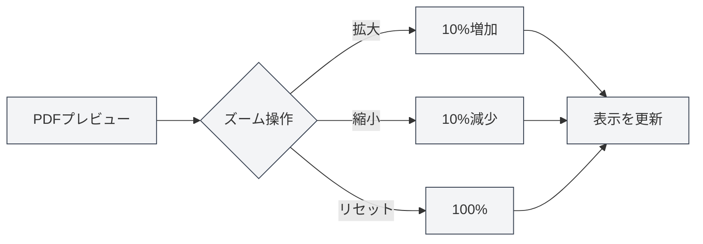

# PDFプレビュー機能

## 概要

PDFプレビュー機能は、LaTeX文書を編集しながらコンパイル後のPDF効果をリアルタイムで確認できます。プレビューパネルは、ズーム、ページめくり、位置特定など豊富なインタラクティブ機能を提供し、LaTeX文書の効率的な編集とデバッグを可能にします。

PDFプレビューはLaTeXコンパイル成功後に自動的に表示され、コードエディタとの双方向位置特定をサポートし、PDFとコード間の迅速な切り替えを容易にします。

<PdfPreviewPanel mode="demo" pdfUrl="" />

## PDFプレビュー紹介

### プレビューパネル

PDFプレビューパネルはLaTeXエディタの右側または下側に表示され、以下を含みます：

- **PDFコンテンツ領域**：PDFページの内容を表示
- **ツールバー**：ズーム、ページめくり、更新などの操作ボタンを提供
- **ページ情報**：現在のページ番号と総ページ数を表示

PDFプレビューパネルのインターフェースは以下の通りです：

<PdfPreviewPanel mode="demo" pdfUrl="" />

<LaTeXCompilerPanel mode="demo" />

### 自動表示

PDFプレビューは以下の状況で自動的に表示されます：

- **コンパイル成功**：LaTeXコンパイル成功後に自動的にPDFプレビューを表示
- **文書を開く**：既存のPDFがあるLaTeX文書を開く際に自動的にプレビューを表示
- **手動で開く**：ツールバーの「プレビュー」ボタンをクリックして手動でプレビューを開く

<PdfPreviewPanel mode="demo" pdfUrl="" />

## PDFズーム

### PDFを拡大

PDFプレビューを拡大：

- **ツールバーボタン**：ツールバーの「拡大」ボタン（+アイコン）をクリック
- **マウスホイール**：`Ctrl`キーを押しながらマウスホイールを上に回転
- **ショートカットキー**：`Ctrl+=`（設定されている場合）

拡大ごとに10%の倍率が増加します。

<LaTeXEditorDemo mode="demo" />

### PDFを縮小

PDFプレビューを縮小：

- **ツールバーボタン**：ツールバーの「縮小」ボタン（-アイコン）をクリック
- **マウスホイール**：`Ctrl`キーを押しながらマウスホイールを下に回転
- **ショートカットキー**：`Ctrl+-`（設定されている場合）

縮小ごとに10%の倍率が減少します。

### ズームをリセット

PDFズームを100%にリセット：

- **ツールバーボタン**：ツールバーの「ズームリセット」ボタンをクリック
- **ショートカットキー**：`Ctrl+0`（設定されている場合）

### ズーム範囲

PDFズームがサポートする範囲：

- **最小値**：20%（0.2倍）
- **最大値**：500%（5倍）
- **デフォルト値**：100%（1倍）

ズーム倍率は有効範囲内に自動的に制限されます。

<PdfPreviewPanel mode="demo" pdfUrl="" />

## PDF更新

### 手動更新

PDFプレビューを手動で更新：

- **ツールバーボタン**：ツールバーの「更新」ボタンをクリック
- **ショートカットキー**：`F5`（設定されている場合）

更新によりPDFファイルが再読み込みされ、最新のコンパイル結果が表示されます。

### 自動更新

PDFプレビューは以下の状況で自動的に更新されます：

- **コンパイル成功**：LaTeXコンパイル成功後に自動的にプレビューを更新
- **PDFファイル更新**：PDFファイルの更新が検出された際に自動的に更新

### 更新タイミング

以下の状況でPDFを更新することをお勧めします：

- **コード修正後**：LaTeXコードを修正して再コンパイルした後
- **プレビュー異常時**：PDFプレビューの表示が異常または内容が正しくない場合
- **長時間編集後**：長時間編集後に最新の効果を確認する必要がある場合

<LaTeXEditorDemo mode="demo" />

## PDFからコードへの位置特定

### PDFからコードへの位置特定

PDFプレビューで特定の位置をクリックすると、エディタが自動的に対応するLaTeXコードの位置にジャンプします：

1. **PDF位置をクリック**：PDFプレビューで確認したい位置をクリック
2. **自動ジャンプ**：エディタが自動的に対応するLaTeXコードにジャンプ
3. **ハイライト表示**：対応するコード行がハイライト表示される

この機能により、PDF効果からソースコードへの迅速な位置特定が可能になり、デバッグと修正が容易になります。

<PdfPreviewPanel mode="demo" pdfUrl="" />

### コードからPDFへの位置特定

LaTeXエディタでは、以下の操作が可能です：

1. **コードを選択**：確認したいLaTeXコードを選択
2. **右クリックメニュー**：右クリックして「PDFに位置特定」を選択
3. **プレビューにジャンプ**：PDFプレビューが自動的に対応する位置にジャンプ

### 双方向位置特定

PDFとコード間の双方向位置特定機能：

- **PDF → コード**：PDF位置をクリックしてコードにジャンプ
- **コード → PDF**：コードを選択してPDF位置にジャンプ
- **同期スクロール**：PDFとコードの同期スクロールをサポート

<ConsoleTerminal mode="demo" consoleKey="demo" :history='[{"content": "PDFページナビゲーション...", "type": "out"}]' />

## PDFページナビゲーション

### ページめくり操作

PDFプレビューは以下のページめくり操作をサポートします：

- **前のページ**：ツールバーの「前のページ」ボタンをクリック、または方向キーを使用
- **次のページ**：ツールバーの「次のページ」ボタンをクリック、または方向キーを使用
- **ページにジャンプ**：ページ番号入力欄にページ番号を入力してEnterキーを押す

### ページ情報

PDFプレビューは以下のページ情報を表示します：

- **現在のページ番号**：現在表示しているページ番号を表示
- **総ページ数**：PDFの総ページ数を表示
- **ページ番号入力欄**：直接ページ番号を入力してジャンプ可能

### 複数ページ表示

PDFプレビューは複数ページ表示モードをサポートします：

- **単一ページモード**：一度に1ページを表示
- **複数ページモード**：一度に複数ページを表示（ホームプレビュー内）

複数ページモードは文書全体の迅速な閲覧に適しています。

<PdfPreviewPanel mode="demo" pdfUrl="" />

## PDF保存

### PDFを保存

現在のPDFファイルを保存：

- **ツールバーボタン**：ツールバーの「保存」ボタンをクリック
- **メニュー**：「ファイル」→「PDFを保存」をクリック
- **ショートカットキー**：`Ctrl+S`（PDFが現在アクティブな文書の場合）

PDFを保存すると、PDFファイルは文書と同じディレクトリに保存されます。

### PDFディレクトリを開く

PDFファイルが存在するディレクトリを開く：

- **ツールバーボタン**：ツールバーの「ディレクトリを開く」ボタンをクリック
- **メニュー**：「ファイル」→「PDFディレクトリを開く」をクリック

ディレクトリを開くと、ファイルマネージャーでPDFファイルを確認および管理できます。

<LaTeXEditorDemo mode="demo" />

## PDFインタラクションモード

### ポインターモード

ポインターモードはデフォルトのインタラクションモードです：

- **テキストを選択**：PDF内のテキストを選択可能
- **テキストをコピー**：選択したテキストをコピー可能
- **クリック位置特定**：PDF位置をクリックしてコードに位置特定可能

### ハンドモード

ハンドモードはPDFのドラッグに使用します：

- **PDFをドラッグ**：マウス左ボタンを押しながらPDFコンテンツをドラッグ
- **ビューを移動**：PDFビューの位置を移動
- **大規模PDFに適応**：大サイズのPDF閲覧に適しています

モード切替：

- **ツールバーボタン**：ツールバーのモード切替ボタンをクリック
- **ショートカットキー**：`H`キーでハンドモードを切り替え

## 使用上のヒント

### 効率的なプレビュー

1. **ズームを使用**：コンテンツに応じて適切なズーム倍率を調整
2. **位置特定を使用**：位置特定機能を使用してコードとPDFを迅速に切り替え
3. **更新を使用**：コード修正後にタイムリーに更新して効果を確認

### デバッグのヒント

1. **エラー位置特定**：PDFからコードに位置特定し、問題の位置を迅速に見つける
2. **効果を比較**：PDF効果とコードを比較し、フォーマットが正しいか確認
3. **複数ページ閲覧**：複数ページモードを使用して文書全体を迅速に閲覧

### パフォーマンス最適化

1. **適切なズーム**：過度に大きなズーム倍率を使用しない
2. **プレビューを閉じる**：不要な際はプレビューパネルを閉じてリソースを節約
3. **更新戦略**：必要に応じて自動または手動更新を選択

## よくある質問

### Q: PDFプレビューが表示されない？

A: LaTeX文書が正常にコンパイルされていることを確認してください。コンパイルが失敗した場合、PDFプレビューは表示されません。コンソール出力のエラーメッセージを確認してください。

### Q: PDFプレビューが更新されない？

A: 「更新」ボタンをクリックして手動でプレビューを更新するか、LaTeX文書を再コンパイルしてください。PDFファイルが正常に生成されていることを確認してください。

### Q: PDFからコードに位置特定するには？

A: PDFプレビューで確認したい位置をクリックすると、エディタが自動的に対応するLaTeXコードにジャンプします。

### Q: コードからPDFに位置特定するには？

A: LaTeXコードを選択し、右クリックして「PDFに位置特定」を選択すると、PDFプレビューが自動的に対応する位置にジャンプします。

### Q: PDFズームが有効にならない？

A: PDFプレビューパネルが完全に読み込まれていることを確認してください。問題が続く場合は、PDFプレビューを更新してみてください。

## 関連ドキュメント

- [[latex.compilation|LaTeXコンパイルとプレビュー]]
- [[latex.editor|LaTeXエディタ使用ガイド]]
- [[latex.console|コンソール出力]]

<LaTeXCompilerPanel mode="demo" />

<LaTeXEditorDemo mode="demo" />

<ConsoleTerminal mode="demo" consoleKey="demo" :history='[{"content": "コンパイルログ...", "type": "out"}]' />