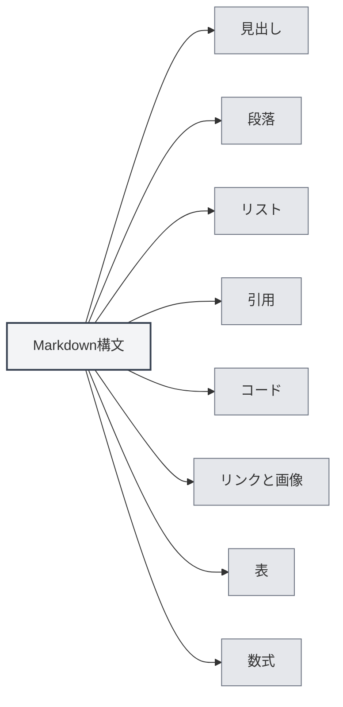

# Markdown構文

## 概要

Markdownは、読み書きしやすいプレーンテキスト形式で文書を作成できる軽量マークアップ言語です。MetaDocは完全なMarkdown編集およびプレビュー機能を提供します。

<ViewMenuItemsDemo mode="demo" :items='["outline", "preview"]' />

## 基本構文

### 見出し

`#` 記号を使用して見出しを作成します。`#` の数が見出しのレベルを表します：

```markdown
# レベル1の見出し

## レベル2の見出し

### レベル3の見出し
```



### 段落

段落は空行で区切ります。

### リスト

**順序なしリスト**は `-`、`*`、または `+` を使用します：

```markdown
- 項目1
- 項目2
- 項目3
```

**順序付きリスト**は数字を使用します：

```markdown
1. 最初の項目
2. 2番目の項目
3. 3番目の項目
```

### 引用

`>` を使用して引用を作成します：

```markdown
> これは引用テキストです
```

### コード

**インラインコード**はバッククォートを使用します：

```markdown
`console.log()` を使用して内容を出力します
```

**コードブロック**は3つのバッククォートを使用します：

````markdown
```javascript
function hello() {
  console.log('Hello, World!')
}
```
````

### リンクと画像

**リンク**：

```markdown
[リンクテキスト](https://example.com)
```

**画像**：

```markdown

```

### 表

```markdown
| 列1   | 列2   | 列3   |
| ----- | ----- | ----- |
| データ1 | データ2 | データ3 |
```

## 数式

### インライン数式

`$` で囲みます：

```markdown
これはインライン数式です：$E = mc^2$
```

### ブロックレベル数式

`$$` で囲みます：

```markdown
$$
\int_{-\infty}^{\infty} e^{-x^2} dx = \sqrt{\pi}
$$
```

## 高度な機能

### LaTeX数式変換

MetaDocは、Markdown内の数式をLaTeX形式に変換する機能をサポートしています。詳細は[[latex.basics|LaTeX構文]]を参照してください。

### 図表サポート

MetaDocは複数の図表形式をサポートしています：

- [[charts.mermaid|Mermaid図表]]
- [[charts.plantuml|PlantUML図表]]
- [[charts.echarts|ECharts図表]]

## 関連ドキュメント

- [[markdown.editor|Markdownエディター使用ガイド]]
- [[markdown.advanced|Markdown高度な機能]]
- [[markdown.features|Markdownエディター機能]]
- [[core.editor-basics|エディター基本操作]]

<LaTeXEditorDemo mode="demo" />

<Outline mode="demo" />

<ViewMenuItemsDemo mode="demo" :items='["outline"]' />

<MenuItemsDemo mode="demo" :items='[{"id": "file", "items": ["new", "open", "save"]}]' />

<TitleMenu mode="demo" title="Markdown文書例" path="1" :tree='{}' />

<ViewMenuItemsDemo mode="demo" :items='["editor", "preview"]' />