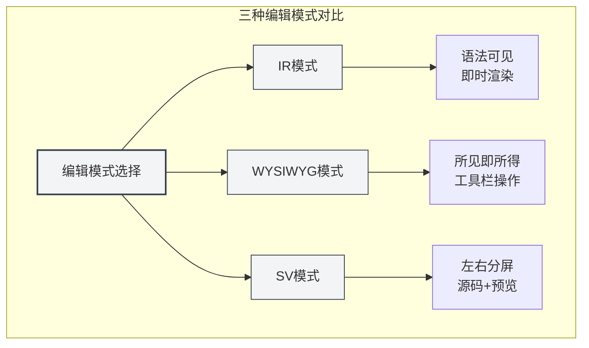
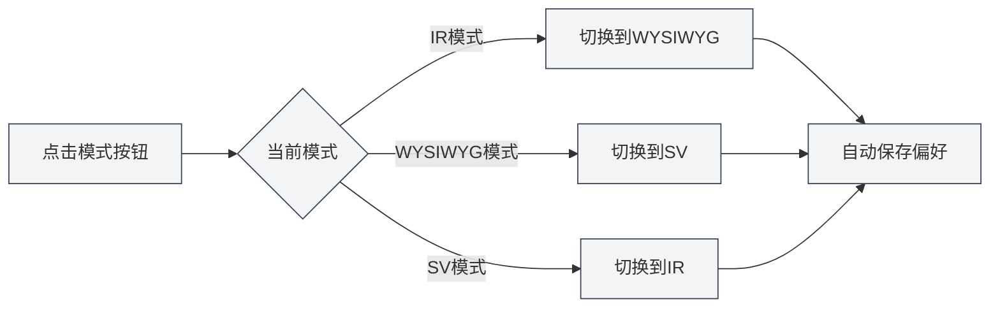
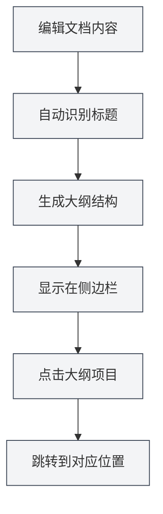
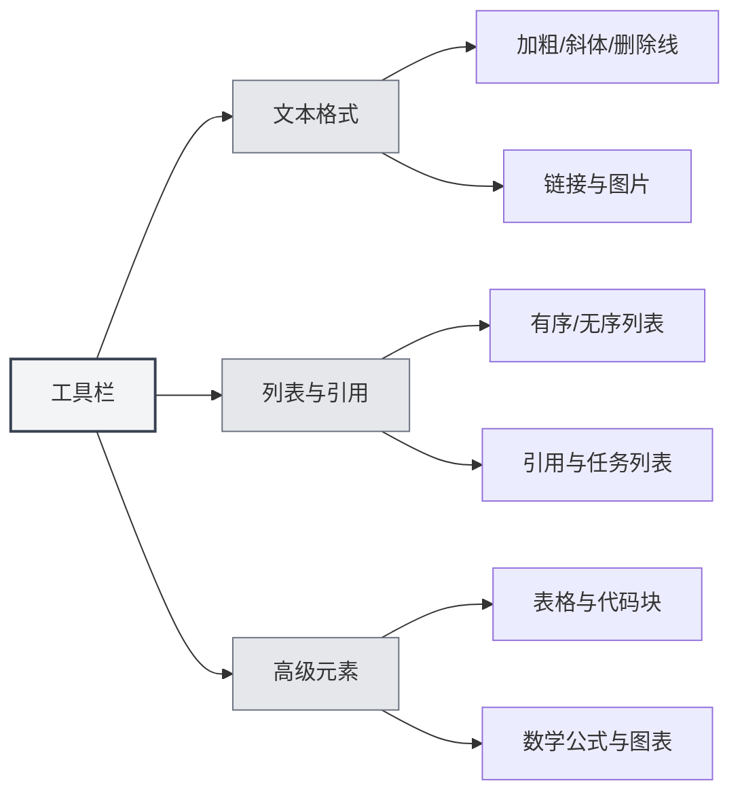

# Markdownエディタ使用ガイド

## 概要

MetaDocのMarkdownエディタは、プロフェッショナルでエレガントな執筆環境を提供します。単なるテキスト入力ボックスではなく、深く最適化された創作空間であり、3つの柔軟な編集モード、リアルタイムのコンテンツプレビュー、豊富な書式設定ツールをサポートしています。これにより、フォーマットに煩わされることなく、コンテンツそのものに集中できます。

技術ブログの執筆、学習ノートの整理、プロジェクトドキュメントの作成など、どのような用途にも対応します。特に、深く統合されたAI機能は、執筆中にインテリジェントな補完と提案を提供し、創作をよりスムーズにします。

<TitleMenu mode="demo" title="Markdown编辑器示例" path="1" :tree='{}' />

<SectionOptimizer mode="demo" title="段落优化示例" path="1" :tree='{}' language="markdown" :adapter='null' />

<QuickStartMarkdown mode="demo" />

## 3つの編集モード

MetaDocは、ユーザーによって異なる編集習慣を理解しているため、3つの編集モードを選択可能にしています：

### IRモード（インスタントレンダリング）

これはデフォルトの編集モードであり、多くのMarkdownユーザーに好まれています。このモードでは：

- **即時フィードバック**：Markdown構文を入力すると同時に、内容が即座にフォーマットされた状態で表示されます
- **構文可視化**：Markdownのマークアップ記号（例：`#`、` **`）が依然として見えるため、フォーマットを正確に制御できます
- **編集の滑らかさ**：レンダリング速度が速く、長いドキュメントを編集しても遅延を感じません
- **学習に優しい**：Markdown構文を学習中のユーザーは、構文と効果の対応関係を即座に確認できます

**適用シーン**：

- Markdown構文に慣れているユーザー
- ドキュメントフォーマットを正確に制御する必要があるシーン
- 長い技術文書やブログ記事を編集する場合

### WYSIWYGモード（見たまま編集）

Wordのような編集体験に慣れている方には、このモードが親しみやすいでしょう：

- **直接編集**：見ているものが最終結果であり、クリックするだけで編集できます
- **構文の暗記不要**：ツールバーボタンで太字、見出し、リストなどの操作を完了します
- **直感的な操作**：テキストを選択してボタンをクリックするだけでフォーマットを適用できます
- **低い学習コスト**：Markdown構文に不慣れなユーザーでもすぐに使い始められます

**適用シーン**：

- Markdownを初めて使用するユーザー
- 素早く書式設定を行い、基盤となる構文を気にしないシーン
- ビジュアル編集に慣れているユーザー

### SVモード（スプリットビュープレビュー）

このモードは編集領域を二分割します：

- **左右対照**：左側にMarkdownソースコード、右側にレンダリング結果を表示します
- **リアルタイム同期**：左側で編集すると、右側のプレビューが即座に更新されます
- **学習ツール**：構文と最終結果を同時に見られるため、Markdownの理解が深まります
- **正確な校正**：複雑なフォーマット（表、ネストされたリストなど）が正しいか確認しやすくなります

**適用シーン**：

- Markdown構文を学習中のユーザー
- ソースコードと効果を同時に確認して校正する必要がある場合
- 複雑なフォーマットを含むドキュメントを編集する場合



### モードの切り替え方法

編集モードの切り替えは非常に簡単です：

1. **ツールバーボタン**：エディタ上部のツールバーにあるモード切り替えボタンを見つけます
2. **循環切り替え**：ボタンをクリックすると、3つのモード間で循環して切り替わります
3. **設定の記憶**：システムは最後に使用したモードを記憶し、次回ドキュメントを開いたときに自動的に復元します



## リアルタイムプレビュー

MetaDocのリアルタイムプレビュー機能は、執筆を楽しみに変えます：

- **自動レンダリング**：左側（または上側）で内容を入力すると、右側（または下側）に即座にレンダリング結果が表示されます
- **完全サポート**：基本的な見出し、リストから、複雑な数式、図表まで、すべて正しくレンダリングされます
- **コードハイライト**：コードブロックは言語タイプに応じて自動的にシンタックスハイライトされ、コードが読みやすくなります
- **数式**：LaTeX構文の数式をサポートし、インライン数式 `$E=mc^2$` でも独立した数式ブロックでも、完璧に表示されます
- **画像の自動調整**：挿入された画像はエディタの幅に自動的に調整され、クリックすると拡大表示できます

## アウトライン同期

長いドキュメント内のナビゲーションがこれまでになく簡単になります：

- **自動抽出**：エディタはドキュメント内の見出しを自動的に認識し、階層化されたアウトラインを生成します
- **リアルタイム更新**：見出しを追加、変更、削除すると、アウトラインが同期して更新されます
- **ワンクリックジャンプ**：アウトライン内の任意の見出しをクリックすると、エディタは即座に対応する位置にジャンプします
- **構造プレビュー**：アウトラインを通じて、ドキュメント全体の構造フレームを素早く把握できます

サイドバーからアウトラインビューにアクセスできます：

<ViewMenuItemsDemo mode="demo" :items='["editor", "outline"]' />



アウトラインフィーチャーの詳細については、[[outline.basics|アウトラインビュー機能]]をご覧ください。

## ツールバー機能

エディタ上部のツールバーには、最もよく使用される書式設定機能が集約されています：



### テキストフォーマット

- **太字**（`Ctrl+B`）：重要な内容を目立たせます
- **斜体**（`Ctrl+I`）：強調や特別な意味を示すために使用します
- **取り消し線**：廃棄または修正された内容を示します
- **インラインコード**：コードスニペットや技術用語をマークします
- **リンク**（`Ctrl+K`）：クリック可能なハイパーリンクを挿入します
- **画像**：ローカル画像またはネットワーク画像を挿入します

### リストと引用

- **順序なしリスト**：箇条書きで内容を列挙します
- **順序付きリスト**：数字の番号で内容を列挙します
- **引用ブロック**：他人の意見や重要なヒントを引用します
- **タスクリスト**：チェックボックス付きのToDoリスト

### 高度な要素

- **表**：構造化されたデータテーブルを作成し、配置やネストをサポートします
- **コードブロック**：複数行のコードを挿入し、数十種類のプログラミング言語のシンタックスハイライトをサポートします
- **数式**：LaTeX構文を使用して数式を挿入します
- **図表**：Mermaid、PlantUML、EChartsなどの図表を挿入します

## ショートカットキー

ショートカットキーを熟練して使用すると、執筆効率が大幅に向上します：

### フォーマットショートカット

| 操作     | Windows/Linux  | macOS         |
| -------- | -------------- | ------------- |
| 太字     | `Ctrl+B`       | `Cmd+B`       |
| 斜体     | `Ctrl+I`       | `Cmd+I`       |
| リンク挿入 | `Ctrl+K`       | `Cmd+K`       |
| コード挿入 | `Ctrl+Shift+K` | `Cmd+Shift+K` |

### 編集ショートカット

| 操作 | Windows/Linux | macOS         |
| ---- | ------------- | ------------- |
| 元に戻す | `Ctrl+Z`      | `Cmd+Z`       |
| やり直し | `Ctrl+Y`      | `Cmd+Shift+Z` |
| すべて選択 | `Ctrl+A`      | `Cmd+A`       |
| 検索 | `Ctrl+F`      | `Cmd+F`       |

## 使用テクニック

### クイック入力

1. **見出しの素早い作成**：`#` を入力してスペースを押すと、自動的に見出しフォーマットに変換されます
2. **リストの素早い作成**：`-` または `*` を入力してスペースを押すと、自動的にリスト項目に変換されます
3. **コードブロックの素早い挿入**：バッククォート3つ ` ``` ` を入力してEnterを押します
4. **区切り線の素早い挿入**：ハイフン3つ `---` を入力してEnterを押します

### フォーマットテクニック

1. **テキスト選択後のフォーマット**：まずテキストを選択し、その後ツールバーボタンをクリックするかショートカットキーを使用します
2. **一括置換**：検索置換機能（`Ctrl+H`）を使用してフォーマットを一括変更します
3. **コードハイライト**：コードブロックの最初の行で言語を指定します（例：````python`）

### プレビューテクニック

1. **モード切り替えプレビュー**：SVモードではソースコードと効果を同時に見ることができます
2. **数式プレビュー**：`$` で数式を囲んで入力すると、リアルタイムでレンダリング結果を確認できます
3. **図表のリアルタイムレンダリング**：Mermaid図表は編集完了後に自動的にレンダリングされます

## よくある質問

### Q: 画像を挿入するには？

A: 3つの方法があります：

1. ツールバーの画像ボタンをクリックします
2. ショートカットキー `Ctrl+Shift+I` を使用します
3. クリップボード内の画像を直接貼り付けます

画像はローカルドキュメントディレクトリに保存することも、画像ホスティングサービスにアップロードすることもできます。

### Q: 表を作成するには？

A: ツールバーの表ボタンを使用して、ビジュアル的に表を作成することをお勧めします。Markdownの表構文を手動で入力することもできます：

```markdown
| 列1  | 列2  | 列3  |
| ---- | ---- | ---- |
| 内容 | 内容 | 内容 |
```

### Q: 数式が表示されない場合は？

A: 構文が正しいか確認してください：

- インライン数式：単一の `$` で囲みます（例：`$E=mc^2$`）
- 独立数式：二つの `$$` で囲み、独立した行にします

### Q: ドキュメントのアウトラインを表示するには？

A: サイドバーの「アウトライン」アイコンをクリックするか、ショートカットキーでアウトラインビューに切り替えます。ドキュメント内の見出しは自動的にアウトラインとして抽出されます。

### Q: 編集モードを切り替えると内容が失われますか？

A: いいえ、失われません。3つのモードは同じドキュメントコンテンツを共有しており、モードの切り替えは表示と編集方法を変更するだけで、コンテンツは完全に保持されます。

## 関連ドキュメント

- [[markdown.basics|Markdown構文]] - Markdownの基本構文を学ぶ
- [[markdown.features|Markdownエディタ機能]] - より高度な機能について学ぶ
- [[core.editor-basics|エディタ基本操作]] - 一般的な編集テクニック
- [[core.editor-settings|エディタ設定]] - 個人設定
- [[outline.basics|アウトラインビュー機能]] - アウトラインフィーチャーを深く理解する

<LaTeXEditorDemo mode="demo" />

<Outline mode="demo" />

<MenuItemsDemo mode="demo" :items='[{"id": "file", "items": ["new", "open", "save"]}]' />

<TitleMenu mode="demo" title="Markdown编辑器示例" path="1" :tree='{}' />

<SectionOptimizer mode="demo" title="段落优化示例" path="1" :tree='{}' language="markdown" :adapter='null' />