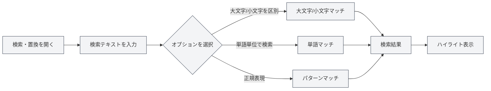
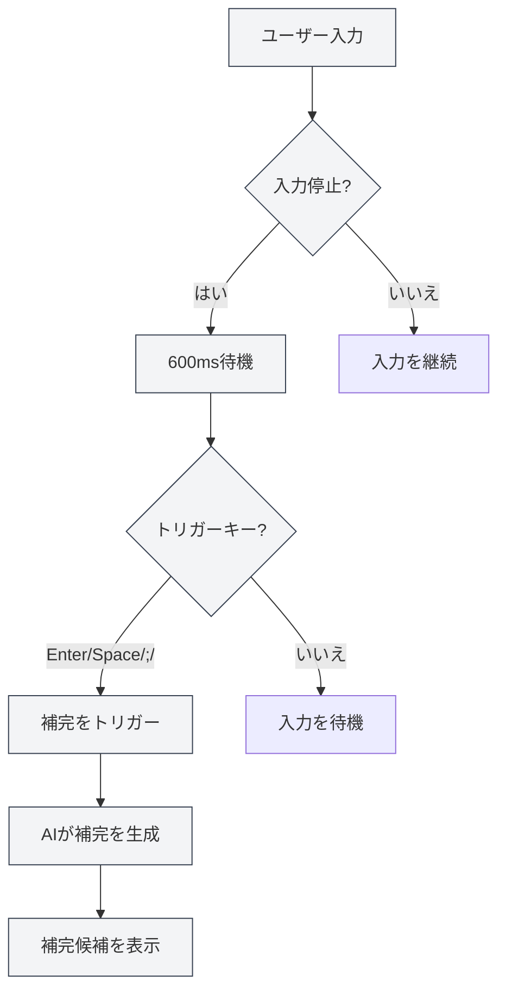

# Markdownエディタ機能

## 概要

Markdownエディタは、検索・置換、右クリックメニュー、AI自動補完、ナレッジベース統合など、豊富な機能を提供します。これらの機能は、編集効率とドキュメント品質を大幅に向上させます。

このドキュメントでは、Markdownエディタの各機能とその使用方法について説明します。

## 検索・置換

### 検索・置換を開く

検索・置換機能を開くには、以下の方法があります：

- **ショートカットキー**：`Ctrl+F` で検索、`Ctrl+H` で検索・置換を開く
- **メニュー**：「編集」→「検索」または「検索・置換」をクリック
- **ツールバー**：ツールバーの検索アイコンをクリック

上部メニューバーのファイルメニューからファイル操作にアクセスし、編集メニューから編集機能にアクセスできます：

<MenuItemsDemo mode="demo" :items='[{"id": "file", "items": ["new", "open", "save"]}]' />

### 検索機能

検索機能は以下のオプションをサポートします：

- **大文字/小文字を区別**：大文字と小文字が完全に一致するテキストのみを一致させる
- **単語単位で検索**：完全な単語のみを一致させる（単語の一部は一致しない）
- **正規表現**：正規表現を使用してパターンマッチングを行う
- **大文字/小文字を保持**：置換時に元のテキストの大文字/小文字の形式を保持する

検索・置換メニューインターフェースは以下の通りです：

<SearchReplaceMenu mode="demo" :adapter='null' />

### 置換機能

置換機能は以下をサポートします：

- **単一置換**：一致したテキストを1つずつ置換する
- **すべて置換**：一致したすべてのテキストを一度に置換する
- **置換プレビュー**：置換前に置換結果をプレビューする

### 一致リスト

検索・置換パネルには一致リストが表示されます：

- **位置の表示**：各一致項目の行番号と列番号を表示する
- **コンテキストプレビュー**：一致項目の前後の内容を表示する
- **クイックジャンプ**：一致項目をクリックして対応する位置に素早くジャンプする

### 使用上のヒント

1. **正規表現**：正規表現を使用して複雑な検索・置換パターンを実現できます
2. **一括置換**：「すべて置換」を使用してドキュメントを素早く一括変更できます
3. **フォーマット保持**：「大文字/小文字を保持」オプションを使用して元のテキストの大文字/小文字形式を保持できます

## 右クリックメニュー

### 基本編集操作

右クリックメニューは以下の基本編集操作を提供します：

- **切り取り**：`Ctrl+X` または右クリックで「切り取り」を選択
- **コピー**：`Ctrl+C` または右クリックで「コピー」を選択
- **貼り付け**：`Ctrl+V` または右クリックで「貼り付け」を選択
- **すべて選択**：`Ctrl+A` または右クリックで「すべて選択」を選択

### AI機能

右クリックメニューは以下のAI機能を提供します：

- **AI分析**：現在のドキュメント内容を分析し、AI対話ウィンドウを開く
- **段落最適化**：現在の段落の内容を最適化する
- **チャート挿入**：AIを使用してチャートコードを生成し、ドキュメントに挿入する

### 機能のオン/オフ

右クリックメニューから以下の機能を素早くオン/オフできます：

- **AI自動補完**：AI自動補完機能を有効化/無効化する
- **ナレッジベース統合**：ナレッジベース統合機能を有効化/無効化する

### 手動トリガー補完

右クリックメニューは「手動トリガー補完」オプションを提供します：

- **ショートカットキー**：`Shift+Tab`
- **右クリックメニュー**：右クリックで「手動トリガー補完」を選択

手動トリガー補完は、自動トリガーを待たずにすぐにAI補完を開始します。

## AI自動補完

### 有効化/無効化

AI自動補完機能は以下の場所で有効化または無効化できます：

- **右クリックメニュー**：右クリックで「AI自動補完を有効化/無効化」を選択
- **設定ページ**：設定でAI自動補完オプションを構成する

### 自動トリガー

AI自動補完は以下の状況で自動的にトリガーされます：

- **入力停止**：入力停止後600msで自動トリガー
- **トリガーキー**：特定のキー入力後にトリガー（Enter、Space、`;`、`,`）

### 手動トリガー

手動で補完をトリガーする方法：

- **ショートカットキー**：`Shift+Tab`
- **右クリックメニュー**：右クリックで「手動トリガー補完」を選択

手動トリガーは、自動トリガーの遅延をスキップしてすぐに補完を開始します。

### 補完モード

AI自動補完は2つのモードをサポートします：

- **完全生成**：完全な補完内容を生成する
- **部分生成**：一部の内容のみを生成する（設定に基づく）

補完モードは設定で構成できます。

### トリガーキー設定

補完トリガーキーは設定で構成できます：

- **Enter**：Enterキーでトリガー
- **Space**：スペースキーでトリガー
- **;**：セミコロンでトリガー
- **,**：カンマでトリガー

複数のトリガーキーを同時に有効化できます。

### 補完最大トークン数

補完最大トークン数は設定で構成できます：

- **最小値**：20トークン
- **最大値**：無制限（0に設定すると無制限）
- **デフォルト値**：50トークン

トークン数が大きいほど補完内容は多くなりますが、生成時間も長くなります。

### 補完の受け入れ

補完候補が表示された後、以下の操作が可能です：

- **Tabキー**：補完候補を受け入れる
- **Escキー**：補完候補をキャンセルする
- **入力を継続**：補完をキャンセルして入力を継続する

<TitleMenu mode="demo" title="Markdownエディタ例" path="1" :tree='{}' />

<SectionOptimizer mode="demo" title="段落最適化例" path="1" :tree='{}' language="markdown" :adapter='null' />

<ViewMenuItemsDemo mode="demo" :items='["editor", "outline", "agent"]' />

## ナレッジベース統合

### 有効化/無効化

ナレッジベース統合機能は以下の場所で有効化または無効化できます：

- **右クリックメニュー**：右クリックで「ナレッジベースを有効化/無効化」を選択
- **設定ページ**：設定でナレッジベースオプションを構成する

### コンテキスト検索

ナレッジベース統合を有効化すると、AI機能は自動的にナレッジベース内の関連コンテンツを検索します：

- **AI補完**：補完時にナレッジベース内の関連コンテンツを参照する
- **AI分析**：ドキュメント分析時にナレッジベース内の知識を使用する
- **段落最適化**：段落最適化時にナレッジベース内のコンテンツを参照する

### 検索原理

ナレッジベース検索はベクトル検索技術を使用します：

- **意味的マッチング**：意味的類似度に基づいて関連コンテンツをマッチングする
- **キーワードマッチング**：同時にキーワードマッチングを使用して精度を向上させる
- **ハイブリッド検索**：ベクトル検索とキーワードマッチングを組み合わせる

### 信頼度閾値

ナレッジベース検索は信頼度閾値の設定をサポートします：

- **閾値範囲**：0.0 - 1.0
- **デフォルト値**：0.5
- **作用**：類似度が閾値より高いコンテンツのみを返す

信頼度閾値は設定で構成でき、詳細は[[knowledge-base.config|ナレッジベース設定]]を参照してください。

## 機能の組み合わせ使用

### 検索・置換 + AI補完

検索・置換とAI補完を組み合わせて使用します：

1. 検索・置換を使用して変更が必要なコンテンツを検索する
2. AI補完を使用して新しいコンテンツを生成する
3. 置換機能を使用して一括更新する

### 右クリックメニュー + ナレッジベース

右クリックメニューとナレッジベースを組み合わせて使用します：

1. ナレッジベース統合を有効化する
2. 右クリックメニューのAI機能を使用する
3. AI機能は自動的にナレッジベース内のコンテンツを使用する

### AI分析 + 段落最適化

AI分析と段落最適化を組み合わせて使用します：

1. AI分析を使用してドキュメント内容を理解する
2. 段落最適化を使用して特定の段落を改善する
3. AI分析の提案に基づいて最適化する

## 使用上のヒント

### 補完品質の向上

1. **ナレッジベースを有効化**：ナレッジベース統合を有効化すると補完品質が向上します
2. **トークン数を調整**：必要に応じて補完最大トークン数を調整します
3. **手動トリガー**：必要な時に手動トリガーを使用してより良い補完効果を得ます

### 効率的な検索・置換

1. **正規表現を使用**：複雑なパターンには正規表現を使用します
2. **置換をプレビュー**：置換前に置換結果をプレビューします
3. **一括操作**：「すべて置換」を使用して素早く一括変更します

### ナレッジベースの使用

1. **関連ドキュメントを追加**：関連ドキュメントをナレッジベースに追加します
2. **信頼度を調整**：必要に応じて信頼度閾値を調整します
3. **定期的に更新**：ナレッジベースコンテンツを定期的に更新します

## よくある質問

### Q: AI補完が表示されませんか？

A: AI自動補完が有効化されているか確認し、LLM設定が正しいことを確認してください。手動トリガー補完（`Shift+Tab`）を試してください。

### Q: 検索・置換でコンテンツが見つかりませんか？

A: 「大文字/小文字を区別」または「単語単位で検索」オプションが有効化されているか確認してください。正規表現を使用している場合は、式が正しいか確認してください。

### Q: ナレッジベース統合が機能しませんか？

A: ナレッジベースが有効化されているか確認し、ナレッジベースに関連ドキュメントがあることを確認してください。信頼度閾値を調整すると、より多くのコンテンツが検索される可能性があります。

### Q: AI補完を無効化するにはどうすればよいですか？

A: 右クリックメニューで「AI自動補完を無効化」を選択するか、設定でAI自動補完オプションを無効化します。

### Q: 補完内容が正確ではありませんか？

A: ナレッジベース統合を有効化してみる、補完最大トークン数を調整する、または手動トリガーを使用してより良い効果を得てみてください。

## 関連ドキュメント

- [[markdown.editor|Markdownエディタ使用ガイド]]
- [[markdown.basics|Markdown構文]]
- [[ai.completion|AI自動補完]]
- [[knowledge-base.usage|ナレッジベース使用]]
- [[core.editor-basics|エディタ基本操作]]

<LaTeXEditorDemo mode="demo" />

<Outline mode="demo" />

<MenuItemsDemo mode="demo" :items='[{"id": "file", "items": ["new", "open", "save"]}]' />

<TitleMenu mode="demo" title="Markdownエディタ機能例" path="1" :tree='{}' />

<SearchReplaceMenu mode="demo" :adapter='null' />

<ViewMenuItemsDemo mode="demo" :items='["editor", "outline", "agent"]' />

<MenuItemsDemo mode="demo" :items='[{"id": "edit", "items": ["find", "replace"]}]' />
