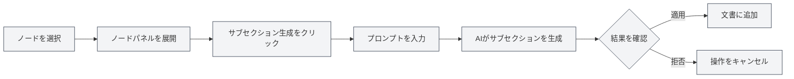
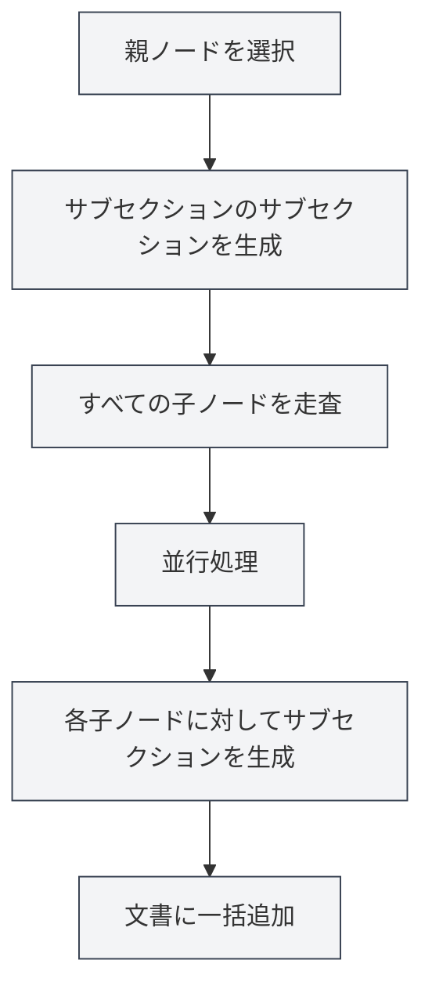

# アウトラインAI機能

## 概要

アウトラインAI機能は、AI技術を活用して文書構造の迅速な生成と最適化を支援します。AI機能を通じて、サブセクションの生成、セクション内容の生成、アウトライン構造の最適化などが可能となり、文書作成の効率を大幅に向上させます。

<Outline mode="demo" />

アウトラインAI機能は、単一ノード操作や一括操作など、複数の操作モードをサポートしており、AIを活用した柔軟な文書作成が可能です。

<Outline mode="demo" />

## サブセクションの生成

### ノードに対するサブセクションの生成

指定したノードに対してサブセクションを生成します：

<OutlineAiToolbar mode="demo" />

1.  **ノードを選択**：アウトラインビューでサブセクションを生成したいノードを選択します。
2.  **ノードを展開**：ノードをクリックして詳細パネルを展開します。
3.  **サブセクションを生成**：「サブセクションを生成」ボタンをクリックします。
4.  **プロンプトを入力**：（オプション）AIの生成をガイドするためのプロンプトを入力します。
5.  **生成を待機**：AIがノードのタイトルと内容に基づいてサブセクションを生成します。
6.  **確認して適用**：生成結果を確認し、問題なければ適用します。

アウトラインビューにはサイドバーからアクセスできます：

<ViewMenuItemsDemo mode="demo" :items='["outline"]' />

生成されたサブセクションは自動的に文書に追加され、アウトライン構造が更新されます。

### 生成の仕組み

<OutlineTreeDisplay mode="demo" />

AIがサブセクションを生成する際には、以下の要素を考慮します：

-   **ノードタイトル**：ノードタイトルからセクションの主題を理解します。
-   **文書構造**：文書全体の構造を考慮します。
-   **ユーザープロンプト**：ユーザーが入力したプロンプトに基づいて生成内容を調整します。
-   **フォーマット要件**：文書フォーマット（Markdown/LaTeX）に応じた正しい見出しフォーマットで生成します。

### 使用上のヒント

1.  **明確なプロンプトを提供**：要件に合ったサブセクションを生成するために、明確なプロンプトを入力します。
2.  **既存の構造を参考**：AIは文書の既存の構造を参考にし、スタイルの一貫性を保ちます。
3.  **複数回生成**：満足のいく結果が得られない場合は、複数回生成して最適な結果を選択できます。

## セクション内容の生成

<Outline mode="demo" />

### ノードに対する内容の生成

指定したノードに対して本文内容を生成します：

1.  **ノードを選択**：アウトラインビューで内容を生成したいノードを選択します。
2.  **ノードを展開**：ノードをクリックして詳細パネルを展開します。
3.  **内容を生成**：「内容を生成」ボタンをクリックします。
4.  **プロンプトを入力**：（オプション）AIの生成をガイドするためのプロンプトを入力します。
5.  **文字数を設定**：（オプション）目標文字数を設定します。
6.  **生成を待機**：AIがノードのタイトルと文書構造に基づいて内容を生成します。
7.  **確認して適用**：生成結果を確認し、問題なければ適用します。

生成された内容は、対応するセクションに自動的に追加されます。

### 内容生成モード

<OutlineAiToolbar mode="demo" />

内容生成では以下のモードをサポートしています：

-   **完全生成**：セクションの完全な内容を生成します。
-   **部分生成**：設定に基づいて一部の内容のみを生成します。
-   **内容追加**：既存の内容に新しい内容を追加します。

### 文字数制御

内容生成時には目標文字数を設定できます：

-   **文字数を設定**：生成ダイアログで目標文字数を入力します。
-   **AIによる調整**：AIは文字数の要求に応じて、生成内容の詳細度を調整します。
-   **柔軟な制御**：セクションの重要度に応じて異なる文字数を設定できます。

<OutlineTreeDisplay mode="demo" />

## サブセクションのサブセクションを生成

### サブセクションの一括生成

指定したノードのすべての子ノードに対して、一括してサブセクションを生成します：

1.  **ノードを選択**：一括操作を行いたいノードを選択します。
2.  **ノードを展開**：ノードをクリックして詳細パネルを展開します。
3.  **サブセクションのサブセクションを生成**：「サブセクションのサブセクションを生成」ボタンをクリックします。
4.  **プロンプトを入力**：AIの生成をガイドするためのプロンプトを入力します。
5.  **生成を待機**：AIはすべての子ノードを並行処理し、各子ノードに対してサブセクションを生成します。
6.  **確認して適用**：生成結果を確認し、問題なければ適用します。

この機能は並行処理メカニズムを使用しており、複数のセクションに対して迅速にサブセクションを一括生成できます。

### 並行処理の利点

<OutlineAiToolbar mode="demo" />

一括生成では並行処理メカニズムを使用します：

-   **効率的な処理**：複数のノードを同時に処理するため、速度が数十倍向上します。
-   **自動同期**：生成完了後、自動的に文書に同期されます。
-   **進捗表示**：各ノードの生成進捗状況が表示されます。

### 使用シナリオ

以下のシナリオに適しています：

-   **大規模生成**：複数のセクションに対してサブセクションを生成する必要がある場合。
-   **一括操作**：すべてのセクションに対してワンクリックでサブセクションを生成する場合。
-   **構造化生成**：アウトライン構造に沿って内容を一括生成する場合。

## サブセクション内容の生成

### 内容の一括生成

指定したノードのすべての子ノードに対して、一括して内容を生成します：

1.  **ノードを選択**：一括操作を行いたいノードを選択します。
2.  **ノードを展開**：ノードをクリックして詳細パネルを展開します。
3.  **サブセクション内容を生成**：「サブセクション内容を生成」ボタンをクリックします。
4.  **プロンプトを入力**：AIの生成をガイドするためのプロンプトを入力します。
5.  **文字数を設定**：（オプション）目標文字数を設定します。
6.  **生成を待機**：AIはすべての子ノードを並行処理し、各子ノードに対して内容を生成します。
7.  **確認して適用**：生成結果を確認し、問題なければ適用します。

この機能を使用すると、文書全体のすべてのセクションに対して迅速に内容を生成できます。

### 再帰的生成

サブセクション内容の生成は再帰的に処理されます：

-   **すべての子ノードを走査**：すべての子ノードを再帰的に走査します。
-   **内容を生成**：各子ノードに対して内容を生成します。
-   **構造を維持**：文書の階層構造を維持します。

### 進捗状況の追跡

一括生成時には進捗状況が表示されます：

-   **ノード進捗**：現在処理中のノードが表示されます。
-   **全体進捗**：全体の生成進捗状況が表示されます。
-   **リアルタイム更新**：生成内容がリアルタイムで更新されます。

<Outline mode="demo" />

## アウトラインの最適化

### 最適化機能

アウトライン最適化機能は、以下の点で役立ちます：

-   **構造調整**：文書の構造と階層を最適化します。
-   **タイトル最適化**：タイトルの命名とフォーマットを最適化します。
-   **構造再編成**：文書構造を再編成します。

### 最適化操作

アウトライン最適化では以下の操作をサポートしています：

-   **ノードの移動**：ノードを新しい位置に移動します。
-   **ノードの削除**：不要なノードを削除します。
-   **階層の調整**：ノード間の階層関係を調整します。
-   **ノードの結合**：類似したノードを結合します。

### 最適化の使用

<OutlineTreeDisplay mode="demo" />

1.  **構造を分析**：AIが現在の文書構造を分析します。
2.  **提案を提供**：最適化の提案を提供します。
3.  **最適化を適用**：確認後、最適化結果を適用します。

## AI機能の設定

### 温度設定

AI生成時には温度パラメータを設定できます：

-   **温度範囲**：0.0 - 1.0
-   **デフォルト値**：設定に基づきます。
-   **効果**：AI生成の創造性を制御します（温度が高いほど創造的になります）。

### プロンプト設定

各操作に対してプロンプトを設定できます：

-   **汎用プロンプト**：汎用的なプロンプトを設定します。
-   **操作別プロンプト**：各操作に対して特定のプロンプトを設定します。
-   **文字数要件**：プロンプト内に文字数要件を含めることができます。

### フォーマット認識

AIは自動的に文書フォーマットを認識します：

-   **Markdownフォーマット**：Markdownフォーマットの見出しと内容を生成します。
-   **LaTeXフォーマット**：LaTeXフォーマットの見出しと内容を生成します。
-   **自動適応**：文書フォーマットに応じて生成内容を自動調整します。

## 使用上のヒント

### 効率的な生成

1.  **一括操作を使用**：大量の内容を生成する必要がある場合は、一括操作を使用して効率を上げます。
2.  **明確なプロンプトを提供**：より良い生成結果を得るために、明確なプロンプトを入力します。
3.  **段階的に生成**：まず構造を生成し、次に内容を生成して、段階的に文書を完成させます。

### 品質管理

1.  **生成結果を確認**：生成後、結果を注意深く確認し、要件に合致していることを確認します。
2.  **複数回生成**：満足のいく結果が得られない場合は、複数回生成して最適な結果を選択します。
3.  **手動調整**：生成後、内容を手動で調整・完成させることができます。

### 構造計画

1.  **まず構造を計画**：AIを使用してサブセクションを生成し、文書構造を計画します。
2.  **次に内容を生成**：構造が確定してから具体的な内容を生成します。
3.  **段階的に完成**：文書を段階的に完成させ、すべての内容を一度に生成しないようにします。

## よくある質問

### Q: AIが生成した内容が正確でない場合は？

A: AIが生成した内容はあくまで参考情報です。生成後は内容を確認し、調整することをお勧めします。より詳細なプロンプトを提供することで、より良い結果が得られる可能性があります。

### Q: 一括生成が遅い場合は？

A: 一括生成は並行処理を使用しており、すでに高速です。それでも遅い場合は、ネットワークの問題やAIサービスの応答が遅い可能性があります。

### Q: 生成をキャンセルするには？

A: 生成プロセス中に「キャンセル」ボタンをクリックして操作をキャンセルできます。既に生成された内容は失われません。

### Q: 生成された内容のフォーマットが正しくない場合は？

A: AIは自動的に文書フォーマットを認識します。フォーマットが正しくない場合は、文書のフォーマット設定を確認するか、生成された内容を手動で調整してください。

### Q: 生成された内容を編集できますか？

A: はい、可能です。生成された内容はいつでも編集・修正できます。生成は創作を補助するものであり、最終的な内容はユーザーが決定します。

## 関連ドキュメント

-   [[outline.basics|アウトラインビュー機能]]
-   [[ai.llm-config|LLM設定]]
-   [[markdown.editor|Markdownエディター使用ガイド]]
-   [[latex.editor|LaTeXエディター使用ガイド]]

<Outline mode="demo" />

<OutlineAiToolbar mode="demo" />

<ViewMenuItemsDemo mode="demo" :items='["ai"]' />
