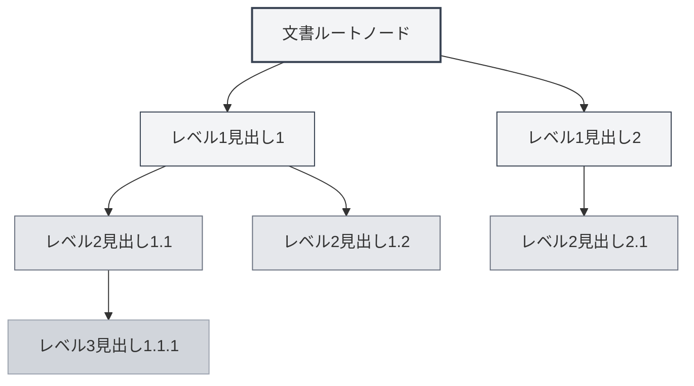
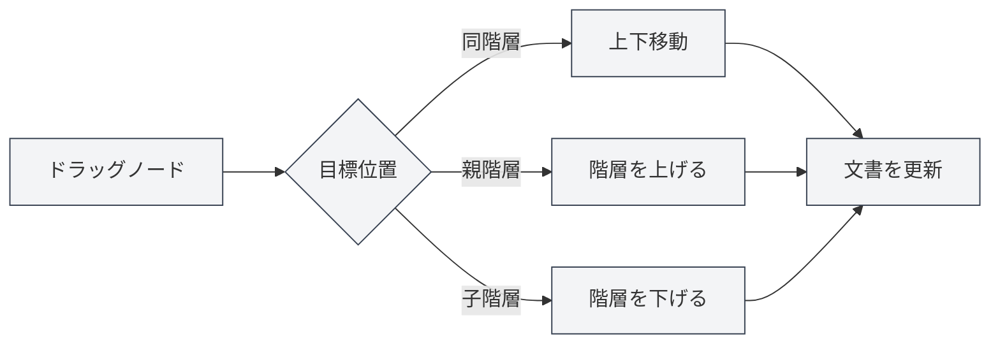

# アウトラインビュー機能

## 概要

アウトラインビューは、文書の見出し階層をツリー構造で表示し、文書構造の迅速な閲覧と編集を支援します。アウトラインビューを通じて、文書内の任意の位置へ素早くジャンプしたり、文書構造を編集したり、AI機能を使用してコンテンツを生成したりすることができます。

MetaDocのアウトラインビューは、自動抽出、手動編集、ドラッグ＆ドロップによる並べ替え、AI生成などの機能をサポートしており、文書構造を効率的に整理・管理することができます。

## アウトラインビューの紹介

### ビューの位置

アウトラインビューは通常、エディタの左側または右側のサイドバーに表示されます：

- **サイドバー**：アウトラインビューはサイドバーの一部として表示されます
- **独立パネル**：アウトラインビューを独立して表示または非表示にすることができます
- **幅の調整**：アウトラインビューの幅を調整できます

サイドバーからアウトラインビューにアクセスできます。サイドバーでは、エディタ、アウトラインなどのビュー切り替えが提供されています：

<ViewMenuItemsDemo mode="demo" :items='["editor", "outline"]' />

### インターフェースプレビュー

アウトラインビューは文書の見出し階層をツリー構造で表示し、ドラッグ＆ドロップによる並べ替えとノード編集をサポートします：

<Outline mode="demo" />

<ViewMenuItemsDemo mode="demo" :items='["outline"]" />

### アウトライン構造

アウトラインビューは文書の見出し階層をツリー構造で表示します：

- **ルートノード**：文書のルートノード（通常は表示されません）
- **レベル1見出し**：文書のレベル1見出し（H1）
- **レベル2見出し**：文書のレベル2見出し（H2）
- **多階層ネスト**：多階層の見出しのネスト表示をサポートします

### 自動抽出

アウトラインビューは文書から自動的に見出し構造を抽出します：

- **Markdown文書**：Markdown見出し（`#`、`##`など）から抽出
- **LaTeX文書**：LaTeXセクションコマンド（`\section`、`\subsection`など）から抽出
- **リアルタイム更新**：文書を編集するとアウトライン構造が自動的に更新されます

## アウトラインノード操作

### 子ノードの追加

アウトラインに新しい子ノードを追加します：

1. **ノードを選択**：子ノードを追加したいノードをクリックします
2. **追加ボタン**：ノード横の「子ノードを追加」ボタン（+アイコン）をクリックします
3. **タイトル入力**：新しいノードのタイトルを入力します
4. **作成確定**：確認後、新しいノードが作成されます

新しいノードは文書の対応する位置に追加され、文書内容が自動的に更新されます。

<Outline mode="demo" />

### ノードの編集

アウトラインノードのタイトルを編集します：

1. **ノードを選択**：編集したいノードをクリックします
2. **編集ボタン**：ノード横の「編集」ボタンをクリックします
3. **タイトル変更**：ノードのタイトルを変更します
4. **保存確定**：確認後、変更が保存されます

ノードタイトルを編集すると、文書内の対応する見出しが自動的に更新されます。

<TitleMenu mode="demo" title="サンプルタイトル" path="1" :tree='{}' />

<ViewMenuItemsDemo mode="demo" :items='["outline"]' />

### ノードの削除

アウトラインノードを削除します：

1. **ノードを選択**：削除したいノードをクリックします
2. **削除ボタン**：ノード横の「削除」ボタンをクリックします
3. **削除確定**：確認後、ノードが削除されます

ノードを削除すると、文書内の対応する見出しと内容（設定されている場合）も同時に削除されます。

<SectionOptimizer mode="demo" title="アウトラインノード最適化サンプル" path="1" :tree='{}' language="markdown" :adapter='null' />

<OutlineTreeDisplay mode="demo" />

### ノードの移動

アウトラインノードの位置を移動します：

- **上下移動**：「上へ移動」と「下へ移動」ボタンを使用してノードの順序を変更します
- **左右移動**：「左へ移動」と「右へ移動」ボタンを使用してノードの階層を変更します
- **ドラッグ移動**：ノードを直接ドラッグして目標位置へ移動します

ノードを移動すると、文書構造が自動的に更新されます。

<OutlineTreeDisplay mode="demo" />

## アウトラインノードのドラッグ＆ドロップ

### ドラッグ操作

アウトラインビューはドラッグ操作をサポートし、文書構造を再編成できます：

1. **マウスを押す**：ノード上でマウスの左ボタンを押し続けます
2. **ノードをドラッグ**：ノードを目標位置までドラッグします
3. **マウスを離す**：マウスボタンを離して移動を完了します

ドラッグ中は視覚的なフィードバックがあり、ノードの目標位置が表示されます。

### ドラッグモード

ドラッグは以下のモードをサポートします：

- **上下移動**：同じ階層内でノードを上下に移動します
- **左右移動**：ノードの階層を変更します（昇格または降格）
- **階層間移動**：ノードを他の階層に移動します

### ドラッグ制限

ドラッグ操作には以下の制限があります：

- **ルートノード**：ルートノードはドラッグできません
- **自己包含**：ノードを自身の子ノード内にドラッグすることはできません（循環参照を避けるため）
- **階層制限**：一部の操作は階層制限を受ける場合があります

<Outline mode="demo" />

## アウトラインの展開/折りたたみ

### ノードの展開

ノードを展開して子ノードを表示します：

- **ノードをクリック**：ノードタイトルをクリックして展開または折りたたみます
- **展開アイコン**：ノード前の展開アイコンをクリックします
- **すべて展開**：「すべて展開」機能を使用してすべてのノードを展開します

### ノードの折りたたみ

ノードを折りたたんで子ノードを非表示にします：

- **ノードをクリック**：展開済みのノードを再度クリックして折りたたみます
- **折りたたみアイコン**：ノード前の折りたたみアイコンをクリックします
- **すべて折りたたみ**：「すべて折りたたみ」機能を使用してすべてのノードを折りたたみます

### 展開状態

アウトラインの展開状態は保存されます：

- **自動保存**：展開状態は自動的に保存されます
- **状態復元**：次回文書を開いた時に展開状態が復元されます
- **独立状態**：各文書の展開状態は独立して保存されます

## アウトラインビューの幅調整

### 幅の調整

アウトラインビューの幅を調整できます：

1. **境界をドラッグ**：アウトラインビューの境界にマウスを移動させます
2. **押してドラッグ**：マウスの左ボタンを押しながらドラッグして幅を調整します
3. **マウスを離す**：マウスボタンを離して調整を完了します

### 幅の制限

アウトラインビューの幅には以下の制限があります：

- **最小幅**：最小幅（通常150px）より小さくすることはできません
- **最大幅**：最大幅（通常は画面幅の50%）より大きくすることはできません
- **自動調整**：幅は内容に応じて自動的に調整されます

<ResizableDivider mode="demo" />

## クイックジャンプ

### クリックジャンプ

アウトラインノードをクリックすると、文書の対応する位置へ素早くジャンプできます：

- **ノードをクリック**：ノードタイトルをクリックして対応する位置へジャンプします
- **ハイライト表示**：ジャンプ後、対応する見出しがハイライト表示されます
- **スクロール位置**：エディタが自動的に対応する位置までスクロールします

### 同期スクロール

アウトラインビューはエディタとの同期スクロールをサポートします：

- **編集時同期**：文書を編集する際、アウトラインは現在編集中の位置を自動的にハイライトします
- **スクロール時同期**：エディタをスクロールする際、アウトラインは表示されている見出しを自動的にハイライトします
- **双方向同期**：アウトラインとエディタは双方向で同期します

## ノード情報の表示

### ノードタイトル

アウトラインノードは以下の情報を表示します：

- **タイトルテキスト**：見出しのテキスト内容を表示します
- **見出し階層**：インデントによって見出しの階層を表示します
- **ノード状態**：ノードの状態（展開/折りたたみ）を表示します

### ノード操作

各ノードには以下の操作ボタンが提供されます：

- **子ノードを追加**：現在のノードの下に子ノードを追加します
- **編集**：ノードタイトルを編集します
- **削除**：ノードを削除します
- **移動**：ノードを上下左右に移動します

操作ボタンは、マウスをホバーした時またはノードを選択した時に表示されます。

<OutlineTreeDisplay mode="demo" />

<ViewMenuItemsDemo mode="demo" :items='["editor", "outline"]' />

## 使用上のヒント

### 文書構造の整理

1. **アウトラインで計画**：まずアウトラインで文書構造を計画し、その後内容を埋めていきます
2. **階層を調整**：ドラッグを使用して見出し階層を素早く調整します
3. **一括操作**：アウトラインビューを使用して複数の見出しを一括管理します

### クイックナビゲーション

1. **ジャンプを使用**：アウトラインノードをクリックして文書位置へ素早くジャンプします
2. **検索を使用**：アウトライン内で見出しを検索して素早く位置を特定します
3. **折りたたみを使用**：不要な部分を折りたたみ、現在の内容に集中します

### 編集効率化

1. **ドラッグで並べ替え**：ドラッグを使用して文書構造を素早く調整します
2. **一括編集**：アウトライン内で複数の見出しを一括編集します
3. **構造プレビュー**：アウトラインを使用して文書全体の構造をプレビューします

<OutlineTreeDisplay mode="demo" />

## よくある質問

### Q: アウトラインが更新されませんか？

A: アウトラインは自動的に更新されます。更新されない場合は、ビューの切り替えや文書のリフレッシュをお試しください。文書に正しい見出しフォーマットがあることを確認してください。

### Q: 複数の見出しを素早く追加するには？

A: 「子ノードを追加」機能を使用して素早く見出しを追加するか、エディタで直接見出しを入力すると、アウトラインが自動的に更新されます。

### Q: ノードのドラッグに失敗しますか？

A: ノードを自身の子ノード内にドラッグしていないか確認してください（循環参照の原因となります）。目標位置が有効であることを確認してください。

### Q: アウトラインが正しく表示されませんか？

A: 文書内の見出しフォーマットが正しいか確認してください。Markdownでは`#`を、LaTeXでは`\section`などのコマンドを使用します。

### Q: アウトラインをリセットするには？

A: アウトラインは文書から自動的に抽出されます。リセットが必要な場合は、文書を再度開くか、文書構造を手動で編集してください。

## 関連ドキュメント

- [[outline.ai-features|アウトラインAI機能]]
- [[markdown.editor|Markdownエディタ使用ガイド]]
- [[latex.editor|LaTeXエディタ使用ガイド]]
- [[core.editor-basics|エディタ基本操作]]
