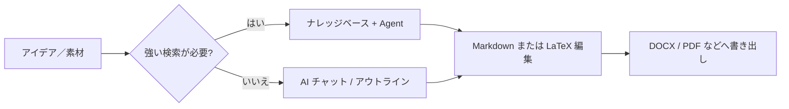

# 🚀 MetaDoc ベストプラクティス

MetaDoc は、決まった手順だけのソフトウェアではありません。

**ツールの組み合わせ**に近く、同じ成果物（記事、図表、翻訳など）を、複数のやり方で進められます。

👉 つまり：

* 同じ作業でも**複数のルート**があり得る
* **速度・コスト・仕上がり**のトレードオフがルートごとに違う
* 「すべての機能を暗記する」より**ルート選び**が重要

この章は機能一覧ではなく、次の問いに答えます。

> 👉 **この状況では、最初にどのやり方が適しているか？**

---

## 🧭 記号の読み方

| 記号       | 意味                                       |
| ---------- | ------------------------------------------ |
| ⭐⭐⭐⭐⭐ | 多くの場合、まず試す価値がある             |
| ⭐⭐⭐⭐   | 安定しているが、手順が一段増えることもある |
| ⭐⭐⭐     | 特定の用途向き                             |
| ⚠️       | 品質・コンプライアンスなどに注意           |
| 💰         | トークン／API コストが増えやすい           |

---

メインウィンドウのタブ（イメージ）：

<MainTabs mode="demo" />

---

# 📝 1. 執筆：アイデアから原稿まで

記事を書く代表的な経路は三つです。目的に合う一つを選べば十分です。

---

## ⭐⭐⭐⭐⭐ 経路 1（既定のおすすめ）

### AI チャットで下書き → Markdown で推敲 → 書き出し

**流れ**：
[[ai.chat|AI チャット]] → Markdown 編集 → [[core.export|書き出し]]

**向いている場合：**

* すぐ書き始めたい
* 何度も直し込みたい
* 最終成果物が Word／PDF／LaTeX になる

---

**おすすめにする理由**

* Markdown は**体裁より内容**に集中しやすい
* まず本文と構成、あとから体裁
* 書き出し後に Word や LaTeX で最終調整できる

👉 **中身優先、体裁は後**と考えると分かりやすいです

---

**注意**

* AI の文章は事実・引用など必ずご自身で確認してください
* 書き出し後、体裁を軽く確認することをおすすめします

---

AI チャット画面のイメージ：

<AIChat mode="demo" />

---

## ⭐⭐⭐⭐ 経路 2

### ナレッジベースを使った執筆（専門・根拠重視）

**流れ**：
[[knowledge-base.usage|ナレッジベース]] → [[agent.introduction|Agent]] → エディタで統合

---

**向いている場合：**

* 論文・レビュー・報告書など、**根拠**が求められる
* PDF や資料をすでにお持ちの場合

---

**利点**

* アップロード済み資料に沿って生成しやすい
* 「出所のある書き方」に寄せやすい

---

**注意点**

* ⚠️ 品質は資料の質やチャンク設計に依存します
* 💰 複数ターンの対話はトークン消費が増えがちです

---

👉 短く言うと：

> **根拠付きで書きたい**ならこの経路です

---

ナレッジベース画面のイメージ：

<KnowledgeBase mode="demo" />

---

## ⭐⭐⭐ 経路 3

### Agent に LaTeX プロジェクト一式を任せる

**流れ**：
Agent → LaTeX プロジェクト → PDF までコンパイル

---

**向いている場合：**

* 論文型の標準的な構成が必要
* LaTeX を使う方針が決まっている
* 時間に余裕がない

---

### ⚠️ 使う前に

* 💰 短いチャットや局所操作よりトークンを多く使いがちです
* パッケージやパスは手元で調整が必要なこともあります
* 機密性・コンプライアンスが厳しい内容は、自動化だけに頼らないでください

---

Agent 画面のイメージ：

<AgentView mode="demo" />

---

**プロンプト例（題目を差し替えてください）**

```text
あなたは LaTeX の技術編集者です。テーマ「（論文／レポートの題目をここに）」について、現在のワークスペースでコンパイル可能な LaTeX プロジェクトを生成してください。

要件：
1) article または指定のドキュメントクラスを使用。メインは main.tex とし、章は複数の .tex に分割して \input で組み込む。
2) ディレクトリ構成を明確に：figures/、sections/、bib/ など。プレースホルダ図と参考文献エントリの例を含める。
3) 数式・図表・文献には標準パッケージ（amsmath、graphicx、biblatex または natbib 等）を使い、追加で必要なパッケージを明記する。
4) 推奨コンパイル手順を書く（latexmk -pdf、Unicode 日本語なら XeLaTeX / LuaLaTeX など）。
5) ファイル本文を省略しない。パスは一貫させる。情報不足なら先に仮定を列挙してから生成する。
```

---

# 📊 2. 図表と可視化

大事なのは「ボタンはどこか」より：

> 👉 **速さと細かさ、どちらを優先するか**

---


| 経路 | やり方 | 推奨 | 向いているとき |
| ---- | ------ | ---- | -------------- |
| A | AI チャットまたは Agent で Mermaid／PlantUML／ECharts 等のコードを出し、Markdown に貼る | ⭐⭐⭐⭐ | 本文の横で素早く試したい |
| B | 図表ウィンドウを使う（[[charts.introduction|図表機能]]） | ⭐⭐⭐⭐ | コードより UI がよい |
| C | テキスト選択 → 右クリックで図を挿入 | ⭐⭐⭐⭐⭐ | 今書いている段落に直結させたい |

関連：[[ai.chat|AI チャット]]、[[agent.introduction|Agent]]。

---

**ざっくりした指針**

* 日常の執筆 → 右クリックが最速になりがち
* 複雑な図 → 図表ウィンドウ
* いろいろ試す → AI でコード生成

---

図表ツールのイメージ：

<GraphWindow mode="demo" />

---

# 🌐 3. 翻訳

一言で言うと：

> 👉 **短いほど、手軽な手段で足りる**

---


| 経路 | 推奨 | 向いているもの |
| ---- | ---- | -------------- |
| 右クリック翻訳 | ⭐⭐⭐⭐⭐ | 一文〜短い段落 |
| AI チャット | ⭐⭐⭐⭐   | 複数ブロック |
| Agent | ⭐⭐⭐⭐   | 長い文書 |

---

👉 目安：

* 短い → 右クリック
* 長い → AI チャットまたは Agent

---

ドラッグで幅を変えられる分割バー（イメージ）：

<ResizableDivider mode="demo" />

---

# ✨ 4. 段落の推敲

原稿全体を一度に AI に渡すと、遅く高くつきがちです。

おすすめは：

---


| 経路 | 推奨 | 理由 |
| ---- | ---- | ---- |
| 段落内を右クリックして最適化 | ⭐⭐⭐⭐⭐ | コンテキストが小さく、コストも抑えやすい |
| アウトラインツリーで章単位 | ⭐⭐⭐⭐   | 構成の整理向き |
| AI チャット／Agent | ⭐⭐⭐⭐   | 広い範囲の書き換え |

---

👉 考え方の核：

> **小さな塊に分けて処理する**

---

アウトライン表示のイメージ：

<Outline mode="demo" />

---

# 🎯 5. シーン別の選び方

迷ったらこの節だけ読んでも構いません。

---

## 🎒 講義ノート

**おすすめ**

* ⭐⭐⭐⭐⭐ 講義中は Markdown で速記 → 後から AI で展開
* ⭐⭐⭐⭐ スライドや PDF をナレッジベースに入れて復習用のまとめ

👉 まず取る、あとで整える

---

## 🧪 実験レポート

**おすすめ**

* ⭐⭐⭐⭐⭐ Markdown → DOCX 書き出しで下書き
* ⭐⭐⭐⭐ 分析パートはナレッジベースで補助

⚠️ 数値データは必ずご自身で確認してください

---

## 🛠️ 技術ドキュメント

**おすすめ**

* ⭐⭐⭐⭐⭐ Markdown ＋ 右クリックでの局所推敲
* ⭐⭐⭐⭐ 旧ドキュメントとの整合は Agent ＋ ナレッジベース

👉 明瞭さと一貫性が優先

---

## 💬 Q&A・ブログ

**おすすめ**

* ⭐⭐⭐⭐⭐ まずアウトライン → から本文
* ⭐⭐⭐⭐ 長文はアウトラインで構造を固定

👉 字数より構成

---

## 📱 メルマガ・クリエイター向け

**おすすめ**

* ⭐⭐⭐⭐⭐ Markdown で完稿 → 書き出し → 各プラットフォームで体裁
* ⭐⭐⭐⭐ 見出しや要約のバリエーションは AI

⚠️ 一発で全文生成はコスト高く、トーンも制御しにくいです

---

# 🔁 流れの全体像



---

# 📚 関連

* [[quick-start.guide|クイックスタート]]
* [[core.export|書き出し]]
* [[features.paragraph-optimization|段落の最適化]]
* [[charts.introduction|図表機能の紹介]]
