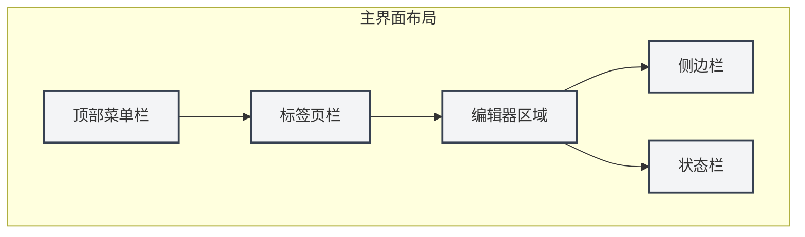
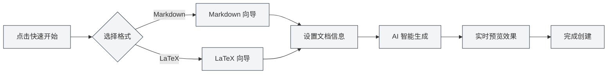

# クイックスタートガイド

## 概要

MetaDocへようこそ！これは知識労働者のために設計されたインテリジェントなドキュメント処理ツールです。技術ブログの執筆、学習ノートの整理、学術論文の準備など、どのような場面でも、MetaDocはプロフェッショナルでエレガントな編集体験を提供します。

MetaDocは人工知能の機能を深く統合し、MarkdownとLaTeXという2つの主流ドキュメント形式をサポートしています。単なるテキストエディタではなく、あなたのスマートな執筆アシスタントです。内蔵のAI対話、自動補完、インテリジェント校正などの機能により、ドキュメント作成をより効率的で楽しいものにします。

## 初めてお使いになる方へ

### アプリケーションの起動

MetaDocを起動すると、最初にホームページが表示されます。これは、すぐに作業を開始できるように設計された出発点です：

- **クイックスタート**：インテリジェントなウィザードがドキュメント形式の選択と新規作成をガイドします
- **新規ドキュメント**：直接空白のドキュメントを作成し、必要な形式を選択できます
- **ファイルを開く**：既存のドキュメントを参照して開くことができます
- **ユーザーマニュアル**：詳細な使用ガイドをいつでも参照できます

### インターフェースの紹介

MetaDocのインターフェースデザインは、モダンなエディタのレイアウト理念に従い、明確で直感的です：

1. **上部メニューバー**

   ウィンドウの最上部に位置し、ファイル、編集、表示などのコア機能が集約されています。新規ドキュメントの作成、テキストの検索・置換、表示モードの切り替えなど、あらゆる操作の入り口がここにあります。メニューバーはカスタマイズ可能で、使用習慣に合わせてメニュー項目の表示と順序を調整できます。

2. **タブバー**

   メニューバーの下に位置し、現在開いているすべてのドキュメントを表示します。各ドキュメントはタブに対応し、クリックで切り替えられます。タブはドラッグで順序を変更でき、よく使うドキュメントを固定して誤って閉じるのを防ぐこともできます。タブが多い場合は、ウィンドウをまたいでドキュメントを整理することも可能です。

3. **エディタ領域**

   ここが主な作業領域です。MetaDocは異なるタイプのドキュメントに特化した編集環境を提供します：

   - **Markdownエディタ**：WYSIWYG（見たまま編集）の編集体験を提供し、リアルタイムプレビュー、数式、チャートなどの豊富な機能をサポートします
   - **LaTeXエディタ**：プロフェッショナルな学術執筆環境を提供し、コードハイライト、インテリジェントヒント、コンパイルプレビューなどの機能をサポートします

4. **サイドバー**

   エディタの左側に位置し、ドキュメントナビゲーションの中心です。ここでは以下のことができます：

   - エディタ、アウトライン、Agentなどの異なるビューに切り替える
   - ドキュメント構造のアウトラインを表示する
   - ナレッジベースと引用素材を管理する

5. **ステータスバー**

   ウィンドウの下部に位置し、現在のドキュメントの状態情報（文字数、保存状態、言語設定など）をリアルタイムで表示します。作業の進捗状況が一目でわかります。

以下に対応する実際のインターフェースコントロールを示します。操作の参考にしてください：

**上部メニューバー**

ウィンドウの最上部に位置し、ファイル、編集、表示などのメインメニューを含み、アプリケーションレベルの操作エントリを提供します。メニューバーから、新規作成、開く、保存などのドキュメント操作や、様々な編集・表示機能にアクセスできます。

<MenuItemsDemo mode="demo" :items='[{"id": "file", "items": ["new", "open", "save"]}, {"id": "edit", "items": ["undo", "redo", "find"]}, {"id": "view", "items": ["editor", "outline"]}]' />

**タブバー**

メニューバーの下に位置し、現在開いているすべてのドキュメントタブを表示します。タブをクリックしてドキュメントを切り替えたり、タブをドラッグして順序を調整したり、タブを右クリックして（閉じる、固定する、新しいウィンドウに移動するなどの）追加操作を行ったりできます。

<MainTabs mode="demo" />

**サイドバー**

エディタの左側に位置し、様々な補助機能パネルへのエントリを提供します。サイドバーを使用して、エディタビュー、アウトラインビュー、Agentビューなどを素早く切り替え、ドキュメント編集の効率を向上させることができます。

<ViewMenuItemsDemo mode="demo" :items='["editor", "outline", "home"]' />

## ドキュメントの作成

### 方法1：クイックスタートウィザードを使用する

MetaDocのクイックスタートウィザードは、思いやりのある設計です。単に空白のドキュメントを作成するだけでなく、経験豊富なアシスタントのように、ドキュメント作成の各ステップをガイドします：

1. ホームページで「クイックスタート」ボタンをクリックします
2. ニーズに応じてドキュメント形式を選択します：
   - **Markdown**：ブログ、技術文書、会議議事録、または日常的なテキストコンテンツを作成する場合、最も軽量な選択肢です。Markdownの構文はシンプルで直感的でありながら、豊富な組版ニーズを満たします。
   - **LaTeX**：学術論文、学位論文、または精密な組版が必要な科学技術文書を準備している場合、LaTeXは学界で認められた標準です。MetaDocは複雑なLaTeXコンパイルをわかりやすく簡単にします。
3. ウィザードは選択に応じて、適切なテンプレートとAI補助機能を提供します

#### 形式選択インターフェース

ウィザードの最初のステップは、ドキュメント形式の選択です。MetaDocは使用シナリオに基づいて、適切なオプションをインテリジェントに推奨します：

#### Markdownクイックスタート

Markdownを選択すると、ウィザードは以下を提供します：

- **インテリジェントなタイトル提案**：AIが初期入力に基づいて適切なドキュメントタイトルを提案します
- **構造化されたアウトライン**：ドキュメントの枠組みを自動生成し、思考の整理を支援します
- **リアルタイムプレビュー**：書きながら確認でき、ドキュメントの最終的な表示効果を即座に把握できます

#### LaTeXクイックスタート

LaTeXを選択すると、ウィザードは以下を提供します：

- **プロフェッショナルテンプレート**：異なる学術シナリオに最適化されたテンプレート（論文、レポート、プレゼンテーションなど）
- **構造ガイダンス**：標準的なLaTeXドキュメント構造を自動生成します
- **インテリジェント補完**：AIがLaTeXコードの生成を補助し、学習のハードルを下げます

#### ウィザードの核心的価値

クイックスタートウィザードの真髄は、**ハードルを下げ、効率を上げる**ことにあります：

- **初心者に優しい**：複雑な構文を覚える必要がなく、ウィザードがステップバイステップでガイドします
- **熟練者に効率的**：AI補助機能により、ドキュメントの枠組みを素早く生成し、繰り返し作業を節約できます
- **コンテキスト認識**：すでにいくつかのアイデアがある場合は、直接AIに伝えることができ、完全なドキュメント構造に拡張してくれます

#### ウィザードのワークフロー

### 方法2：直接新規ドキュメントを作成する

MetaDocに慣れている場合は、直接空白のドキュメントを作成して作業を開始できます：

1. ホームページの「新規ドキュメント」ボタンをクリックするか、ショートカットキー `Ctrl+N` を押します
2. ドキュメント形式（Markdown / LaTeX / プレーンテキスト）を選択します
3. ドキュメントはすぐにエディタで開かれ、作成を開始できます

この方法は、経験豊富なユーザーや、明確な執筆計画があるシナリオに適しています。

### 方法3：既存ファイルを開く

以前の作業を続けるのも簡単です：

1. ホームページの「ファイルを開く」ボタンをクリックするか、`Ctrl+O` を押します
2. ファイルブラウザでドキュメントを見つけます
3. 選択したファイルは新しいタブで開かれ、シームレスに編集を続行できます

MetaDocは最近開いたドキュメントを自動的に記憶するので、素早く作業状態に戻ることができます。

## 基本操作

### ドキュメントの編集

MetaDocの編集体験は、注意をコンテンツ自体に集中できるように注意深く設計されています：

- **スムーズな入力**：インスピレーションの素早い記録から、文章の丹念な磨き上げまで、エディタはあなたの思考に追いつきます
- **インテリジェントなフォーマット**：MarkdownエディタはWYSIWYGをサポートし、LaTeXエディタは構文ハイライトとインテリジェントヒントを提供します
- **豊富な要素**：画像、表、コードブロック、数式などの要素を簡単に挿入でき、ドキュメントをより生き生きとプロフェッショナルにします
- **リアルタイムプレビュー**：Markdownドキュメントは書きながら確認でき、最終的な効果を即座に把握できます

### ドキュメントの保存

MetaDocは複数の保存方法を提供し、作業が失われないようにします：

- **即時保存**：`Ctrl+S` で現在のドキュメントを素早く保存します。最も一般的な操作です
- **別名で保存**：`Ctrl+Shift+S` 現在のドキュメントをコピーとして別名で保存する場合に使用します
- **一括保存**：`Ctrl+K S` 開いているすべてのドキュメントを一度に保存します。作業の整理や仕上げに適しています

さらに、設定で自動保存機能を有効にすると、MetaDocが定期的にドキュメントを自動保存します。

### ビューの切り替え

MetaDocは、異なる作業段階のニーズを満たす複数のビューモードを提供します：

- **エディタビュー**：ドキュメント編集の主要作業領域で、完全な編集機能を提供します
- **アウトラインビュー**：ドキュメントの見出し階層をツリー構造で表示し、素早いナビゲーションと構造調整に適しています
- **PDFプレビュー**：LaTeXドキュメントのコンパイル後のプレビューで、最終的な組版効果の確認に便利です

サイドバーまたはショートカットキーを使用して、異なるビュー間を素早く切り替えることができます。

## ヘルプの入手

MetaDocには詳細なユーザーマニュアルが内蔵されており、いつでも疑問を解決できます：

1. `F1` キーを押すか、ホームページの「ユーザーマニュアル」ボタンをクリックします
2. マニュアルはトピック別に分類されており、基本操作から高度な機能まで網羅しています
3. 検索機能を使用して、必要なコンテンツに素早く移動できます

マニュアルがカバーする内容は以下の通りです：

- エディタの詳細な使用ガイド
- ファイルとプロジェクト管理のテクニック
- AI機能の詳細なチュートリアル
- Agentフレームワークの動作原理
- 個人設定オプション

## さらに詳しく

クイックスタートの完了は最初の一歩に過ぎません。MetaDocには探索すべき多くの強力な機能があります：

1. **編集テクニックを習得する**：[[core.editor-basics|エディタ基本操作]]を理解し、執筆効率を向上させます
2. **ファイル管理をマスターする**：[[core.file-operations|ファイル操作]]のベストプラクティスを学びます
3. **エディタ機能を深く理解する**：
   - Markdownユーザー：[[markdown.editor|Markdownエディタ使用ガイド]]を参照してください
   - LaTeXユーザー：[[latex.editor|LaTeXエディタ使用ガイド]]を参照してください
4. **AI機能を体験する**：[[ai.chat|AI対話]]と[[ai.completion|AI自動補完]]機能を試してみてください

MetaDocの設計理念は、**技術を目に見えないものにし、創造を自由にする**ことです。このツールが、あなたの知識作業の頼もしい助手となることを願っています。

## 関連ドキュメント

- [[core.file-operations|ファイル操作]]
- [[core.editor-basics|エディタ基本操作]]
- [[markdown.editor|Markdownエディタ使用ガイド]]
- [[latex.editor|LaTeXエディタ使用ガイド]]
- [[settings.basic|基本設定]]
