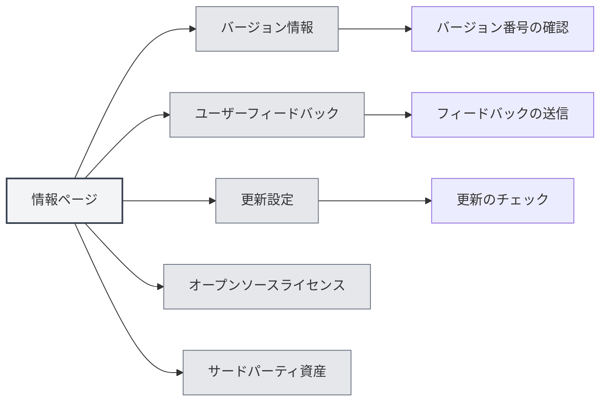
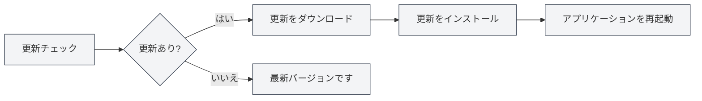

# 情報について

## 概要

情報ページでは、MetaDocのバージョン情報、更新設定、オープンソースライセンス、およびサードパーティ資産情報を提供しています。このページを通じて、アプリケーション情報の確認、更新のチェック、フィードバックの送信などを行うことができます。

## バージョン情報

### バージョンの確認

情報ページでは、以下の情報を確認できます：

- **アプリケーション名**：MetaDoc
- **バージョン番号**：現在インストールされているバージョン番号
- **リリース日**：現在のバージョンのリリース日
- **ビルド環境**：開発版またはリリース版

上部メニューバーから情報ページにアクセスできます：

<MenuItemsDemo mode="demo" :items='[{"id": "settings", "items": ["about"]}]' />



### バージョン形式

バージョン番号はセマンティックバージョニング形式を使用しています：

```
メジャーバージョン.マイナーバージョン.パッチバージョン
```

例：`0.12.1`

### ビルド環境

- **開発版**：開発環境でビルドされたバージョン。デバッグ情報を含む場合があります。
- **リリース版**：正式にリリースされたバージョン。テストと最適化が行われています。

<SettingAboutSection mode="demo" />

## ユーザーフィードバック

### フィードバックの送信

以下の方法でフィードバックを送信できます：

1. 情報ページで「ユーザーフィードバック」ボタンをクリック
2. フィードバックページで内容を記入
3. フィードバックを送信

### フィードバック内容

フィードバックには以下の情報を含めることができます：

- **問題の説明**：遭遇した問題の詳細な説明
- **再現手順**：問題を再現する方法の説明
- **期待される動作**：期待する動作の説明
- **実際の動作**：実際に発生した動作の説明
- **環境情報**：オペレーティングシステム、バージョン番号など

### フィードバックの提案

- **詳細な説明**：問題を可能な限り詳細に説明してください
- **スクリーンショットの提供**：必要に応じて、スクリーンショットや画面録画を提供してください
- **バージョン情報**：バージョン番号とビルド環境情報を含めてください
- **再現手順**：明確な再現手順を提供してください

<UserFeedbackView mode="demo" />

## 公式QQグループ

### QQグループへの参加

MetaDoc公式QQグループ：**1079841705**

QQグループに参加すると：

- 最新情報や更新通知を入手できます
- 他のユーザーと使用経験を交流できます
- 技術サポートが得られます
- 機能の議論に参加できます

### グループ内のリソース

QQグループでは以下のリソースを提供しています：

- **使用チュートリアル**：グループファイル内の使用チュートリアル
- **問題解決**：グループメンバー間での相互支援
- **更新通知**：最新の更新情報をいち早く入手
- **機能提案**：機能の議論や提案への参加

## 更新設定

### 自動更新チェック

「自動更新チェック」を有効にすると、MetaDocは起動時に自動的に新しいバージョンがあるかチェックします：

- **有効**：起動時に自動的に更新をチェック
- **無効**：自動更新チェックを行わない

### 更新チャネル

更新チャネルを選択できます：

- **安定版**：正式リリース版を使用（推奨）
- **開発版**：開発版を使用（不安定な場合があります）

<MainTabs mode="demo" />

### 手動更新チェック

いつでも手動で更新をチェックできます：

1. 情報ページの「更新設定」タブ
2. 「更新をチェック」ボタンをクリック
3. チェックが完了するのを待つ

### 更新ステータス

更新チェック後、以下のステータスが表示されます：

- **更新が利用可能**：新しいバージョン情報が表示され、更新をダウンロードできます
- **最新バージョンです**：現在のバージョンが最新です
- **チェック失敗**：エラーメッセージが表示されます

### 更新のダウンロードとインストール

更新が利用可能な場合：

1. **更新のダウンロード**：「更新をダウンロード」ボタンをクリック
2. **ダウンロード待機**：ダウンロードの進捗を確認
3. **更新のインストール**：ダウンロード完了後、「インストールして再起動」ボタンをクリック
4. **自動再起動**：アプリケーションが自動的に再起動し、更新がインストールされます



<QuickStartPanel mode="demo" />

## オープンソースライセンス

### ライセンスの確認

情報ページの「オープンソースライセンス」タブでは、以下を確認できます：

- **オープンソースライセンス**：MetaDocで使用されているオープンソースライセンス
- **ライセンス内容**：完全なライセンステキスト

### ライセンス情報

MetaDocはオープンソースライセンスに従っており、以下を行うことができます：

- ライセンス内容の確認
- 利用規約の理解
- 権利と義務の理解

## サードパーティ資産

### サードパーティ資産の確認

情報ページの「サードパーティ資産」タブでは、以下を確認できます：

- **サードパーティライブラリ**：MetaDocで使用されているサードパーティのオープンソースライブラリ
- **資産情報**：サードパーティ資産のライセンスと出典情報

### 資産リスト

サードパーティ資産リストには以下が含まれます：

- **ライブラリ名**：サードパーティライブラリの名称
- **バージョン**：使用されているバージョン番号
- **ライセンス**：ライブラリのライセンスタイプ
- **出典**：ライブラリのソースリンク

## ベストプラクティス

1. **定期的な更新**：自動更新チェックを有効にし、新しいバージョンを適宜入手することをお勧めします
2. **問題のフィードバック**：問題に遭遇した場合は、速やかにフィードバックを送信してください
3. **QQグループへの参加**：公式QQグループに参加してサポートと情報を入手してください
4. **ライセンスの確認**：オープンソースライセンスの利用規約を理解してください
5. **更新の注目**：更新通知に注目し、新機能や修正点を把握してください

## 注意事項

1. **更新前のバックアップ**：更新前に重要なデータをバックアップすることをお勧めします
2. **ネットワーク接続**：更新チェックにはネットワーク接続が必要です
3. **バージョン互換性**：更新後、一部の設定を再構成する必要がある場合があります
4. **フィードバック情報**：フィードバック送信時は、プライバシー情報の保護に注意してください
5. **ライセンス遵守**：MetaDocの使用時は、オープンソースライセンスを遵守してください

<ResizableDivider mode="demo" />

## 関連ドキュメント

- [[settings.basic|基本設定]]
- [[settings.logging|ログ設定]]
- [[quick-start.guide|クイックスタートガイド]]

<SettingAboutSection mode="demo" />

<UserFeedbackView mode="demo" />

<MenuItemsDemo mode="demo" :items='[{"id": "settings", "items": ["about"]}]' />

<MainTabs mode="demo" />