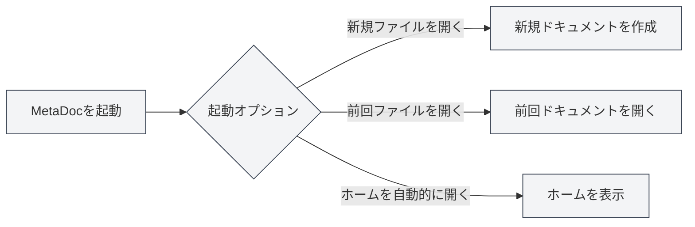
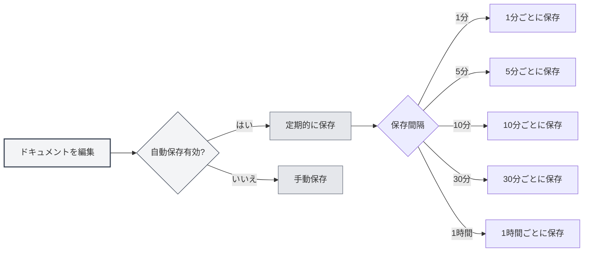
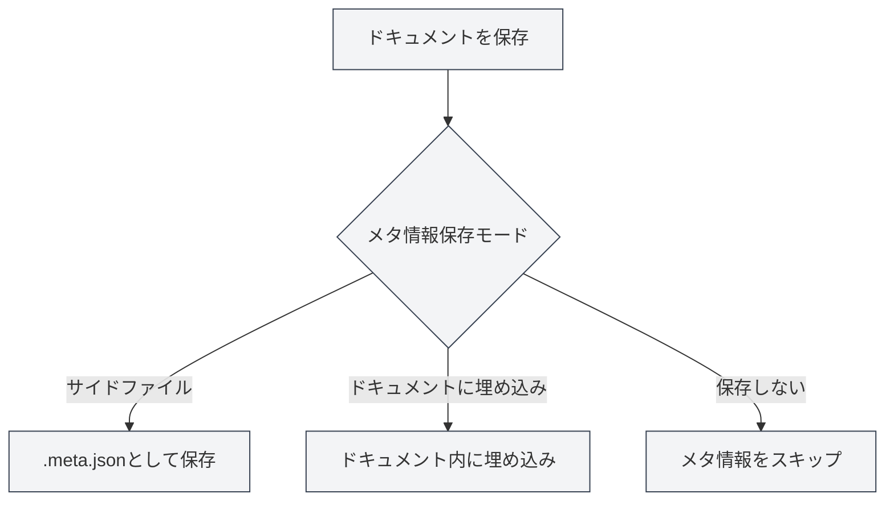

# 基本設定

## 概要

基本設定はMetaDocのコア設定オプションであり、アプリケーションの起動動作、自動保存、ドキュメント統計、メタ情報管理などの重要な機能をカバーしています。これらのオプションを適切に設定することで、使用体験と作業効率を向上させることができます。

## 起動オプション

### 起動動作の設定

起動オプションは、MetaDoc起動時のデフォルト動作を決定します：

- **新規ファイルを開く**：起動するたびに新しい空白ドキュメントを作成します
- **前回編集したファイルを開く**：起動時に前回終了時に編集中だったドキュメントを自動的に開きます

使用習慣に応じて適切な起動オプションを選択できます。前回の作業から続けることが多い場合は、「前回編集したファイルを開く」を選択することをお勧めします。

設定には上部メニューバーからアクセスできます：

<MenuItemsDemo mode="demo" :items='[{"id": "settings"}]' />

### 基本設定インターフェース

以下の図は、基本設定ページの完全なインターフェースを示しています：

<SettingBasicSection mode="demo" />

基本設定インターフェースには、以下の主要な設定領域が含まれています：

- **起動オプション**：アプリケーション起動時のデフォルト動作を設定します（新規ファイルを開く/前回編集したファイルを開く）
- **自動保存**：データ損失を防ぐための自動保存の時間間隔を設定します
- **メタデータ保存**：メタデータの保存方法を選択します（ドキュメント内/独立ファイル）
- **参照ディレクトリ**：ドキュメントが参照する外部ファイルの保存場所を管理します
- **その他のオプション**：コードブロック処理、画像埋め込み、数式などの高度な設定

### 起動時にホームを自動的に開く

このオプションを有効にすると、MetaDoc起動時にホームタブが自動的に開きます。ホームには、クイックスタート、最近のドキュメントリストなどの機能が提供されており、よく使う機能に素早くアクセスできます。

## 自動保存

<SettingBasicSection mode="demo" />

### 自動保存の設定

自動保存機能は、予期せぬ状況（アプリケーションクラッシュ、停電など）によるコンテンツの損失を防ぎます。MetaDocは以下の自動保存間隔をサポートしています：

- **オフ**：自動保存せず、手動で保存する必要があります
- **1分**：1分ごとに自動保存します
- **5分**：5分ごとに自動保存します
- **10分**：10分ごとに自動保存します
- **30分**：30分ごとに自動保存します
- **1時間**：1時間ごとに自動保存します

### 使用上の推奨事項

- **頻繁に編集する場合**：短い自動保存間隔（1〜5分）を設定し、コンテンツがタイムリーに保存されるようにすることをお勧めします
- **長時間執筆する場合**：長い間隔（10〜30分）を設定し、ディスク書き込み頻度を減らすことができます
- **重要なドキュメントの場合**：自動保存を有効にし、手動保存（`Ctrl+S`）と組み合わせてデータの安全性を確保することをお勧めします

自動保存はバックグラウンドで静かに実行され、編集作業を中断することはありません。

## ドキュメント統計設定

<SettingBasicSection mode="demo" />

### コードブロック統計を除外

このオプションを有効にすると、ドキュメントの文字数、単語頻度などの情報を統計する際に、コードブロック内のコンテンツが除外されます。これは技術ドキュメントに特に有用です。コードブロック内のコンテンツは通常、ドキュメントのテキスト統計に含めるべきではないためです。

**使用シナリオ**：

- 技術ドキュメントに多数のコード例が含まれている場合
- ドキュメントの実際のテキストコンテンツを正確に統計する必要がある場合
- コードが単語頻度分析の結果に影響を与えるのを避けたい場合

## 画像処理設定

<SettingBasicSection mode="demo" />

### 埋め込み画像の解析（OCR機能）

このオプションを有効にすると、MetaDocはドキュメント内に埋め込まれた画像に対してOCR（光学文字認識）処理を行い、画像内のテキストコンテンツを抽出します。これは、画像を含むドキュメント（PDF、Wordドキュメントなど）を処理する際に特に有用です。

**機能説明**：

- アップロードされたDOCX、PPTX、PDFファイル内の画像はOCR処理されます
- 直接アップロードされた画像ファイルも引き続きOCR処理されます（このオプションの影響を受けません）
- OCR結果は、ナレッジベース検索やAI支援機能に使用できます

**注意事項**：

- OCR処理には一定の計算リソースが必要であり、ドキュメントの読み込み速度に影響を与える可能性があります
- 画像内の文字を抽出する必要がない場合は、パフォーマンス向上のためにこの機能をオフにすることができます

### 数式インラインナンバー

このオプションを有効にすると、数式内の数字がブロックレベルモードではなくインラインモードで表示されます。これにより、数式がテキストフローにうまく溶け込み、段落内に簡単な数式を挿入するのに適しています。

## メタ情報保存モード

<SettingBasicSection mode="demo" />

### 保存方法の設定

ドキュメントメタ情報（タイトル、著者、説明、キーワードなど）は、3つの方法で保存できます：

- **サイドファイル**：メタ情報をドキュメントと同じディレクトリ内の独立したファイル（`.meta.json`）に保存します
  - 利点：元のドキュメントコンテンツに影響を与えず、バージョン管理が容易です
  - 欠点：2つのファイルを同時に管理する必要があります
- **ドキュメントに埋め込み**：メタ情報をドキュメントファイル内部に埋め込みます
  - 利点：単一ファイル管理で、共有が容易です
  - 欠点：一部の形式では埋め込みをサポートしていない可能性があります
- **保存しない**：メタ情報を保存しません
  - 適用シナリオ：一時的なドキュメントやメタ情報が不要なドキュメント

### 選択の推奨事項

- **技術ドキュメント**：「サイドファイル」モードの使用を推奨します。Gitなどのバージョン管理システムでの管理が容易です
- **個人メモ**：「ドキュメントに埋め込み」モードを使用して、単一ファイルを整理された状態に保つことができます
- **一時ドキュメント**：「保存しない」モードを選択できます

## 参照ファイルディレクトリ管理

<SettingBasicSection mode="demo" />

### ディレクトリ情報の確認

参照ファイルディレクトリは、ドキュメント内で参照される外部ファイル（画像、添付ファイルなど）を保存するために使用されます。基本設定ページでは、以下のことができます：

- **ディレクトリサイズを確認**：参照ファイルディレクトリが占有するディスク容量を表示します
- **更新**：ディレクトリサイズ情報を更新します
- **ディレクトリを開く**：ファイルマネージャーで参照ファイルディレクトリを開きます
- **ディレクトリを空にする**：ディレクトリ内のすべてのファイルを削除します（操作は元に戻せません）

### 使用シナリオ

参照ファイルディレクトリは通常、以下の目的で使用されます：

- ドキュメントに挿入された画像の保存
- ドキュメント添付ファイルの保存
- ドキュメント関連のリソースファイルの管理

**注意事項**：

- ディレクトリを空にする操作は元に戻せません。慎重に操作してください
- 空にする前に重要なファイルをバックアップすることをお勧めします
- ディレクトリサイズは、ドキュメントで参照されるファイルが増えるにつれて大きくなります

## 注意事項

1.  **起動オプション**：起動オプションを変更した場合、次回アプリケーションを起動したときに有効になります
2.  **自動保存**：自動保存は手動保存操作を上書きしません。両方を組み合わせて使用できます
3.  **メタ情報モード**：メタ情報保存モードを変更した場合、新しく保存されるドキュメントは新しいモードを使用します。既存のドキュメントには影響しません
4.  **参照ディレクトリ**：参照ディレクトリを空にする前に、これらのファイルを使用しているドキュメントがないことを確認してください

## 関連ドキュメント

- [[core.file-operations|ファイル操作]]
- [[core.document-metadata|ドキュメントメタ情報]]
- [[settings.theme|テーマ設定]]
- [[settings.image|画像設定]]

<MenuItemsDemo mode="demo" :items='[{"id": "settings", "items": ["basic"]}]' />