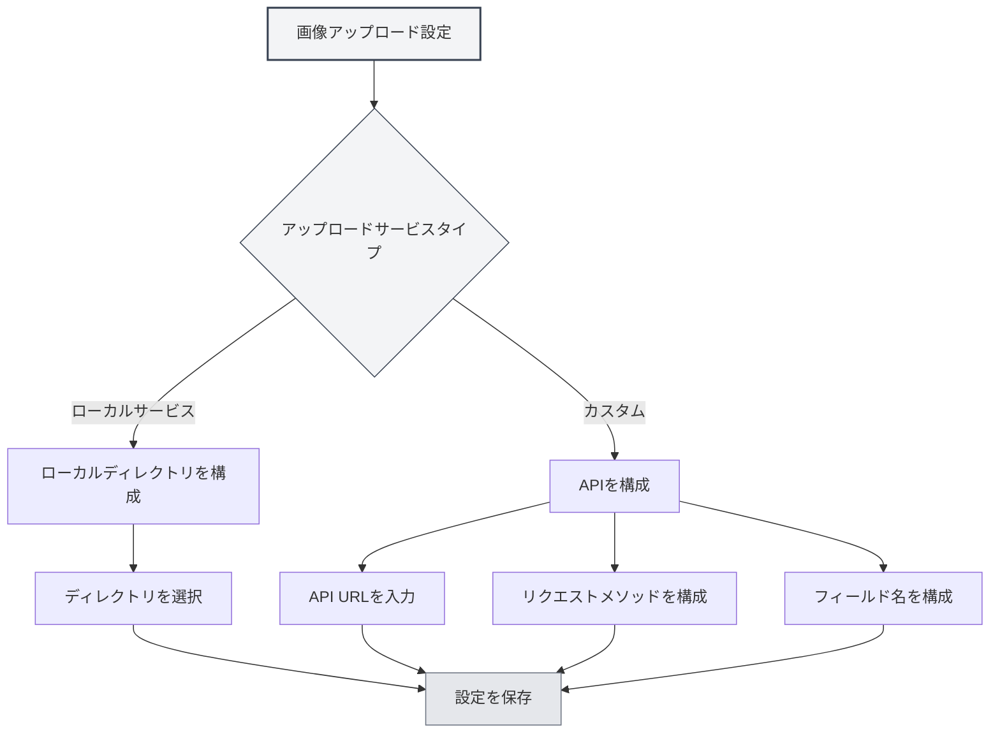

# アップロードサービス設定

## 概要

アップロードサービス設定では、画像アップロードのターゲットサービスを構成できます。MetaDocはローカルサービスとカスタムAPIの2種類のアップロード方法をサポートしており、必要に応じて適切なサービスを選択できます。

## アップロードサービスタイプ

### サービス選択

画像設定ページで、「画像挿入操作」が「アップロード」に設定されている場合、アップロードサービスを選択できます：

- **ローカルサービス**：画像をローカルディレクトリに保存します
- **カスタム**：カスタムAPIを使用して画像をアップロードします

トップメニューバーから画像アップロード設定にアクセスできます：

<MenuItemsDemo mode="demo" :items='[{"id": "settings"}]' />



### ローカルサービス

ローカルサービスは画像をローカルファイルシステムに保存します：

- **利点**：完全なローカル制御、データセキュリティ
- **欠点**：ローカルディレクトリの構成が必要
- **適用シナリオ**：ローカル使用、データプライバシー要件が高い場合

<SettingImageSection mode="demo" />

### カスタムサービス

カスタムサービスは外部APIを使用して画像をアップロードします：

- **利点**：クラウドストレージ、画像ホスティングサービスなどにアップロード可能
- **欠点**：APIインターフェースの構成が必要
- **適用シナリオ**：クラウドストレージ、画像CDNなどが必要な場合

<MainTabs mode="demo" />

## ローカル画像ディレクトリ構成

### ディレクトリ設定

ローカルサービスを使用する場合、画像保存ディレクトリを構成する必要があります：

1. 画像設定ページで「ローカルサービス」を選択
2. 「参照」ボタンをクリックしてディレクトリを選択
3. または入力ボックスに直接ディレクトリパスを入力
4. 「開く」ボタンをクリックすると、ファイルマネージャーでディレクトリを開けます

### ディレクトリ選択

画像ディレクトリを選択する際：

- **参照ボタン**：ディレクトリ選択ダイアログを開く
- **パス入力**：直接ディレクトリパスを入力
- **開くボタン**：ファイルマネージャーで設定済みのディレクトリを開く

### デフォルトディレクトリ

ローカル画像ディレクトリを設定しない場合、システムはデフォルトディレクトリを使用します：

- **Windows**：`%APPDATA%/MetaDoc/images`
- **macOS**：`~/Library/Application Support/MetaDoc/images`
- **Linux**：`~/.config/MetaDoc/images`


### ディレクトリ管理

- **ディレクトリの表示**：「開く」ボタンをクリックしてディレクトリ内容を表示
- **ディレクトリの変更**：「参照」ボタンをクリックして新しいディレクトリを選択
- **ディレクトリ要件**：ディレクトリが存在し、書き込み権限があることを確認

## カスタムアップロードAPI構成

### API URL構成

カスタムサービスを使用する場合、APIアドレスを構成する必要があります：

1. 画像設定ページで「カスタム」サービスを選択
2. 「カスタムアップロードAPI URL」入力ボックスにAPIアドレスを入力
3. フォーマット例：`https://api.example.com/upload`

### APIメソッド構成

APIリクエストメソッドを構成：

- **POST**：POSTメソッドを使用してアップロード（推奨）
- **PUT**：PUTメソッドを使用してアップロード

ほとんどのAPIはPOSTメソッドを使用し、一部の特殊なAPIはPUTメソッドを使用する場合があります。

### フィールド名構成

アップロードファイルのフィールド名を構成：

- **デフォルト値**：`file`
- **カスタム**：APIの要件に応じてフィールド名を設定

異なるAPIは異なるフィールド名を使用する場合があります。例：`file`、`image`、`upload`など。

### API構成例

**例1：標準画像ホスティングAPI**

```
API URL: https://api.example.com/upload
方法: POST
フィールド名: file
```

**例2：カスタムフィールド名API**

```
API URL: https://api.example.com/image
方法: POST
フィールド名: image
```

**例3：PUTメソッドAPI**

```
API URL: https://api.example.com/upload
方法: PUT
フィールド名: file
```

<ViewMenuItemsDemo mode="demo" :items='["home", "editor"]'
/>

## APIレスポンス形式

### レスポンス要件

カスタムAPIは以下の形式のJSONレスポンスを返す必要があります：

```json
{
  "success": true,
  "imagePath": "https://example.com/image.png"
}
```

### レスポンスフィールド

- **success**：ブール値、アップロードが成功したかどうかを示す
- **imagePath**：文字列、画像のURLまたはパスを返す

### エラー処理

アップロードが失敗した場合、APIは以下を返すべきです：

```json
{
  "success": false,
  "message": "エラーメッセージ"
}
```

<DialogDemo mode="demo" dialogType="api-config" />

## 構成検証

### 設定テスト

カスタムAPIを構成した後、設定をテストすることをお勧めします：

1. ドキュメントに画像を挿入
2. アップロード結果を確認
3. 失敗した場合、構成が正しいか確認

### よくある問題

**接続失敗**：

- API URLが正しいか確認
- ネットワーク接続を確認
- APIサービスが正常に動作しているか確認

**アップロード失敗**：

- APIメソッドが正しいか確認
- フィールド名が正しいか確認
- APIレスポンス形式が要件に合っているか確認

**権限問題**：

- APIに認証が必要か確認
- APIキーまたはトークンが正しいか確認

<SettingBasicSection mode="demo" />

## ローカルサービス構成

### ディレクトリ権限

ローカルサービスを使用する場合、ディレクトリに書き込み権限があることを確認：

- **Windows**：フォルダー権限設定を確認
- **macOS/Linux**：ディレクトリ権限を確認（chmod）

### ディレクトリ構造

ローカルサービスは指定されたディレクトリに画像を保存：

- **ファイル名**：タイムスタンプ＋元のファイル名を使用
- **ファイル形式**：元の形式を維持
- **ディレクトリ構造**：すべての画像は同じディレクトリに保存

<OcrWindow mode="demo" />

### 画像アクセス

ローカルサービスの画像は以下の方法でアクセスできます：

- **HTTPサービス**：ランタイムサーバーの `/images/` パス経由でアクセス（デフォルトアドレスはアプリケーション構成による。例：`http://127.0.0.1:52521/images/`）
- **ファイルパス**：ファイルシステムパスを直接使用

## ベストプラクティス

1. **ローカル使用**：ローカル使用にはローカルサービスを推奨
2. **クラウドストレージ**：クラウドストレージが必要な場合はカスタムAPIを使用
3. **ディレクトリ管理**：定期的に画像ディレクトリをクリーンアップし、過剰なスペース使用を避ける
4. **APIテスト**：カスタムAPIを構成した後、まずテストする
5. **バックアップ戦略**：重要な画像は同時にバックアップすることを推奨

<MenuItemsDemo mode="demo" :items='[{"id": "file", "items": ["new", "open", "save"]}]' />

## 注意事項

1. **設定の有効化**：構成を変更後、新しく挿入される画像のみが新しい構成を使用
2. **API互換性**：カスタムAPIがレスポンス形式の要件に準拠していることを確認
3. **ディレクトリ権限**：ローカルディレクトリに書き込み権限があることを確認
4. **ネットワーク接続**：カスタムAPIにはネットワーク接続が必要
5. **ストレージスペース**：ローカルサービスはローカルストレージスペースを消費

## 関連ドキュメント

- [[settings.image|画像アップロード構成]]
- [[settings.basic|基本設定]]
- [[core.file-operations|ファイル操作]]

<ResizableDivider mode="demo" />
